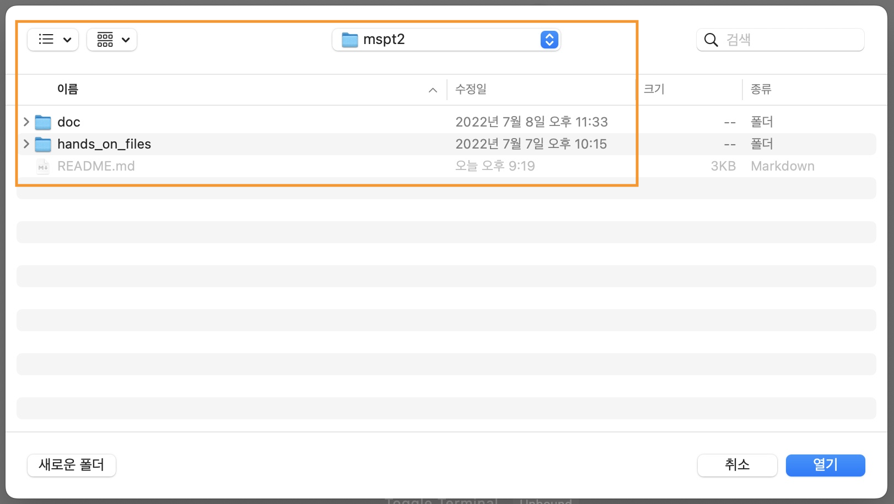

# mspt2 - Docker & Kubernetes

### 디렉토리 구조 및 설명
| 디렉토리 | 설명 |
| :--- | :--- |
| ./doc | 이론/실습 교재 (markdown) |
| ./doc/themes | 교재(md)의 slides 형식을 위한 theme (css적용) |
| ./doc/img | 교재에 사용된 이미지 |
| ./doc/ppt | 교재의 slides 형식 출력본(ppt) |
| ./doc/pdf | 교재의 slides 형식 출력본(pdf) |
| ./hands_on_files | 실습교재에 사용되는 파일들 |

> ppt 파일은 이미지 형식임. (내용 중 text를 복사하여 사용할 수 없음.)

---

### 이론/실습 교재 Contents

| No. | 이론교재 | 실습교재 |
| :---: | :--- | :--- |
|  1 | [[Book] 01_Docker_Overview.md](./doc/%5BBook%5D%2001_Docker_Overview.md)                                             | [[Hands-on] 01_Docker_Intro.md](doc/%5BHands-on%5D%2001_Docker_Intro.md) [[Hands-on] 02_Docker_Layers.md](doc/%5BHands-on%5D%2002_Docker_Layers.md) |
|  2 | [[Book] 02_Docker_Commands.md](./doc/%5BBook%5D%2002_Docker_Commands.md)                                             | [[Hands-on] 03_Docker_Commands.md](doc/%5BHands-on%5D%2003_Docker_Commands.md)                                                                         |
|  3 | [[Book] 03_Docker_Storage.md](./doc/%5BBook%5D%2003_Docker_Storage.md)                                               | [[Hands-on] 04_Docker_Volumes.md](doc/%5BHands-on%5D%2004_Docker_Volumes.md)                                                                           |
|  4 | [[Book] 04_Docker_Network.md](./doc/%5BBook%5D%2004_Docker_Network.md)                                               | [[Hands-on] 05_Docker_Network.md](doc/%5BHands-on%5D%2005_Docker_Network.md)                                                                           |
|  5 | [[Book] 05_Dockerfile.md](./doc/%5BBook%5D%2005_Dockerfile.md)                                                       | -                                                                                                                                                      |
|  6 | [[Book] 06_Dockerfile_BestPractice.md](./doc/%5BBook%5D%2006_Dockerfile_BestPractice.md)                             | [[Hands-on] 06_Dockerfile.md](doc/%5BHands-on%5D%2006_Dockerfile.md)                                                                                   |
|  7 | [[Book] 07_Kubernetes_Overview.md](./doc/%5BBook%5D%2007_Kubernetes_Overview.md)                                     | [[Hands-on] 07_Kubernetes_Overview.md](doc/%5BHands-on%5D%2007_Kubernetes_Overview.md)                                                                 |
|  8 | [[Book] 08_Kubernetes_Workload(1).md](./doc/%5BBook%5D%2008_Kubernetes_Workload(1).md)                               | [[Hands-on] 08_Kubernetes_Workload(1).md](doc/%5BHands-on%5D%2008_Kubernetes_Workload(1).md)                                                           |
|  9 | [[Book] 09_Kubernetes_Workload(2).md](./doc/%5BBook%5D%2009_Kubernetes_Workload(2).md)                               | [[Hands-on] 09_Kubernetes_Workload(2).md](doc/%5BHands-on%5D%2009_Kubernetes_Workload(2).md)                                                           |
| 10 | [[Book] 10_Kubernetes_Service.md](./doc/%5BBook%5D%2010_Kubernetes_Service.md)                                       | [[Hands-on] 10_Kubernetes_Service.md](doc/%5BHands-on%5D%2010_Kubernetes_Service.md)                                                                   |
| 11 | [[Book] 11_Kubernetes_Deployment_strategies.md](./doc/%5BBook%5D%2011_Kubernetes_Deployment_strategies.md)           | [[Hands-on] 11_Kubernetes_Deployment_strategies.md](doc/%5BHands-on%5D%2011_Kubernetes_Deployment_strategies.md)                                       |
| 12 | [[Book] 12_Kubernetes_Configmaps & Secrets](doc/%5BBook%5D%2012_Kubernetes_ConfigMaps%20&%20Secrets.md)              | [[Hands-on] 12_Kubernetes_ConfigMaps & Secrets.md](doc/%5BHands-on%5D%2012_Kubernetes_ConfigMaps%20&%20Secrets.md)                                     |
| 13 | [[Book] 13_Kubernetes_Horizontal Pod Autoscaler.md](doc/%5BBook%5D%2013_Kubernetes_Horizontal%20Pod%20Autoscaler.md) | [[Hands-on] 13_Kubernetes_Horizontal Pod Autoscaler.md](doc/%5BHands-on%5D%2013_Kubernetes_Horizontal%20Pod%20Autoscaler.md)                           |
| 14 | [[Book] 14_Kubernetes_Volume.md](./doc/%5BBook%5D%2014_Kubernetes_Volume.md)                                         | [[Hands-on] 14_Kubernetes_Volume.md](doc/%5BHands-on%5D%2014_Kubernetes_Volume.md)                                                                     |
| 15 | [[Book] 15_Helm.md](./doc/%5BBook%5D%2015_Helm.md)                                                                   | [[Hands-on] 15_Helm.md](doc/%5BHands-on%5D%2015_Helm.md)                                                                                               |

---

### 실습환경
실습교재의 내용을 직접 실행해볼 수 있는 환경은 다음과 같습니다.  
환경에 따라 교재의 내용 중 일부는 실행되지 않을 수도 있습니다. (대부분은 문제없이 실행 가능합니다.)

| 실습환경 | 설명 |
| :--- | :--- |
| [Docker Desktop on Windows](https://docs.docker.com/desktop/install/windows-install/) | 학습용 환경인 경우 Windows에 Docker Desktop을 설치해서 Docker와 Kubernetes(Single-node)까지 실습해볼 수 있습니다. |
| [Killercoda](https://killercoda.com/brian) | 설치없이 간단히 실습해볼 수 있는 환경입니다. 이 과정의 실습교재 내용 대부분을 동일하게 구성해 놓았습니다. |
| [Minikube](https://minikube.sigs.k8s.io/) | 단일 노드 실행환경 입니다. 리눅스 환경(e.g. EC2 Instance)을 하나 준비한 다음 아래 가이드를 참고하여 준비합니다. 이 과정의 실습교재는 EC2 + Minikube를 기준으로 작성되었습니다. [minikube start](https://minikube.sigs.k8s.io/docs/start/) |
| [Play with Docker](https://labs.play-with-docker.com/) | 설치없이 간단히 실습해볼 수 있는 환경입니다. (Docker) |
| [Play with Kubernetes](https://labs.play-with-k8s.com/) | 설치없이 간단히 실습해볼 수 있는 환경입니다. (Kubernetes) |

---

### 교재(markdown with marp) 작성/수정 및 출력(ppt,pdf) 방법

교재(.doc/*.md)는 모두 [markdown](https://www.markdownguide.org/)문서로 작성되었고, slide 형식(ppt, pdf)으로 출력하기 위해서 [Marp](https://marp.app/)를 사용함.

본 교재의 수정과 출력이 필요한 경우

- [Visual Studio Code](https://code.visualstudio.com/)
- [Marp for VS Code](https://marketplace.visualstudio.com/items?itemName=marp-team.marp-vscode)

설치가 필요함.

Visual Studio Code 설치/실행 후 Extension 에서 marp 검색하여 Install

#### 교재 작성/수정 방법

Visual Studio Code 에서 File > Open Folder 실행 후 본 Repository 최상위 경로를 선택

열기를 했을 때 아래와 같아야 함. (.vscode , doc , hands_on_files 디렉토리가 보여야 함.)

이후 편집 과정은 일반적인 Markdown 문서와 동일함.  
편집 과정 중 문서 우측상단의 **Preview** 버튼을 클릭하여 출력형태를 확인할 수 있음.

기타 자세한 marp 사용법은 [Marpit Markdown](https://marpit.marp.app/markdown)를 참조.

#### Slide 형식의 파일(ppt, pdf)로 출력하는 방법

편집을 마친 Markdown 문서의 출력은 아래 그림과 같이 진행.  (Marp 아이콘 > Export Slide Deck...)

