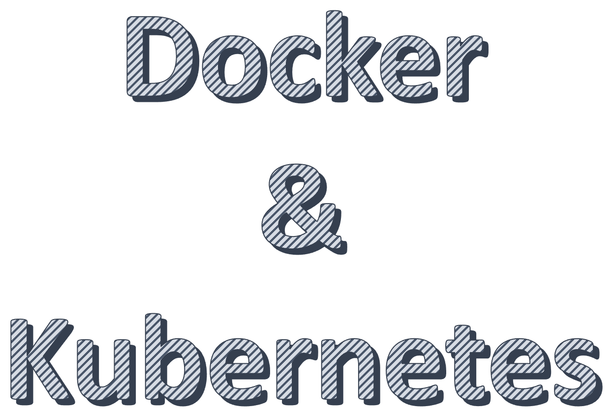

이 Repository는 **MSP T3** 과정 중 **Docker & Kubernetes** 학습을 위한 교재와 실습파일들의 저장소 입니다.  

## 디렉토리 구조 및 설명

| 디렉토리             | 설명                                   |
|:---------------- |:------------------------------------ |
| ./doc            | 이론/실습 교재 (markdown)                  |
| ./doc/themes     | 교재(md)의 slides 형식을 위한 themes (css적용) |
| ./doc/img        | 교재에 사용된 이미지                          |
| ./doc/pdf        | 이론교재의 slides 형식 출력본(pdf)             |
| ./hands_on_files | 실습에 사용되는 파일들                         |
| ./qna            | 각 차수별 메모와 질문/답변                      |

## 학습방법
[Contents](https://github.com/JungSangup/mspt3/tree/main/doc#contents) 의 순서에 따라 **이론**과 **실습**을 진행합니다.  
각 이론교재는 기본 내용을 설명하고 있고, 교재의 링크를 통해 보다 더 깊이있는 내용을 학습할 수 있습니다.  

## 실습환경
실습교재의 내용을 직접 실행해볼 수 있는 환경은 다음과 같습니다.  
환경에 따라 교재의 내용 중 일부는 실행되지 않을 수도 있습니다. 

| 실습환경 | 설명 |
| :--- | :--- |
| [Docker engine](https://docs.docker.com/engine/install/) + [Minikube](https://minikube.sigs.k8s.io/) | 단일 노드 실행환경 입니다. 실습교재에는 **AWS EC2 Instance**를 이용하여 Docker와 Minikube를 구성하는 내용이 포함되어 있습니다. |
| [Killercoda](https://killercoda.com/brian) | 설치없이 간단히 실습해볼 수 있는 환경입니다. 이 과정의 실습교재 내용 대부분을 동일하게 구성해 놓았습니다. |
| [Docker Desktop on Windows](https://docs.docker.com/desktop/install/windows-install/) | 학습용 환경인 경우 Windows에 Docker Desktop을 설치해서 Docker와 Kubernetes(Single-node)까지 실습해볼 수 있습니다. 설치 가이드 : [[Appendix] Docker_desktop.md](./doc/%5BAppendix%5D%20Docker_desktop.md) |
| [Play with Docker](https://labs.play-with-docker.com/) | 설치없이 간단히 실습해볼 수 있는 환경입니다. (Docker) |
| [Play with Kubernetes](https://labs.play-with-k8s.com/) | 설치없이 간단히 실습해볼 수 있는 환경입니다. (Kubernetes) |  

> WSL2기반의 Docker Desktop on Windows인 경우 Docker root dir.의 위치가 아래와 같습니다.
> 탐색기에서 `\\wsl.localhost\docker-desktop-data\data\docker` 로 탐색  

    

-------------------- 절취선 ----------------------  ( 이하 내용은 삭제 예정 )

MSP T3 강의계획

- 1일차
  - 이론 : Docker overview ~ network
  - 실습 : Docker 설치 ~ network
- 2일차
  - 이론 : Dockerfile ~ K8s workload(2)
  - 실습 : Dockerfile ~ K8s workload(2)
- 3일차
  - 이론 : K8s service ~ Helm
  - 실습 : K8s service ~ Helm

순서조정 (K8s)
Overview > Workload(1) > Workload(2) > Service > Storage > Configuration > Deployment strategy > HPA > Helm

### 개선사항

- [x] A반/B반으로 나누어서 진행함. -> 교재에 내용 반영완료.

- [x] ubuntu 20.04 사용. -> 교재에 반영완료.

- [x] mspt3.pem 파일처리 명령어로 안될 때 어떻게 할지... ( `icacls.exe mspt3.pem /GRANT:R "SDS:(R)"` )  -> 강의 중 이슈 발생 시 안내.

- [x] powershell, mac 기본 terminal 기준으로  -> 선행과정에서 MobaXTerm을 설치/사용하므로, MobaXTerm을 기본으로 안내

- [x] 리눅스 명령어 정리 -> https://github.com/JungSangup/mspt3/blob/main/doc/%5BAppendix%5D%20%EB%A6%AC%EB%88%85%EC%8A%A4%EB%AA%85%EB%A0%B9%EC%96%B4.md 추가

- [x] 각 실습 마지막 정리하기 추가 -> 교재에 내용 반영완료.

- [x] pdf, powershell 복사/붙여넣기 이슈 -> 실습교재는 Github의 md파일로 진행. (code block 복사하기 버튼 활용)  

- [x] Editor는 VI를 사용. (가이드 활용) -> 강의 중 기본 사용법 안내. 

- [x] minikube start 시 오류 (/etc/docker)  -> Ubuntu, Docker, Minikube, Kubernetes 버젼을 특정해서 진행. (오류가 발생하지 않는 버젼의 조합 사용)

- [x] 터미널 프로그램 통일  -> 선행과정에서 MobaXTerm을 설치/사용하므로, MobaXTerm을 기본으로 안내

- [x] 실습파일 챕터별로 번호(?) 부여  -> hands_on_files/chxx 로 챕터별 실습파일 위치를 나누고, 교재에 반영함.

- [x] 전체 교육과정 맵 제공  -> 각 차수별 qna에 맵을 제공하고, 진행 중 공유

- [x] 사전준비 ( Docker Hub가입, 터미널 툴 설치 )   -> 두 가지 포함하여 사전준비 안내 준비.

- [x] 실습 시작 전 체크사항 정리 (EC2접속해서 어느 디렉토리로 이동하고... 등) -> https://github.com/JungSangup/mspt3/blob/main/doc/README.md 에 정리함.(매일 실습 전 함께 체크하고 진행)  

- [x] 일자가 바뀌어도 실습환경 유지가 되도록 주의. (EC2 stop하지 말고 3일단 유지) -> 가능하면 stop하지 않도록 안내하고, stop해도 다시 시작 가능한 방안(실습시작 전 체크사항) 제공. 

- [ ] 진행 시 화면 해상도 적정하게 

- [x] A,B반 동일리전 사용 ( 버지니아 ) -> 교재 수정 완료

- [ ] 실습화면에서 예제와 명령어의 순서 변경? 또는, 예제는 복사되지 않도록 (의견)
