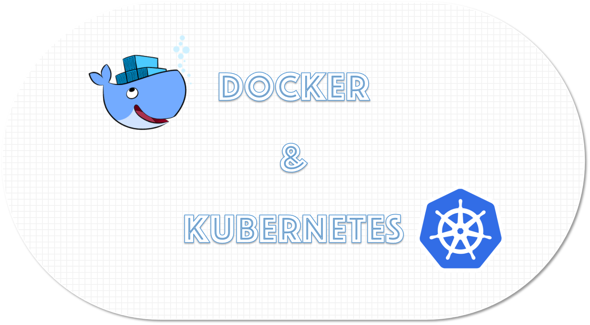

이 Repository는 **MSP T3** 과정 중 **Docker & Kubernetes** 학습을 위한 교재와 실습파일들의 저장소 입니다.  

## 디렉토리 구조 및 설명

| 디렉토리             | 설명                                   |
|:---------------- |:------------------------------------ |
| ./doc            | 이론/실습 교재 (markdown)                  |
| ./doc/themes     | 교재(md)의 slides 형식을 위한 themes (css적용) |
| ./doc/img        | 교재에 사용된 이미지                          |
| ./doc/pdf        | 이론교재의 slides 형식 출력본(pdf)             |
| ./hands_on_files | 실습에 사용되는 파일들                         |
| ./qna            | 각 차수별 메모와 질문/답변                      |

## 학습방법
[Contents](https://github.com/JungSangup/mspt3/tree/main/doc#contents) 의 순서에 따라 **이론**과 **실습**을 진행합니다.  
각 이론교재는 기본 내용을 설명하고 있고, 교재의 링크를 통해 보다 더 깊이있는 내용을 학습할 수 있습니다.  

## 실습환경
실습교재의 내용을 직접 실행해볼 수 있는 환경은 다음과 같습니다.  
환경에 따라 교재의 내용 중 일부는 실행되지 않을 수도 있습니다. 

| 실습환경 | 설명 |
| :--- | :--- |
| [Docker engine](https://docs.docker.com/engine/install/) + [Minikube](https://minikube.sigs.k8s.io/) | 단일 노드 실행환경 입니다. 실습교재에는 **AWS EC2 Instance** 또는, **SCP Virtual Server**를 이용하여 Docker와 Minikube를 구성하는 내용이 포함되어 있습니다. |
| [Killercoda](https://killercoda.com/brian) | 설치없이 간단히 실습해볼 수 있는 환경입니다. 이 과정의 실습교재 내용 대부분을 동일하게 구성해 놓았습니다. |
| [Docker Desktop on Windows](https://docs.docker.com/desktop/install/windows-install/) | 학습용 환경인 경우 Windows에 Docker Desktop을 설치해서 Docker와 Kubernetes(Single-node)까지 실습해볼 수 있습니다. 설치 가이드 : [[Appendix] Docker_desktop.md](./doc/%5BAppendix%5D%20Docker_desktop.md) |
| [Play with Docker](https://labs.play-with-docker.com/) | 설치없이 간단히 실습해볼 수 있는 환경입니다. (Docker) |
| [Play with Kubernetes](https://labs.play-with-k8s.com/) | 설치없이 간단히 실습해볼 수 있는 환경입니다. (Kubernetes) |  

> WSL2기반의 Docker Desktop on Windows인 경우 Docker root dir.의 위치가 아래와 같습니다.
> 탐색기에서 `\\wsl.localhost\docker-desktop-data\data\docker` 로 탐색  

