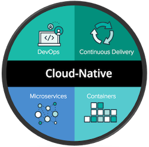
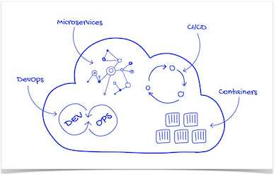
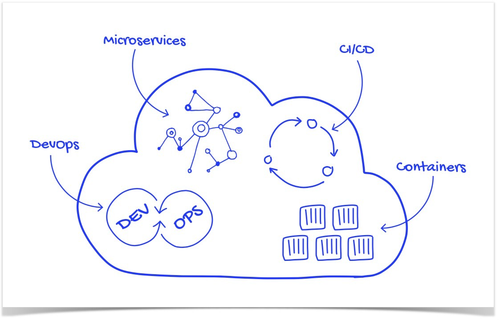
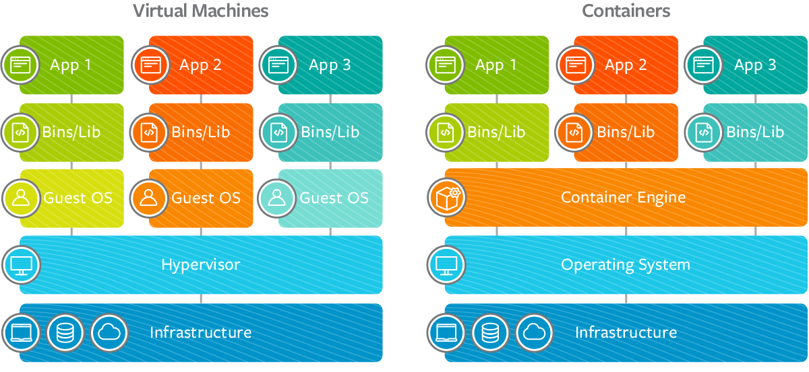

# Cloud Native

  

#### [ Cloud Native 의 정의 ]
클라우드 네이티브 기술은 조직이 퍼블릭, 프라이빗, 그리고 하이브리드 클라우드와 같은 현대적이고 동적인 환경에서 확장 가능한 애플리케이션을 개발하고 실행할 수 있게 해준다. 컨테이너, 서비스 메쉬, 마이크로서비스, 불변(Immutable) 인프라, 그리고 선언형(Declarative) API가 이러한 접근 방식의 예시들이다.  
이 기술은 회복성, 관리 편의성, 가시성을 갖춘 느슨하게 결합된 시스템을 가능하게 한다.  
견고한 자동화 기능을 함께 사용하면, 엔지니어는 영향이 큰 변경을 최소한의 노력으로 자주,  
예측 가능하게 수행할 수 있다.  
...

---

# Cloud Native

---

# Container vs Virtual machine

**컨테이너**는 애플리케이션이 다양한 컴퓨팅 환경에서 빠르고 안정적으로 실행될 수 있도록  
**코드**와 모든 **종속성**을 **패키징**하는 소프트웨어의 표준 단위입니다.
여러 컨테이너가 동일 시스템에서 실행될 수 있고, OS 커널을 공유하며, 각각은 격리된  
프로세스로 실행됩니다.

**가상머신-VM**은 하드웨어 추상화 입니다. 하이퍼바이저를 이용하여 단일 시스템에서  
여러 VM을 실행할 수 있습니다. 각 VM에는 OS, 애플리케이션, 필요한 바이너리 및  
라이브러리가 모두 포함됩니다.

---

# Container vs Virtual machine

| | Container | Virtal Machine |
| :--- | :----: | :----: |
| Virtualization | OS Virtualization | H/W Virtualization |
| Efficiency (Resource usage) | O | △ |
| Performance |  O | △ |
| Provisioning |  O | △ |
| Isolation (Security) | △ | O |

- **Continaer** : 성능, 실행속도, 자원활용 측면에서 장점을 가짐.  
- **Virtual Machine** : 다양한 환경(OS), 격리(보안) 측면에서 장점을 가짐.

   

 [What is a container?](https://www.docker.com/resources/what-container/)

---

# DevOps

