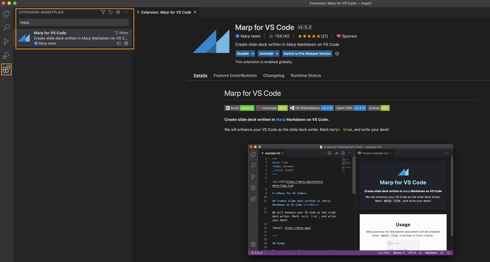
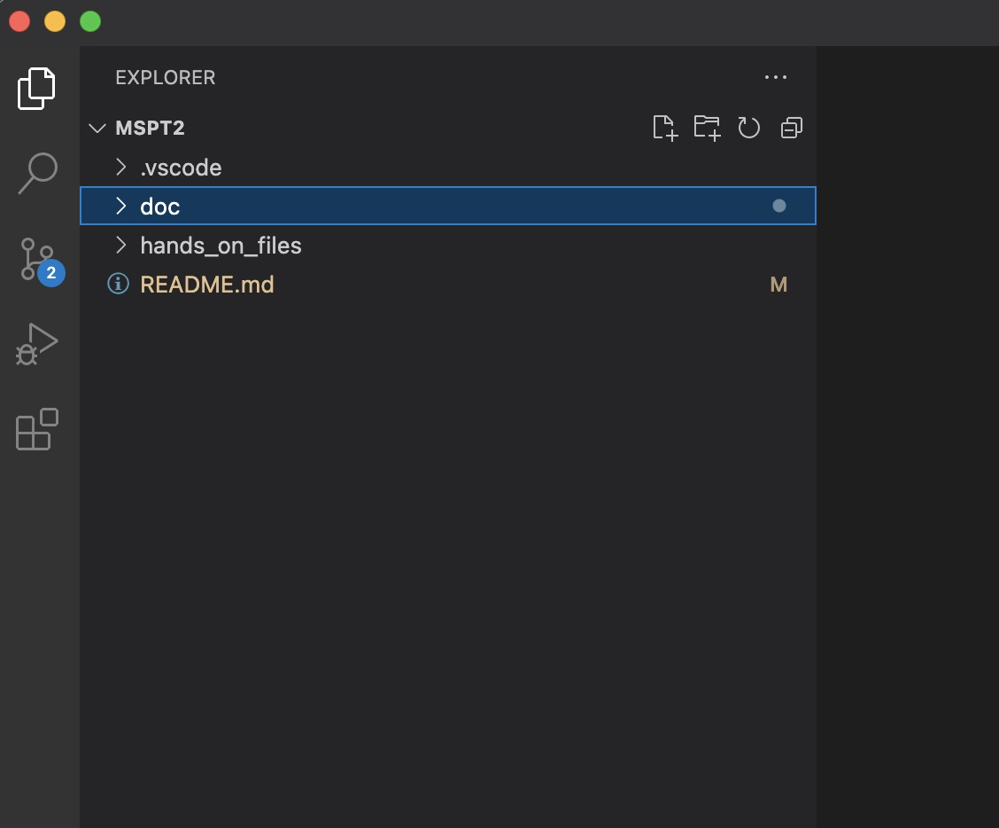

### 이론교재(markdown with marp) 작성/수정 및 출력(ppt,pdf) 방법

교재(.doc/*.md) 중 이론교재([Book] OOO.md)는 모두 [markdown](https://www.markdownguide.org/)문서로 작성되었고, slide 형식(ppt, pdf)으로 출력하기 위해서 [Marp](https://marp.app/)를 사용함.

본 교재의 수정과 출력이 필요한 경우

- [Visual Studio Code](https://code.visualstudio.com/)
- [Marp for VS Code](https://marketplace.visualstudio.com/items?itemName=marp-team.marp-vscode)

설치가 필요함.

Visual Studio Code 설치/실행 후 Extension 에서 marp 검색하여 Install

#### 교재 작성/수정 방법

Visual Studio Code 에서 File > Open Folder 실행 후 본 Repository 최상위 경로를 선택

열기를 했을 때 아래와 같아야 함. (.vscode , doc , hands_on_files 디렉토리가 보여야 함.)

이후 편집 과정은 일반적인 Markdown 문서와 동일함.  
편집 과정 중 문서 우측상단의 **Preview** 버튼을 클릭하여 출력형태를 확인할 수 있음.

기타 자세한 marp 사용법은 [Marpit Markdown](https://marpit.marp.app/markdown)를 참조.

#### Slide 형식의 파일(ppt, pdf)로 출력하는 방법

편집을 마친 Markdown 문서의 출력은 아래 그림과 같이 진행.  (Marp 아이콘 > Export Slide Deck...)

---

### 교재작성 노트
- Docker network : iptables nat 내용 추가
- 각 Hands-on 도입부에 그림설명 추가
- K8s 순서 변경 ( overview > workload(1) > workload(2) > Service > Volume > Confitmap/Secret > Deployment strategy > 
- K8s 실습내용 변경
  - Service, volume, Configmap/Secret 은 todo app을 이용
  - Helm도 todo chart로 

