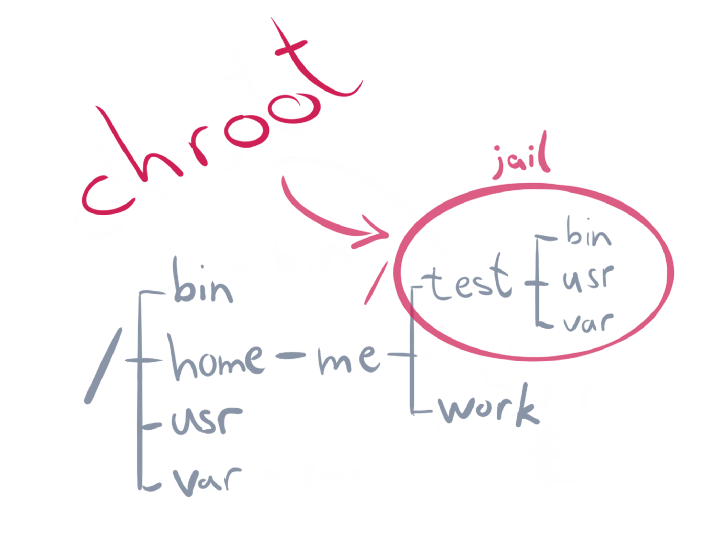
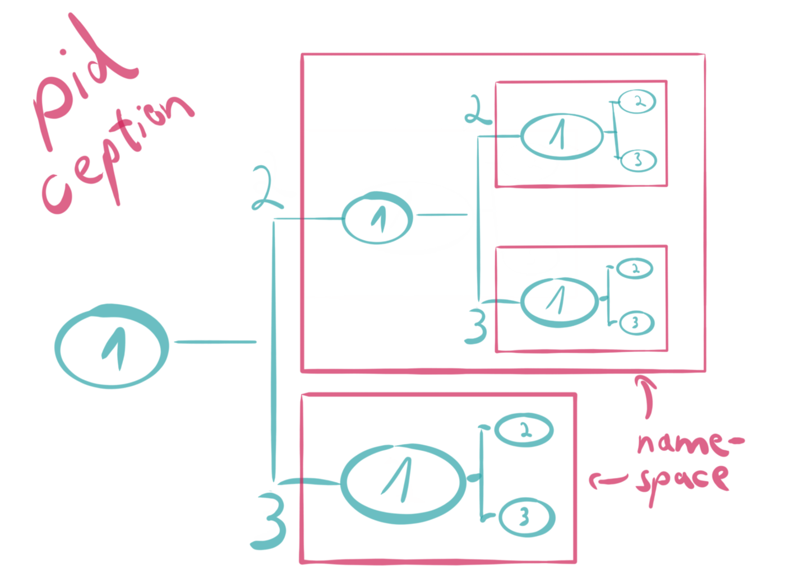
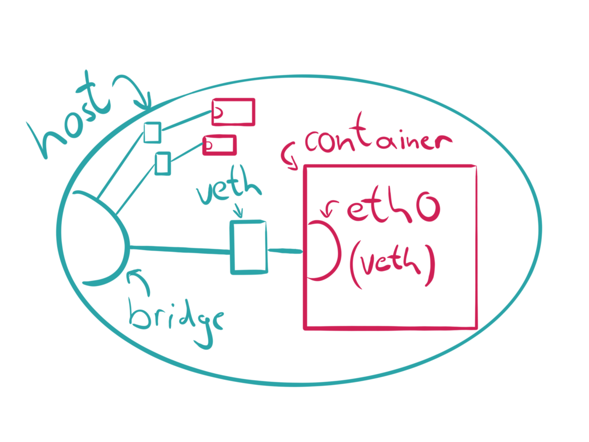

 

# [Appendix] Containers

 

- **Kernel Space**
- **Container Runtimes**
- **Container Images**

---

## [Kernel Space](https://medium.com/@saschagrunert/demystifying-containers-part-i-kernel-space-2c53d6979504)

**Containers** are only isolated groups of processes running on a single host, which fulfill a set of “common” features.  
**컨테이너**는 단일 호스트에서 실행되는 **격리**된 프로세스 그룹임.

### chroot, pivot_root
파일시스템 root를 변경. (/ 를 다른 경로로 설정.)  
초기에 사용되던 chroot는 더 이상 컨테이너에서 사용되지 않고, pivot_root가 사용됨.  
이것만으로는 프로세스, 네트워크 격리를 할 수 없음. ( 감옥 안에서 감옥 밖의 프로세스와 네트워크를 건드릴 수 있음. (* ￣︿￣) ) 

> `jail` : chroot를 이용하여 해커활동 모니터링에 사용되어 Jail이라는 용어를 사용함. (1991)  

---

### Linux Namespaces
**Namespaces** are a **Linux kernel feature** which were introduced back in 2002 with Linux 2.4.19.  

Not all available namespaces were implemented from the beginning. A full support for what we now understand as **“container ready”** was finished in **kernel version 3.8** back in 2013 with the introduction of the user namespace.

- seven distinct namespaces (current) : *mnt, pid, net, ipc, uts, user and cgroup.*
- two additional namespaces (not fully implemented yet) : *time and syslog.* 

- Namespace APIs ( System calls )
    - clone : creates a new child process
    - unshare : disassociate parts of the execution context
    - setns : reassociates the calling thread with the provided namespace file descriptor

#### Mount(mnt) namespace
2002년 처음 구현된 Namespace로, 이를 이용하여 프로세스 그룹별로 마운트포인트 세트를 격리(isolate)할 수 있음.  
chroot 의 jail과 유사한 (하지만 더 안전한 방식으로) 환경을 제공함.  
mnt namespace 추상화는 루트 권한 없이도 내부에서 루트 권한을 가진 가상 환경을 생성할 수 있음.

---

#### UNIX Time-sharing System (uts) namespace
The UTS namespace was introduced in Linux 2.6.19 (2006) and allows us to **unshare the domain- and hostname** from the current host system.

#### Interprocess Communication (ipc) namespace
mespaces came with Linux 2.6.19 (2006) too and isolate interprocess communication (IPC) resources.

---

#### Process ID (pid) namespace
The PID namespace was introduced in Linux 2.6.24 (2008) and gives processes an **independent set of process identifiers (PIDs)**.

---

#### Network (net) namespace
Network namespaces were completed in Linux 2.6.29 (2009) and can be used to virtualize the network stack.

#### User ID (user) namespace
With Linux 3.5 (2012) the isolation of user and group IDs was finally possible via namespaces.

---

## [Container Runtimes](https://medium.com/@saschagrunert/demystifying-containers-part-ii-container-runtimes-e363aa378f25)

**“How to actually run containers?”**  

---

Linux Container(LXC) : cgroup, Namespaces  
LMCTFY : "Let Me Contain That For You" -> Google's project (2007)  
Docker : LXC , images

Open Container Initiative (OCI)
Container Runtime Interface (CRI)
CRI-O

---

## [Container Images](https://medium.com/@saschagrunert/demystifying-containers-part-iii-container-images-244865de6fef)

---

### References
- [Demystifying Containers - Part I: Kernel Space](https://medium.com/@saschagrunert/demystifying-containers-part-i-kernel-space-2c53d6979504)
- [Demystifying Containers - Part II: Container Runtimes](https://medium.com/@saschagrunert/demystifying-containers-part-ii-container-runtimes-e363aa378f25)
- [Demystifying Containers — Part III: Container Images](https://medium.com/@saschagrunert/demystifying-containers-part-iii-container-images-244865de6fef)
