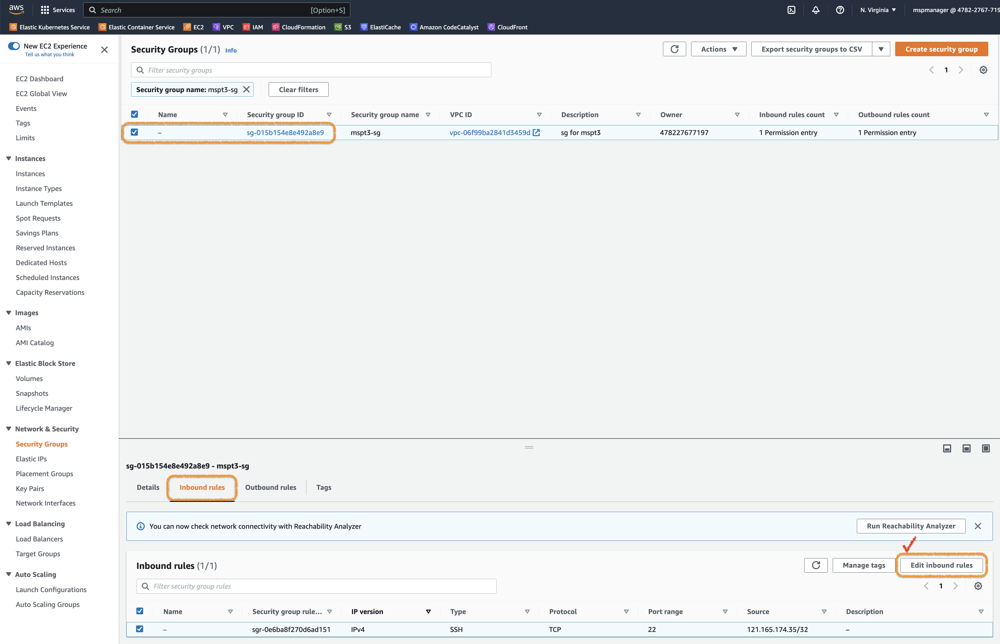
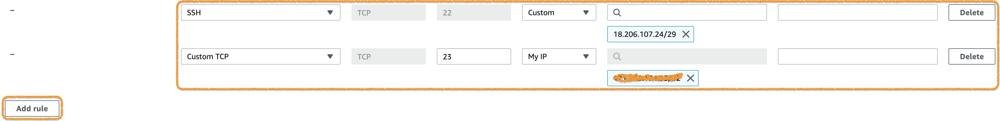
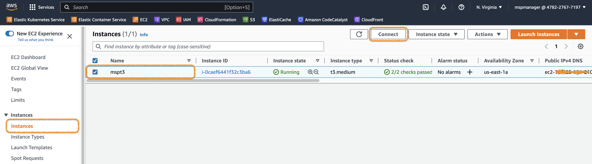
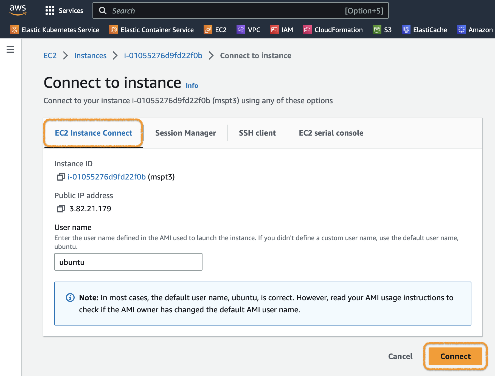
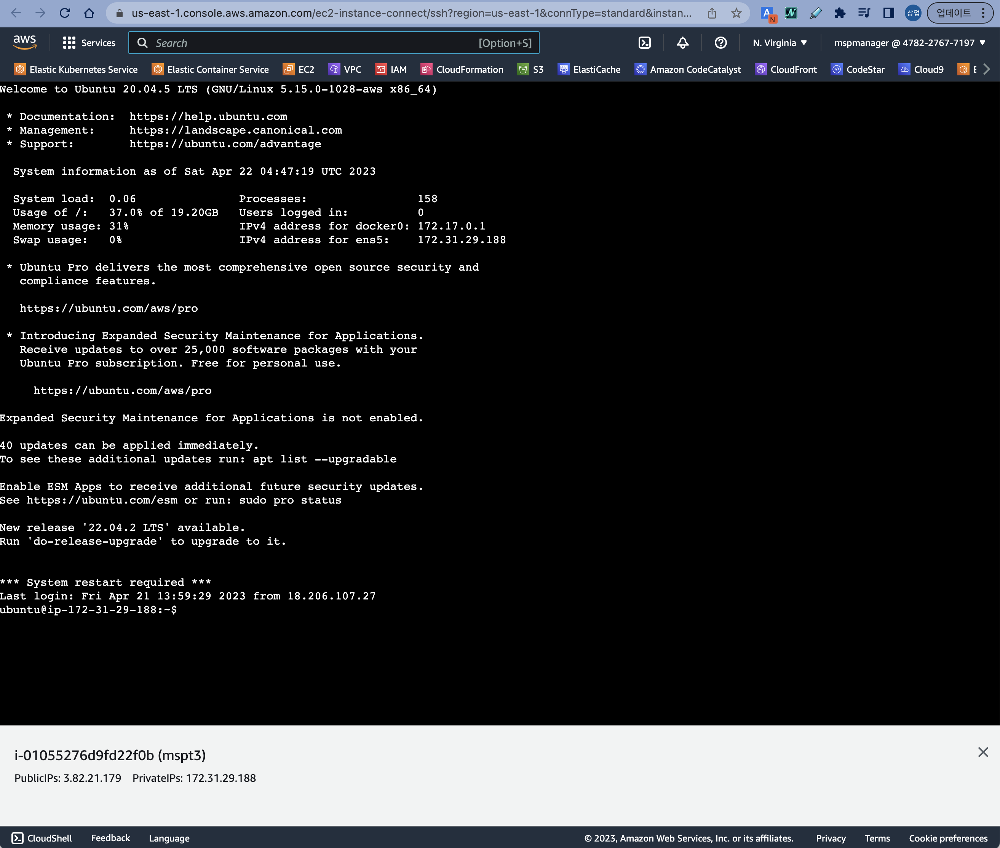

# EC2 SSH 포트변경

<br>

SSH 의 Default port인 22번 포트를 이용할 수 없는 경우, 설정을 변경하는 가이드입니다.  

순서는 다음과 같습니다.  
- EC2 Security group 설정 (EC2 Instance connect, sshd)
- EC2 Instance connect 로 연결
- sshd 설정 변경
- ssh를 이용해서 접속

## EC2 Security group 설정
EC2 Instance connect를 위한 규칙과 ssh 포트변경 후 사용할 규칙을 추가합니다.


> 위와같이 EC2 Instance의 **Security** 탭에서 해당 **Security group**으로 이동합니다. (Security group명 옆의 아이콘 클릭)

<br><br><br>


> Serurity group화면의 Inbound rules 탭에서 `Edit inbound rules` 버튼을 클릭합니다.

<br><br><br>


> `Add rule` 버튼을 누르면 규칙을 추가할 수 있습니다. 아래 규칙을 추가해주세요.

| **Type**   | **Port range** | Source |
| --- | --- | --- |
| SSH | 22 | Custom ( 18.206.107.24/29 ) |
| Custom TCP | 23 | My IP  |

첫 번째 규칙은 EC2 Instance Connect를 위한 것이고, 두 번째 규칙은 ssh 포트변경 후 사용을 위한 겻입니다.  

> 참고 : [EC2 Instance Connect 설정](https://docs.aws.amazon.com/ko_kr/AWSEC2/latest/UserGuide/ec2-instance-connect-set-up.html) 과 [https://ip-ranges.amazonaws.com/ip-ranges.json](https://ip-ranges.amazonaws.com/ip-ranges.json) 의 아래 부분  
> ```
>{
>   "ip_prefix": "18.206.107.24/29",
>   "region": "us-east-1",
>   "service": "EC2_INSTANCE_CONNECT",
>   "network_border_group": "us-east-1"
>}
>```

<br><br><br>

## EC2 Instance connect 를 이용하여 접속

이제 다음과 같이 EC2 Instance에 접속 가능합니다.  

AWS Console에서 EC2 > Instances 화면으로 이동합니다.

> 접속하려는 EC2 Instance를 선택하고, `Connect`버튼을 클릭합니다.

<br><br><br>


> 위 그림과 같이 **Connect to instance** 화면에서 **EC2 Instance Connect** 탭을 클릭하고 **Connect** 버튼을 클릭합니다.

<br><br><br>


> 이렇게 브라우저를 통해서 접속 됩니다.

<br>

여기까지만 하고 사용해도 됩니다.  
별도의 Teminal 프로그램을 사용해서 접속하지 않고, **EC2 Instance Connect**를 사용하는 방법입니다.

<br><br><br>

## sshd 설정 변경 (포트변경)
이제 ssh의 기본 포트(22)를 다른 포트로 변경해 보겠습니다.  
sshd의 설정파일은 `/etc/ssh/sshd_config` 이고, 포트 설정 부분은 `Port 22`입니다.

```bash
ubuntu@ip-172-31-29-188:~$ sudo cat /etc/ssh/sshd_config | grep -i port
#Port 22
#GatewayPorts no
```

> 💻 명령어
>```bash
>sudo cat /etc/ssh/sshd_config | grep -i port
>```

<br><br><br>

이제 이 파일을 아래 명령어로 수정해주세요.

```bash
ubuntu@ip-172-31-29-188:~$ sudo sed -i 's/#Port 22/Port 23/g' /etc/ssh/sshd_config
ubuntu@ip-172-31-29-188:~$ sudo cat /etc/ssh/sshd_config | grep -i port
Port 23
#GatewayPorts no
```

> 💻 명령어
>```bash
>sudo sed -i 's/#Port 22/Port 23/g' /etc/ssh/sshd_config
>```
>```bash
>sudo cat /etc/ssh/sshd_config | grep -i port
>```
> `#Port 22`를 `Port 23`로 바꾸고 확인했습니다. (주석 풀고 23번 포트 적용)

<br><br><br>

그리고 sshd 서비스를 재시작 해주세요.  
```bash
ubuntu@ip-172-31-29-188:~$ sudo service sshd restart
```

> 💻 명령어
>```bash
>sudo service sshd restart
>```

<br>

이제 ssh 포트가 22에서 23으로 변경됐습니다.

<br><br><br>

## Terminal 프로그램을 이용한 접속 (ssh)

다음은 기본 과정과 동일합니다.  
단, 접속 시 포트만 기본포트인 22가 아닌 23을 사용하면 됩니다.

[본 교재](https://github.com/JungSangup/mspt3/blob/main/doc/%5BHands-on%5D%2001_Environment_Setup-Docker.md#2-vm-instance-%EC%A0%91%EC%86%8D%ED%95%98%EA%B8%B0)로 돌아가서 다음 과정을 진행해주세요.
