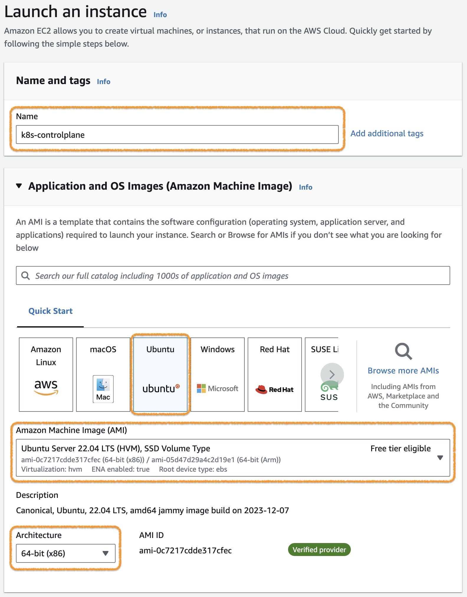
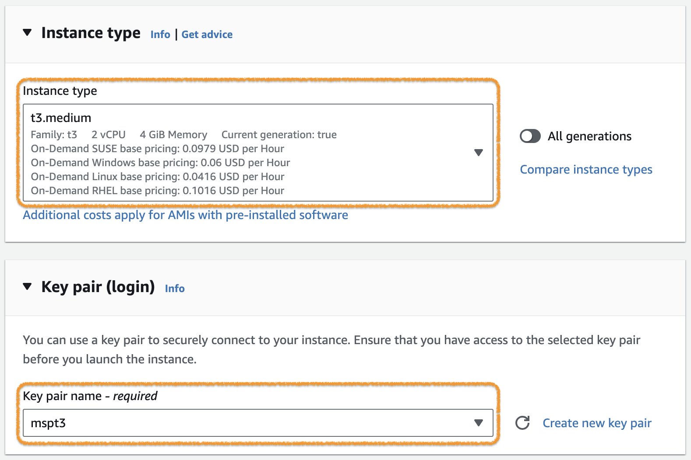
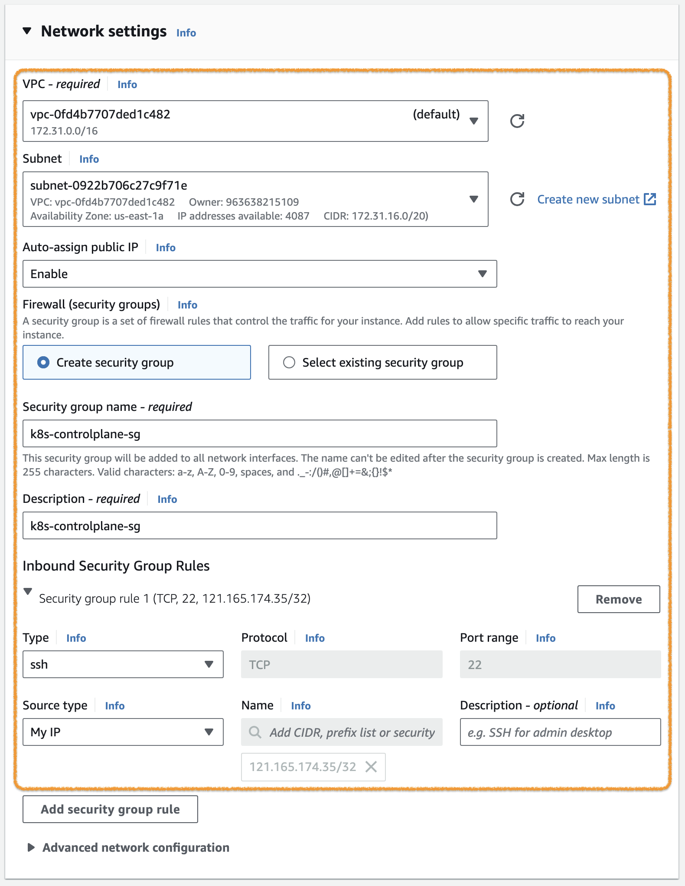
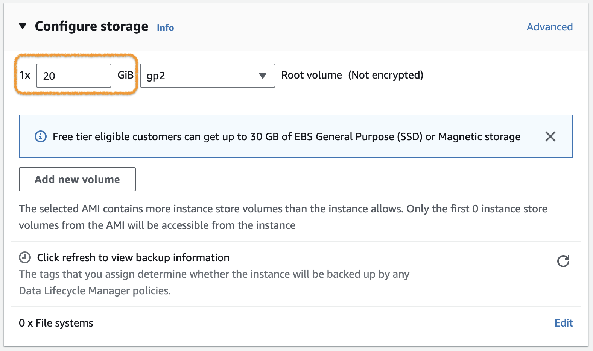

## [Appendix] Kubernetes 클러스터 구성하기 ( with kubeadm )

<br>

kubeadm 도구를 이용해서 Kubernetes cluster를 구성하는 절차입니다.  
이 문서는 [Bootstrapping clusters with kubeadm](https://kubernetes.io/docs/setup/production-environment/tools/kubeadm/) 의 내용을 기반으로 작성되었습니다.

<br>

**Kubernetes 클러스터 구성 순서**

1. Node VM(Virtual machine) 준비
2. Container runtime 설치
3. kubeadm, kubelet, kubectl 설치
4. Control-plane node 구성
5. (Worker) node 구성
6. Helm 설치
7. Ingress controller 설치 및 구성
8. Storage Class 구성

---

### 클러스터 구성

이 가이드는 아래와 같은 구성으로 진행함.

- Node 구성 : Contol-plane node * 1 , (Worker) node * 2
- Node OS : Ubuntu Server 22.04 LTS
- Container runtime : containerd
- Kubernetes version : 1.29
- Ingress controller : ingress nginx
- Srorage Class : NFS, NFS provisioner

---

### 1. Node VM(Virtual machine) 준비

Kubernetes 클러스터 구성을 위한 Node VM들을 준비합니다.  

> VM이 아닌 다른 구성(e.g. Bare metal server, PC, Single board computer etc.)을 이용하는 경우 이 단계는 생략하면 됩니다.  

모든 VM 노드는 인터넷에 연결되어 있고, Public IP Address를 가진 구성으로 합니다.  
이 가이드는 AWS의 EC2 Instance를 이용하는 경우를 설명합니다.  

> AWS의 Default VPC는 Internet Gateway를 이용하여 인터넷에 연결되어 있습니다.

아래와 같이 세 개의 VM을 준비합니다.

| Node name        | OS                      | Node type | VPC         | Public IP | Storage |
|:---------------- |:-----------------------:| --------- |:-----------:| --------- | ------- |
| k8s-controlplane | Ubuntu Server 22.04 LTS | t3.medium | Default VPC | Enable    | 20GiB   |
| k8s-node01        | Ubuntu Server 22.04 LTS | t3.medium | Default VPC | Enable    | 20GiB   |
| k8s-node02        | Ubuntu Server 22.04 LTS | t3.medium | Default VPC | Enable    | 20GB    |

아래는 k8s-controlplane 구성 예시이며, k8s-node1와 k8s-node2는 Name만 다르게 하고 다른 구성은 동일하게 진행합니다.  




> **Key pair**는 SSH 접속을 위해 필요함.


> Inbound Security Group Rule은 SSH 접속을 위한 MyIP만 우선 설정하고, 추후 필요한 설정 추가 예정.




---

### [Option] Swapoff

Kubernetes는 Swap 메모리를 지원하지 않고 있습니다.  
따라서, Kubernetes를 구성하려는 노드에서는 Swap 설정을 모두 비활성화 해야 합니다.
> 최근에는 지원하려는 움직임이 있습니다. ( [Kubernetes 1.28: Beta support for using swap on Linux](https://kubernetes.io/blog/2023/08/24/swap-linux-beta/) )

먼저 Swap 설정 확인은 다음과 같이 할 수 있습니다.
```bash
$ free --human
               total        used        free      shared  buff/cache   available
Mem:           3.8Gi       630Mi       123Mi       2.0Mi       3.0Gi       2.8Gi
Swap:             0B          0B          0B
$ swapon --summary
$
```
> 💻 명령어
>```bash
>free --human
>```
>```bash
>swapon --summary
>```
> `free` 또는 `swapon` 명령어 사용. (위 예시는 Swap 비활성화 된 경우임.)

위 예시처럼 Swap 이 비활성화 되어있는 경우에는 이 절차를 생략하고 다음 절차(2. Container runtime 설치)를 바로 실행합니다.

그렇지 않은 경우에는 다음과 같이 Swap을 비활성화 합니다.  

먼저, 현재 설정된 swap 메모리를 비활성화 합니다. (swapoff)
```bash
$ sudo swapoff --all
```
> 💻 명령어
>```bash
>sudo swapoff --all
>```

그 다음은, OS가 재시작 되더라도 swap 구성이 되지 않도록 다음과 같이 fstab 파일을 수정합니다.
```bash
$ sudo sed -i '/ swap / s/^/#/' /etc/fstab
```
> 💻 명령어
>```bash
>sudo sed -i '/ swap / s/^/#/' /etc/fstab
>```
> /etc/fstab파일에서 swap 설정 부분을 찾아서 comment out 처리(#) 함.


---

### 2. Container runtime 설치

준비된 Node에 Container runtime 중 하나인 containerd를 설치합니다.  
아래 내용은 모든 Node(k8s-controlplane, k8s-node01, k8s-node02)에 동일하게 진행합니다.  

각 노드로 ssh 접속 후 다음 절차를 진행하세요.  

> 상세 내용은 [Container Runtimes](https://kubernetes.io/docs/setup/production-environment/container-runtimes/)를 참조.

#### 2.1. Network 설정

[Network Plugin Requirements](https://kubernetes.io/docs/concepts/extend-kubernetes/compute-storage-net/network-plugins/#network-plugin-requirements)에 따라 iptables proxy 설정을 합니다.  

아래 명령어를 실행합니다.  

> 💻 명령어
>```bash
>cat <<EOF | sudo tee /etc/modules-load.d/k8s.conf
>overlay
>br_netfilter
>EOF
>
>sudo modprobe overlay
>sudo modprobe br_netfilter
>
># sysctl params required by setup, params persist across reboots
>cat <<EOF | sudo tee /etc/sysctl.d/k8s.conf
>net.bridge.bridge-nf-call-iptables  = 1
>net.bridge.bridge-nf-call-ip6tables = 1
>net.ipv4.ip_forward                 = 1
>EOF
>
># Apply sysctl params without reboot
>sudo sysctl --system
>```

> 관련 문서 : [Install and configure prerequisites](https://kubernetes.io/docs/setup/production-environment/container-runtimes/#install-and-configure-prerequisites) 

---

#### 2.2. containerd 설치

containerd를 apt package로 설치합니다.  

> 💻 명령어
>```bash
># Add Docker's official GPG key:
>sudo apt-get update
>sudo apt-get install -y ca-certificates curl gnupg
>sudo install -m 0755 -d /etc/apt/keyrings
>curl -fsSL https://download.docker.com/linux/ubuntu/gpg | sudo gpg --dearmor -o /etc/apt/keyrings/docker.gpg
>sudo chmod a+r /etc/apt/keyrings/docker.gpg
>
># Add the repository to Apt sources:
>echo \
>  "deb [arch=$(dpkg --print-architecture) signed-by=/etc/apt/keyrings/docker.gpg] https://download.docker.com/linux/ubuntu \
>  $(. /etc/os-release && echo "$VERSION_CODENAME") stable" | \
>  sudo tee /etc/apt/sources.list.d/docker.list > /dev/null
>sudo apt-get update
>sudo apt-get install -y containerd.io
>```

> 관련 문서 : [Getting started with containerd - Installing containerd - Option 2: From apt-get](https://github.com/containerd/containerd/blob/main/docs/getting-started.md#option-2-from-apt-get-or-dnf) , [Install Docker Engine on Ubuntu](https://docs.docker.com/engine/install/ubuntu/)

---

#### 2.3. containerd 설정

systemd를 cgroup driver로 사용하고, CRI Support를 위해 다음과 같이 containrd의 설정을 변경합니다.  

먼저 config.toml 파일을 생성합니다. (overwrite)  
> 💻 명령어
>```bash
>containerd config default | sudo tee /etc/containerd/config.toml
>```
> containerd 의 default config.를 config.toml 파일에 기록

Containerd의 default config.에서는 `SystemdCgroup = false`로 되어있기 때문에 이 부분을 변경합니다.  
> 💻 명령어
>```bash
>sudo sed -i 's/SystemdCgroup = false/SystemdCgroup = true/g' /etc/containerd/config.toml
>```

결과는 아래와 같아야 합니다.  
- disabled_plugins 에 cri가 포함되어 있지 않다.
- SystemdCgroup = true ( [plugins."io.containerd.grpc.v1.cri".containerd.runtimes.runc.options] 부분 )
```bash
$ sudo cat /etc/containerd/config.toml | grep disabled_plugins
disabled_plugins = []
$ sudo cat /etc/containerd/config.toml | grep SystemdCgroup
            SystemdCgroup = true
```

> 💻 명령어
>```bash
>sudo cat /etc/containerd/config.toml | grep disabled_plugins
>```
>```bash
>sudo cat /etc/containerd/config.toml | grep SystemdCgroup
>```

설정을 변경했으면 아래 명령어를 실행해서 containerd 를 재시작합니다.
> 💻 명령어
>```bash
>sudo systemctl restart containerd
>```

> 관련 문서 : [Configuring the systemd cgroup driver](https://kubernetes.io/docs/setup/production-environment/container-runtimes/#containerd-systemd)

---

### 3. kubeadm, kubelet, kubectl 설치

다음 세 개의 패키지를 모든 노드에 설치합니다.  
- kubeadm : Kubernetes 클러스터 관리 도구
- kubelet : Kubernetes node component로 Pod/Container의 동작을 관리
- kubectl: Kubernetes CLI 도구

다음 명령을 실행해서 세 개의 패키지를 설치합니다.
> 아래 명령어는 Kubernetes v1.29 경우입니다. 설치 시점에 필요한 버젼을 확인 후 진행하세요.

> 💻 명령어
>```bash
>sudo apt-get update
># apt-transport-https may be a dummy package; if so, you can skip that package
>sudo apt-get install -y apt-transport-https ca-certificates curl gpg
>
>curl -fsSL https://pkgs.k8s.io/core:/stable:/v1.29/deb/Release.key | sudo gpg --dearmor -o /etc/apt/keyrings/kubernetes-apt-keyring.gpg
>
># This overwrites any existing configuration in /etc/apt/sources.list.d/kubernetes.list
>echo 'deb [signed-by=/etc/apt/keyrings/kubernetes-apt-keyring.gpg] https://pkgs.k8s.io/core:/stable:/v1.29/deb/ /' | sudo tee /etc/apt/sources.list.d/kubernetes.list
>
>sudo apt-get update
>sudo apt-get install -y kubelet kubeadm kubectl
>sudo apt-mark hold kubelet kubeadm kubectl
>```

> 관련 문서 : [Installing kubeadm, kubelet and kubectl](https://kubernetes.io/docs/setup/production-environment/tools/kubeadm/install-kubeadm/#installing-kubeadm-kubelet-and-kubectl)

---

### 4. Control-plane node 구성

**[주의] 이 절차는 Control-plane node에서만 진행합니다.**  

kubeadm을 이용해서 Control-plane node에 필요한 패키지를 설치하고 실행합니다.

먼저 Control-plane node의 IP Address 확인이 필요합니다.  (AWS EC2인 경우 Private IPv4 addresses)
```bash
$ ip route show
default via 172.31.16.1 dev ens5 proto dhcp src 172.31.30.145 metric 100
...
```

> 💻 명령어
> ```bash
>ip route show
...
> 위와 같이 출력되면 172.31.30.145 가 이 Node의 IP Address 임.

아래 명령어를 실행하여 Control-plane node에 Control-plane component들을 설치하고 실행합니다.  

> 💻 명령어
>```bash
>sudo kubeadm init --apiserver-advertise-address=[API-SERVER IP ADDRESS] --pod-network-cidr=10.244.0.0/16
>```
> `--apiserver-advertise-address` : Control-plane node의 IP Address  
> `--pod-network-cidr` : 사용할 Network add-on에 따라 설정함. (위 예시는 Flannel 을 위한 구성입니다.)

아래는 실행결과 예시입니다.  
```bash
$ sudo kubeadm init --apiserver-advertise-address=172.31.30.145 --pod-network-cidr=10.244.0.0/16
[init] Using Kubernetes version: v1.29.0
[preflight] Running pre-flight checks
[preflight] Pulling images required for setting up a Kubernetes cluster
[preflight] This might take a minute or two, depending on the speed of your internet connection
[preflight] You can also perform this action in beforehand using 'kubeadm config images pull'
W0112 08:14:02.746414    7047 checks.go:835] detected that the sandbox image "registry.k8s.io/pause:3.6" of the container runtime is inconsistent with that used by kubeadm. It is recommended that using "registry.k8s.io/pause:3.9" as the CRI sandbox image.
[certs] Using certificateDir folder "/etc/kubernetes/pki"
[certs] Generating "ca" certificate and key
[certs] Generating "apiserver" certificate and key
[certs] apiserver serving cert is signed for DNS names [ip-172-31-30-145 kubernetes kubernetes.default kubernetes.default.svc kubernetes.default.svc.cluster.local] and IPs [10.96.0.1 172.31.30.145]
[certs] Generating "apiserver-kubelet-client" certificate and key
[certs] Generating "front-proxy-ca" certificate and key
[certs] Generating "front-proxy-client" certificate and key
[certs] Generating "etcd/ca" certificate and key
[certs] Generating "etcd/server" certificate and key
[certs] etcd/server serving cert is signed for DNS names [ip-172-31-30-145 localhost] and IPs [172.31.30.145 127.0.0.1 ::1]
[certs] Generating "etcd/peer" certificate and key
[certs] etcd/peer serving cert is signed for DNS names [ip-172-31-30-145 localhost] and IPs [172.31.30.145 127.0.0.1 ::1]
[certs] Generating "etcd/healthcheck-client" certificate and key
[certs] Generating "apiserver-etcd-client" certificate and key
[certs] Generating "sa" key and public key
[kubeconfig] Using kubeconfig folder "/etc/kubernetes"
[kubeconfig] Writing "admin.conf" kubeconfig file
[kubeconfig] Writing "super-admin.conf" kubeconfig file
[kubeconfig] Writing "kubelet.conf" kubeconfig file
[kubeconfig] Writing "controller-manager.conf" kubeconfig file
[kubeconfig] Writing "scheduler.conf" kubeconfig file
[etcd] Creating static Pod manifest for local etcd in "/etc/kubernetes/manifests"
[control-plane] Using manifest folder "/etc/kubernetes/manifests"
[control-plane] Creating static Pod manifest for "kube-apiserver"
[control-plane] Creating static Pod manifest for "kube-controller-manager"
[control-plane] Creating static Pod manifest for "kube-scheduler"
[kubelet-start] Writing kubelet environment file with flags to file "/var/lib/kubelet/kubeadm-flags.env"
[kubelet-start] Writing kubelet configuration to file "/var/lib/kubelet/config.yaml"
[kubelet-start] Starting the kubelet
[wait-control-plane] Waiting for the kubelet to boot up the control plane as static Pods from directory "/etc/kubernetes/manifests". This can take up to 4m0s
[apiclient] All control plane components are healthy after 7.002440 seconds
[upload-config] Storing the configuration used in ConfigMap "kubeadm-config" in the "kube-system" Namespace
[kubelet] Creating a ConfigMap "kubelet-config" in namespace kube-system with the configuration for the kubelets in the cluster
[upload-certs] Skipping phase. Please see --upload-certs
[mark-control-plane] Marking the node ip-172-31-30-145 as control-plane by adding the labels: [node-role.kubernetes.io/control-plane node.kubernetes.io/exclude-from-external-load-balancers]
[mark-control-plane] Marking the node ip-172-31-30-145 as control-plane by adding the taints [node-role.kubernetes.io/control-plane:NoSchedule]
[bootstrap-token] Using token: ev57z0.770ldkwdxb8if9bn
[bootstrap-token] Configuring bootstrap tokens, cluster-info ConfigMap, RBAC Roles
[bootstrap-token] Configured RBAC rules to allow Node Bootstrap tokens to get nodes
[bootstrap-token] Configured RBAC rules to allow Node Bootstrap tokens to post CSRs in order for nodes to get long term certificate credentials
[bootstrap-token] Configured RBAC rules to allow the csrapprover controller automatically approve CSRs from a Node Bootstrap Token
[bootstrap-token] Configured RBAC rules to allow certificate rotation for all node client certificates in the cluster
[bootstrap-token] Creating the "cluster-info" ConfigMap in the "kube-public" namespace
[kubelet-finalize] Updating "/etc/kubernetes/kubelet.conf" to point to a rotatable kubelet client certificate and key
[addons] Applied essential addon: CoreDNS
[addons] Applied essential addon: kube-proxy

Your Kubernetes control-plane has initialized successfully!

To start using your cluster, you need to run the following as a regular user:

  mkdir -p $HOME/.kube
  sudo cp -i /etc/kubernetes/admin.conf $HOME/.kube/config
  sudo chown $(id -u):$(id -g) $HOME/.kube/config

Alternatively, if you are the root user, you can run:

  export KUBECONFIG=/etc/kubernetes/admin.conf

You should now deploy a pod network to the cluster.
Run "kubectl apply -f [podnetwork].yaml" with one of the options listed at:
  https://kubernetes.io/docs/concepts/cluster-administration/addons/

Then you can join any number of worker nodes by running the following on each as root:

kubeadm join 172.31.30.145:6443 --token ev57z0.770ldkw... \
	--discovery-token-ca-cert-hash sha256:3d98992e...
```

kubectl 설정을 위해 다음 명령어를 실행합니다.
> 💻 명령어
>```bash
>mkdir -p $HOME/.kube
>sudo cp -i /etc/kubernetes/admin.conf $HOME/.kube/config
>sudo chown $(id -u):$(id -g) $HOME/.kube/config
>```
> [Tip] `kubectl` CLI를 편하게 사용하기 위해서 [kubectl 자동 완성 활성화](https://kubernetes.io/ko/docs/tasks/tools/included/optional-kubectl-configs-bash-linux/#kubectl-%EC%9E%90%EB%8F%99-%EC%99%84%EC%84%B1-%ED%99%9C%EC%84%B1%ED%99%94)를 적용하면 편합니다.

다음은 pod network add-on 을 설치합니다. ( 아래 예시는 Flannel )

> 💻 명령어
>```bash
>kubectl apply -f https://github.com/flannel-io/flannel/releases/latest/download/kube-flannel.yml
>```

정상적으로 준비가 된 경우 아래와 같이 표시됩니다.  
```bash
$ kubectl get po -A
NAMESPACE      NAME                                       READY   STATUS    RESTARTS   AGE
kube-flannel   kube-flannel-ds-z97gc                      1/1     Running   0          2m1s
kube-system    coredns-76f75df574-276ns                   1/1     Running   0          5m3s
kube-system    coredns-76f75df574-swj5p                   1/1     Running   0          5m3s
kube-system    etcd-ip-172-31-26-107                      1/1     Running   0          5m17s
kube-system    kube-apiserver-ip-172-31-26-107            1/1     Running   0          5m17s
kube-system    kube-controller-manager-ip-172-31-26-107   1/1     Running   0          5m17s
kube-system    kube-proxy-x6zmg                           1/1     Running   0          5m3s
kube-system    kube-scheduler-ip-172-31-26-107            1/1     Running   0          5m18s
```

> 💻 명령어
>```bash
>kubectl get po -A
>```

여기까지 하면 Control-plane node는 준비가 됐습니다.  
다음 단계로 넘어가기 전에 API Server 접근을 위해서 Control-plane node의 Security Group에 다음 규칙을 추가해주세요.  
| Type | Protocol | Port range | Source |
| --- | --- | --- | --- |
| Custom TCP | TCP | 6443 | 172.31.0.0/16 |
> Source의 IP Range는 (Worker) node의 IP Range 입니다.


> 관련 문서 : [Initializing your control-plane node](https://kubernetes.io/docs/setup/production-environment/tools/kubeadm/create-cluster-kubeadm/#initializing-your-control-plane-node)   
> 관련 문서 : [kubeadm init](https://kubernetes.io/docs/reference/setup-tools/kubeadm/kubeadm-init/)   
> 관련 문서 : [Deploying flannel manually](https://github.com/flannel-io/flannel?tab=readme-ov-file#deploying-flannel-manually)

---

### 5. (Worker) node 구성

**[주의] 이 절차는 (Worker) node에서만 진행합니다.**  

kubeadm을 이용해서 (Worker) node에 필요한 구성을 하고, K8s cluster에 Join 시킵니다.  

앞 절차에서 생성된 `kubeadm join ...` 명령어를 저장해 두었으면 그대로 실행합니다.  
그렇지 않은 경우 다음과 같이
- api-server-endpoint  
- token  
- discovery-token-ca-cert-hash  
를 준비합니다.  

**Control-plane node**에서 다음과 같이 확입합니다.  

(1) api-server-endpoint
```bash
$ kubectl cluster-info
Kubernetes control plane is running at https://172.31.30.145:6443
CoreDNS is running at https://172.31.30.145:6443/api/v1/namespaces/kube-system/services/kube-dns:dns/proxy

To further debug and diagnose cluster problems, use 'kubectl cluster-info dump'.
```
> `172.31.30.145:6443` 이 API Server의 endpoint 입니다.

> 💻 명령어
>```bash
>kubectl cluster-info
>```


(2) token
```bash
$ kubeadm token list
TOKEN                     TTL         EXPIRES                USAGES                   DESCRIPTION                                                EXTRA GROUPS
ev57z0.770ldkw...   21h         2024-01-16T05:07:18Z   authentication,signing   The default bootstrap token generated by 'kubeadm init'.   system:bootstrappers:kubeadm:default-node-token
```
> `ev57z0.770ldkw...` 이 token name 입니다.

> 💻 명령어
>```bash
>kubeadm token list
>```


(3) discovery-token-ca-cert-hash
```bash
$ openssl x509 -pubkey -in /etc/kubernetes/pki/ca.crt | openssl rsa -pubin -outform der 2>/dev/null | openssl dgst -sha256 -hex | sed 's/^.* //'
3d98992e...
```
> `3d98992e...` 이 CA Cert 의 Hash 입니다.

> 💻 명령어
>```bash
>openssl x509 -pubkey -in /etc/kubernetes/pki/ca.crt | openssl rsa -pubin -outform der 2>/dev/null | openssl dgst -sha256 -hex | sed 's/^.* //'
>```


위의 정보를 조합하여 아래와 같이 `kubeadm join` 명령어를 실행합니다.  
```bash
$ sudo kubeadm join 172.31.30.145:6443 --token ev57z0.770ldkw... --discovery-token-ca-cert-hash sha256:3d98992e...

[preflight] Running pre-flight checks
[preflight] Reading configuration from the cluster...
[preflight] FYI: You can look at this config file with 'kubectl -n kube-system get cm kubeadm-config -o yaml'
[kubelet-start] Writing kubelet configuration to file "/var/lib/kubelet/config.yaml"
[kubelet-start] Writing kubelet environment file with flags to file "/var/lib/kubelet/kubeadm-flags.env"
[kubelet-start] Starting the kubelet
[kubelet-start] Waiting for the kubelet to perform the TLS Bootstrap...

This node has joined the cluster:
* Certificate signing request was sent to apiserver and a response was received.
* The Kubelet was informed of the new secure connection details.

Run 'kubectl get nodes' on the control-plane to see this node join the cluster.
```

> 💻 명령어
>```bash
>sudo kubeadm join [API-SERVER Endpoint] --token [TOKEN-NAME] --discovery-token-ca-cert-hash sha256:[CA-CERT Hash]
>```
> 주의 : `kubeadm join` 명령어는 Control-plane node가 아닌, (Worker) node 에서 실행합니다.


Join 후에 kubectl을 이용해서 Node를 조회하면 아래와 같이 조회됩니다.  
```bash
$ kubectl get nodes -o wide
NAME               STATUS   ROLES           AGE    VERSION   INTERNAL-IP     EXTERNAL-IP   OS-IMAGE             KERNEL-VERSION    CONTAINER-RUNTIME
ip-172-31-30-145   Ready    <none>          10s    v1.29.0   172.31.30.145   <none>        Ubuntu 20.04.6 LTS   5.15.0-1048-aws   containerd://1.6.26
ip-172-31-25-27    Ready    <none>          18s    v1.29.0   172.31.25.27    <none>        Ubuntu 20.04.6 LTS   5.15.0-1048-aws   containerd://1.6.26
ip-172-31-29-238   Ready    control-plane   175m   v1.29.0   172.31.29.238   <none>        Ubuntu 20.04.6 LTS   5.15.0-1048-aws   containerd://1.6.26
```

> 💻 명령어
>```bash
>kubectl get nodes -o wide
>```
> 한 개의 Control-plane node와 두 개의 (Worker) node 가 확인됨.


> 관련 문서 : [kubeadm join](https://kubernetes.io/docs/reference/setup-tools/kubeadm/kubeadm-join/)

---

### 6. Helm 설치

Kubernetes package manager인 Helm을 설치합니다.  
kubectl CLI를 위한 설정이 된 곳(앞의 과정대로 진행하셨다면 Control-plane node)에서 다음과 같이 설치합니다.  

> 💻 명령어
>```bash
>curl -LO https://get.helm.sh/helm-v3.13.3-linux-amd64.tar.gz
>tar -zxvf helm-v3.13.3-linux-amd64.tar.gz
>sudo mv linux-amd64/helm /usr/local/bin/helm
>```
> 설치 시접의 릴리즈 확인은 [Helm releases](https://github.com/helm/helm/releases)를 참고하세요.

설치 확인은 아래와 같이 해보시면 됩니다.  
```bash
$ helm version
version.BuildInfo{Version:"v3.13.3", GitCommit:"c8b948945e52abba22ff885446a1486cb5fd3474", GitTreeState:"clean", GoVersion:"go1.20.11"}
```

> 💻 명령어
>```bash
>helm version
>```

> 관련 문서 : [Installing Helm  - From the binary releases ](https://helm.sh/docs/intro/install/#from-the-binary-releases)

---

### 7. Ingress controller 설치 및 구성

Ingress controller로 Nginx를 설치합니다.  

> 💻 명령어
>```bash
>helm install ingress-nginx ingress-nginx \
>  --repo https://kubernetes.github.io/ingress-nginx \
>  --namespace ingress-nginx --create-namespace \
>  --set controller.service.type=NodePort \
>  --set controller.service.nodePorts.http=30000 \
>  --set controller.service.nodePorts.https=30001
>```
> ingress-nginx helm chart를 이용하고, Service type은 NodePort(HTTP:30000, HTTPS:30001)로 설정 했습니다.


이 구성은 Ingress-Nginx Controller의 Bare-metal 구성에서 [Over a NodePort Service](https://kubernetes.github.io/ingress-nginx/deploy/baremetal/#over-a-nodeport-service) 방법을 사용한 것입니다.  
Load balancing 구성은 여러가지 방법이 있을 수 있으므로, 구축하는 환경에 맞게 구성하시면 됩니다.  

설치가 완료되면 아래와 같이 `ingress-nginx` 네임스페이스와 리소스들이 생성됩니다.  
```bash
$ helm ls -n ingress-nginx
NAME            NAMESPACE       REVISION        UPDATED                                 STATUS          CHART                   APP VERSION
ingress-nginx   ingress-nginx   1               2024-01-18 04:09:58.730337499 +0000 UTC deployed        ingress-nginx-4.9.0     1.9.5      

$ kubectl get all -n ingress-nginx
NAME                                            READY   STATUS    RESTARTS   AGE
pod/ingress-nginx-controller-6c84576bbd-x487j   1/1     Running   0          41s

NAME                                         TYPE        CLUSTER-IP       EXTERNAL-IP   PORT(S)                      AGE
service/ingress-nginx-controller             NodePort    10.107.129.131   <none>        80:30000/TCP,443:30001/TCP   41s
service/ingress-nginx-controller-admission   ClusterIP   10.106.188.41    <none>        443/TCP                      41s

NAME                                       READY   UP-TO-DATE   AVAILABLE   AGE
deployment.apps/ingress-nginx-controller   1/1     1            1           41s

NAME                                                  DESIRED   CURRENT   READY   AGE
replicaset.apps/ingress-nginx-controller-6c84576bbd   1         1         1       41s
```

> 💻 명령어
>```bash
>helm ls -n ingress-nginx
>```
>```bash
>kubectl get all -n ingress-nginx
>```
설치 후 NodePort를 특정 포트로 변경하려면 [kubectl edit](https://kubernetes.io/docs/reference/kubectl/generated/kubectl_edit/) 명령어를 이용하여 변경합니다.  

삭제는 다음과 같이 합니다.  
```bash
helm uninstall ingress-nginx --namespace ingress-nginx
kubectl delete namespaces ingress-nginx
```

> 💻 명령어
>```bash
>helm uninstall ingress-nginx --namespace ingress-nginx
>```
>```bash
>kubectl delete namespaces ingress-nginx
>```

> 관련 문서 : [Ingress Controllers](https://kubernetes.io/docs/concepts/services-networking/ingress-controllers/)  
> 관련 문서 : [Ingress-Nginx Controller - Installation Guide - Quick start](https://kubernetes.github.io/ingress-nginx/deploy/#quick-start)  
> 관련 문서 : [Ingress-Nginx Controller - Bare-metal considerations](https://kubernetes.github.io/ingress-nginx/deploy/baremetal/)  
> 관련 문서 : [Ingress-Nginx Helm chart](https://github.com/kubernetes/ingress-nginx/tree/main/charts/ingress-nginx)

---

### 8. Storage Class 구성

> [사전조건] NFS Server가 구성되어 있어야 함.

미리 준비된 NFS Server의 Storage를 Dynamic Volume provisioning영역으로 사용하기 위해서 Storage Class를 구성합니다.  
먼저, 워크로드가 실행될 노드( (worker) node )에 NFS Client를 설치합니다.  

> 💻 명령어
>```bash
>sudo apt-get update
>sudo apt-get install -y nfs-common
>```

그 다음은 NFS Server에서 공유된 디렉토리의 정보를 확인합니다.  
이 영역은 미리 준비되어 있어야 합니다.  

```bash
$ showmount -e 172.31.26.107
Export list for 172.31.26.107:
/data/k8s-volume 172.31.16.0/20
```
> 위 예시는 172.31.26.107 에 NFS Server가 구성되어 있는 예시입니다. /data/k8s-volume 디렉토리가 Volume 영역으로 사용되고 172.31.16.0/20에서 접근 가능한 구성입니다.

> 💻 명령어
>```bash
>showmount -e [NFS-SERVER IP ADDRESS]
>```


이제 NFS Subdir External Provisioner 를 설치합니다.
```bash
$ helm repo add nfs-subdir-external-provisioner https://kubernetes-sigs.github.io/nfs-subdir-external-provisioner/
$ helm install nfs-subdir-external-provisioner nfs-subdir-external-provisioner/nfs-subdir-external-provisioner \
    --create-namespace --namespace nfs-provisioner \
    --set nfs.server=172.31.26.107 \
    --set nfs.path=/data/k8s-volume \
    --set storageClass.defaultClass=true
```

> 💻 명령어
>```bash
>helm repo add nfs-subdir-external-provisioner https://kubernetes-sigs.github.io/nfs-subdir-external-provisioner/
>```
>```bash
>helm install nfs-subdir-external-provisioner nfs-subdir-external-provisioner/nfs-subdir-external-provisioner \
>    --create-namespace --namespace nfs-provisioner \
>    --set nfs.server=[NFS-SERVER IP ADDRESS] \
>    --set nfs.path=[NFS-SERVER VOLUME PATH] \
>    --set storageClass.defaultClass=true
>```
> nfs.server(NFS Server의 IP Address)와 nfs.path(NFS Server의 Volume 영역)는 앞서 확인한 정보를 참조하여 설정합니다.

설치 후 확인은 아래와 같이 합니다.
```bash
$ kubectl get storageclasses
NAME                   PROVISIONER                                     RECLAIMPOLICY   VOLUMEBINDINGMODE   ALLOWVOLUMEEXPANSION   AGE
nfs-client (default)   cluster.local/nfs-subdir-external-provisioner   Delete          Immediate           true                   33d
$ kubectl describe storageclasses nfs-client 
Name:                  nfs-client
IsDefaultClass:        Yes
Annotations:           meta.helm.sh/release-name=nfs-subdir-external-provisioner,meta.helm.sh/release-namespace=nfs-provisioner,storageclass.kubernetes.io/is-default-class=true
Provisioner:           cluster.local/nfs-subdir-external-provisioner
Parameters:            archiveOnDelete=true
AllowVolumeExpansion:  True
MountOptions:          <none>
ReclaimPolicy:         Delete
VolumeBindingMode:     Immediate
Events:                <none>
```

> 💻 명령어
>```bash
>kubectl get storageclasses
>```
>```bash
>kubectl describe storageclasses nfs-client
>```

> 관련 문서 : [Storage Classes](https://kubernetes.io/docs/concepts/storage/storage-classes/)  
> 관련 문서 : [nfs-subdir-external-provisioner](https://github.com/kubernetes-sigs/nfs-subdir-external-provisioner)  
