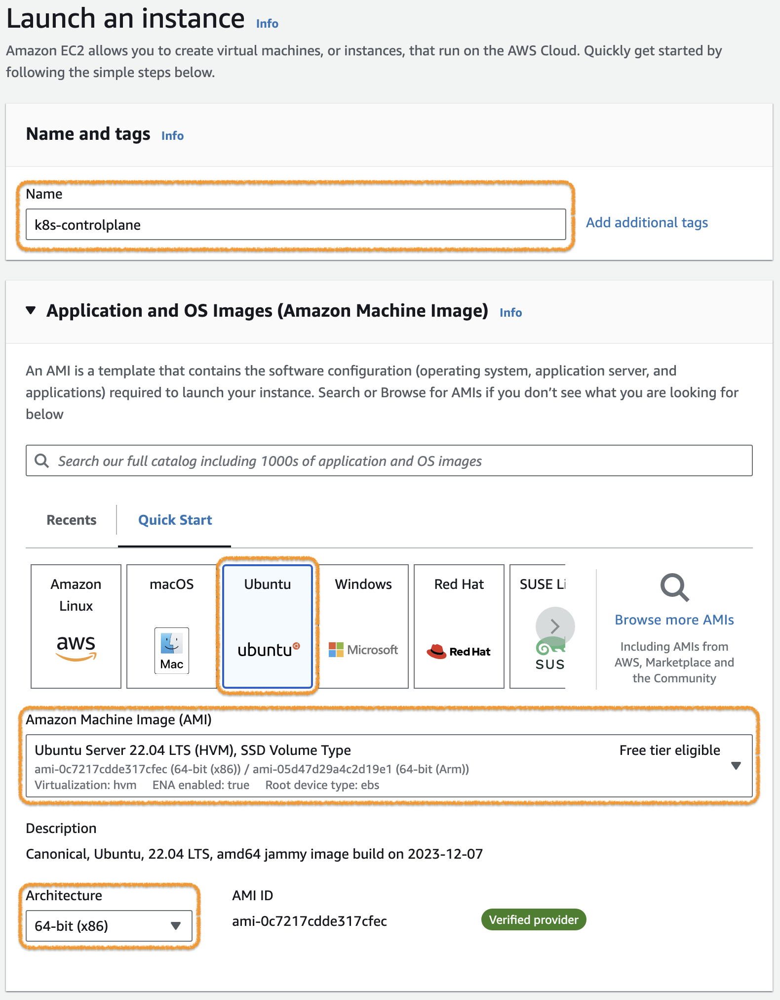

## [Appendix] Kubernetes 클러스터 구성하기

<br>

kubeadm 도구를 이용해서 Kubernetes cluster를 구성하는 절차입니다.  
이 문서는 [Bootstrapping clusters with kubeadm](https://kubernetes.io/docs/setup/production-environment/tools/kubeadm/) 의 내용을 기반으로 작성되었습니다.

<br>

**Kubernetes 클러스터 구성 순서**

1. Node VM(Virtual machine) 준비
2. Container runtime 설치
3. kubeadm, kubelet, kubectl 설치
4. Control-plane node 구성
5. (Worker) node 구성
6. Ingress controller 설치 및 구성
7. Storage Class 구성

---

### 클러스터 구성

이 가이드는 아래와 같은 구성으로 진행함.

- Node 구성 : Contol-plane node * 1 , (Worker) node * 2
- Node OS : Ubuntu Server 22.04 LTS
- Container runtime : containerd
- Kubernetes version : 1.29
- Ingress controller : ingress nginx
- Srorage Class : NFS, NFS provisioner

---

### 1. Node VM(Virtual machine) 준비

Kubernetes 클러스터 구성을 위한 Node VM들을 준비합니다.  

> VM이 아닌 다른 구성(e.g. Bare metal server, PC, Single board computer etc.)을 이용하는 경우 이 단계는 생략하면 됩니다.  

모든 VM 노드는 인터넷에 연결되어 있고, Public IP Address를 가진 구성으로 합니다.  
이 가이드는 AWS의 EC2 Instance를 이용하는 경우를 설명합니다.  

> AWS의 Default VPC는 Internet Gateway를 이용하여 인터넷에 연결되어 있습니다.

아래와 같이 세 개의 VM을 준비합니다.

| Node name        | OS                      | Node type | VPC         | Public IP | Storage |
|:---------------- |:-----------------------:| --------- |:-----------:| --------- | ------- |
| k8s-controlplane | Ubuntu Server 22.04 LTS | t3.medium | Default VPC | Enable    | 20GiB   |
| k8s-node01        | Ubuntu Server 22.04 LTS | t3.medium | Default VPC | Enable    | 20GiB   |
| k8s-node02        | Ubuntu Server 22.04 LTS | t3.medium | Default VPC | Enable    | 20GB    |

아래는 k8s-controlplane 구성 예시이며, k8s-node1와 k8s-node2는 Name만 다르게 하고 다른 구성은 동일하게 진행합니다.  




> **Key pair**는 SSH 접속을 위해 필요함.


> Inbound Security Group Rule은 SSH 접속을 위한 MyIP만 우선 설정하고, 추후 필요한 설정 추가 예정.


---

### 2. Container runtime 설치

준비된 Node에 Container runtime 중 하나인 containerd를 설치합니다.  
아래 내용은 모든 Node(k8s-controlplane, k8s-node01, k8s-node02)에 동일하게 진행합니다.  

각 노드로 ssh 접속 후 다음 절차를 진행하세요.  

> 상세 내용은 [Container Runtimes](https://kubernetes.io/docs/setup/production-environment/container-runtimes/)를 참조.

#### 2.1. Network 설정

[Network Plugin Requirements](https://kubernetes.io/docs/concepts/extend-kubernetes/compute-storage-net/network-plugins/#network-plugin-requirements)에 따라 iptables proxy 설정을 합니다.  

아래 명령어를 실행합니다.  
```bash
cat <<EOF | sudo tee /etc/modules-load.d/k8s.conf
overlay
br_netfilter
EOF

sudo modprobe overlay
sudo modprobe br_netfilter

# sysctl params required by setup, params persist across reboots
cat <<EOF | sudo tee /etc/sysctl.d/k8s.conf
net.bridge.bridge-nf-call-iptables  = 1
net.bridge.bridge-nf-call-ip6tables = 1
net.ipv4.ip_forward                 = 1
EOF

# Apply sysctl params without reboot
sudo sysctl --system
```

> 관련 문서 : [Install and configure prerequisites](https://kubernetes.io/docs/setup/production-environment/container-runtimes/#install-and-configure-prerequisites) 

---

#### 2.2. containerd 설치

containerd를 apt package로 설치합니다.  

```bash
# Add Docker's official GPG key:
sudo apt-get update
sudo apt-get install -y ca-certificates curl gnupg
sudo install -m 0755 -d /etc/apt/keyrings
curl -fsSL https://download.docker.com/linux/ubuntu/gpg | sudo gpg --dearmor -o /etc/apt/keyrings/docker.gpg
sudo chmod a+r /etc/apt/keyrings/docker.gpg

# Add the repository to Apt sources:
echo \
  "deb [arch=$(dpkg --print-architecture) signed-by=/etc/apt/keyrings/docker.gpg] https://download.docker.com/linux/ubuntu \
  $(. /etc/os-release && echo "$VERSION_CODENAME") stable" | \
  sudo tee /etc/apt/sources.list.d/docker.list > /dev/null
sudo apt-get update
sudo apt-get install -y containerd.io
```


> 관련 문서 : [Getting started with containerd - Installing containerd - Option 2: From apt-get](https://github.com/containerd/containerd/blob/main/docs/getting-started.md#option-2-from-apt-get-or-dnf) , [Install Docker Engine on Ubuntu](https://docs.docker.com/engine/install/ubuntu/)

---

#### 2.3. containerd 설정

systemd cgroup driver 와 CRI Support 를 위해 다음과 같이 설정파일을 변경합니다.  
`/etc/containerd/config.toml`파일의 내용을 모두 삭제(또는 comment out 처리)하고 아래 내용을 추가합니다.  
> 이 가이드는 K8s cluster 구성만 고려하고 있어 아래 내용만 남깁니다. 별도로 다른 설정이 필요한 경우 관련 가이드에 따라 설정하세요. 

```bash
[plugins."io.containerd.grpc.v1.cri".containerd.runtimes.runc]
  [plugins."io.containerd.grpc.v1.cri".containerd.runtimes.runc.options]
    SystemdCgroup = true
```

설정을 변경했으면 아래 명령어를 실행해서 containerd 를 재시작합니다.

```bash
sudo systemctl restart containerd
```

> 관련 문서 : [Configuring the systemd cgroup driver](https://kubernetes.io/docs/setup/production-environment/container-runtimes/#containerd-systemd)

---

### 3. kubeadm, kubelet, kubectl 설치

다음 세 개의 패키지를 모든 노드에 설치합니다.  
- kubeadm : Kubernetes 클러스터 관리 도구
- kubelet : Kubernetes node component로 Pod/Container의 동작을 관리
- kubectl: Kubernetes CLI 도구

다음 명령을 실행해서 세 개의 패키지를 설치합니다.
> 아래 명령어는 Kubernetes v1.29 경우입니다. 설치 시점에 필요한 버젼을 확인 후 진행하세요.

```bash
sudo apt-get update
# apt-transport-https may be a dummy package; if so, you can skip that package
sudo apt-get install -y apt-transport-https ca-certificates curl gpg

curl -fsSL https://pkgs.k8s.io/core:/stable:/v1.29/deb/Release.key | sudo gpg --dearmor -o /etc/apt/keyrings/kubernetes-apt-keyring.gpg

# This overwrites any existing configuration in /etc/apt/sources.list.d/kubernetes.list
echo 'deb [signed-by=/etc/apt/keyrings/kubernetes-apt-keyring.gpg] https://pkgs.k8s.io/core:/stable:/v1.29/deb/ /' | sudo tee /etc/apt/sources.list.d/kubernetes.list

sudo apt-get update
sudo apt-get install -y kubelet kubeadm kubectl
sudo apt-mark hold kubelet kubeadm kubectl
```

> 관련 문서 : [Installing kubeadm, kubelet and kubectl](https://kubernetes.io/docs/setup/production-environment/tools/kubeadm/install-kubeadm/#installing-kubeadm-kubelet-and-kubectl)

---

### 4. Control-plane node 구성

**[주의] 이 절차는 Control-plane node에서만 진행합니다.**  

kubeadm을 이용해서 Control-plane node에 필요한 패키지를 설치하고 실행합니다.


> 관련 문서 : []()