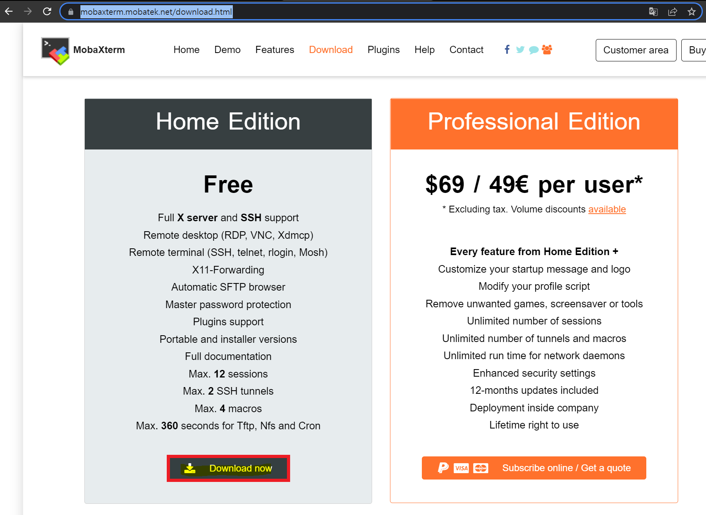
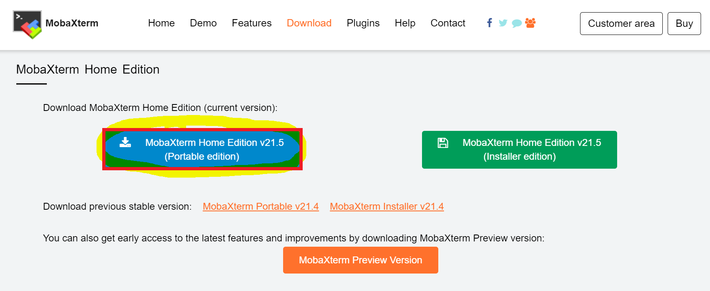
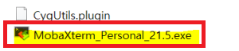

# MobaXterm 설치하기

<br>

1. MobaXterm 다운로드 수행한다.

- 접속 URL :  https://mobaxterm.mobatek.net/download.html

- Home Edition에서 `Download now` 버튼을 클릭한다.   



<br>

2. 다운로드 받은 파일을 압축 해제한다.

- 편의상 `MobaXterm Home Edition (Portable edition)` 버튼을 클릭하여 다운로드 받고, 이후에 압축을 푼다.      
- 예시 화면과 달리 MobaXterm 버전이 업데이트 된 경우 업데이트 된 버전으로 사용한다.      



<br>

3. exe 파일을 실행한다.

- 압축을 푼 위치로 이동하여 MobaXterm_Personal_*.exe 실행파일을 더블 클릭한다.

- 기호에 맞는 테마를 선택하고 MobaXterm 설치를 마무리한다.




# MobaXterm 텍스트 편집 가이드

<br>

교육 진행중 Linux 터미널 환경에서 VI 사용이 익숙하지 않는 분을 위한 가이드 입니다.

이 방법은 방화벽이 있는 경우 정상 동작하지 않을 수 있습니다.

가능하면 업무에서 사용 가능한 Linux 터미널 환경에서 VI 사용을 권해 드립니다.

---

## MobaXterm 설정

- 화면 왼쪽 하단에서 Follow terminal folder를 체크 합니다.  
  이 경우 오른쪽 터미널 화면에서 보이는 파일과 동일하게 왼쪽에도 파일이 표시됩니다.  
  

```
> [참고] 왼쪽 목록이 잘 변경되지 않는 경우 4번째 녹색 동그라미 Refresh 아이콘을 클릭해서 파일 목록을 변경합니다.     
```

## 파일 편집

- 왼쪽에 표시되는 main.tf파일을 마우스 오른쪽 버튼을 클릭하고  
  보이는 팝업메뉴에서 **Open With default text editor**를 클릭합니다.  
  
  > [참고] 파일을 새로 생성 할 경우 아래와 같이 Linux 터미널에서 먼저 파일을 생성해야 합니다.
  
  ```c
  touch main.tf
  ```
  
  ```c
  $ touch main.tf
  $ ls -l main.tf
    -rw-rw-r-- 1 ubuntu ubuntu 0 Mar 19 11:36 main.tf
  ```
  

```
> [참고] 왼쪽에 표시되는 main.tf파일을 마우스 오른쪽 버튼을 클릭하고     
보이는 팝업메뉴에서  Open With 를 클릭하여 선호하는 에디터를 선택 할 수 있습니다.     
```

- MobaTextEditor가 원격에 있는 파일을 Local PC로 다운로드 받아 실행됩니다.  
  일반 에디터와 동일하게 수정 작업을 진행합니다.  
  

- 파일이 수정되면 에디터 화면 상단에 있는 저장 아이콘이 붉은 색으로 변경되고,  
  소스 파일에도 * 로 수정이 발생한 것을 표시합니다.  
  

## 파일 저장

- 수정이 완료되면 저장 아이콘을 클릭 하면,  
  팝업 화면이 표시되며 수정된 파일을 remote로 전송할 것인지를 확인합니다.  
  이때 Yes버튼을 클릭하여 수정한 파일을 저장합니다.  
  만일 2개 이상의 파일을 같이 수정 하였다면 Yes to all 을 사용할 수 있습니다.  
  하지만 한번에 하나의 파일을 수정하고 원격에 저장 후 확인하는 방식을 권고 합니다.  
  
- 파일이 서버에 저장되면 반드시 수정한 내용이 잘 반영되었는지 확인 합니다.
  
  ```c
  cat main.tf
  ```
  


