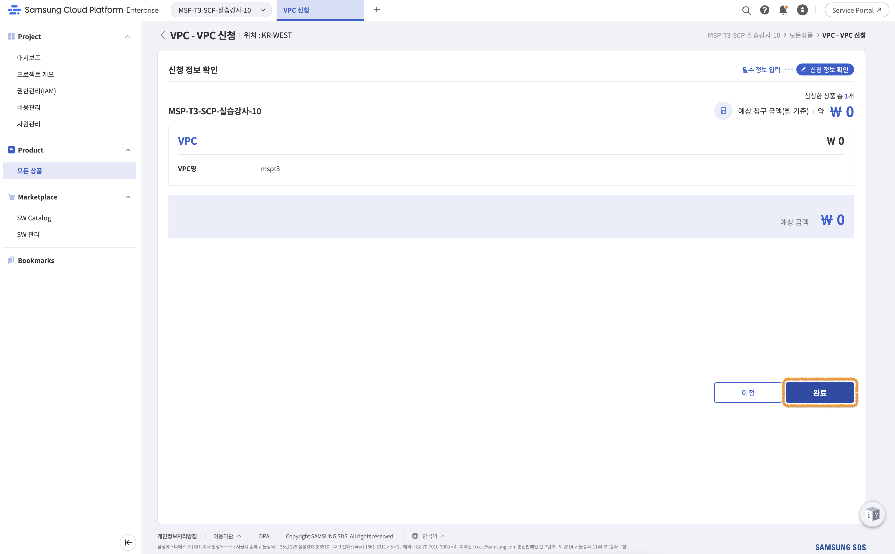
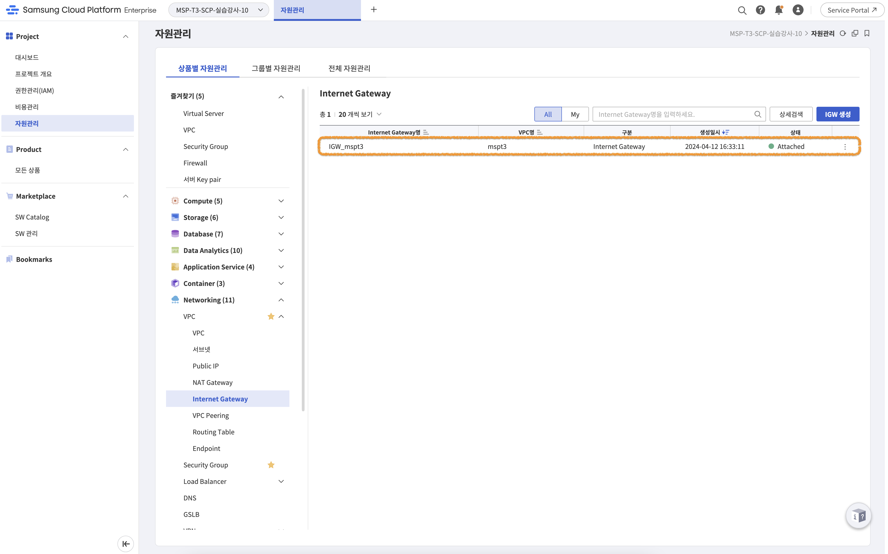
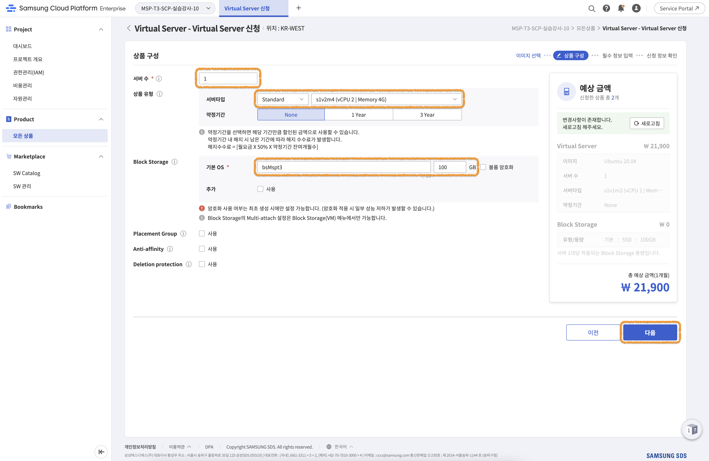
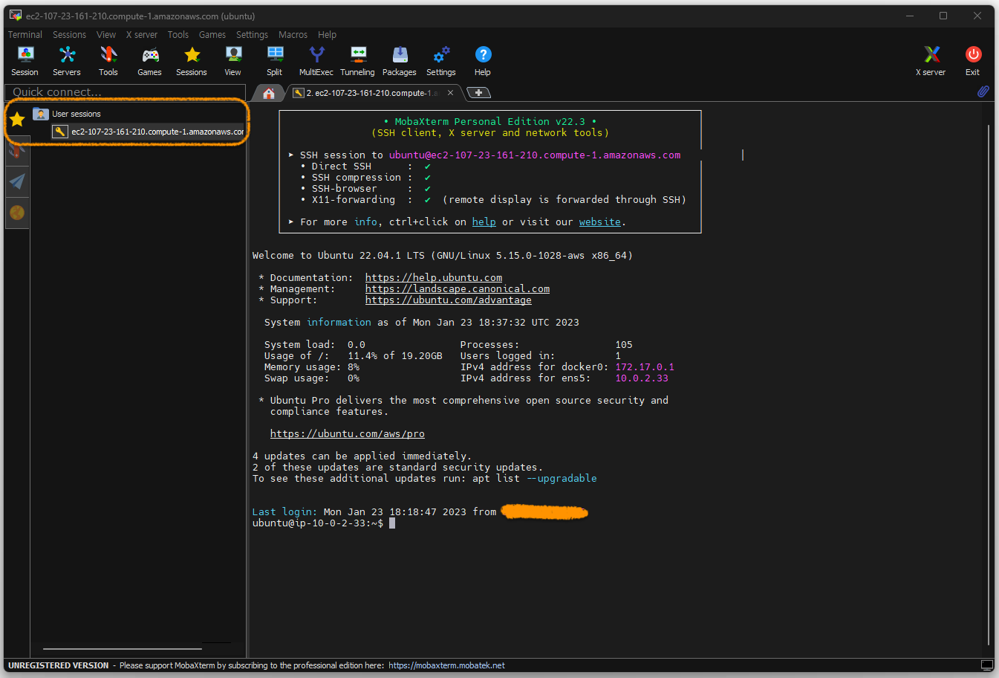

FA
# [Hands-on] 01. Environment setup - Docker


<br>

# Contents

**[1. VM Instance 만들기](#1-vm-instance-만들기)**  
**[2. VM Instance 접속하기](#2-vm-instance-접속하기)**  
**[3. Docker 설치하기](#3-docker-설치하기)**  
**[4. Git clone하기 (실습파일 다운로드)](#4-git-clone하기-실습파일-다운로드)**  

---

<br>

## 1. VM Instance 만들기

실습을 위한 환경구성을 진행합니다.

먼저 SCP Console에 로그인합니다.  
- SCP Console : [https://cloud.samsungsds.com/console/](https://cloud.samsungsds.com/console/)


> **email**, **비밀번호**, **OTP**를 이용해서 로그인 합니다.

<br><br><br>


> 화면 상단에서 **프로젝트**를 선택합니다.

<br><br><br>

이제 VPC(Virtual Private Cloud)를 생성합니다.  


> 좌측 메뉴에서 **자원관리**를 선택하고, 상품별 자원관리에서 Networking > VPC > VPC를 선택하고, 우측상단 또는 화면 중앙의 **상품신청** 버튼을 클릭합니다.

<br><br><br>


> **VPC명**(**mspt3**)을 입력하고, **중복체크** 후 문제가 없으면 **다음**을 클릭합니다.

<br><br><br>


> 입력내용 확인 후 문제가 없는 경우 **완료**를 클릭해서 VPC를 생성합니다.

<br><br><br>


> 정상적으로 생성되면 위와 같이 목록이 표시됩니다.  
> 상태가 **Active**로 되어있습니다.

<br><br><br>

다음은 Subnet을 생성하고 설정합니다.  
본 실습은 간단한 구성을 위해 Public Subnet을 구성하고 사용합니다.


> 좌측 메뉴에서 **자원관리**를 선택하고, 상품별 자원관리에서 Networking > VPC > 서브넷을 선택하고, 우측상단 또는 화면 중앙의 **서브넷 생성** 버튼을 클릭합니다.

<br><br><br>


> 다음과 같이 필수정보를 입력합니다.  
> - VPC : `mspt3` (앞의 과정에서 생성한 VPC명을 선택)
> - 사용 용도 : `일반`, `Public`
> - 서브넷명 : `mspt3PublicSub` 입력 후 **중복체크**
> - IP대역 : `10.0.1.0/24` 입력 후 **중복체크**

<br><br><br>


> 입력내용 확인 후 문제가 없는 경우 **완료**를 클릭해서 서브넷을 생성합니다.

<br><br><br>


> 정상적으로 생성되면 위와 같이 목록이 표시됩니다.  
> 상태가 **Active**로 되어있습니다.


<br><br><br>

다음은 Internet Gateway를 생성합니다.


> 좌측 메뉴에서 **자원관리**를 선택하고, 상품별 자원관리에서 Networking > VPC > Internet Gateway를 선택하고, 우측상단 또는 화면 중앙의 **IGW 생성** 버튼을 클릭합니다.

<br><br><br>


> 다음과 같이 필수정보를 입력합니다.  
> - VPC : `mspt3` (앞의 과정에서 생성한 VPC명을 선택)
> - 구분 : `Internet Gateway`
> - Firewall 로깅 여부 : `미사용` (교육용으로 사용하기 위해 단순한 구성을 선택함.)

<br><br><br>


> 입력내용 확인 후 문제가 없는 경우 **완료**를 클릭해서 Internet Gateway를 생성합니다.

<br><br><br>


> 정상적으로 생성되면 위와 같이 목록이 표시됩니다.  
> 상태가 **Active**로 되어있습니다.

<br><br><br>

여기까지는 네트워크 구성에 관련된 내용입니다.  

이제 우리가 사용할 컴퓨팅 자원인 Virtual Server를 만들어 보겠습니다.


> 좌측 메뉴에서 **자원관리**를 선택하고, 상품별 자원관리에서 Compute > Virtual Server > Virtual Server를 선택하고, 우측상단 또는 화면 중앙의 **상품신청** 버튼을 클릭합니다.

<br><br><br>


> 다음과 같이 신청 정보를 선택하고 다음을 클릭합니다.
> - 종류 : 표준 > Ubuntu
> - 이미지 버젼 : Ubuntu 20.04

## ☢️ 😱 Ubuntu 버젼은 ***20.04*** 입니다. 꼭 확인해주세요. 꼭이요~ 🙏🏻
## 🙅🏻‍♀️ 22.04 아닙니다.

<br><br><br>


> 다음과 같이 상품 구성을 설정하고 다음을 클릭합니다.
> - 서버 수 : `1`
> - 서버 타입 : `Standard s1v2m4 (vCPU 2 | Memory 4G)`
> - 약정기간 : `None`
> - Block Storage : `bsMspt3` , `100GB`

<br><br><br>


> Key pair 생성을 위해서 `+ 신규 생성`을 클릭합니다.  
> 기존에 생성한 Key pair가 있다면, 신규 생성 하지 않고 기존 Key pair를 사용해도 됩니다.

<br><br><br>


> 서버 Key pair명을 `mspt3`로 설정하고 **완료**를 클릭합니다.

<br><br><br>


> Key pair가 생성되면 Key를 다운로드 합니다.  
> 최초 1회만 다운로드 가능하기 때문에 잘 보관해둡니다.

<br><br><br>


> 생성된 Key pair정보는 화면과 같이 표시됩니다.

<br><br><br>


> 다시 **Virtual Server 신청** 탭으로 이동하여 화면과 같이 정보를 입력합니다.
> - Key pair : `mspt3` (앞의 과정에서 생성한 Key pair)
> - 서버별 Prefix : `mspt3`
> - 네트워크 설정
>   - VPC : `mspt3` (앞의 과정에서 생성한 VPC)
>   - 일반 서브넷 : `mspt3PublicSub (Public)` (앞의 과정에서 생성한 Subnet)
>   - NAT : `사용`
> - AZ 설정 : `AZ2`
> - Security Group : `선택` 버튼 클릭 (신규 생성으로 이동)

*** 네트워크 설정이나 AZ는 사용하는 환경을 고려해서 결정하세요. 위 그림은 예시일 뿐입니다. ***

<br><br><br>


> 새로운 Security Group 생성을 위해 화면 중앙 **Security Group**을 클릭합니다.

<br><br><br>


> 다음과 같이 필수 정보를 입력하고 **다음**을 클릭합니다.
> - Security Group명 : `mspt3SG`
> - VPC : `mspt3` (앞의 과정에서 생성한 VPC)
> - 로깅 여부 : `미사용`

<br><br><br>


> 모든 내용이 정상이면 **완료**버튼을 클릭하여 Security Group을 생성합니다.

<br><br><br>


> 정상적으로 Security Group이 생성되면 화면과 같이 표시됩니다.  
> Security Group의 상태가 **Active** 입니다.

<br><br><br>


> 다시 이전 화면(Virtual Server 신청)으로 돌아와 조금 전 생성한 `Security Group`을 선택하고 **확인**을 클릭합니다.

<br><br><br>


> 화면에 정상적으로 `Security Group`이 선택된 것을 확인하고, **다음**버튼을 클릭합니다.

<br><br><br>


> 앞에서 입력한 내용을 확인하고, 문제가 없는 경우 **완료**를 클릭합니다.

<br><br><br>


> 정상적으로 Virtual Server가 생성되고 동작하면 화면과 같이 조회 가능합니다.  
> 화면 중앙부근의 `IP`와 `NAT IP`를 잘 기록해두세요. 이후 실습에서 계속 사용하게 됩니다.

<br><br><br>


이제 생성한 Virtual Server의 Inbound/Outbound 네트워크 허용을 위해 방화벽과 Security Group을 설정합니다.


> [https://ifconfig.me/](https://ifconfig.me/)에서 현재 내 PC의 IP를 확인할 수 있습니다.

<br><br><br>


> 좌측 메뉴에서 **자원관리**를 선택하고, 상품별 자원관리에서 Networking > Firewall을 선택하고, 우측 리스트의 Firewall을 클릭합니다.

<br><br><br>


> **규칙**탭에서 `규칙추가`버튼을 클릭합니다.

<br><br><br>


> 화면과 같이 **Inbound 규칙**을 입력하고 **확인**을 클릭합니다.
> - 출발지 IP : 앞에서 확인한 내 PC의 `IP` ( [https://ifconfig.me/](https://ifconfig.me/) 에서 확인 가능. )
> - 목적지 IP : 앞에서 확인한 Virtual Server의 `IP` 
> - 프로토콜 : TCP
> - 허용 포트 : 직접입력
>   - TCP : 22,80,443,3000,30000-32767
> - 동작 : Allow
> - 방향 : Inbound


<br><br><br>

동일한 방법으로 Outbound 규칙도 하나 추가합니다.


> 화면과 같이 **Outbound 규칙**을 입력하고 **확인**을 클릭합니다.
> - 출발지 IP : 앞에서 확인한 Virtual Server의 `IP` 
> - 목적지 IP : 0.0.0.0/0 ( 모든 IP Address를 의미합니다. ) 
> - 프로토콜 : TCP
> - 허용 포트 : 직접입력
>   - TCP : 80,443
> - 동작 : Allow
> - 방향 : Outbound

<br><br><br>


> 좌측 메뉴에서 **자원관리**를 선택하고, 상품별 자원관리에서 Networking > Security Group을 선택하고, 우측 리스트의 `mspt3SG`를 클릭합니다.
> `mspt3SG`는 Virtual Server 생성 과정에서 생성한 Security Group입니다.

<br><br><br>


> **규칙**탭에서 `규칙추가`버튼을 클릭합니다.

<br><br><br>


> 화면과 같이 **Inbound 규칙**을 입력하고 **확인**을 클릭합니다.
> 방향 : Inbound 규칙
> - 대상 주소 : 앞에서 확인한 내 PC의 `IP` ( [https://ifconfig.me/](https://ifconfig.me/) 에서 확인 가능. )
> - 프로토콜 : TCP
> - 허용 포트 : 직접입력
>   - TCP : 22,80,443,3000,30000-32767

<br><br><br>


> 화면과 같이 **Outbound 규칙**을 입력하고 **확인**을 클릭합니다.
> - 방향 : Outbound 규칙
> - 대상 주소 : 0.0.0.0/0 ( 모든 IP Address를 의미합니다. ) 
> - 프로토콜 : TCP
> - 허용 포트 : 직접입력
>   - TCP : 80,443


여기까지가 인프라 준비 입니다.  
이제 우리가 실습에 사용할 환경이 준비됐습니다. 👏🏻👏🏻👏🏻


<br><br><br><br><br>

## 2. VM Instance 접속하기

SSH 접속을 위해서는 다음을 먼저 확인해야 합니다.

- Virtual Server의 **NAT IP**
- Key pair (**mspt3.pem** 파일)
- SSH 접속을 위한 Inbound traffic (Port:22) 이 허용되어 있는지 확인 (앞에서 이미 진행함.)

위의 내용을 확인 후 터미널 프로그램인 MobaXterm을 준비합니다.  
다음 순서대로 실행해주세요.


> - 접속 URL :  https://mobaxterm.mobatek.net/download.html
> - Home Edition 하단 `Download now` 버튼을 클릭 

<br><br><br>


> - `MobaXterm Home Edition (Portable edition)` 버튼을 클릭하여 다운로드 하고 압축해제 합니다.  
> - 버젼은 화면과 다를 수 있습니다.

<br><br><br>


> 압축을 해재하면 그림과 같이 MobaXterm_Personal_*.exe 가 있습니다. 이 파일을 실행합니다.

<br><br><br>


> MobaXterm이 실행되면 화면에서 `Session` 버튼을 클릭합니다.

<br><br><br>


접속방식은 `SSH`를 선택하고 다음 정보를 입력한 다음 `OK`버튼을 클릭하여 접속합니다.  
> SSH 포트를 변경한 경우 포트정보도 맞게 설정해서 접속하세요.

- **Remote host** : Virtual Server의 **NAT IP**
- **Specify username** : vmuser
- **Use private key** : mspt3.pem

<br><br><br>


> 접속되면 위와같은 화면이 표시됩니다.  
> 다음 번 접속부터는 **Quick connect**의 **User session**을 이용할 수 있습니다.

<br><br><br><br><br>

## 3. Docker 설치하기

실습을 위해서 Docker 설치를 진행합니다.
설치하는 방법은 아래 두 가지 방법이 있습니다.

- [Docker Desktop](https://docs.docker.com/desktop/) : One-click-install application for your Mac, Linux, or Windows
- [Docker Engine](https://docs.docker.com/engine/) : Open source containerization platform

우리 실습에는 앞에서 만든 **Ubuntu linux**에 **Docker Engine**을 설치해서 진행하도록 하겠습니다.

> 설치를 위해서는 [OS requirements](https://docs.docker.com/engine/install/ubuntu/#os-requirements)를 만족하는 조건이어야 합니다.  
> 우리가 만든 환경은 이 조건에 맞는 **Ubuntu 20.04(LTS)** 64bit 버젼 입니다.

### [Uninstall old versions](https://docs.docker.com/engine/install/ubuntu/#uninstall-old-versions)

기존에 설치된 버젼이 있거나 다시 설치를 진행하려고 하는 경우 먼저 기존버젼 삭제를 진행합니다.  
처음 설치를 하는 경우라면, 생략하고 다음 단계를 진행합니다.
```bash
ubuntu@ip-172-31-23-60:~$ sudo apt-get remove docker docker-engine docker.io containerd runc
Reading package lists... Done
Building dependency tree
Reading state information... Done
Package 'docker.io' is not installed, so not removed
E: Unable to locate package docker
E: Unable to locate package docker-engine
```

> 💻 명령어
>```bash
>sudo apt-get remove docker docker-engine docker.io containerd runc
>```

<br>

### [Install using the repository](https://docs.docker.com/engine/install/ubuntu/#install-using-the-repository)

Ubuntu의 [Advanced Packaging Tool (APT)](https://ubuntu.com/server/docs/package-management)를 이용해서 설치를 진행합니다.

먼저 package index를 업데이트 합니다.
```bash
ubuntu@ip-172-31-23-60:~$ sudo apt-get update
Get:1 http://security.ubuntu.com/ubuntu focal-security InRelease [114 kB]
Hit:2 http://us-east-1.ec2.archive.ubuntu.com/ubuntu focal InRelease
Get:3 http://us-east-1.ec2.archive.ubuntu.com/ubuntu focal-updates InRelease [114 kB]
Get:4 http://us-east-1.ec2.archive.ubuntu.com/ubuntu focal-backports InRelease [108 kB]
Get:5 http://security.ubuntu.com/ubuntu focal-security/main amd64 Packages [1993 kB]
Get:6 http://security.ubuntu.com/ubuntu focal-security/main Translation-en [326 kB]
Get:7 http://security.ubuntu.com/ubuntu focal-security/main amd64 c-n-f Metadata [12.2 kB]
Get:8 http://security.ubuntu.com/ubuntu focal-security/restricted amd64 Packages [1495 kB]
Get:9 http://security.ubuntu.com/ubuntu focal-security/restricted Translation-en [211 kB]
Get:10 http://us-east-1.ec2.archive.ubuntu.com/ubuntu focal/universe amd64 Packages [8628 kB]
...생략...
Fetched 25.7 MB in 4s (6120 kB/s)
Reading package lists... Done
```

> 💻 명령어
>```bash
>sudo apt-get update
>```

<br><br><br>

다음은, HTTPS를 이용하기 위해서 몇 가지 패키지를 설치합니다.  
```bash
ubuntu@ip-172-31-23-60:~$ sudo apt-get install -y ca-certificates curl gnupg lsb-release
Reading package lists... Done
Building dependency tree
Reading state information... Done
lsb-release is already the newest version (11.1.0ubuntu2).
lsb-release set to manually installed.
ca-certificates is already the newest version (20211016ubuntu0.20.04.1).
ca-certificates set to manually installed.
curl is already the newest version (7.68.0-1ubuntu2.15).
curl set to manually installed.
gnupg is already the newest version (2.2.19-3ubuntu2.2).
gnupg set to manually installed.
0 upgraded, 0 newly installed, 0 to remove and 11 not upgraded.
```

> 💻 명령어
>```bash
>sudo apt-get install -y ca-certificates curl gnupg lsb-release
>```

<br><br><br>

Docker GPG key를 추가합니다.
```bash
ubuntu@ip-172-31-23-60:~$ sudo mkdir -m 0755 -p /etc/apt/keyrings
ubuntu@ip-172-31-23-60:~$ curl -fsSL https://download.docker.com/linux/ubuntu/gpg | sudo gpg --dearmor -o /etc/apt/keyrings/docker.gpg
```

> 💻 명령어
>```bash
>sudo mkdir -m 0755 -p /etc/apt/keyrings
>curl -fsSL https://download.docker.com/linux/ubuntu/gpg | sudo gpg --dearmor -o /etc/apt/keyrings/docker.gpg
>
>```

<br><br><br>

Docker 설치를 위해서 APT Repository를 설정합니다.
```bash
ubuntu@ip-172-31-23-60:~$ echo \
>   "deb [arch=$(dpkg --print-architecture) signed-by=/etc/apt/keyrings/docker.gpg] https://download.docker.com/linux/ubuntu \
>   $(lsb_release -cs) stable" | sudo tee /etc/apt/sources.list.d/docker.list > /dev/null
```

> 💻 명령어
>```bash
>echo \
>  "deb [arch=$(dpkg --print-architecture) signed-by=/etc/apt/keyrings/docker.gpg] https://download.docker.com/linux/ubuntu \
>  $(lsb_release -cs) stable" | sudo tee /etc/apt/sources.list.d/docker.list > /dev/null
>```

<br><br><br>

다시 Package index를 업데이트 합니다.
```bash
ubuntu@ip-172-31-23-60:~$ sudo apt-get update
Hit:1 http://us-east-1.ec2.archive.ubuntu.com/ubuntu focal InRelease
Hit:2 http://us-east-1.ec2.archive.ubuntu.com/ubuntu focal-updates InRelease
Hit:3 http://us-east-1.ec2.archive.ubuntu.com/ubuntu focal-backports InRelease
Get:4 https://download.docker.com/linux/ubuntu focal InRelease [57.7 kB]
Get:5 http://security.ubuntu.com/ubuntu focal-security InRelease [114 kB]
Get:6 https://download.docker.com/linux/ubuntu focal/stable amd64 Packages [24.5 kB]
Fetched 196 kB in 1s (264 kB/s)
Reading package lists... Done
```

> 💻 명령어
>```bash
>sudo apt-get update
>```

<br><br><br>

그리고, 마지막으로 Docker를 설치합니다. (**Docker version : 20.10.23**)
```bash
ubuntu@ip-172-31-23-60:~$ sudo apt-get install -y docker-ce=5:20.10.23~3-0~ubuntu-focal docker-ce-cli=5:20.10.23~3-0~ubuntu-focal containerd.io docker-buildx-plugin docker-compose-plugin
Reading package lists... Done
Building dependency tree
Reading state information... Done
The following additional packages will be installed:
  docker-ce-rootless-extras docker-scan-plugin pigz slirp4netns
Suggested packages:
  aufs-tools cgroupfs-mount | cgroup-lite
The following NEW packages will be installed:
  containerd.io docker-buildx-plugin docker-ce docker-ce-cli docker-ce-rootless-extras docker-compose-plugin docker-scan-plugin pigz slirp4netns
0 upgraded, 9 newly installed, 0 to remove and 11 not upgraded.
Need to get 139 MB of archives.
After this operation, 505 MB of additional disk space will be used.
Get:1 http://us-east-1.ec2.archive.ubuntu.com/ubuntu focal/universe amd64 pigz amd64 2.4-1 [57.4 kB]
Get:2 http://us-east-1.ec2.archive.ubuntu.com/ubuntu focal/universe amd64 slirp4netns amd64 0.4.3-1 [74.3 kB]
Get:3 https://download.docker.com/linux/ubuntu focal/stable amd64 containerd.io amd64 1.6.16-1 [27.7 MB]
Get:4 https://download.docker.com/linux/ubuntu focal/stable amd64 docker-buildx-plugin amd64 0.10.2-1~ubuntu.20.04~focal [25.9 MB]
Get:5 https://download.docker.com/linux/ubuntu focal/stable amd64 docker-ce-cli amd64 5:20.10.23~3-0~ubuntu-focal [42.6 MB]
Get:6 https://download.docker.com/linux/ubuntu focal/stable amd64 docker-ce amd64 5:20.10.23~3-0~ubuntu-focal [20.5 MB]
Get:7 https://download.docker.com/linux/ubuntu focal/stable amd64 docker-ce-rootless-extras amd64 5:23.0.1-1~ubuntu.20.04~focal [8765 kB]
...생략...
Processing triggers for man-db (2.9.1-1) ...
Processing triggers for systemd (245.4-4ubuntu3.19) ...
```

> 💻 명령어
>```bash
>sudo apt-get install -y docker-ce=5:20.10.23~3-0~ubuntu-focal docker-ce-cli=5:20.10.23~3-0~ubuntu-focal containerd.io docker-buildx-plugin docker-compose-plugin
>```

<br><br><br>


설치 후 다음 설정을 진행합니다. ([Docker Engine post-installation steps](https://docs.docker.com/engine/install/linux-postinstall/))

Docker daemon은 root 유저로 동작하고, Docker CLI(/usr/bin/docker)는 root 그룹/계정 권한을 가지고 있습니다.

```bash
ubuntu@ip-172-31-23-60:~$ ps -ef | grep -i dockerd
root        3039       1  0 08:56 ?        00:00:00 /usr/bin/dockerd -H fd:// --containerd=/run/containerd/containerd.sock
ubuntu      4078    1407  0 08:58 pts/0    00:00:00 grep --color=auto -i dockerd
ubuntu@ip-172-31-23-60:~$ ls -al /usr/bin/docker
-rwxr-xr-x 1 root root 50722320 Jan 19 17:34 /usr/bin/docker
```

root가 아닌 계정(우리 실습환경의 user는 `ubuntu` 입니다.)을 이용하여 Docker CLI를 사용하기 위해서 다음과 같이 진행합니다.

먼저 `docker`그룹을 추가합니다.

```bash
ubuntu@ip-172-31-23-60:~$ sudo groupadd docker
```

> 💻 명령어
>```bash
>sudo groupadd docker
>```
- 이미 docker 그룹이 있을수도 있습니다. (groupadd: group 'docker' already exists)

<br><br><br>

다음은 사용 중인 User(`ubuntu`)를 docker 그룹에 추가하고, 적용(docker 그룹으로 로그인)합니다.

```bash
ubuntu@ip-172-31-23-60:~$ sudo usermod -aG docker $USER
ubuntu@ip-172-31-23-60:~$ newgrp docker
```

> 💻 명령어
>```bash
>sudo usermod -aG docker $USER
>newgrp docker
>
>```

<br><br><br>

모두 정상적으로 설치되고 설정된 경우 다음과 같이 동작해야 합니다.
한 번 테스트 해보세요.
```bash
ubuntu@ip-172-31-23-60:~$ docker run --rm hello-world
Unable to find image 'hello-world:latest' locally
latest: Pulling from library/hello-world
2db29710123e: Pull complete
Digest: sha256:aa0cc8055b82dc2509bed2e19b275c8f463506616377219d9642221ab53cf9fe
Status: Downloaded newer image for hello-world:latest

Hello from Docker!
This message shows that your installation appears to be working correctly.

To generate this message, Docker took the following steps:
 1. The Docker client contacted the Docker daemon.
 2. The Docker daemon pulled the "hello-world" image from the Docker Hub.
    (amd64)
 3. The Docker daemon created a new container from that image which runs the
    executable that produces the output you are currently reading.
 4. The Docker daemon streamed that output to the Docker client, which sent it
    to your terminal.

To try something more ambitious, you can run an Ubuntu container with:
 $ docker run -it ubuntu bash

Share images, automate workflows, and more with a free Docker ID:
 https://hub.docker.com/

For more examples and ideas, visit:
 https://docs.docker.com/get-started/
```

> 💻 명령어
>```bash
>docker run --rm hello-world
>```

<br><br><br>

그리고, 실습에 필요한 몇 가지 패키지를 추가로 더 설치할게요.  
- net-tools : ifconfig, netstat 등의 명령어 사용
- tree : 디렉토리 구조를 보기위한 툴
- conntrack : 리눅스 커널의 network connection을 관리하고 추적
- jq : JSON 프로세서
```bash
ubuntu@ip-172-31-23-60:~$ sudo apt-get update
Hit:1 http://us-east-1.ec2.archive.ubuntu.com/ubuntu focal InRelease
Hit:2 http://us-east-1.ec2.archive.ubuntu.com/ubuntu focal-updates InRelease
Hit:3 http://us-east-1.ec2.archive.ubuntu.com/ubuntu focal-backports InRelease
Get:4 http://security.ubuntu.com/ubuntu focal-security InRelease [114 kB]
Hit:5 https://download.docker.com/linux/ubuntu focal InRelease
Fetched 114 kB in 1s (150 kB/s)
Reading package lists... Done
ubuntu@ip-172-31-23-60:~$ sudo apt-get install -y net-tools tree conntrack
Reading package lists... Done
Building dependency tree
Reading state information... Done
Suggested packages:
  nftables
The following NEW packages will be installed:
  conntrack net-tools tree
0 upgraded, 3 newly installed, 0 to remove and 13 not upgraded.
Need to get 270 kB of archives.
After this operation, 1083 kB of additional disk space will be used.
Get:1 http://us-east-1.ec2.archive.ubuntu.com/ubuntu focal/main amd64 conntrack amd64 1:1.4.5-2 [30.3 kB]
Get:2 http://us-east-1.ec2.archive.ubuntu.com/ubuntu focal/main amd64 net-tools amd64 1.60+git20180626.aebd88e-1ubuntu1 [196 kB]
Get:3 http://us-east-1.ec2.archive.ubuntu.com/ubuntu focal/universe amd64 tree amd64 1.8.0-1 [43.0 kB]
Fetched 270 kB in 0s (12.2 MB/s)
Selecting previously unselected package conntrack.
(Reading database ... 62118 files and directories currently installed.)
Preparing to unpack .../conntrack_1%3a1.4.5-2_amd64.deb ...
Unpacking conntrack (1:1.4.5-2) ...
Selecting previously unselected package net-tools.
Preparing to unpack .../net-tools_1.60+git20180626.aebd88e-1ubuntu1_amd64.deb ...
Unpacking net-tools (1.60+git20180626.aebd88e-1ubuntu1) ...
Selecting previously unselected package tree.
Preparing to unpack .../tree_1.8.0-1_amd64.deb ...
Unpacking tree (1.8.0-1) ...
Setting up net-tools (1.60+git20180626.aebd88e-1ubuntu1) ...
Setting up conntrack (1:1.4.5-2) ...
Setting up tree (1.8.0-1) ...
Processing triggers for man-db (2.9.1-1) ...
```

> 💻 명령어
>```bash
>sudo apt-get update
>sudo apt-get install -y net-tools tree conntrack jq
>
>```

<br><br><br><br><br>

## 4. Git clone하기 (실습파일 다운로드)
이후 진행되는 실습과정들에 사용되는 파일들을 다운로드 하겠습니다.

```bash
ubuntu@ip-172-31-23-60:~$ git clone https://github.com/JungSangup/mspt3.git
Cloning into 'mspt3'...
remote: Enumerating objects: 3210, done.
remote: Counting objects: 100% (857/857), done.
remote: Compressing objects: 100% (481/481), done.
remote: Total 3210 (delta 406), reused 775 (delta 374), pack-reused 2353
Receiving objects: 100% (3210/3210), 328.05 MiB | 51.34 MiB/s, done.
Resolving deltas: 100% (1786/1786), done.
```

> 💻 명령어
>```bash
>git clone https://github.com/JungSangup/mspt3.git
>```
- **hands_on_files** 디렉토리 아래에 실습에 필요한 파일들이 있습니다.
