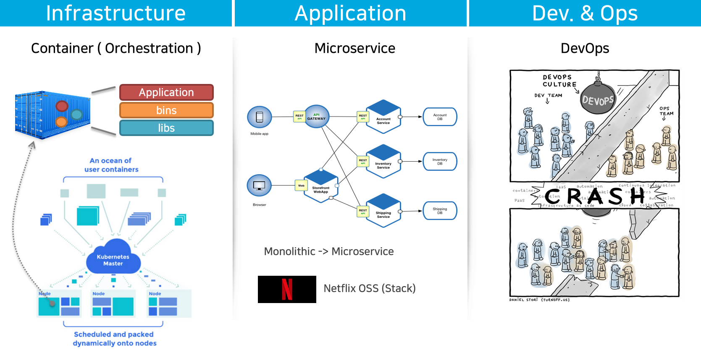
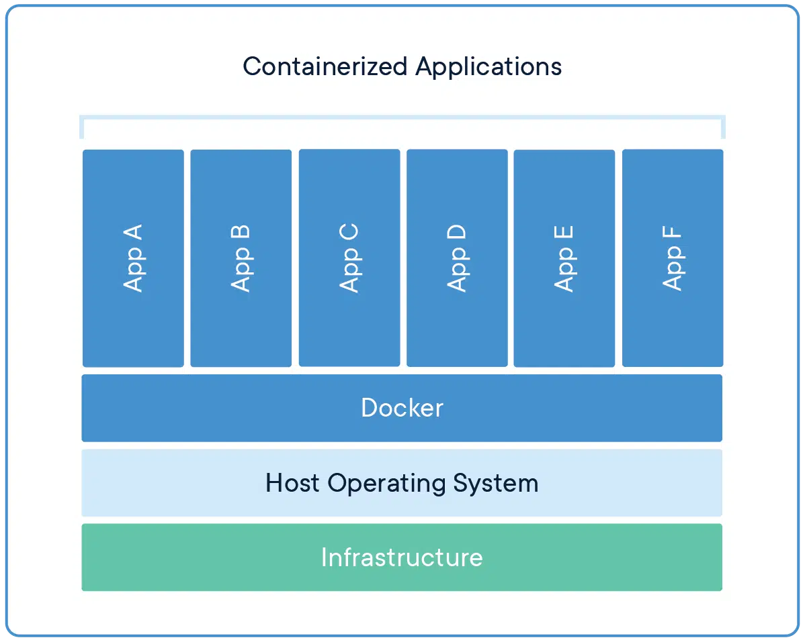
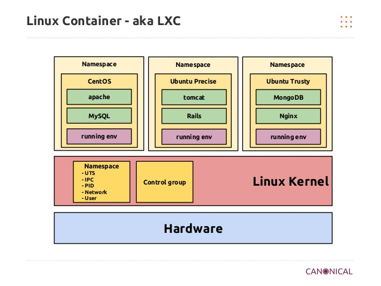

### Cloud Native

  

#### [ Cloud Native 의 정의 ]
> **클라우드 네이티브** 기술은 조직이 퍼블릭, 프라이빗, 그리고 하이브리드 클라우드와 같은 현대적이고 동적인 환경에서 **확장 가능**한 애플리케이션을 개발하고 실행할 수 있게 해준다. **컨테이너**, 서비스 메쉬, **마이크로서비스**, 불변(Immutable) 인프라, 그리고 **선언형(Declarative) API**가 이러한 접근 방식의 예시들이다.  
이 기술은 회복성, 관리 편의성, 가시성을 갖춘 **느슨하게 결합된** 시스템을 가능하게 한다.  
견고한 **자동화** 기능을 함께 사용하면, 엔지니어는 영향이 큰 변경을 최소한의 노력으로 자주,  
예측 가능하게 수행할 수 있다.  
...

---

### Cloud Native

---

### Container

**컨테이너**는 애플리케이션이 다양한 컴퓨팅 환경에서 빠르고 안정적으로 실행될 수 있도록 **코드**와 모든 **종속성**을 **패키징**하는 소프트웨어의 표준 단위입니다.
**컨테이너**는 **가상화** 기술의 하나로 Host머신 또는 다른 컨테이너와 **분리된 환경**에서 애플리케이션을 실행시킵니다.
컨테이너는 **소형**이며 **빠르고** **이식성**이 뛰어납니다.

---

### Container vs Virtual machine

**컨테이너**는 **코드**와 모든 **종속성**을 함께 **패키징**하는 앱 계층의 추상화입니다.
여러 컨테이너가 동일 시스템에서 실행될 수 있고, OS 커널을 공유하며, 각각은 격리된  
프로세스로 실행됩니다.

**가상머신-VM**은 하드웨어 추상화 입니다. 하이퍼바이저를 이용하여 단일 시스템에서  
여러 VM을 실행할 수 있습니다. 각 VM에는 OS, 애플리케이션, 필요한 바이너리 및  
라이브러리가 모두 포함됩니다.

---

### Container vs Virtual machine

| | Container | Virtal Machine |
| :--- | :----: | :----: |
| Virtualization | OS Virtualization | H/W Virtualization |
| Efficiency (Resource usage) | O | △ |
| Performance |  O | △ |
| Provisioning |  O | △ |
| Isolation (Security) | △ | O |

- **Continaer** : 성능, 실행속도, 자원활용 측면에서 장점을 가짐.  
- **Virtual Machine** : 다양한 환경(OS), 격리(보안) 측면에서 장점을 가짐.

    

[What is a container?](https://www.docker.com/resources/what-container/)

---

### Linux Container (LXC)
**Container는  Linux 커널의 여러 기능을 활용하여 Container라는 격리된 공간 안에서 프로세스가 동작하는 기술입니다.**

가상머신(VM)과 동일한 효과를 보이지만, 기존의 가상머신(VM)은 호스트의 하드웨어와 OS전체를 가상화하여 무겁고 느리지만, 컨테이너는 호스트 OS(리눅스) 커널을 공유하며 프로세스의 격리/가상화를 통하여 가상머신에 비해 빠른 실행속도를 보입니다.

Docker는 이러한 컨테이너를 위한 플랫폼(또는 런타임)입니다. 

---
## Linux Container (LXC)
Linux커널의 다음 요소들을 이용하여 컨테이너를 위한 격리된 환경을 제공합니다.

### Namespaces
Docker는 Linux의 아래와 같은  `namespaces` 기능을 활용하여 격리된 Container를 구현합니다
- **The pid namespace:** Process isolation (PID: Process ID).
- **The net namespace:** Managing network interfaces (NET: Networking).
- **The ipc namespace:** Managing access to IPC resources (IPC: InterProcess Communication).
- **The mnt namespace:** Managing filesystem mount points (MNT: Mount).
- **The uts namespace:** Isolating kernel and version identifiers. (UTS: Unix Timesharing System).

### Control groups
Docker Engine cgroups 이라는 Linux기술을 이용하여 CPU, Memory와 같은 Container에서 사용하는 하드웨어 리소스를 제어합니다.

### Union file systems
Union file systems은 Layer를 생성하여 동작하는 파일시스템으로 매우 가볍고 빠릅니다. Docker는 UnionFS를 사용하여 Container에 대한 Building Block을 제공합니다.

---

### Summary

- Cloud native
    - Container (orchestration)
    - Microservice
    - DevOps
- Container vs Virtual machine
- Linux container (LXC)
    - Namespaces
    - Control groups
    - Union file systems

        

`문의처` : 정상업 / rogallo.jung@samsung.com