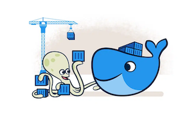
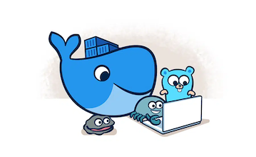

## Docker

"**Docker**는 애플리케이션을 **개발**하고, **전달/배포**하고, **실행**하기 위한 **오픈 플랫폼**이다."

**Docker**는 **컨테이너**라고 하는 느슨하게 격리된(loosely isolated) 환경에서 애플리케이션을 패키징하고 실행할 수 있는 기능을 제공합니다. 격리 및 보안을 통해 주어진 호스트에서 **많은 컨테이너를 동시에 실행**할 수 있습니다. 컨테이너는 **가볍고** 애플리케이션을 실행하는 데 필요한 **모든 것을 포함**하므로, 현재 호스트에 설치된 것에 의존할 필요가 없습니다. 컨테이너는 **쉽게 공유**될 수 있으며 공유하는 모든 사람이 동일한 방식으로 작동하는 **동일한 컨테이너**를 갖게 됩니다.

**Docker**는 컨테이너의 수명 주기를 관리하기 위한 **도구**와 **플랫폼**을 제공합니다.

[](https://www.docker.com/)[](https://www.docker.com/)[](https://www.docker.com/)

<br>

 **Hands-on :** 01_Docker_Intro

---

## Docker Installation

**Docker Desktop**은 컨테이너화된 애플리케이션을 구축하고 공유할 수 있는 Mac 또는 Windows 환경용으로 설치하기 쉬운 애플리케이션입니다. Docker Desktop에는 Docker Engine, Docker CLI Client, Docker Compose, Docker Content Trust, Kubernetes 및 Credential Helper가 포함 됩니다.

- `Commercial use of Docker Desktop in larger enterprises (more than 250 employees OR more than $10 million USD in annual revenue) now requires a paid subscription.`  

<br>

### DESKTOP

| Platform | x86_64 / amd64 | arm64 (Apple Silicon) |
| :--- | :---: | :---: |
| Docker Desktop for Linux |  | |
| Docker Desktop for Mac (macOS) |  |  |
| Docker Desktop for Windows |  | |

- `Mac, Windows의 경우 Linux가 실행될 VM이 필요함.`

---

## Docker Installation

**Docker Engine**은 Client-Server 애플리케이션으로 작동하는 오픈소스 패키지 입니다.
패키지는 Daemon(dockerd), CLI Client, API 를 포함하고 있습니다.

<br>

### SERVER
| Platform | x86_64 / amd64 | arm64 / aarch64 | arm (32-bit) | s390x |
| :--- | :---: | :---: | :---: | :---: |
| CentOS |  |  | | |
| Debian |  |  |  | |
| Fedora |  |  | | |
| Raspbian | | |  | |
| RHEL |  |  |  |  |
| SLES |  |  |  |  |
| Ubuntu |  |  |  |  |
| Binaries |  |  |  | |

<br>

[Install Docker Engine](https://docs.docker.com/engine/install/)

---

## Docker architecture
**Docker daemon**은 컨테이너를 **빌드/실행**하는 작업을 수행하고, **Docker client**는 이 Docker daemon과 통신합니다. (REST API를 사용)  
Docker client와 daemon은 동일한 시스템상에 존재할 수도 있고, 원격지에서 사용될 수도 있습니다.


[Docker architecture](https://docs.docker.com/get-started/overview/#docker-architecture)

---

## Docker architecture

<br>

### The Docker daemon
Docker daemon(`dockerd`)은 Docker Object(Container, Network, Volume 등)에 대한 Docker API 요청을 요청받아 처리하는 서비스입니다.  

<br>

### The Docker client
Docker client(`docker`)는 Docker 유저와 상호 작용하는 주요 사용자 인터페이스입니다. 사용자가 `docker run` 과 같은 명령어를 사용하면 Docker Client는 이 명령어를 `dockerd`로 전송하는 역할을 수행합니다. 이 때 Docker 의 API가 사용됩니다.  

<br>

### Docker registries
A Docker **registry**는 Docker image들을 저장하는 저장공간입니다.  
(마치 소스코드를 Github에 저장하듯이)  
`docker pull` 이나 `docker run`과 같은 명령어를 사용하면 필요한 컨테이너 이미지를  
레지스트리에서 다운로드(`pull`)하게 됩니다.  
Docker registry는 Docker Hub(Default registry)와 같은 Public 레지스트리와  
팀이나 기업내에서 자체 구축할 수 있는 Private 레지스트리로 구분될 수 있습니다.

---

## Docker objects
Docker를 사용하면 image, container, network, volume 과 같은 다양한 Docker object를 만들게 됩니다.

### Images
**Image**는 Docker 컨테이너 생성방법(instructions)이 포함된 읽기전용 템플릿입니다.  
주로 다른 Image를 기반(Base)으로 해서 추가적인 변경사항을 반영하여 만들어집니다.  
- `e.g., My(new) image = Base image(Ubuntu) + Apache web server + config.`

Image는 Dockerfile을 이용하여 만들어진 이미지 또는 Registry에 게시(publish)된 이미지를 사용할 수 있습니다. 그리고, Image는 Layer라는 개념을 적용하여 자원을 효율적으로 사용합니다.

### Containers
**Container**는 **Image**를 실행하여 생성 된 **인스턴스**이며, Docker API 또는 CLI를 사용하여  
생성/시작/중지/이동/삭제할 수 있습니다.  
기본적으로 컨테이너는 다른 컨테이너 및 호스트 시스템과 비교적 잘 격리되어 있습니다.  
Container는 Image와 생성 시 제공된 구성옵션으로 정의됩니다.  
그리고, Container가 제거될 때는 별도의 저장공간(Persistent storage)에  
따로 저장하지 않은 변경사항은 모두 사라지게 됩니다.

<br>

[Docker objects](https://docs.docker.com/get-started/overview/#docker-objects)

---

## Images and Layers
Docker **image**는 일련의 계층(**Layer**)으로 이루어져 있으며, 이 계층들은 단일 이미지로 결합됩니다.
여기서 계층(Layer)이란 애플리케이션을 구동하기위한 runtime, lib, src등으로 구성된 파일시스템으로 아래 dockerfile에서 FROM, COPY, RUN 명령어가 이루어질때마다 각각의 Layer가 추가됩니다.

```dockerfile
FROM ubuntu:15.04
LABEL org.opencontainers.image.authors="org@example.com"
COPY . /app
RUN make /app
RUN rm -r $HOME/.cache
CMD python /app/app.py
```
|  |  |
| --- | :---: |
|  | `Container layer(Thin R/W layer)`<br>+<br>`Image layers(R/O)` 

[Images and Layers](https://docs.docker.com/storage/storagedriver/#images-and-layers)

---

## Container and layers
Container와 Image의 주요 차이점은 **쓰기 가능**한 최상위 레이어(Thin R/W layer)입니다. 새 데이터를 추가하거나 기존 데이터를 수정하는 컨테이너에 대한 모든 쓰기는 이 layer에 저장됩니다.  
컨테이너가 삭제되면 쓰기 가능한 레이어도 삭제됩니다. 기본 이미지는 변경되지 않은 상태로 유지됩니다.

각 컨테이너에는 쓰기 가능한 자체 컨테이너 레이어가 있고 모든 변경 사항이 이 컨테이너 레이어에 저장되기 때문에 여러 컨테이너가 동일한 기본 이미지에 대한 액세스를 공유하면서도 고유한 데이터 상태를 가질 수 있습니다.
그리고, 이렇게 공유되는 layer구조로 인해 자원을 효율적으로 사용할 수 있습니다. (저장공간, Provisioning)

 

 **Hands-on :** 02_Docker_Layers

---

## Summary

- **Docker** : 애플리케이션을 **개발**하고, **전달/배포**하고, **실행**하기 위한 **오픈 플랫폼**
- Docker installation
    - Docker desktop for Linux / macOS / Windows
    - Docker engine
- Docker architecture
    - Docker daemon : Docker objects의 관리
    - Docker client : 사용자 인터페이스
    - Docker registries : 이미지 저장소
- Docker objects
    - Images
    - Containers
    - Networks
    - Volumes
    - etc.
- Images and Layers
- Container and Layers
<br>

`문의처` : 정상업 / rogallo.jung@samsung.com