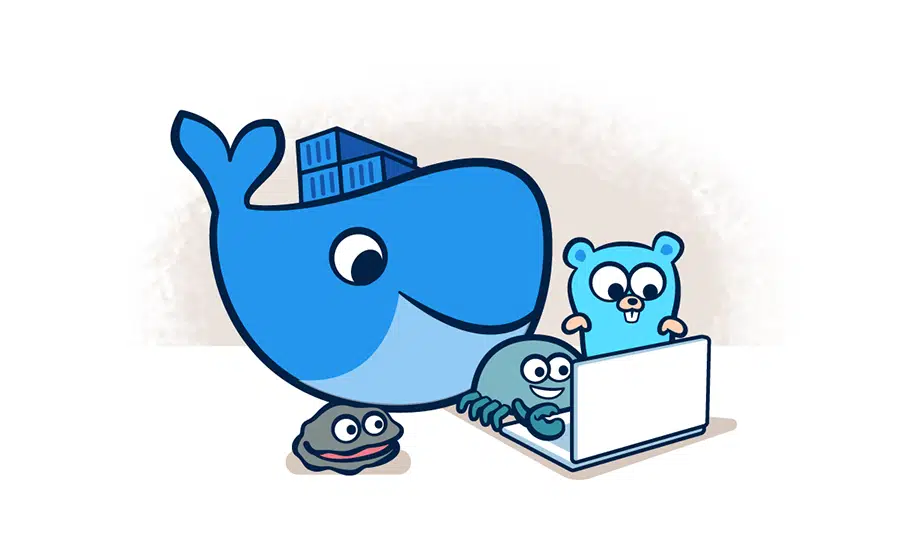

## Docker

"**Docker**는 애플리케이션을 **개발**하고, **전달/배포**하고, **실행**하기 위한 **오픈 플랫폼**이다."

**Docker**는 **컨테이너**라고 하는 느슨하게 격리된(loosely isolated) 환경에서 애플리케이션을 패키징하고 실행할 수 있는 기능을 제공합니다. 격리 및 보안을 통해 주어진 호스트에서 **많은 컨테이너를 동시에 실행**할 수 있습니다. 컨테이너는 **가볍고** 애플리케이션을 실행하는 데 필요한 **모든 것을 포함**하므로, 현재 호스트에 설치된 것에 의존할 필요가 없습니다. 컨테이너는 **쉽게 공유**될 수 있으며 공유하는 모든 사람이 동일한 방식으로 작동하는 **동일한 컨테이너**를 갖게 됩니다.

**Docker**는 컨테이너의 수명 주기를 관리하기 위한 **도구**와 **플랫폼**을 제공합니다.

 

 **Hands-on :** 01_Docker_Intro

---

## Docker Installation

**Docker Desktop**은 컨테이너화된 애플리케이션을 구축하고 공유할 수 있는 Mac 또는 Windows 환경용으로 설치하기 쉬운 애플리케이션입니다. Docker Desktop에는 Docker Engine, Docker CLI Client, Docker Compose, Docker Content Trust, Kubernetes 및 Credential Helper가 포함 됩니다.

- `Commercial use of Docker Desktop in larger enterprises (more than 250 employees OR more than $10 million USD in annual revenue) now requires a paid subscription.`  

 

### DESKTOP

| Platform | x86_64 / amd64 | arm64 (Apple Silicon) |
| :--- | :---: | :---: |
| Docker Desktop for Linux |  | |
| Docker Desktop for Mac (macOS) |  |  |
| Docker Desktop for Windows |  | |

- `Mac, Windows의 경우 Linux가 실행될 VM이 필요함.`

[Install Docker Engine](https://docs.docker.com/engine/install/)

---

## Docker Installation

**Docker Engine**은 Client-Server 애플리케이션으로 작동하는 기본 설치 패키지입니다.  

 

### SERVER
| Platform | x86_64 / amd64 | arm64 / aarch64 | arm (32-bit) | s390x |
| :--- | :---: | :---: | :---: | :---: |
| CentOS |  |  | | |
| Debian |  |  |  | |
| Fedora |  |  | | |
| Raspbian | | |  | |
| RHEL |  |  |  |  |
| SLES |  |  |  |  |
| Ubuntu |  |  |  |  |
| Binaries |  |  |  | |

[Install Docker Engine](https://docs.docker.com/engine/install/)

---

## Docker architecture

**Docker daemon**은 컨테이너를 **빌드/배포/실행**하는 작업을 수행하고, **Docker client**는 이 Docker daemon과 통신합니다. (REST API를 사용)  
Docker client와 daemon은 동일한 시스템상에 존재할 수도 있고, 원격지에서 사용될 수도 있습니다.

[Docker architecture](https://docs.docker.com/get-started/overview/#docker-architecture)

---

## Docker architecture