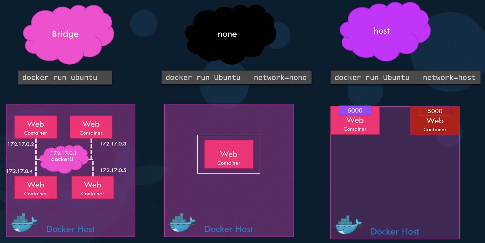

<br>

# Contents

<br>

- **Network drivers**
    - **bridge**
    - **host**
    - **overlay**
    - **none**
- **bridge network (in detail)**

---

## Networking overview

이번 장에서는 Docker의 네트워킹에 대해 알아보겠습니다.

Docker가 강력한 이유 중 하나는 컨테이너들을 함께 연결하거나, Docker가 아닌 워크로드에 연결할 수 있기 때문입니다.
아래는 Docker가 설치되면 기본적으로 생성되는 Network의 종류입니다.
- `bridge` , `none` , `host`



---

## Network drivers
앞에서 본 네트워크에 대해 좀 더 자세히 알아보겠습니다.

Docker의 네트워킹 서브시스템은 드라이버를 사용합니다. (pluggable)
아래는 대표적인 Docker의 네트워크 드라이버들 입니다.

- [bridge](https://docs.docker.com/network/bridge/) : Default 네트워크 드라이버인 bridge network는 일반적으로 **컨테이너들 간에 통신**이 필요한 경우 사용됩니다.
- [host](https://docs.docker.com/network/host/) : 컨테이너와 Host 머신간의 네트워크 격리를 제거하고 **호스트의 네트워킹을 직접 사용**합니다.
- [overlay](https://docs.docker.com/network/overlay/) : 오버레이 네트워크는 **여러 Docker 데몬을 함께 연결**하고 Swarm 서비스가 서로 통신할 수 있도록 합니다. 또한 오버레이 네트워크를 사용하여 Swarm 서비스와 독립 실행형 컨테이너 간 또는 **서로 다른 Docker 데몬**에 있는 두 개의 독립 실행형 컨테이너 간의 통신을 용이하게 할 수 있습니다.
- [none](https://docs.docker.com/network/none/) : 이 컨테이너의 경우 **모든 네트워킹을 비활성화**합니다. 일반적으로 사용자 지정 네트워크 드라이버와 함께 사용됩니다.
- 기타 : [ipvlan](https://docs.docker.com/network/ipvlan/) , [macvlan](https://docs.docker.com/network/macvlan/)

<br><br><br><br><br><br>

[Networking overview](https://docs.docker.com/network/)

---

## Bridge network

Docker에서는 동일한 bridge network에 연결된 컨테이너들이 통신할 수 있도록 하면서, 해당 bridge network에 연결되지 않은 컨테이너들과는 격리된 환경을 제공하는 **소프트웨어 브리지**를 사용합니다.
Docker를 시작하면 **기본 bridge network**가 자동으로 생성되고, 컨테이너 실행 시 network를 명시적으로 지정하지 않으면 기본 bridge network에 연결됩니다.


---

## Bridge network

다음은 기본 bridge network의 상세 내용입니다.
Nginx 컨테이너를 하나 **기본 bridge network**에 연결하여 실행한 다음 확인해 보겠습니다.

```bash
ubuntu@ip-10-0-1-14:~$ docker run -d --name my-nginx -p 8080:80 nginx
Unable to find image 'nginx:latest' locally
latest: Pulling from library/nginx
b85a868b505f: Pull complete
f4407ba1f103: Pull complete
4a7307612456: Pull complete
935cecace2a0: Pull complete
8f46223e4234: Pull complete
fe0ef4c895f5: Pull complete
Digest: sha256:10f14ffa93f8dedf1057897b745e5ac72ac5655c299dade0aa434c71557697ea
Status: Downloaded newer image for nginx:latest
80f6c40a51a19ede9a3daebf0cb14034f3dba832177ad71ff52290aaebe50598
```
> `--network` flag를 사용하지 않고, 기본 Bridge network에 연결하여 실행.

---

## Bridge network

```bash
ubuntu@ip-10-0-1-14:~$ docker network inspect bridge
[
    {
        "Name": "bridge",
        "Id": "96f02bec6c0585b98fd670cbdb3725b21139a5fea3bb7e99fa0146af08f079c1",
        "Created": "2022-06-25T08:49:54.597984615Z",
        "Scope": "local",
        "Driver": "bridge",
        "EnableIPv6": false,
        "IPAM": {
            "Driver": "default",
            "Options": null,
            "Config": [
                {
                    "Subnet": "172.17.0.0/16",
                    "Gateway": "172.17.0.1"
                }
            ]
        },
        "Internal": false,
        "Attachable": false,
        "Ingress": false,
        "ConfigFrom": {
            "Network": ""
        },
        "ConfigOnly": false,
```
> `"Driver": "bridge"` , `"Subnet": "172.17.0.0/16"` , `"Gateway": "172.17.0.1"`

---

## Bridge network

```bash
        "Containers": {
            "80f6c40a51a19ede9a3daebf0cb14034f3dba832177ad71ff52290aaebe50598": {
                "Name": "my-nginx",
                "EndpointID": "6a1e7941749c391553c5aaf473b4b7b650cb151d03e92dd47a1a36f33fd8f3d8",
                "MacAddress": "02:42:ac:11:00:02",
                "IPv4Address": "172.17.0.2/16",
                "IPv6Address": ""
            }
        },
        "Options": {
            "com.docker.network.bridge.default_bridge": "true",
            "com.docker.network.bridge.enable_icc": "true",
            "com.docker.network.bridge.enable_ip_masquerade": "true",
            "com.docker.network.bridge.host_binding_ipv4": "0.0.0.0",
            "com.docker.network.bridge.name": "docker0",
            "com.docker.network.driver.mtu": "1500"
        },
        "Labels": {}
    }
]
```
> **my-nginx**의 `"IPv4Address": "172.17.0.2/16"` , `"com.docker.network.bridge.name": "docker0"`

"Subnet": "172.17.0.0/16", "Gateway": "172.17.0.1" 로 구성된 `docker0` bridge network가 기본적으로 사용되며, Nginx 컨테이너는 `172.17.0.2` 아이피를 할당받아 이 bridge network에 연결된 걸 확인할 수 있습니다.

---

## Bridge network

Nginx 컨테이너를 살펴보면 아래와 같습니다.

```bash
ubuntu@ip-10-0-1-14:~$ docker inspect my-nginx
[
    {
        ... 생략 ...
        "NetworkSettings": {
            ... 생략 ...
            "Ports": {
                "80/tcp": [
                    {
                        "HostIp": "0.0.0.0",
                        "HostPort": "8080"
                    },
                    {
                        "HostIp": "::",
                        "HostPort": "8080"
                    }
                ]
            },
            ... 생략 ...
        }
    }
]
```
> 컨테이너의 **80**번 포트가 bridge network를 통해서 Host 머신의 **8080**번 포트로 연결된걸 알 수 있습니다.

---

## Bridge network

기본 bridge network이 아닌, 필요에 의해서 새로운 bridge network를 만들어서 사용할 수도 있습니다.
예를들어 Host 머신 내에서 정해진 컨테이너들만 격리된 네트워크 구성이 필요하다면, 별도의 bridge network를 생성하고 컨테이너 생성 시 이 network를 사용하도록 지정하면 됩니다.

아래 그림은 새로운 bridge network가 생성됐을 때의 그림입니다.
`my_bridge`를 지정하여 컨테이너를 실행하면, 그 네트워크를 사용한 컨테이너들만 격리된 환경을 구성할 수 있습니다.


> 명령어 : `docker network create -d bridge my_bridge`

<br>

 **Hands-on :** 05_Docker_Network

---

## Summary

- Network drivers
    - bridge
    - host
    - overlay
    - none
- bridge network (in detail)
    - Subnet, Gateway
    - 기본 bridge network, 사용자 생성 bridge network

<br><br><br><br><br><br><br><br><br><br>

`문의처` : 정상업 / rogallo.jung@samsung.com