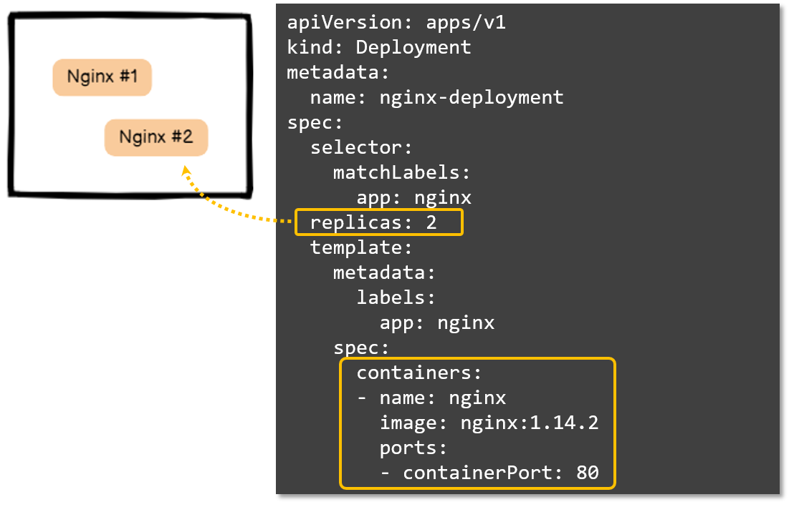
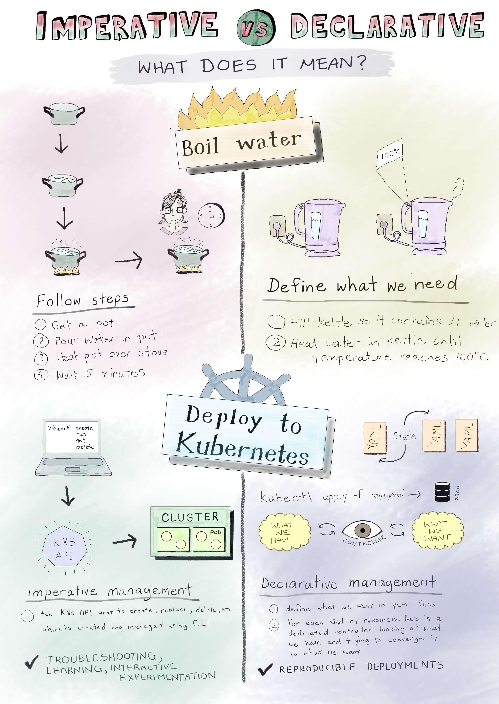
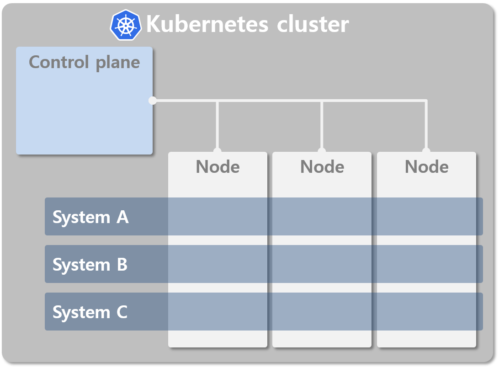

<br>

# Contents

<br>

- **What is container orchestration?**
- **What is Kubernetes?**
- **Kubernetes Components**
  - **Control Plane Components**
  - **Node Components**
- **Kubernetes Objects**
- **Object Spec and Status**
- **Kubernetes Object Management**
- **Namespace**
- **Labels and Selectors**

---

## What is container orchestration?


<br><br><br><br><br>

- Cluster
- Scheduling
- Rollout / Rollback
- Self-healing
- Scaling

---

## What id Kubernetes?

쿠버네티스는 **컨테이너**화된 **워크로드**와 서비스를 관리하기 위한 **이식성**이 있고, **확장가능**한 오픈소스 플랫폼이다. 쿠버네티스는 **선언적 구성**과 **자동화**를 모두 용이하게 해준다. 쿠버네티스는 크고, 빠르게 성장하는 생태계를 가지고 있다. 쿠버네티스 서비스, 기술 지원 및 도구는 어디서나 쉽게 이용할 수 있다.

쿠버네티스란 명칭은 키잡이(helmsman)나 파일럿을 뜻하는 그리스어에서 유래했다. **K8S**라는 표기는 "K"와 "S"와 그 사이에 있는 여덟(8) 글자를 나타내는 약식 표기이다. 

<br>


<br><br><br><br>

🔗[What is Kubernetes?](https://kubernetes.io/docs/concepts/overview/what-is-kubernetes/)

---

## Kubernetes Components

쿠버네티스 클러스터는 컨테이너가 실행되는 **노드**(**Node**)들의 집합입니다.
그리고, 이런 (워커)노드들과 그 안에서 실행되는 Pod(컨테이너)들의 관리를 위한 **컨트롤 플레인**(**Control plane**)이 있습니다.

이런 기본 구조 안에서 어떤 컴포넌트들이 어떤 역할을 하는지 알아보겠습니다.


---

## Kubernetes Components

<br>

#### Control Plane Components

| Component                                                                                                             | Description                         |
|:--------------------------------------------------------------------------------------------------------------------- |:----------------------------------- |
| [kube-apiserver](https://kubernetes.io/docs/reference/command-line-tools-reference/kube-apiserver/)                   | API를 노출하는 K8S의 프론트엔드                |
| [etcd](https://etcd.io/)                                                                                              | K8S의 백엔드 저장소 역할을 하는 Key-value store |
| [kube-scheduler](https://kubernetes.io/docs/reference/command-line-tools-reference/kube-scheduler/)                   | 새로 생성된 파드 를 감지하고 실행할 노드를 선택         |
| [kube-controller-manager](https://kubernetes.io/docs/reference/command-line-tools-reference/kube-controller-manager/) | 컨트롤러 프로세스를 실행                       |
| [cloud-controller-manager](https://kubernetes.io/docs/concepts/architecture/cloud-controller/)                        | 클라우드별 컨트롤 로직을 포함                    |

> 컨트롤러 프로세스 : Node controller, Job controller, Endpoint controller, Service Account & Token controllers

<br>

#### Node Components

| Component                                                                                        | Description                                    |
|:------------------------------------------------------------------------------------------------ |:---------------------------------------------- |
| [kubelet](https://kubernetes.io/docs/reference/command-line-tools-reference/kubelet/)            | 각 Node의 Agent로 Pod의 동작을 관리                     |
| [kube-proxy](https://kubernetes.io/docs/reference/command-line-tools-reference/kube-proxy/)      | 각 Node의 Network proxy                          |
| [Container runtime](https://kubernetes.io/docs/setup/production-environment/container-runtimes/) | 컨테이너의 실행을 담당<br>(e.g. containerd, CRI-O, etc.) |

---

## Kubernetes Objects

Kubernetes Object는 클러스터의 상태를 나타내는 영속성을 가지는 요소(persistent entities)이며,
다음과 같은 것들을 나타냅니다.

- 어떤 컨테이너화된 애플리케이션이 동작 중인지 (그리고 어느 노드에서 동작 중인지)
- 그 애플리케이션이 이용할 수 있는 리소스
- 그 애플리케이션이 어떻게 재구동 정책(Restart policies), 업그레이드, 그리고 내고장성(fault-tolerance)과 같은 것에 동작해야 하는지에 대한 정책

K8S Object는 하나의 의도(Desired state)를 담은 레코드로, 생성되면 K8S는 이 Object가 유지되도록 지속적으로 노력합니다.  
이러한 Object의 생성/수정/삭제는 [Kubernetes API](https://kubernetes.io/ko/docs/concepts/overview/kubernetes-api/)를 통해 이루어지는데, CLI인 `kubectl`도 이 API를 이용합니다.

앞으로 다루겠지만, 일반적으로 [YAML(YAML Ain't Markup Language)](https://yaml.org/)
형식의 파일로 Object를 정의하고, API를 통해 Kubernetes에 처리를 요청합니다.

<br><br><br>

> [쿠버네티스 오브젝트 이해하기](https://kubernetes.io/ko/docs/concepts/overview/working-with-objects/kubernetes-objects/) 참조.
--- 

## Object Spec and Status

대부분의 Kubernetes object들은 **Spec**과 **Status**를 가지고 있습니다.
**Spec**은 Object를 생성할 때 **원하는 특징에 대한 설정**이며, **Status**는 Kubernetes에 의해 **제공된 Object의 상태** 입니다.

- Spec = **Desired state** of the object
- Status = **Current(Actual) status** of the object

Kubernetes는 Spec과 Status를 일치시키기 위해서 Object의 상태를 지속적으로 업데이트 합니다.

예를들어, 아래 그림에서 Nginx 컨테이너의 개수(Replicas)를 2로 지정해 놓으면(-> **Spec**), Kubernetes는 두 개의 Nginx 컨테이너(-> **Status**)를 유지하려고 노력합니다.
문제가 생겨 하나가 멈춘다면(**Spec ≠ Status**), Kubernetes는 대체 인스턴스를 생성하여 **Spec**과 **Status**를 일치시켜 줍니다. 

 

---

## Describing a Kubernetes object

Kubernetes object는 일반적으로 아래와 같이 **YAML**파일로 정의하고 Kubernetes API로 전달되어 처리됩니다.
모든 Object는 아래와 같은 필드를 가지고 있습니다.

- **apiVersion** : Kubernetes API의 버젼
- **kind** : Object의 종류
- **metadata** : Name, UID, Namespace등의 Object를 구분지을 수 있는 정보
- **spec** : Object의 요구되는 상태(= Desired state)
  
```yaml
apiVersion: apps/v1
kind: Deployment
metadata:
  name: nginx-deployment
spec:
  selector:
    matchLabels:
      app: nginx
  replicas: 2 # tells deployment to run 2 pods matching the template
  template:
    metadata:
      labels:
        app: nginx
    spec:
      containers:
      - name: nginx
        image: nginx:1.14.2
        ports:
        - containerPort: 80
```

---

## Kubernetes Object Management

Kubernetes의 CLI툴인 `kubectl`을 이용하여 Kubernetes object들을 관리하는 방법은 몇 가지가 있습니다.
그 전에 먼저 **명령형**(**Imperative**)과 **선언형**(**Declarative**)의 차이에 대해 알아보겠습니다.
| | |
| --- | :--- |
| [](https://www.digitalocean.com/community/tutorials/imperative-vs-declarative-kubernetes-management-a-digitalocean-comic) | - **명령형**(**Imperative**) : 필요한 동작을 지시 (How)<br>- **선언형**(**Declarative**) : 원하는 상태를 선언 (What) |

---

## Kubernetes Object Management

Kubernetes object를 처리하는 방법의 예시를 보면서 차이를 알아보겠습니다.

<br>

#### [명령형 커맨드(Imperative commands)](https://kubernetes.io/ko/docs/concepts/overview/working-with-objects/object-management/#%EB%AA%85%EB%A0%B9%ED%98%95-%EC%BB%A4%EB%A7%A8%EB%93%9C)

Object의 동작을 직접 지시하는 형태로, 일회성 작업에 추천되는 방법입니다.
Object에 직접 영향을 미치기 때문에, 이전 구성에 대한 이력을 제공하지 않습니다.

```bash
$ kubectl create deployment nginx --image nginx
```

> Deployment Object를 생성(create)하여 Nginx 컨테이너를 구동

<br>

#### [명령형 오브젝트 구성 (Imperative object configuration)](https://kubernetes.io/ko/docs/concepts/overview/working-with-objects/object-management/#%EB%AA%85%EB%A0%B9%ED%98%95-%EC%98%A4%EB%B8%8C%EC%A0%9D%ED%8A%B8-%EA%B5%AC%EC%84%B1)

YAML파일로 정의된 Object에 대한 커맨드(생성, 삭제, 교체 등)를 지시하는 방식입니다.

```bash
$ kubectl create -f nginx.yaml
$ kubectl delete -f nginx.yaml -f redis.yaml
$ kubectl replace -f nginx.yaml
```

> YAML파일로 정의된 Object들을 create/delete/replace 함

---

## Kubernetes Object Management

#### [선언형 오브젝트 구성 (Declarative object configuration)](https://kubernetes.io/ko/docs/concepts/overview/working-with-objects/object-management/#%EC%84%A0%EC%96%B8%ED%98%95-%EC%98%A4%EB%B8%8C%EC%A0%9D%ED%8A%B8-%EA%B5%AC%EC%84%B1)

명령형 오브젝트 구성(Imperative object configuration)과 비슷해 보이지만, 수행할 작업내용(커맨드)을 정의하지 않습니다.
생성/업데이트/삭제 는 자동으로 감지되어 처리됩니다.

```bash
$ kubectl apply -f configs/
$ kubectl apply -R -f configs/
```

> configs 디렉토리 이하의 YAML파일을 이용하여 처리함

<br>

| 관리기법            | 대상<br>(Operates on) | 권장 환경       | 지원하는 작업자 수 | 학습 난이도 |
| --------------- | ------------------- | ----------- | ---------- | ------ |
| 명령형 커맨드         | 활성 오브젝트             | 개발 환경       | 1+         | 낮음     |
| 명령형 오브젝트 구성     | 개별 파일               | 프로덕션 환경     | 1          | 보통     |
| **선언형 오브젝트 구성** | **파일이 있는 디렉토리**     | **프로덕션 환경** | **1+**     | **높음** |

---

## Namespace

**Namespace**는 단일 클러스터 내에서 리소스 그룹의 격리 메커니즘으로 사용됩니다.
규모가 작거나 테스트용 클러스터에서는 크게 신경쓰지 않아도 되지만, 여러 팀이나 프로젝트에서 공동으로 사용하는 클러스터에서는 자원의 격리가 필요합니다.
예를들어, 아래 그림과 같이 각 System들이 사용하는 영역을 구분하여 사용할 수 있습니다.



---

## Namespace - Not All Objects are in a Namespace

대부분의 쿠버네티스 리소스(e.g. pods, services, replication controllers, and others)는 네임스페이스에 속하지만
노드(Node)나 퍼시스턴트 볼륨(PV)과 같은 저수준 리소스는 어느 네임스페이스에도 속하지 않습니다.
아래 대표적인 두 가지 유형의 리소스들을 보겠습니다.

```bash
# 네임스페이스에 속하는 리소스
ubuntu@ip-10-0-1-14:~$ kubectl api-resources --namespaced=true
NAME                        SHORTNAMES   APIVERSION                     NAMESPACED   KIND
configmaps                  cm           v1                             true         ConfigMap
persistentvolumeclaims      pvc          v1                             true         PersistentVolumeClaim
pods                        po           v1                             true         Pod
secrets                                  v1                             true         Secret
serviceaccounts             sa           v1                             true         ServiceAccount
services                    svc          v1                             true         Service
daemonsets                  ds           apps/v1                        true         DaemonSet
deployments                 deploy       apps/v1                        true         Deployment
replicasets                 rs           apps/v1                        true         ReplicaSet
statefulsets                sts          apps/v1                        true         StatefulSet
horizontalpodautoscalers    hpa          autoscaling/v2                 true         HorizontalPodAutoscaler
ingresses                   ing          networking.k8s.io/v1           true         Ingress

# 네임스페이스에 속하지 않는 리소스
ubuntu@ip-10-0-1-14:~$ kubectl api-resources --namespaced=false
NAME                              SHORTNAMES   APIVERSION                             NAMESPACED   KIND
namespaces                        ns           v1                                     false        Namespace
nodes                             no           v1                                     false        Node
persistentvolumes                 pv           v1                                     false        PersistentVolume
ingressclasses                                 networking.k8s.io/v1                   false        IngressClass
clusterrolebindings                            rbac.authorization.k8s.io/v1           false        ClusterRoleBinding
clusterroles                                   rbac.authorization.k8s.io/v1           false        ClusterRole
storageclasses                    sc           storage.k8s.io/v1                      false        StorageClass
```

---

## Labels and Selectors

**Label**은 Object에 첨부된 **Key/Value 쌍**(pairs)입니다. **Label**은 **Object의 특성**을 식별하는데 사용되지만, 시스템에 직접적인 의미는 없습니다.
Object들의 하위 집합(subsets)을 선택하고 구성하는데 사용됩니다.

아래는 Label을 사용한 예제 입니다.

```yaml
apiVersion: v1
kind: Pod
metadata:
  name: label-demo
  labels:
    environment: production
    app: nginx
spec:
  containers:
  - name: nginx
    image: nginx:1.14.2
    ports:
    - containerPort: 80
```

> `environment: production` , `app: nginx` 두 개의 Label을 가진 경우

<br><br>

🔗[Labels and Selectors](https://kubernetes.io/ko/docs/concepts/overview/working-with-objects/labels/)

---

## Labels and Selectors

Selector는 Label로 특징지어지는 Object들을 선택하는 방법입니다.
아래와 같은 기준에 따라 Label들을 검사하여 선택할 수 있습니다.

- 일치성 기준(equality-based) : `=` , `==` , `!=` 
- 집합성 기준(set-based) : `in` , `notin` , `exists`

아래 예를 보면 어떻게 사용되는지 쉽게 알 수 있습니다.

```yaml
apiVersion: v1
kind: Pod
metadata:
  name: cuda-test
spec:
  containers:
    - name: cuda-test
      image: "k8s.gcr.io/cuda-vector-add:v0.1"
      resources:
        limits:
          nvidia.com/gpu: 1
  nodeSelector:
    accelerator: nvidia-tesla-p100
```

> `accelerator=nvidia-tesla-p100` Label을 가진 Node를 선택하여 Pod를 처리함

<br>

🔗[노드에 파드 할당하기](https://kubernetes.io/ko/docs/concepts/scheduling-eviction/assign-pod-node/) 🔗[노드 어피니티를 사용해 노드에 파드 할당](https://kubernetes.io/ko/docs/tasks/configure-pod-container/assign-pods-nodes-using-node-affinity/)

---

## Summary

- What is Kubernetes?
- Kubernetes Components
  - Control Plane Components
    - kube-apiserver
    - etcd
    - kube-scheduler
    - kube-controller-manager
    - cloud-controller-manager
  - Node Components
    - kubelet
    - kube-proxy
    - Container runtime
- Kubernetes Objects
- Object Spec and Status
- Kubernetes Object Management : Imperative vs. Declarative
- Namespace
- Labels and Selectors
