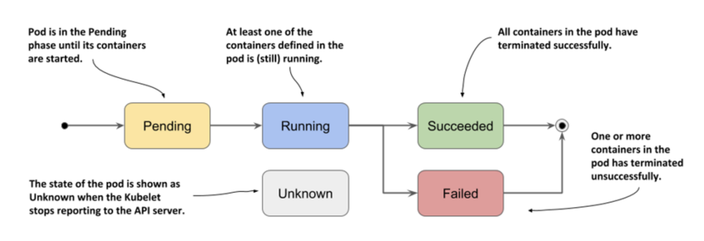
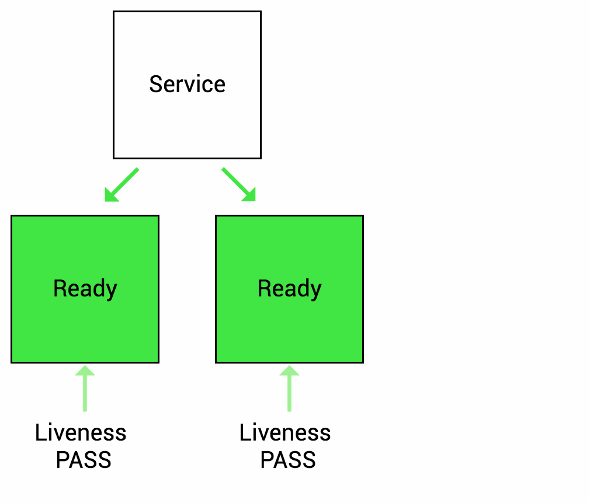
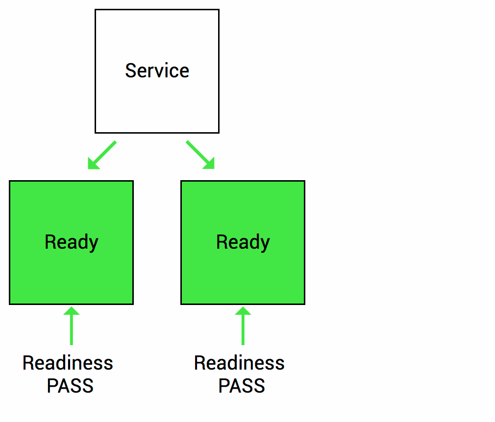

## Workload

**워크로드**(**Workload**)는 Kubernetes에서 구동되는 애플리케이션을 말합니다.
애플리케이션을 컨테이너의 형태로 실행하기 위해서 Kubernetes에서는 **Pod**라는 Object를 이용합니다.
그리고, 이 **Pod**들의 집합을 관리하기 위해서 또 다른 **Workload resource**들을 사용합니다.

이번 장에서는 이 Workload에 대해 알아보겠습니다.

[](https://www.reddit.com/r/kubernetes/comments/k26je7/overview_of_builtin_kubernetes_workload_resources/)

---

### [Pod](https://kubernetes.io/ko/docs/concepts/workloads/pods/)

**파드**(**Pod**)는 Kubernetes에서 생성하고 관리할 수 있는 배포 가능한 가장 작은 컴퓨팅 단위입니다.
Pod는 하나 이상의 컨테이너 그룹으로 구성되며, **스토리지**와 **네트워크**를 공유합니다.

이 **Pod**는 **Node**에서 실행되는데, 이때 Node의 [Cuntainer runtime](https://kubernetes.io/ko/docs/setup/production-environment/container-runtimes/)을 이용하게 됩니다.
**Docker**는 대표적인 Kubernetes의 Container runtime이었지만, v1.20이후에는 deprecated 되었습니다. ([참조](https://kubernetes.io/blog/2020/12/02/dont-panic-kubernetes-and-docker/))
하지만, 앞서 배운 Docker환경에서 만들어진 컨테이너 이미지는 Kubernetes에서 문제없이 동작하니 걱정할 필요는 없습니다.


---

### [Pod](https://kubernetes.io/ko/docs/concepts/workloads/pods/)

**Pod**를 구성하기 위한 Spec은 아래와 같이 작성할 수 있습니다.
내부에 포함될 Container의 image와 구성에 필요한 여러 정보(e.g. ports)를 포함하고 있습니다.
```yaml
apiVersion: v1
kind: Pod
metadata:
  name: nginx
spec:
  containers:
  - name: nginx
    image: nginx:1.14.2
    ports:
    - containerPort: 80
```
그리고, 아래와 같이 두 가지 유형의 Pod가 있습니다.
- **Pods that run a single container** : "one-container-per-Pod" 모델로, 가장 일반적인 유형
- **Pods that run multiple containers** : 밀접하게 결합되고 리소스를 공유하는 여러 개의 컨테이너로 구성

**Pod**는 결국 애플리케이션의 단일 인스턴스를 실행하기 위한 Kubernetes의 Object이며, 인스턴스를 확장(Pod의 개수를 증가)하기 위해서는 또 다른 Workload resource(아래)와 컨트롤러를 이용하게 됩니다. 이 부분은 뒤에 더 자세히 다루겠습니다.
- Deployment
- StatefulSet
- DaemonSet

---

### Pod lifecycle

파드(Pod)는 정의된 라이프사이클을 따릅니다. **Pending** 단계(Phase)에서 시작해서, 기본 컨테이너 중 적어도 하나 이상이 OK로 시작하면 **Running** 단계를 통과하고, 그런 다음 파드의 컨테이너가 어떤 상태로 종료되었는지에 따라 **Succeeded** 또는 **Failed** 단계로 이동합니다.

#### [Pod phase](https://kubernetes.io/ko/docs/concepts/workloads/pods/pod-lifecycle/#%ED%8C%8C%EB%93%9C%EC%9D%98-%EB%8B%A8%EA%B3%84)
Pod의 Lifecycle에서의 단계(Phase)를 나타내는 고수준 요약
| Value | Description |
| --- | --- |
| **Pending** | Pod가 Kubernetest cluster에서 승인되었지만, 컨테이너가 준비상태인 경우<br>(스케쥴링이나 이미지 다운로드에 걸리는 시간을 포함함) |
| **Running** | Pod가 Node에 바인딩 되고 모든 컨테이너가 생성되어 실행 중 |
| **Succeeded** | Pod의 모든 컨테이너가 성공적으로 종료 |
| **Failed** | Pod의 모든 컨테이너가 종료되었고, 그 중 적어도 하나의 컨테이너가 실패로 종료 |
| **Unknown** | Pod의 상태를 확인할 수 없는 단계로, 일반적으로 Node와의 통신오류로 인해 발생함 |



---

#### [Pod conditions](https://kubernetes.io/ko/docs/concepts/workloads/pods/pod-lifecycle/#%ED%8C%8C%EB%93%9C%EC%9D%98-%EC%BB%A8%EB%94%94%EC%85%98)
Pod가 통과하거나 통과하지 못한 컨디션을 나타냄.
- **PodScheduled** : Pod가 Node에 스케줄되었다.
- **ContainersReady** : Pod의 모든 컨테이너가 준비되었다.
- **Initialized** : 모든 [초기화 컨테이너(Init container)](https://kubernetes.io/ko/docs/concepts/workloads/pods/init-containers/)가 성공적으로 완료(completed)되었다.
- **Ready** : Pod는 요청을 처리할 수 있으며 일치하는 모든 서비스의 로드 밸런싱 풀에 추가되어야 한다.

`kubectl describe pod`명령어로 조회했을 때, 아래와 같이 각 Condition이 True/False로 표시됩니다.
```yaml
Conditions:
  Type              Status
  Initialized       True
  Ready             True
  ContainersReady   True
  PodScheduled      True
```

---

#### [Container states](https://kubernetes.io/ko/docs/concepts/workloads/pods/pod-lifecycle/#%EC%BB%A8%ED%85%8C%EC%9D%B4%EB%84%88-%EC%83%81%ED%83%9C)
Pod의 단계(Phase)뿐 아니라, Kubernetes는 Pod 내부 컨테이너의 상태(State)도 추적합니다. 컨테이너는 각 Node의 Container runtime에 의해 생성되며, 아래와 같은 상태(Status)를 가집니다.

| Container states | Description                                                  |
| --- | --- |
| **Waiting** | 컨테이너가 시작되기 전의 상태로, 이미지 pull이나 Secret의 적용과 같은 처리가 진행 중인 상태 |
| **Running** | 컨테이너가 문제없이 실행중인 상태 |
| **Terminated** | 컨테이너가 종료된 상태. (실패인 경우 포함.) |

요약하자면 아래와 같습니다.
- Pod
  - **Phase** : Pending / Running / Succeeded / Failed / Unknown
  - **Condition** : PodScheduled / ContainersReady / Initialized / Ready
  - **Reason** : ContainersNotReady / PodCompleted
  - Containers:
    - Container #N
      - **State** : Waiting / Running / Terminated
      - **Reason** : ContainerCreating / CrashLoopBackOff / Error / Completed

---

일반적인 Pod가 생성되는 단계의 각 상태변화는 다음과 같습니다.
| Pod phase | Pod condition | Container state | Description |
| :---: | :--- | :---: | :--- |
| Pending | PodScheduled : F<br>ContainersReady : F<br>Initialized : T<br>Ready : F | - | Pod가 최초로 생성되었을 때 |
| Pending | ***PodScheduled : T***<br>ContainersReady : F<br>Initialized : T<br>Ready : F | - | 실행될 Node가 정해짐<br>(Kube-scheduler에 의해)|
| Pending | PodScheduled : T<br>ContainersReady : F<br>Initialized : T<br>Ready : F | ***Waiting*** | Image를 Pull |
| ***Running*** | PodScheduled : T<br>***ContainersReady : T***<br>Initialized : T<br>***Ready : T*** | ***Running*** | 컨테이너가 실행됨 |

---

#### [Container probes](https://kubernetes.io/ko/docs/concepts/workloads/pods/pod-lifecycle/#%EC%BB%A8%ED%85%8C%EC%9D%B4%EB%84%88-%ED%94%84%EB%A1%9C%EB%B8%8C-probe)
Kublet은 주기적으로 Pod의 상태를 진단하게 되는데, 이때 사용되는것이 Probe 입니다.
아래와 같은 체크 메커니즘이 사용됩니다.
- **exec** : 컨테이너에서 지정된 명령어를 실행 (exits with 0 -> Successful)
- **httpget** : HTTP GET request (200이상 400미만 -> Successful)
- **tcpsocket** : 특정 포트에 대한 TCP 체크 수행 (Port가 Open됨 -> Successful)

<br>

Probe의 종류는 다음과 같은 것들이 있습니다.
- **livenessProbe** : 컨테이너가 동작 중인지 여부를 나타냄. (실패한 경우 컨테이너를 재시작)
- **readinessProbe** : 컨테이너가 요청을 처리할 준비가 되었는지 여부를 나타냄.
- **startupProbe** : 컨테이너 내의 애플리케이션이 시작되었는지를 나타냄. 성공이후 다른 Probe가 활성화됨. (실패한 경우 컨테이너를 재시작)

---

#### [Container probes](https://kubernetes.io/ko/docs/concepts/workloads/pods/pod-lifecycle/#%EC%BB%A8%ED%85%8C%EC%9D%B4%EB%84%88-%ED%94%84%EB%A1%9C%EB%B8%8C-probe) - livenessProbe
**livenessProbe**는 애플리케이션의 동작상태를 체크합니다.

애플리케이션에 교착 상태(deadlock)가 발생하여 앱이 무기한 중단되고 요청(Request) 처리가 중단되는 시나리오를 상상해 보겠습니다. 프로세스는 계속 실행중이기 때문에 기본적으로 Kubernetes는 모든 것이 정상이라고 생각하고 계속해서 손상된 Pod에 요청을 보냅니다.

**livenessProbe**를 사용하면 이런경우 애플리케이션이 더 이상 Request를 정상적으로 처리하지 않음을 감지하고 문제가 되는 Pod의 컨테이너를 재시작합니다. (Pod의 Restart 카운트가 증가함.)



---

#### [Container probes](https://kubernetes.io/ko/docs/concepts/workloads/pods/pod-lifecycle/#%EC%BB%A8%ED%85%8C%EC%9D%B4%EB%84%88-%ED%94%84%EB%A1%9C%EB%B8%8C-probe) - readinessProbe
**readinessProbe**는 애플리케이션이 요청을 처리할 준비가 되었는지를 체크합니다.

예를들어 애플리케이션이 시작되고 정상적으로 서비스되기까지 얼마정도의 시간이 걸린다고 가정해보겠습니다. 이러한 상황(준비가 완료되지 않은 상황)에서는 트래픽이 이 컨테이너로 전달되면 문제가 될 수 있습니다.

**readinessProbe**를 사용하면 애플리케이션이 완전히 시작될 때까지 기다렸다가 트래픽을 보낼 수 있습니다.



[Configure Liveness, Readiness and Startup Probes](https://kubernetes.io/docs/tasks/configure-pod-container/configure-liveness-readiness-startup-probes/)

---


---

## Summary

- 

<br><br><br><br><br>

`문의처` : 정상업 / rogallo.jung@samsung.com