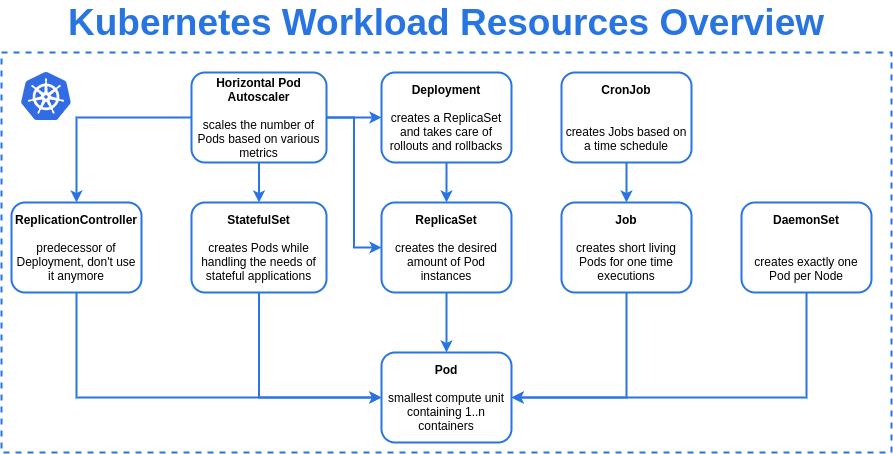
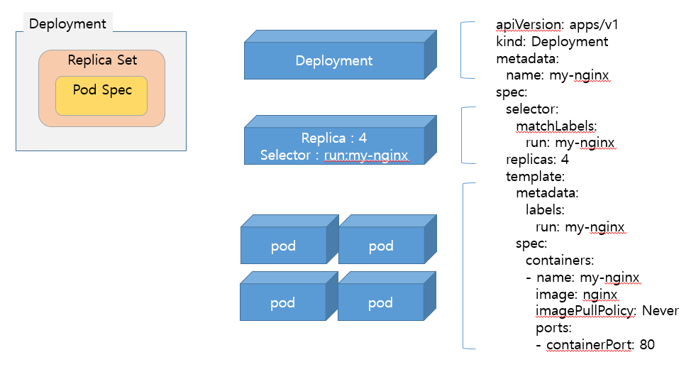
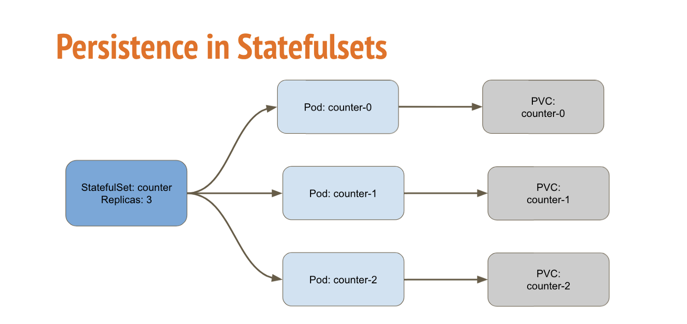
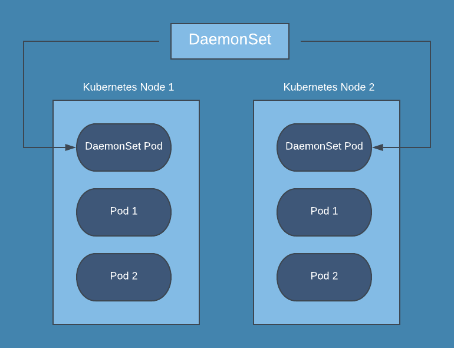

# Contents


<br>

- **Workload**
  - **ReplicaSet**
  - **Deployment**
  - **StatefulSets**
  - **DaemonSet**

---

## Workload

앞 장에서 이야기한 **워크로드**(**Workload**)를 다시 한 번 보겠습니다.
**워크로드**(**Workload**)는 Kubernetes에서 구동되는 **애플리케이션**이며, **Pod** Object를 이용하여 컨테이너 형태로 실행합니다.

이번 장에는 이 **Pod**를 관리하는 또 다른 **Workload resource**들을 알아보도록 하겠습니다.

<br>

[](https://www.reddit.com/r/kubernetes/comments/k26je7/overview_of_builtin_kubernetes_workload_resources/)

---

### ReplicaSet

**ReplicaSet**의 목적은 레플리카 Pod 집합(Pod의 복제본들)의 실행을 항상 안정적으로 유지하는 것입니다.
정해진 수의 Pod를 유지하기 위해서 Object들의 상태(Status)를 살피고, **Spec**과 **Status**에 차이가 발생하면 이를 다시 일치시키기 위해서 조치를 취합니다.

**ReplicaSet**의 **Spec**에는 다음 정보들이 포함되어 있습니다.

- **replicas** : 유지해야 하는 Pod 개수
- **selector** : 획득 가능한 파드를 식별하는 방법 (ReplicaSet에 의해 관리되는 Pod의 선택방법)
- **template** : Pod 생성에 사용되는 데이터 (Pod의 metadata와 spec)

> **ReplicationController**
> **ReplicaSet**은 **ReplicationController**의 다음에 나온 오브젝트 입니다.
> 이 두 개의 용도는 동일하고, 유사하게 동작하지만, **ReplicationController**는 집합성 기준(set-based) 셀렉터의 요건을 지원하지 않는다는 차이가 있습니다.
> 따라서 현재는 주로 **ReplicaSet**이 사용됩니다.

하지만, **Deployment**가 **ReplicaSet**을 관리하고 다른 유용한 기능과 함께 **Pod**에 대한 선언적 업데이트를 제공하는 상위 개념이기 때문에, 특별한 경우를 제외하고는 **ReplicaSet**을 직접 사용하기 보다는 **Deployment**를 사용합니다.

---

### ReplicaSet

**ReplicaSet** 예제

```yaml
apiVersion: apps/v1
kind: ReplicaSet
metadata:
  name: nginx-replicaset
  labels:
    app: my-nginx
    tier: frontend
spec:
  replicas: 3
  selector:
    matchLabels:
      app: my-nginx
  template:
    metadata:
      labels:
        app: my-nginx
      name: my-nginx
    spec:
      containers:
      - image: nginx:1.19.3
        name: my-nginx
        ports:
        - containerPort: 80        
```

> `replicas: 3` 은 `template`에 정의된 Pod를 항상 세 개 유지하라는 것입니다.

---

### Deployment

**Deployment**는 **Pod**를 생성하기 위한 상위 개념의 **Workload resource**이며, 아래 그림과 같이 **ReplicaSet**과 **Pod**에 대한 선언적 업데이트를 제공합니다.
일반적으로 **Pod**는 개별 생성하지 않고 이 **Deployment**와 (**Deployment**에 의해 관리되는) **ReplicaSet**을 이용하여 생성하고 관리합니다.



> 위 그림은 Pod의 image를 v1 > v2 > v3로 변경한 경우를 나타내고 있습니다.

---

### Deployment

**Deployment**는 아래와 같이 정의합니다.

```yaml
apiVersion: apps/v1
kind: Deployment
metadata:
  name: nginx-deployment
  labels:
    app: my-nginx
    tier: frontend
spec:
  replicas: 3
  strategy:
    type: RollingUpdate
  selector:
    matchLabels:
      app: my-nginx
  template:
    metadata:
      labels:
        app: my-nginx
      name: my-nginx
    spec:
      containers:
      - image: nginx:1.19.3
        name: my-nginx
        ports:
        - containerPort: 80        
```

> ReplicaSet과 비슷하지만, `.spec.strategy` 가 추가되어 있습니다.

---

### Deployment

위의 YAML파일을 이용하여 Deployment object를 생성하면 아래와 같은 결과를 볼 수 있습니다.

```bash
ubuntu@ip-10-0-1-14:~$ kubectl apply -f nginx-deployment.yaml
deployment.apps/nginx-deployment created

ubuntu@ip-10-0-1-14:~$ kubectl get all
NAME                                    READY   STATUS    RESTARTS   AGE
pod/nginx-deployment-596ff98864-49mtz   1/1     Running   0          5s
pod/nginx-deployment-596ff98864-tgxf5   1/1     Running   0          5s
pod/nginx-deployment-596ff98864-thl9z   1/1     Running   0          5s

NAME                 TYPE        CLUSTER-IP   EXTERNAL-IP   PORT(S)   AGE
service/kubernetes   ClusterIP   10.96.0.1    <none>        443/TCP   5d7h

NAME                               READY   UP-TO-DATE   AVAILABLE   AGE
deployment.apps/nginx-deployment   3/3     3            3           5s

NAME                                          DESIRED   CURRENT   READY   AGE
replicaset.apps/nginx-deployment-596ff98864   3         3         3       5s
```

**Deployment** Object를 생성하면, 그 하위 Object인 **ReplicaSet**과 **Pod**가 생성됩니다.
조회결과가 의미하는 정보는 각각 아래와 같습니다.

- **Deployment**의 **READY** 필드 3/3 -> Spec에 정의된 세 개의 Pod 중 세 개가 READY 상태임
- **ReplicaSet**의 **DESIRED**/**CURRENT**/**READY** 는 각각 요청된/생성된/준비된 Pod의 개수를 나타냄
- **Pod**는 **ReplicaSet**에 의해 생성된 세 개의 Pod가 각각 표시됨.

---

### Deployment

**Deployment**에 업데이트(e.g. 이미지 변경)가 필요한 경우 아래와 같은 방법으로 할 수 있습니다.

```bash
ubuntu@ip-10-0-1-14:~$ kubectl set image deployment/nginx-deployment my-nginx=nginx:1.23.0
deployment.apps/nginx-deployment image updated
```

> 명령형 커맨드 방식으로 Nginx 이미지를 변경함. (`nginx:1.19.3` -> `nginx:1.23.0`)

<br>

```bash
ubuntu@ip-10-0-1-14:~$ kubectl get all
NAME                                    READY   STATUS    RESTARTS   AGE
pod/nginx-deployment-69748b786d-jjpwr   1/1     Running   0          2m14s
pod/nginx-deployment-69748b786d-m5t2k   1/1     Running   0          2m13s
pod/nginx-deployment-69748b786d-rl6kr   1/1     Running   0          2m18s

NAME                 TYPE        CLUSTER-IP   EXTERNAL-IP   PORT(S)   AGE
service/kubernetes   ClusterIP   10.96.0.1    <none>        443/TCP   5d8h

NAME                               READY   UP-TO-DATE   AVAILABLE   AGE
deployment.apps/nginx-deployment   3/3     3            3           19m

NAME                                          DESIRED   CURRENT   READY   AGE
replicaset.apps/nginx-deployment-596ff98864   0         0         0       19m
replicaset.apps/nginx-deployment-69748b786d   3         3         3       2m18s
```

새로운 ReplicaSet이 생성되고, 이전의 ReplicaSet은 DESIRED/CURRENT/READY 가 모두 0으로 변경된 걸 볼 수 있습니다.

---

### Deployment

`kubectl describe deployment`명령어로 Deployment object의 세부내용을 보겠습니다.

```bash
ubuntu@ip-10-0-1-14:~$ kubectl describe deployment nginx-deployment
Name:                   nginx-deployment
Namespace:              default
CreationTimestamp:      Sun, 03 Jul 2022 10:55:31 +0000
Labels:                 app=my-nginx
                        tier=frontend
Annotations:            deployment.kubernetes.io/revision: 2
Selector:               app=my-nginx
Replicas:               3 desired | 3 updated | 3 total | 3 available | 0 unavailable
StrategyType:           RollingUpdate
MinReadySeconds:        0
RollingUpdateStrategy:  25% max unavailable, 25% max surge
Pod Template:
  Labels:  app=my-nginx
  Containers:
   my-nginx:
    Image:        nginx:1.23.0
    Port:         80/TCP
    Host Port:    0/TCP
    Environment:  <none>
    Mounts:       <none>
  Volumes:        <none>
Conditions:
  Type           Status  Reason
  ----           ------  ------
  Available      True    MinimumReplicasAvailable
  Progressing    True    NewReplicaSetAvailable
OldReplicaSets:  <none>
NewReplicaSet:   nginx-deployment-69748b786d (3/3 replicas created)
```

---

### Deployment

```bash
Events:
  Type    Reason             Age    From                   Message
  ----    ------             ----   ----                   -------
  Normal  ScalingReplicaSet  26m    deployment-controller  Scaled up replica set nginx-deployment-596ff98864 to 3
  Normal  ScalingReplicaSet  8m52s  deployment-controller  Scaled up replica set nginx-deployment-69748b786d to 1
  Normal  ScalingReplicaSet  8m48s  deployment-controller  Scaled down replica set nginx-deployment-596ff98864 to 2
  Normal  ScalingReplicaSet  8m48s  deployment-controller  Scaled up replica set nginx-deployment-69748b786d to 2
  Normal  ScalingReplicaSet  8m47s  deployment-controller  Scaled down replica set nginx-deployment-596ff98864 to 1
  Normal  ScalingReplicaSet  8m47s  deployment-controller  Scaled up replica set nginx-deployment-69748b786d to 3
  Normal  ScalingReplicaSet  8m46s  deployment-controller  Scaled down replica set nginx-deployment-596ff98864 to 0
```

현재 Replicas 상태가 표시되고(`Replicas: 3 desired | 3 updated | 3 total | 3 available | 0 unavailable`), 하단의 Events를 보면 최초 생성과 업데이트된 내용을 볼 수 있습니다. (업데이트 중간과정과 함께)

앞서 **Deployment**의 `.spec.strategy.type==RollingUpdate` 부분으로 인해 업데이트는 RollingUpdate방식으로 이루어 졌습니다.
strategy.type에는 아래와 같이 두 가지 Type이 있습니다.

- **RollingUpdate** : 업데이트 시 Pod들을 정해진 규칙에 따라 순차적으로 생성/삭제
- **Recreate**: 업데이트 시 기존의 Pod를이 모두 삭제되고 새로운 Pod들이 생성됨

그리고, RollingUpdate시에는 다음과 같은 정보를 이용하여 프로세스를 제어할 수 있습니다.

- **Max Unavailable** : 업데이트 프로세스 중에 사용할 수 **없는** 최대 파드의 수를 지정 (Default : 25%)
- **Max Surge** : 의도한 파드의 수에 대해 (추가로) 생성할 수 있는 최대 파드의 수 (Default : 25%)

---

### StatefulSets

**StatefulSet**은 이름과 같이 stateful한 애플리케이션(e.g. Databases)을 위해 사용됩니다.
Pod의 생성과 Scale in/out 시 순서와 고유성이 보장되는 형태입니다.
**Deployment**와 마찬가지로 동일한 Container spec(template)을 이용하여 pod들을 생성하지만, 각 개별 pod들은 교체 불가능하고 rescheduling시에도 식별자가 유지됩니다.

- Pod 이름은 `$(statefulset name)-$(ordinal)`형태로 주어짐. (e.g. my-pod-0, my-pod-1, ...)
- Pod들은 0부터 순차적으로 생성/업데이트 됨
- PVC(PersistentVolumeClaim) Template을 이용하여 각 Pod는 개별 PVC와 PV를 가짐.



🔗[StatefulSets](https://kubernetes.io/ko/docs/concepts/workloads/controllers/statefulset/)

---

### DaemonSet

**DaemonSet**은 모든(또는 일부) **Node**가 **Pod**의 사본을 실행하도록 합니다. Node가 클러스터에 추가되면 Pod도 추가되고, Node가 클러스터에서 제거되면 해당 Pod는 가비지(garbage)로 수집됩니다.
Node마다 실행되어야 하는 Pod가 있을때 사용되며 대표적으로 다음과 같은 것들이 있을 수 있습니다.

- 모든 Node에서 클러스터 스토리지 데몬 실행
- 모든 Node에서 로그 수집 데몬 실행
- 모든 Node에서 Node 모니터링 데몬 실행



🔗[DaemonSet](https://kubernetes.io/ko/docs/concepts/workloads/controllers/daemonset/)

---

## Summary

- Workload
  - ReplicaSet
    - .spec.replicas
    - .spec.selector
    - .spec.template
  - Deployment
    - .spec.replicas
    - .spec.selector
    - .spec.template
    - .spec.strategy
      - RollingUpdate
      - Recreate
  - StatefulSets
  - DaemonSet
