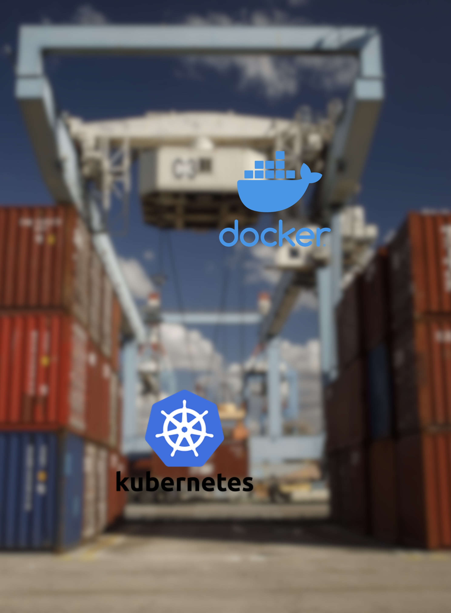

# Contents



<br>

- **ConfigMap**
- **Secret**
- **Resource 관리**
- **Namespace settings**

---

## ConfigMap

**ConfigMap**은 Key-Value 쌍으로 기밀이 아닌 데이터를 저장하는데 사용하는 API Object입니다. Pod는 볼륨에서 환경변수, 명령줄 인수 또는 구성(Config.) 파일로 **ConfigMap**을 사용할 수 있습니다.

**ConfigMap**을 사용하면 컨테이너 이미지에서 **환경별 구성**(**Config.**)을 분리하여, 애플리케이션을 쉽게 이식할 수 있습니다.

> **ConfigMap**은 많은 양의 데이터를 보유하도록 설계되지 않았습니다. **ConfigMap**에 저장된 데이터는 1MiB를 초과할 수 없습니다. 이 제한보다 큰 설정을 저장해야 하는 경우, Volume을 마운트하는 것을 고려하거나 별도의 데이터베이스 또는 파일 서비스를 사용할 수 있습니다.

**ConfigMap**은 다른 Kubernetes object들과 달리 `.spec`대신 `data`와 `binaryData`를 가지고 있습니다.

```yaml
apiVersion: v1
kind: ConfigMap
metadata:
  name: game-demo
data:
  # 속성과 비슷한 키; 각 키는 간단한 값으로 매핑됨
  player_initial_lives: "3"
  ui_properties_file_name: "user-interface.properties"

  # 파일과 비슷한 키
  game.properties: |
    enemy.types=aliens,monsters
    player.maximum-lives=5    
  user-interface.properties: |
    color.good=purple
    color.bad=yellow
    allow.textmode=true 
```

---

## ConfigMap

위와같이 생성된 Configmap을 사용할 때는 다음과 같이 할 수 있습니다.

```yaml
apiVersion: v1
kind: Pod
metadata:
  name: configmap-demo-pod
spec:
  containers:
    - name: demo
      image: alpine
      command: ["sleep", "3600"]
      env:
        # 환경 변수 정의
        - name: PLAYER_INITIAL_LIVES # 참고로 여기서는 컨피그맵의 키 이름과 대소문자가 다르다.
          valueFrom:
            configMapKeyRef:
              name: game-demo           # 이 값의 컨피그맵.
              key: player_initial_lives # 가져올 키.
        - name: UI_PROPERTIES_FILE_NAME
          valueFrom:
            configMapKeyRef:
              name: game-demo
              key: ui_properties_file_name
      ...
```

> 환경변수(`PLAYER_INITIAL_LIVES`, `UI_PROPERTIES_FILE_NAME`)의 값으로 Configmap에 정의된 값(`3`,`user-interface.properties`)을 사용함.

---

## ConfigMap

앞의 파일에서 이어진 파일입니다.

```yaml
      ...
      volumeMounts:
      - name: config
        mountPath: "/config"
        readOnly: true
  volumes:
    # 파드 레벨에서 볼륨을 설정한 다음, 해당 파드 내의 컨테이너에 마운트한다.
    - name: config
      configMap:
        # 마운트하려는 컨피그맵의 이름을 제공한다.
        name: game-demo
        # 컨피그맵에서 파일로 생성할 키 배열
        items:
        - key: "game.properties"
          path: "game.properties"
        - key: "user-interface.properties"
          path: "user-interface.properties"
```

> Volume을 정의하고 mountPath(/config)에 두 개의 파일(`game.properties`,`user-interface.properties`)을 마운트

---

## Secret

**Secret**은 암호, 토큰 또는 키와 같은 소량의 중요한 데이터를 포함하는 Object입니다. 이를 사용하지 않으면 중요한 정보가 파드 명세나 컨테이너 이미지에 포함될 수 있다. **Secret**을 사용한다는 것은 사용자의 기밀 데이터를 애플리케이션 코드에 넣을 필요가 없음을 뜻합니다.

**Secret**은 **Secret**을 사용하는 Pod와 독립적으로 생성될 수 있기 때문에, 파드를 생성하고, 확인하고, 수정하는 워크플로우 동안 **Secret**이 노출되는 것에 대한 위험을 경감시킬 수 있습니다.

**Secret**은 **Configmap**과 유사하지만 특별히 기밀 데이터를 보관하기 위한 것입니다.

간단한 사용예를 보겠습니다.

```yaml
apiVersion: v1
kind: Secret
metadata:
  name: mysecret
type: Opaque
data:
  USER_NAME: YWRtaW4=
  PASSWORD: MWYyZDFlMmU2N2Rm
```

> `USER_NAME` 과 `PASSWORD`를 가진 secret

---

## Secret

```yaml
apiVersion: v1
kind: Pod
metadata:
  name: secret-test-pod
spec:
  containers:
    - name: test-container
      image: registry.k8s.io/busybox
      command: [ "/bin/sh", "-c", "env" ]
      envFrom:
      - secretRef:
          name: mysecret
  restartPolicy: Never
```

> 환경변수로 앞에서 생성된 Secret의 정보를 사용

---

#### Resource 관리

Pod의 Spec.을 정할 때 컨테이너에 필요한 각 리소스의 양을 지정할 수 있습니다. 지정할 수 있는 대표적인 리소스는 **CPU**와 **메모리**(RAM)가 있습니다.  

##### requests and limits

Pod에서 리소스 요청(request)을 지정하면, kube-scheduler는 이 정보를 사용하여 Pod가 배치될 Node를 결정합니다. **리소스 제한**(**limit**)을 지정하면, kublet은 실행중인 컨테이너가 설정한 제한보다 많은 리소스를 사용할 수 없도록 해당 제한을 적용합니다. 또한, kubelet은 컨테이너가 사용할 수 있도록 해당 시스템 **리소스의 최소 요청**(**request**)량을 예약합니다.  
컨테이너의 프로세스가 허용된 양보다 많은 메모리를 사용하려고 하면, 시스템 커널은 메모리 부족(Out of memory, OOM) 오류와 함께 프로세스를 종료합니다.

```yaml
apiVersion: v1
kind: Pod
metadata:
  name: frontend
spec:
  containers:
  - name: wp
    image: wordpress
    resources:
      requests:
        memory: "64Mi"
        cpu: "250m"
      limits:
        memory: "128Mi"
        cpu: "500m"
```

> 위 예제는 250 milicore / 64 MiB ~ 500 milicore / 128 MiB 로 설정함.

---

###### CPU

1 CPU 단위는 물리호스트인지 가상머신인지에 따라서 **1 physical CPU Core** 또는 **1 virtual core** 에 해당합니다.  

> 1 core = 1000m core

<br>

###### Memory

메모리에 대한 요청(request)과 제한(limit)은 바이트(byte) 단위로 주어집니다. 

> **1 Ki** = 1 KiB (Kibibyte, Kilo binary byte) = 2^10 byte
> **1 Mi** = 1 MiB (Mebibyte, Mega binary byte) = 2^20 byte
> **1 Gi** = 1 GiB (Gibibyte, Giga binary byte) = 2^30 byte

---

#### Namespace settings

Kubernetes cluster에는 다수의 Namespace가 존재할 수 있고, 각 Namespace간에 리소스 사용에 대한 제한을 둘 필요가 있습니다. 
이를 위해 Kubernetes에서는 Namespace 단위로 리소스 사용에 대한 설정을 할 수 있습니다.

##### [ResourceQuotas](https://kubernetes.io/ko/docs/concepts/policy/resource-quotas/)

ResourceQuota는 **Namespace별 총 리소스** 사용을 제한하는 제약 조건입니다.  
예를들면 다음과 같은 유형으로 사용할 수 있습니다.

- 용량이 32GiB RAM, 16 코어인 클러스터에서 A 팀이 20GiB 및 10 코어를 사용하고 B 팀은 10GiB 및 4 코어를 사용하게 하고 2GiB 및 2 코어를 향후 할당을 위해 보유하도록 한다.
- "testing" 네임스페이스를 1 코어 및 1GiB RAM을 사용하도록 제한하고 "production" 네임스페이스에는 원하는 양을 사용하도록 한다.
  
  ```yaml
  apiVersion: v1
  kind: ResourceQuota
  metadata:
  name: demo
  spec:
  hard:
    requests.cpu: 500m
    requests.memory: 100Mib
    limits.cpu:700m
    limits.memory: 500Mib
  ```
  
  > request.cpu / request.memory : 모든 Pod에서 CPU/memory 요청(request)의 합은 이 값을 초과할 수 없음.
  > limits.cpu / limits.memory : 모든 Pod에서 CPU/memory 제한(limit)의 합은 이 값을 초과할 수 없음.

---

##### [LimitRange](https://kubernetes.io/ko/docs/concepts/policy/limit-range/)

ResourceQuotas는 Namespace 전체영역에 대한 리소스의 제한을 정의하는반면, LimitRange는 **개별 컨테이너 단위의 리소스**에 대한 제약입니다. 즉, 사용자들이 개별 컨테이너에 대한 리소스를 정의할때 해당되는 범위를 제한하는 개념입니다.

```yaml
apiVersion: v1
kind: LimitRange
metadata:
  name: cpu-resource-constraint
spec:
  limits:
  - default: # this section defines default limits
      cpu: 500m
      memory: 100Mib
    defaultRequest: # this section defines default requests
      cpu: 100m
      memory: 50Mib
    max: # max and min define the limit range
      cpu: "1""
      memory: 200Mib
    min:
      cpu: "1"
      memory: 10Mib
    type: Container
```

> default : 컨테이너에서 지정된 값이 없을 경우 적용되는 limit
> defaultRequest : 컨테이너에서 지정된 값이 없을 경우 적용되는 request
> max : limit으로 지정할 수 있는 최대 크기
> min : limit으로 지정할 수 있는 최소 크기

---

## Summary

- ConfigMap
- Secret
