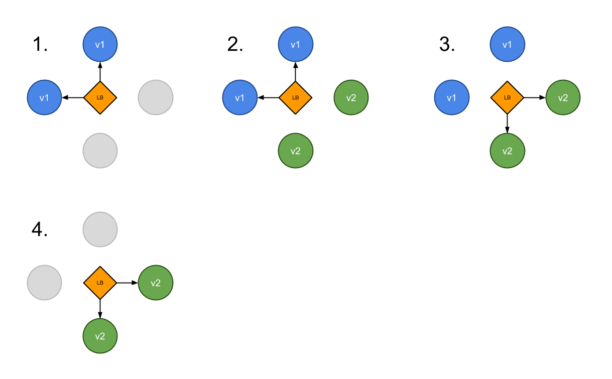
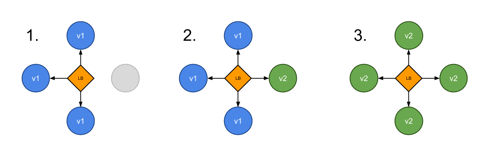
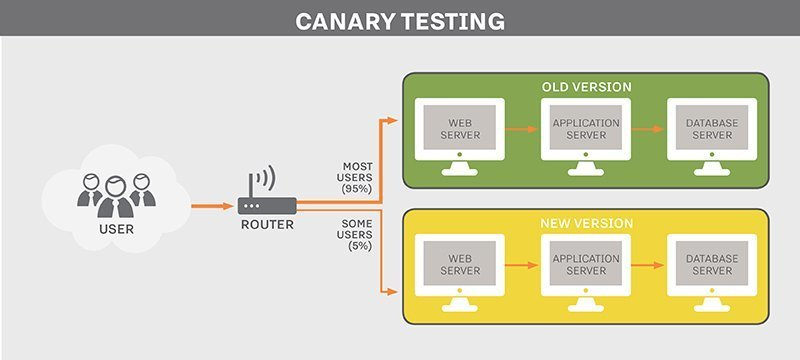

# Contents


<br>

- **Deployment strategies**
  - **Recreate**
  - **RollingUpdate**
  - **Blue/Green deployments**
  - **Canary deployments**

---

## Deployment strategies

Kubernetes 환경에서 애플리케이션을 배포하는 방법은 여러가지가 있습니다.
이번 장에서는 여러가지 배포전략의 특징을 알아보겠습니다.


🔗[Kubernetes deployment strategies](https://blog.container-solutions.com/kubernetes-deployment-strategies)
🔗[Kubernetes deployment strategies(Github)](https://github.com/ContainerSolutions/k8s-deployment-strategies)

---

### Recreate

**Recreate**전략은 기존 Version A를 제거하고 Version B를 배포하는 전략으로, Cloud환경에서 비용이 적게 들고 간편한 설정으로 인해 **개발환경**에서 선택할 수 있는 좋은 전략입니다.  **Recreate**는 Deployment 의 `.spec.strategy`를 아래와 같이 지정하여 사용할 수 있습니다.

```yaml
spec:
  strategy:
    type: Recreate
```

다만 이러한 Recreate전략은 기존 A버전의 애플리케이션이 중단되면 대체할 수 있는 애플리케이션이 없기 때문에 B버전의 애플리케이션이 시작되기까지 **Downtime**이 발생하게 됩니다.


---

### Recreate

**Recreate** 전략을 적용한 Deployment에서 업데이트(image 변경)를 한 경우, `kubectl describe deploy`명령어로 Deployment의 Event를 확인하면 아래와 같이 변경내용을 확인할 수 있습니다.

```bash
$ kubectl describe deploy nginx-deployment
Name:               nginx-deployment
Namespace:          default
CreationTimestamp:  Tue, 05 Jul 2022 13:03:38 +0000
...생략...
Conditions:
  Type           Status  Reason
  ----           ------  ------
  Available      True    MinimumReplicasAvailable
  Progressing    True    NewReplicaSetAvailable
OldReplicaSets:  <none>
NewReplicaSet:   nginx-deployment-6866dc769c (3/3 replicas created)
Events:
  Type    Reason             Age   From                   Message
  ----    ------             ----  ----                   -------
  Normal  ScalingReplicaSet  73s   deployment-controller  Scaled up replica set nginx-deployment-5777d8dcc8 to 3
  Normal  ScalingReplicaSet  20s   deployment-controller  Scaled down replica set nginx-deployment-5777d8dcc8 to 0
  Normal  ScalingReplicaSet  19s   deployment-controller  Scaled up replica set nginx-deployment-6866dc769c to 3
```

Events의 내용은 아래와 같습니다.

1. 최초 생성 : Scaled up replica set nginx-deployment-5777d8dcc8 to 3
2. 업데이트 단계 1 : Scaled down replica set nginx-deployment-5777d8dcc8 to 0 (구 버젼 삭제)
3. 업데이트 단계 2 : Scaled up replica set nginx-deployment-6866dc769c to 3 (신 버젼 생성)

---

### RollingUpdate(Ramped)

**Rolling Update**는 Kubernetes에서 쉽고 효율적으로 사용 할 수 있는 **무중단 배포전략**으로, Pod를 순차 update하는 방식입니다. 이러한 배포방법은 자원을 효율적으로 사용하면서 전체 서비스가 끊김없이 지속될 수 있는 효과를 볼 수 있습니다. **RollingUpdate**는 Deployment 의 `.spec.strategy`를 아래와 같이 지정하여 사용할 수 있습니다.

```yaml
spec:
  strategy:
    type: RollingUpdate
    rollingUpdate:
      maxSurge: 1
      maxUnavailable: 0
```


---

### RollingUpdate(Ramped)

RollingUpdate 진행중의 과정을 그림으로 표현하면 아래와 같습니다.
v1 pod들이 정해진 범위 내에서(maxSurge, maxUnavailable) v2 pod로 대체되게 됩니다.
진행 중에 일시적으로 다른 버젼이 서비스되기는 하지만, 서비스 중단없이 업데이트를 수행하는 가장 손쉬운 방법입니다.


---

### RollingUpdate(Ramped)

**RollingUpdate** 전략을 적용한 Deployment에서 업데이트(image 변경)를 한 경우, `kubectl describe deploy`명령어로 Deployment의 Event를 확인하면 아래와 같이 변경내용을 확인할 수 있습니다.

```bash
$ kubectl describe deploy nginx-deployment
Name:                   nginx-deployment
Namespace:              default
...생략...
Events:
  Type    Reason             Age   From                   Message
  ----    ------             ----  ----                   -------
  Normal  ScalingReplicaSet  84s   deployment-controller  Scaled up replica set nginx-deployment-6866dc769c to 3
  Normal  ScalingReplicaSet  20s   deployment-controller  Scaled up replica set nginx-deployment-796c89d97c to 1
  Normal  ScalingReplicaSet  10s   deployment-controller  Scaled down replica set nginx-deployment-6866dc769c to 2
  Normal  ScalingReplicaSet  10s   deployment-controller  Scaled up replica set nginx-deployment-796c89d97c to 2
  Normal  ScalingReplicaSet  9s    deployment-controller  Scaled down replica set nginx-deployment-6866dc769c to 1
  Normal  ScalingReplicaSet  9s    deployment-controller  Scaled up replica set nginx-deployment-796c89d97c to 3
  Normal  ScalingReplicaSet  8s    deployment-controller  Scaled down replica set nginx-deployment-6866dc769c to 0
```

1. 최초 생성 : Scaled up replica set nginx-deployment-6866dc769c to 3
2. 업데이트 단계 1 : Scaled up replica set nginx-deployment-796c89d97c to 1 (신 버젼 Pod 수 +1)
3. 업데이트 단계 2 : Scaled down replica set nginx-deployment-6866dc769c to 2 (구 버젼 Pod 수 -1)
4. 업데이트 단계 3 : Scaled up replica set nginx-deployment-796c89d97c to 2 (신 버젼 Pod 수 +1)
5. 업데이트 단계 4 : Scaled down replica set nginx-deployment-6866dc769c to 1 (구 버젼 Pod 수 -1)
6. 업데이트 단계 5 : Scaled up replica set nginx-deployment-796c89d97c to 3 (신 버젼 Pod 수 +1)
7. 업데이트 단계 6 : Scaled down replica set nginx-deployment-6866dc769c to (구 버젼 Pod 수 -1)

---

### Blue/Green deployments

**Blue/green deployment**는 Blue(Old version)와 Green(New version)이 모두 운영환경에 존재하는 상태에서 Green(New version)을 테스트한 후 문제가 없으면 트래픽을 Blue에서 Green으로 전환하는 전략입니다.
이 전략은 업데이트와 롤백을 중단없이 할 수 있다는 장점이 있는 반면, 배포시 두 배의 리소스가 소요된다는 점과 Stateful한 애플리케이션의 경우는 핸들링하기가 어렵다는 단점이 있습니다.



---

### Blue/Green deployments

**Blue/green deployment**는 **Recreate**나 **RollingUpdate**처럼 **Deployment**의 Spec만 설정해서는 구현할 수 없습니다. 여러가지 방법이 있지만, Kubernetes에서 구현 가능한 대표적인 방법은 **Service**의 `.spec.selector`를 이용하는 방법이 있습니다.

```bash
apiVersion: v1
kind: Service
metadata:
  name: my-app
  labels:
    app: my-app
spec:
  type: NodePort
  ports:
  - name: http
    port: 80
    targetPort: http
  selector:
    app: my-app
    version: v1.0.0
```

> 앞의 그림에서 LB역할을 하는 **Service object**를 생성하고, `.spec.selector`를 변경하여 특정 Label을 가진 Pod로 Route를 변경할 수 있습니다.
> 예를들어 위와 같은 상태에서는 version=v1.0.0인 Pod로 경로를 설정하지만, 이 값을 변경하면(e.g. v1.0.0 -> v2.0.0) 변경된 Label을 가진 Pod로 경로를 변경할 수 있습니다.

---

### Canary deployments

**Canary deployment**는 운영환경에서 V1로 배포된 애플리케이션을 V2로 점진적으로 트래픽을 이동시키는 방법입니다. 예를 들어 동일한 애플리케이션에 대한 사용자 요청을 90%는 V1로 나머지 10%를 새롭게 배포된 V2로 보내는 전략입니다. 이러한 배포방법은 배포할 애플리케이션에 대한 테스트가 부족하거나 안정성에 대한 확신이 없을 경우 사용할 수 있습니다.




---

### Canary deployments

**Canary deployments**를 구현하는 방법도 다양한 방법이 있습니다. Kubernetes에서 간단하게 이 방법을 구현하려면 아래와 같은 방법을 사용할 수 있습니다. (labels and selectors)

```yaml
     name: frontend
     replicas: 3
     ...
     labels:
        app: guestbook
        tier: frontend
        track: stable
     ...
     image: gb-frontend:v3
```

> `track: stable` label을 가진 stable 버젼

```yaml
     name: frontend-canary
     replicas: 1
     ...
     labels:
        app: guestbook
        tier: frontend
        track: canary
     ...
     image: gb-frontend:v4
```

> `track: canary` label을 가진 canary 버젼 (새로운 버젼)

---

### Canary deployments

위와같이 두 가지 버젼의 시스템을 위한 **Deployment**를 생성한 후, LB의 selector는 아래와 같이 설정하면(`track:`은 제외하고 나머지 `label`만 선택함) 간단히 **Canary deployment**를 구현할 수 있습니다.

위의 예에서는 Replicas의 차이만큼( stable:canary = 3:1 )의 사용자 트래픽 처리를 할 수 있습니다.

```yaml
  selector:
     app: guestbook
     tier: frontend
```

---

## Summary

- Deployment strategies
  - Recreate
  - RollingUpdate
  - Blue/Green deployments
  - Canary deployments
