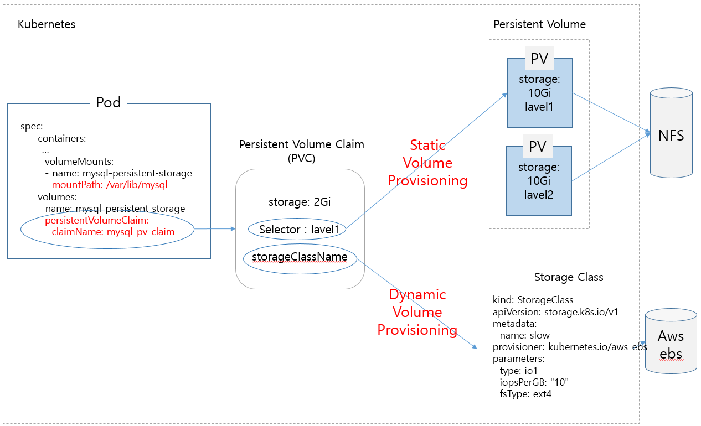

# Contents


<br>

- **Volume**
  - **PersistentVolume**
  - **PersistentVolumeClaim**
---

## Volume

컨테이너가 실행되고 실행 중에 상태를 가지고 데이터가 생성되어도, 컨테이너가 종료되면 컨테이너에서 생성되었던 모든 데이터는 사라집니다. 이것은 Kubernetes상에서 자유롭게 Pod를 복제하고 배포하는데 있어 커다란 장점으로 작용합니다.

하지만, 로그 및 데이터베이스와 같은 애플리케이션은 종료되더라도 데이터가 유지되어야만 하는 특징이 있습니다. 이렇게 데이터의 상태를 유지할 수 있도록 사용하는 것이 **Volume**입니다.

Kubernetes에서는 Docker와는 다르게 Pod 단위로 [Volume](https://kubernetes.io/docs/concepts/storage/volumes/)을 관리하며,  Life Cycle과 제공되는 디스크 Type 따라 다양한 옵션과 종류가 존재합니다.

이 장에서는 Kubernetes의 영구 Volume체계인
- PersistentVolume(PV)와 
- PersistentVolumeClaim(PVC)
 
에 대해 살펴보겠습니다.


---

## Volume



---

### Volume 종류
Volume은 제공되는 디스크 Type에 따라 여러가지 종류의 Volume Type을 지원합니다.

| Temp     | Local           | Network        |
| -------- | --------------- | -------------- |
| emptyDir | hostPath, local | NFS, AWS EBS.. |

- emptyDir은 동일한 Pod내에서 사용가능한 임시 Volume으로 Pod가 삭제되면 Volume의 데이터도 같이 삭제됩니다.
- hostPath는 Pod에 호스트 노드의 파일이나 디렉토리를 마운트하여 사용하며, Pod가 삭제되어도 내용이 삭제되지 않습니다.
- local은 특정 노드에 mount된 파일시스템을 Volume으로 사용합니다.
- Network : 네트워크 또는 클라우드 상에 존재하는 storage를 Volume으로 사용합니다.

### Volume Provisioning 에 따른 분류
Kubernetes에서는 자동으로 Volume을 생성할 수 있느냐 없느냐에 따라 **Static Volume Provisioning**과 **DynamicVolume Provisoning**으로 구분할 수 있습니다. 
- Static Volume Provisioning : 관리자가 수동으로 Kubernetes에서 Persistent Volume을 생성
- DynamicVolume Provisoning : 개발자의 요청에 의해 자동으로 Kubernetes에서 Persistent Volume을 생성

---

### Persistent Volume(PV) & Persistent Volume Claim(PVC)
쿠버네티스에서 볼륨을 사용하는 구조는 스토리지를 매핑시킨 PersistentVolume(PV)과 그 PV를 Pod에서 사용할때 PV로 Volume내역을 요청하는 PersistentVolumeClaim(PVC) 2단계로 분리되어 있습니다.

PVC는 개발자 또는 클라우드 사용자가 PV Volume을 할당해달라는 요청에 해당합니다. 사용하고 싶은 **용량**과 각종 Volume에 관한 **설정값**을 정해서 요청하게 됩니다.

아래는 PersistentVolume(PV)예시입니다.
```yaml
apiVersion: v1
kind: PersistentVolume
metadata:
  name: pv0003
spec:
  capacity:
    storage: 5Gi
  volumeMode: Filesystem
  accessModes:
    - ReadWriteOnce
  persistentVolumeReclaimPolicy: Recycle
  storageClassName: slow
  mountOptions:
    - hard
    - nfsvers=4.1
  nfs:
    path: /tmp
    server: 172.17.0.2
```
> 용량, Mode, Path등의 정보가 있습니다.

---

### Phase
Volume은 아래와 같은 단계(Phase)를 가집니다. 해당 단계는 PersistentVolume(PV)이 생성되고, kubectl get pv 명령을 통해 조회할 수 있습니다.
- Available – PV가 생성되고 PVC가 바인딩되기 전 단계
- Bound – PV가 PVC에 바인된 단계
- Released – PVC가 삭제된 단계
- Failed – 자동반환 실패

### Access Modes
Access 유형에 따라 다음과 같이 구부됩니다.
- ReadWriteOnce – 단일 노드에 의한 읽기-쓰기로 볼륨이 마운트될 수 있습니다.
- ReadOnlyMany – 여러 노드에 의한 읽기 전용으로 볼륨이 마운트될 수 있습니다.
- ReadWriteMany – 여러 노드에 의한 읽기-쓰기로 볼륨이 마운트될 수 있습니다.
- ReadWriteOncePod - 볼륨이 단일 파드에서 읽기-쓰기로 마운트될 수 있습니다.

---

### Reclaim Policy
사용자가 볼륨을 다 사용하고나면 리소스를 반환할 수 있는 API를 사용하여 PVC 오브젝트를 삭제할 수 있습니다. 이때 PV에서 수행할 작업 유형에 따라 다음과 같은 종류가 있습니다.
- Retain – 리소스를 수동반환하는 방식으로, PV는 Released Phase가 되고 데이터 유지(다시 쓰기 위해서는 PV를 삭제하고 재생성해야함)
- Recycle – PV는 유지하고 파일만 삭제 (`rm -rf /thevolume/*`)
- Delete – 볼륨 및 데이터 삭제
  
---

## PVC
아래는 Persistent Volume Claim(PVC) 예시입니다.

```
kind: PersistentVolumeClaim
apiVersion: v1
metadata:
  name: myclaim
spec:
  accessModes:
    - ReadWriteOnce
  volumeMode: Filesystem
  resources:
    requests:
      storage: 8Gi
  storageClassName: slow
  selector:
    matchLabels:
      release: "stable"
    matchExpressions:
      - {key: environment, operator: In, values: [dev]}
```

---

## Summary

- Volume
  - PersistentVolume
  - PersistentVolumeClaim

<br><br><br><br><br><br><br><br><br><br><br><br><br><br><br><br>

`문의처` : 정상업 / rogallo.jung@samsung.com