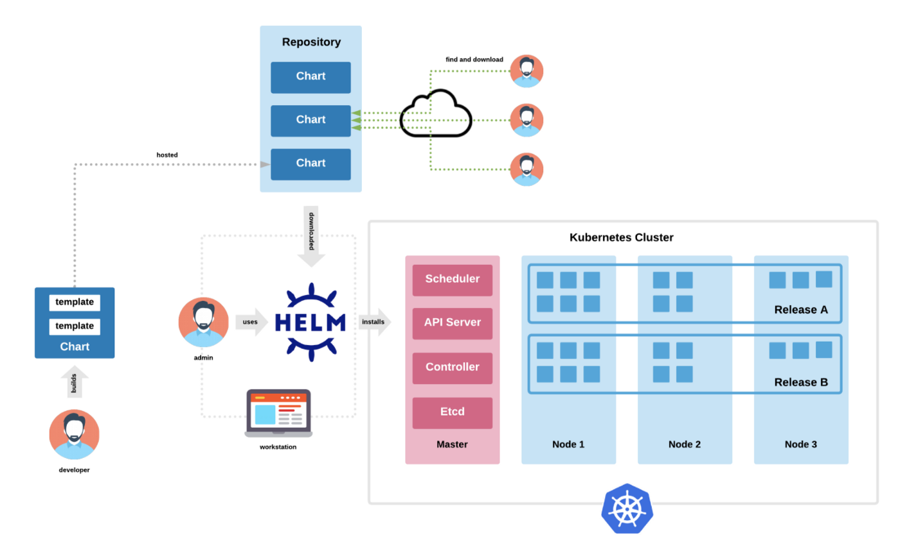
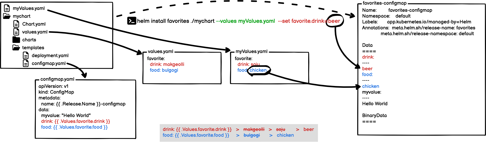

# Contents


<br>

- **Helm**
  - **Helm concept**
  - **Helm Commands**

---

## Helm

Helm은 Kuberentes **Package Managing Tool**입니다. node.js의 npm과 유사하게 Kuberentes의 Package를 배포 가능하게 하는 Tool 이라고 생각하시면 됩니다. 

**Chart** 라고 부르는 Package Format을 사용하게되는데, 이 Chart는 **Kubernetes Resource**들을 정의하는 파일들의 집합입니다.

Helm을 통해 다음과 같은 일을 할 수 있습니다.

- 새로운 Chart를 생성할 수 있습니다.
- Chart들을 통해 Chart 아카이브(tgz) 파일을 생성할 수 있습니다.
- Chart들이 저장된 Repositories와 상호작용(가져오기 등)을 할 수 있습니다.
- Chart들을 Kubernetes Cluster에 설치/제거 할 수 있습니다.
- Helm을 통해 설치된 Chart들에 대한 Release Cycle을 관리할 수 있습니다.

<br><br><br><br><br>

🔗[Helm](https://helm.sh/ko/)

---

## Helm



Helm은 다음과 같은 3가지 중요한 개념([Three Big Concepts](https://helm.sh/ko/docs/intro/using_helm/#%EC%A3%BC%EC%9A%94-%EA%B0%9C%EB%85%90-3%EA%B0%80%EC%A7%80))을 가지고 있습니다.

- **Chart** : Helm의 package이며, 이 package에는 Kubernetes Resource들을 담고 있음
- **Repository** : Chart(Kubernetes Package) 저장소
- **Release** : Kubernetes Cluster에서 구동되는 Chart의 Instance

---

### [Charts](https://helm.sh/ko/docs/topics/charts/)

Chart는 Helm에서 사용되는 **패키징 포멧**이며, **쿠버네티스 리소스**를 정의하는 파일들의 집합입니다.
Chart는 디렉토리 내부에 파일들로 구성되며, 디렉토리 이름이 Chart의 이름이 됩니다.
예를들어, WordPress라는 Chart는 `wordpress/` 디렉토리에 저장이 됩니다.

디렉토리 내에는 아래와 같은 구조로 파일들이 존재 합니다.

```bash
wordpress/
  Chart.yaml          # 차트에 대한 정보를 가진 YAML 파일
  LICENSE             # 옵션: 차트의 라이센스 정보를 가진 텍스트 파일
  README.md           # 옵션: README 파일
  values.yaml         # 차트에 대한 기본 환경설정 값들
  values.schema.json  # 옵션: values.yaml 파일의 구조를 제약하는 JSON 파일
  charts/             # 이 차트에 종속된 차트들을 포함하는 디렉터리
  crds/               # 커스텀 자원에 대한 정의
  templates/          # values와 결합될 때, 유효한 쿠버네티스 manifest 파일들이 생성될 템플릿들의 디렉터리
  templates/NOTES.txt # 옵션: 간단한 사용법을 포함하는 텍스트 파일
```

> 위 예제의 파일과 디렉토리는 Helm에서 사용되는 예약어 입니다.
> 
> - 파일 : Chart.yaml, LICENSE, README.md, values.yaml, values.schema.json
> - 디렉토리 : charts/ , crds/ , templates/

---

#### [Chart.yaml 파일](https://helm.sh/ko/docs/topics/charts/#chartyaml-%ED%8C%8C%EC%9D%BC)

Chart.yaml 파일은 Chart에 필수적인 파일이며 다음과 같은 Field를 포함하고 있습니다.

```yaml
apiVersion: 차트 API 버전 (필수)
name: 차트명 (필수)
version: SemVer 2 버전 (필수)
kubeVersion: 호환되는 쿠버네티스 버전의 SemVer 범위 (선택)
description: 이 프로젝트에 대한 간략한 설명 (선택)
type: 차트 타입 (선택)
keywords:
  - 이 프로젝트에 대한 키워드 리스트 (선택)
home: 프로젝트 홈페이지의 URL (선택)
sources:
  - 이 프로젝트의 소스코드 URL 리스트 (선택)
dependencies: # 차트 필요조건들의 리스트 (optional)
  - name: 차트명 (nginx)
    version: 차트의 버전 ("1.2.3")
    repository: 저장소 URL ("https://example.com/charts") 또는 ("@repo-name")
    condition: (선택) 차트들의 활성/비활성을 결정하는 boolean 값을 만드는 yaml 경로 (예시: subchart1.enabled)
    tags: # (선택)
      - 활성화 / 비활성을 함께하기 위해 차트들을 그룹화 할 수 있는 태그들
    enabled: (선택) 차트가 로드될수 있는지 결정하는 boolean
    import-values: # (선택)
      - ImportValues 는 가져올 상위 키에 대한 소스 값의 맵핑을 보유한다. 각 항목은 문자열이거나 하위 / 상위 하위 목록 항목 쌍일 수 있다.
    alias: (선택) 차트에 대한 별명으로 사용된다. 같은 차트를 여러번 추가해야할때 유용하다.
```

---

앞장에서 계속

```yaml
maintainers: # (선택)
  - name: maintainer들의 이름 (각 maintainer마다 필수)
    email: maintainer들의 email (각 maintainer마다 선택)
    url: maintainer에 대한 URL (각 maintainer마다 선택)
icon: 아이콘으로 사용될 SVG나 PNG 이미지 URL (선택)
appVersion: 이 앱의 버전 (선택). SemVer인 필요는 없다.
deprecated: 차트의 deprecated 여부 (선택, boolean)
annotations:
  example: 키로 매핑된 주석들의 리스트 (선택).
```

- **version** : 모든 Chart는 버젼 번호를 정하게 되어있는데, 이때  [SemVer 2](https://semver.org/spec/v2.0.0.html) 표준을 따릅니다. ( e.g. wordpress-15.2.22)  
- **apiVersion** : Helm 3를 사용하는 경우 `apiVersion` 은 `v2`여야 합니다. (Helm 2는 `v1`)  
- **type** : Chart의 타입을 정의하며, application(기본형)과 library(유틸리티/함수 제공) 두 가지 타입이 있다.  

<br><br>

#### [LICENSE, README and NOTES](https://helm.sh/ko/docs/topics/charts/#%EC%B0%A8%ED%8A%B8-%EB%9D%BC%EC%9D%B4%EC%84%BC%EC%8A%A4-readme-%EC%99%80-notes) 파일

라이센스 내용이나 설명, 사용법, 구성 등을 담고있는 텍스트 파일

> README는 Markdown(.md) 포멧을 사용

---

#### [Chart Dependencies](https://helm.sh/ko/docs/topics/charts/#%EC%B0%A8%ED%8A%B8-%EC%9D%98%EC%A1%B4%EC%84%B1)

Helm은 차트간에 **의존성**을 가진 구조를 가질 수 있습니다.  
이 의존성은 Chart.yaml 파일에 dependencies 필드를 사용하거나, charts/ 디렉토리를 통해 관리할 수 있습니다.

<br>

##### Chart.yaml 파일의 dependencies 필드 (예제)

```yaml
dependencies:
  - name: apache
    version: 1.2.3
    repository: https://example.com/charts
  - name: mysql
    version: 3.2.1
    repository: https://another.example.com/charts
```

> Chart.yaml의 dependencies 필드에 리스트 형태로 정의

<br>

##### charts/ 디렉토리 (예제)

```yaml
charts/
  apache-1.2.3.tgz
  mysql-3.2.1.tgz
```

> 아카이브 형태의 차트(.tgz)를 charts/ 디렉토리에 저장

---

#### [Templates and Values](https://helm.sh/ko/docs/topics/charts/#%ED%85%9C%ED%94%8C%EB%A6%BF%EA%B3%BC-%EA%B0%92)

Helm Chart의 **Template**들은 [Go template language](https://pkg.go.dev/text/template)로 작성되어 있으며, 다양한 template funtion들을 사용할 수 있습니다.
모든 Template 파일들은 Chart의 `templates/` 디렉토리에 저장되고, Helm이 Chart를 rendering할 때 해당 디렉토리 내의 모든 파일들이 template engine으로 전달됩니다.  

Template들을 위한 **값**(**Values**)은 아래의 방법으로 제공됩니다.

- **Chart 개발자**가 `values.yaml`파일을 chart내에 포함시켜 제공. (default 값 포함)
- **Chart 사용자**가 [helm install](https://helm.sh/ko/docs/helm/helm_install/)시 별도의 파일(e.g. `myValues.yaml`)이나 옵션(e.g. `--set`)으로 값을 제공.  
  
  > 위와 같은 경우 값의 우선순위는 **명령어 옵션**, **별도의 파일**, 기본 **values.yaml파일** 순으로 적용됩니다.



---

template 파일의 예는 아래와 같습니다.

```yaml
apiVersion: apps/v1
kind: Deployment
metadata:
  name: {{ include "mychart.fullname" . }}
  labels:
    {{- include "mychart.labels" . | nindent 4 }}
spec:
  {{- if not .Values.autoscaling.enabled }}
  replicas: {{ .Values.replicaCount }}
  {{- end }}
  selector:
    matchLabels:
      {{- include "mychart.selectorLabels" . | nindent 6 }}
  template:
    metadata:
      labels:
        {{- include "mychart.selectorLabels" . | nindent 8 }}
    spec:
      {{- with .Values.imagePullSecrets }}
      imagePullSecrets:
        {{- toYaml . | nindent 8 }}
      {{- end }}
      containers:
        - name: {{ .Chart.Name }}
          image: "{{ .Values.image.repository }}:{{ .Values.image.tag | default .Chart.AppVersion }}"
          imagePullPolicy: {{ .Values.image.pullPolicy }}
          ports:
            - name: http
              containerPort: 80
              protocol: TCP
```

---

values.yaml 파일의 예는 다음과 같습니다.

```yaml
# Default values for mychart.
# This is a YAML-formatted file.
# Declare variables to be passed into your templates.

replicaCount: 1
image:
  repository: nginx
  pullPolicy: IfNotPresent
  # Overrides the image tag whose default is the chart appVersion.
  tag: ""
imagePullSecrets: []

service:
  type: ClusterIP
  port: 80

ingress:
  enabled: false
  className: ""
  annotations: {}
    # kubernetes.io/ingress.class: nginx
    # kubernetes.io/tls-acme: "true"
  hosts:
    - host: chart-example.local
      paths:
        - path: /
          pathType: ImplementationSpecific
  tls: []

... 생략 ...
```

---

### Helm Commands

helm은 helm cli를 통해 사용 가능하며, 만약 설치되어 있지 않다면, 공식 release binary (아래 링크)를 설치하여 사용 가능합니다.

[Releases · helm/helm · GitHub](https://github.com/helm/helm/releases)

사용하는 OS에 맞는 압축된 파일을 다운받아서 적절한 위치에 압축해제 후 사용하시면 됩니다.

설치 방법은 다음과 같습니다.

```bash
$ tar -zxvf helm-v3.0.0-linux-amd64.tar.gz
$ mv linux-amd64/helm /usr/local/bin/helm
```

> 압축해제 후 실행파일(helm)을 path가 지정된 디렉토리로 이동

기본적인 helm commands의 사용법은 [Helm](https://helm.sh/ko/docs/helm/helm/)을 참고하거나, 다음과 같이 명령어의 helm 를 참고합니다.

```bash
$ helm --help
helm help
The Kubernetes package manager

Common actions for Helm:

- helm search:    search for charts
- helm pull:      download a chart to your local directory to view
- helm install:   upload the chart to Kubernetes
- helm list:      list releases of charts

... 생략 ...
```

---

#### [helm search](https://helm.sh/ko/docs/helm/helm_search/)

chart를 검색하기 위한 command 이며, 다음과 같은 방법으로 검색할 수 있습니다.

- `helm search hub` : public helm chart를 [Artifact Hub](https://artifacthub.io/)에서 검색
- `helm search repo` : `helm repo add`를 사용하여 로컬 helm client에 추가된 저장소에서 검색

```
$ helm search hub wordpress
URL                                                     CHART VERSION   APP VERSION             DESCRIPTION                                       
https://artifacthub.io/packages/helm/kube-wordp...      0.1.0           1.1                     this is my wordpress package                      
https://artifacthub.io/packages/helm/bitnami/wo...      13.1.15         5.9.3                   WordPress is the world's most popular blogging ...
https://artifacthub.io/packages/helm/bitnami-ak...      13.1.12         5.9.2                   WordPress is the world's most popular blogging ...
https://artifacthub.io/packages/helm/riftbit/wo...      12.1.16         5.8.1                   Web publishing platform for building blogs and ...
https://artifacthub.io/packages/helm/sikalabs/w...      0.2.0                                   Simple Wordpress
```

helm search repo는 사전에 추가된 repository로 부터 검색을 하며, repository 추가는 아래와 같이 합니다.
(아래 예는, Open Source S/W 들을 쉽게 구성하고 설치할 수 있도록 해주는 VMWare의 Bitnami Repository를 사용하는 예입니다.)

```
$ helm repo add bitnami https://charts.bitnami.com/bitnami
"bitnami" has been added to your repositories
```

```
$ helm search repo wordpress
NAME                    CHART VERSION   APP VERSION     DESCRIPTION                                       
bitnami/wordpress       13.1.15         5.9.3           WordPress is the world's most popular blogging ...
bitnami/wordpress-intel 0.1.29          5.9.3           WordPress for Intel is the most popular bloggin...
```

search 통해 설치하고자 하는 package를 찾았다면, helm install을 통해 설치할 수 있습니다.

---

#### [helm install](https://helm.sh/ko/docs/helm/helm_install/)

chart를 설치하는 방법은 `helm install` 명령어를 사용하는 것이고, 사용 방법은 다음과 같습니다.

`helm install 'release명' 'chart명'`

이 때 Chart는 다음과 같이 여러가지 방법으로 지정할 수 있습니다.

- 차트 저장소 (helm install my-foo repo/foo)
- 로컬 차트 압축파일 (helm install my-foo foo-0.1.1.tgz)
- 압축해제된 차트 디렉토리 (helm install my-foo path/to/foo)
- 완전한 URL (helm install my-foo https://example.com/charts/foo-1.2.3.tgz)

```bash
$ helm install my-wordpress bitnami/wordpress
NAME: my-wordpress
LAST DEPLOYED: Mon Apr 11 11:31:55 2022
NAMESPACE: default
STATUS: deployed
REVISION: 1
TEST SUITE: None
NOTES:
CHART NAME: wordpress
CHART VERSION: 13.1.15
APP VERSION: 5.9.3

** Please be patient while the chart is being deployed **
```

---

앞장에서 계속

```bash
Your WordPress site can be accessed through the following DNS name from within your cluster:

    my-wordpress.default.svc.cluster.local (port 80)

To access your WordPress site from outside the cluster follow the steps below:

1. Get the WordPress URL by running these commands:

  NOTE: It may take a few minutes for the LoadBalancer IP to be available.
        Watch the status with: 'kubectl get svc --namespace default -w my-wordpress'

   export SERVICE_IP=$(kubectl get svc --namespace default my-wordpress --include "{{ range (index .status.loadBalancer.ingress 0) }}{{ . }}{{ end }}")
   echo "WordPress URL: http://$SERVICE_IP/"
   echo "WordPress Admin URL: http://$SERVICE_IP/admin"

2. Open a browser and access WordPress using the obtained URL.

3. Login with the following credentials below to see your blog:

  echo Username: user
  echo Password: $(kubectl get secret --namespace default my-wordpress -o jsonpath="{.data.wordpress-password}" | base64 --decode)
```

> 위 예제는 **bitnami repository**의 **wordpress** 차트를 이용하여 **my-wordpress**라는 이름으로 설치한 경우입니다.

---

helm install을 통해 chart를 설치 후 `kubectl get all` 명령을 통해 생성된 Resource 들을 확인해 보면 다음과 같습니다.

```
$ kubectl get all
NAME                              READY   STATUS    RESTARTS   AGE
pod/my-wordpress-ff8559cd-hrnm8   0/1     Pending   0          5m36s
pod/my-wordpress-mariadb-0        0/1     Pending   0          5m36s

NAME                           TYPE           CLUSTER-IP      EXTERNAL-IP   PORT(S)                      AGE
service/kubernetes             ClusterIP      10.96.0.1       <none>        443/TCP                      93d
service/my-wordpress           LoadBalancer   10.96.65.217    <pending>     80:32482/TCP,443:31884/TCP   5m36s
service/my-wordpress-mariadb   ClusterIP      10.97.227.246   <none>        3306/TCP                     5m36s

NAME                           READY   UP-TO-DATE   AVAILABLE   AGE
deployment.apps/my-wordpress   0/1     1            0           5m36s

NAME                                    DESIRED   CURRENT   READY   AGE
replicaset.apps/my-wordpress-ff8559cd   1         1         0       5m36s

NAME                                    READY   AGE
statefulset.apps/my-wordpress-mariadb   0/1     5m36s
```

> **my-wordpress** 라는 이름으로, **service**, **deployment**, **statefulset** 등이 생성된 것을 확인할 수 있습니다.
> **helm release**생성 후 **k8s 리소스**들이 생성되기 까지는 어느정도 시간이 소요됩니다.

---

#### [chart customizing](https://helm.sh/ko/docs/intro/using_helm/#%EC%84%A4%EC%B9%98-%EC%A0%84-%EC%B0%A8%ED%8A%B8-%EC%BB%A4%EC%8A%A4%ED%84%B0%EB%A7%88%EC%9D%B4%EC%A7%95)

chart를 customizing 하는 방법은 **value**만 수정하는 방법과 **chart** 자체를 수정하는 방법이 있습니다.

<br><br>

##### value 변경

앞에서는 별도의 value를 지정하지 않고 설치를 하였기 때문에 chart에 포함되어 있는 values.yaml 파일의 내용이 사용되었습니다.

> chart에 포함된 **values.yaml**파일의 내용을 보는 방법은, `helm show values 'chart명'`입니다.

default value 들을 확인한 뒤에 특정 value를 변경하여 배포하고자 한다면, 다음과 같은 두가지 방법을 사용할 수 있습니다.

- **--values (또는 -f)** 옵션 : 별도의 value 파일을 생성하고 해당 파일의 경로와 이름을 지정 (예, --values myval.yaml)
- **--set** 옵션 : command line 상에서 value를 지정 (예, --set wordpressUsername=user,memcached.enabled=false)

---

##### chart 변경

chart를 수정하여 설치하려면 repository로 부터 chart를 다운받아서 수정하고, 수정된 chart를 이용하여 helm 설치를 할 수 있습니다.
chart를 다운받기 위해서는 pull 명령을 사용하며 --untar 옵션을 사용하면 chart를 다운받은 후 압축해제까지 한 번에 할 수 있습니다.

```
$ helm pull --untar bitnami/wordpress
$ cd wordpress
$ ls -la
total 152
drwxr-xr-x 5 hojoon hojoon  4096 Apr 12 13:12 .
drwxrwxr-x 5 hojoon hojoon  4096 Apr 12 13:12 ..
-rw-r--r-- 1 hojoon hojoon   388 Apr 12 13:12 Chart.lock
drwxr-xr-x 5 hojoon hojoon  4096 Apr 12 13:12 charts
-rw-r--r-- 1 hojoon hojoon  1025 Apr 12 13:12 Chart.yaml
drwxr-xr-x 2 hojoon hojoon  4096 Apr 12 13:12 ci
-rw-r--r-- 1 hojoon hojoon   333 Apr 12 13:12 .helmignore
-rw-r--r-- 1 hojoon hojoon 65131 Apr 12 13:12 README.md
drwxr-xr-x 2 hojoon hojoon  4096 Apr 12 13:12 templates
-rw-r--r-- 1 hojoon hojoon  5706 Apr 12 13:12 values.schema.json
-rw-r--r-- 1 hojoon hojoon 45757 Apr 12 13:12 values.yaml
```

수정이 필요한 부분을 직접 수정한 뒤에, chart를 설치하는 방법은 아래와 같습니다.

```
$ helm install my-wordpress .
```

chart가 있는 디렉토리를 지정하고( 위의 예는 현재 디렉토리인 . ), install 명령을 사용하면 됩니다.
value 들이 반영된 manifest를 확인해 보고자 한다면, `--dry-run` 옵션을 사용할 수도 있습니다.

---

#### [helm upgrade](https://helm.sh/ko/docs/helm/helm_upgrade/)

설치된 chart(release)를 업그레이드 하는 방법은 `helm upgrade` 명령어를 사용하는 것입니다.

변경사항이 있는 resource들에 대하여 Deployment 같은 경우는 deployment strategies 에 따라 rolling upgrade 혹은 recreate 되며 다른 Resource 들은 patch 됩니다.

일반적으로 Docker image가 변경되었을때 주로 upgrade를 하며, 일부 설정이 변경되는 경우에도 upgrade를 수행할 수 있습니다.

##### value 변경

특정 value로 업그레이드 하고자 한다면, 다음과 같은 두가지 방법을 사용할 수 있습니다. (install 시와 동일)

- --values (또는 -f) : 별도의 value 파일을 생성하고 해당 파일의 경로와 이름을 지정 (예, --values myval.yaml)
- --set : command line 상에서 value를 지정 (예, --set image.tag=5.9.3-debian-10-r4)

#### [helm rollback](https://helm.sh/ko/docs/helm/helm_rollback/)

릴리스가 계획대로 되지 않는다면 `helm rollback 'release명' '리비전 번호'`를 사용하여 이전 릴리스로 간단히 롤백할 수도 있습니다.

```bash
$ helm rollback my-wordpress 1
```

> 위와 같이 하면 my-wordpress가 맨 첫번째 릴리스 버전으로 롤백됩니다.  
> 특정 릴리스의 리비전 번호를 확인하기 위해서는 `helm history 'release명'`를 사용할 수 있습니다.
> 리비전 번호는 1부터 시작해서 1씩 증가하여 부여됩니다.

---

#### [helm uninstall](https://helm.sh/ko/docs/helm/helm_uninstall/)

설치된 chart(release)를 삭제하는 방법은 `helm uninstall 'release명'`을 사용하는 것입니다.

```
$ helm uninstall my-wordpress
release "my-wordpress" uninstalled
```

helm install을 통해 설치된 모든 k8s resource가 삭제되는 것을 볼 수 있습니다.

---

#### [helm create](https://helm.sh/ko/docs/helm/helm_create/)

나만의 helm chart를 만들고자 한다면, `helm create 'chart명'`명령을 통해 새로운 chart를 생성할 수 있습니다.

이 명령을 사용하면, chart에 사용되는 파일들과 디렉토리를 `'chart명'`디렉토리 아래 생성해 줍니다.

```
$ helm create mychart
Creating mychart

$ tree mychart/
mychart/
├── charts
├── Chart.yaml
├── templates
│   ├── deployment.yaml
│   ├── _helpers.tpl
│   ├── hpa.yaml
│   ├── ingress.yaml
│   ├── NOTES.txt
│   ├── serviceaccount.yaml
│   ├── service.yaml
│   └── tests
│       └── test-connection.yaml
└── values.yaml
```

생성된 chart를 원하는대로 수정하면 됩니다.

---

#### [helm lint](https://helm.sh/ko/docs/helm/helm_lint/)

작성된 chart를 오류가 있는지 검증하려면, `helm lint 'chart명'` 명령을 사용하면 됩니다.

```
$ helm lint mychart
==> Linting mychart
[INFO] Chart.yaml: icon is recommended

1 chart(s) linted, 0 chart(s) failed
```

만약 오류가 있다면 아래와 같이 오류에 대한 정보를 표시해 줍니다.

```
$ helm lint mychart
==> Linting mychart
[INFO] Chart.yaml: icon is recommended
[WARNING] templates/deployment.yaml: object name does not conform to Kubernetes naming requirements: "":
 metadata.name: Invalid value: "": a lowercase RFC 1123 subdomain must consist of lower case alphanumeric
  characters, '-' or '.', and must start and end with an alphanumeric character (e.g. 'example.com',
   regex used for validation is '[a-z0-9]([-a-z0-9]*[a-z0-9])?(\.[a-z0-9]([-a-z0-9]*[a-z0-9])?)*')

1 chart(s) linted, 0 chart(s) failed
```

> 위 예제는 **deployment.yaml**에서 **deployment name**을 지우고 lint를 한 결과입니다.

---

#### [helm package](https://helm.sh/ko/docs/helm/helm_package/)

chart 디렉토리를 아카이브(압축) 합니다.

아카이브된 파일명은,  Chart.yaml 파일의 `'name_value'-'version_value'.tgz` 으로 생성됩니다.

```
$ helm package ./mychart
Successfully packaged chart and saved it to: /home/hojoon/helm/mychart-0.1.0.tgz
```

> 위와 같이 압축된 파일은 **chart repository**에 등록할 때 사용됩니다.

---

## Summary

- Helm
  - Helm concept
    - Chart : Chart.yaml / Template / values.yaml
    - Repository
    - Release
  - Helm Commands
    - helm search
    - helm install
    - helm upgrade
    - helm roleback
    - helm uninstall
    - helm create
    - helm lint
    - helm package
