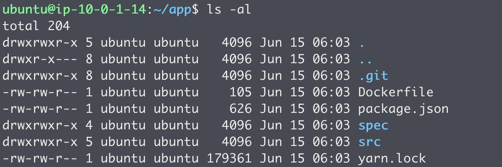
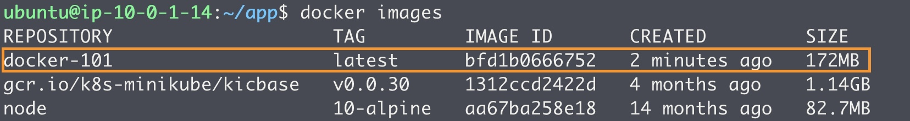
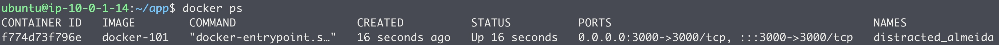

## [Hands-on] 01. Docker intro

첫 번째 실습입니다.  
그냥 일단 무작정 따라해보세요.  
자세한건 천천히 알아볼게요.  


이번 과정에서 사용할 샘플 애플리케이션인 ToDo List Manager 입니다.  
할 일 목록(Item)을 등록하고 관리할 수 있는 간단한 애플리케이션입니다.

---

먼저 필요한 소스코드를 Github에서 다운로드 합니다.  
```bash
git clone https://github.com/JungSangup/todo_list_manager.git app
```
소스코드 준비가 됐으면 `app` 디렉토리로 이동합니다.
```bash
cd app
```
어떤 파일들이 있는지 보려면
```bash
ls -al
```
명령어를 실행해보세요.


---

이제 샘플 애플리케이션을 컨테이너 이미지로 만들어 보겠습니다.  
​
컨테이너 이미지가 뭔지 모르셔도 됩니다.
우선 따라와보세요.

아래 명령어는 도커 이미지를 만드는(build) 명령어 입니다.
```bash
docker build --tag docker-101 .
```
터미널을 보면 뭔가 열심히 만드는 것 같네요.
다운로드도 하고, COPY도 하고, install도 하고...
​
이제 잘 만들어졌는지 볼까요?
현재 있는 이미지를 조회하는 명령어입니다.
```bash
docker images
```
아래 그림처럼 docker-101 이 보이면 성공입니다. ٩(ˊᗜˋ*)و



---

이제 샘플 애플리케이션을 실행해 보겠습니다.
​
앞에서는 컨테이너 이미지를 만들었습니다.
이번에는 이 이미지를 실제 컨테이너로 실행(run)해 보겠습니다.
실행하는 명령어는 다음과 같습니다.
```bash
docker run --detach --publish 3000:3000 docker-101
```
잘 실행되고 있는지 볼까요?
```bash
docker ps
```
아래 그림처럼 docker-101 이 보이면 정상입니다.

​
이제 실행된 애플리케이션에 접속해볼까요?
실행된 Host의 3000번 포트로 접속하면 됩니다.

- `AWS EC2인 경우 인스턴스의 Public IPv4 address로 접속하면 됩니다.`

---
​


여러분의 ToDo List Manager 애플리케이션이 잘 동작하나요?
오늘 할 일을 한 번 추가해 보세요.

축하합니다!!! (ง˙∇˙)ว

여러분은 방금 10분만에 뚝딱 시스템 구축을 마쳤습니다.