<br>

# Contents

<br>

- **VM Instance 만들기**
- **VM Instance 접속하기**
- **Docker 설치하기**
- **Git clone하기 (실습파일 다운로드)**

---

## VM Instance 만들기

실습을 위한 환경구성을 진행합니다.

먼저 AWS Console에 로그인합니다.
[https://aws.amazon.com/console/](https://aws.amazon.com/console/)


화면 우측 상단의 `Sign in to the Console`을 클릭합니다.

---


**Account ID**와 **IAM user name**을 이용해서 `sign in` 합니다.


[MFA](https://docs.aws.amazon.com/ko_kr/singlesignon/latest/userguide/enable-mfa.html) 구성을 한 경우, 위 그림과 같은 화면에서 MFA Code를 입력해야 합니다.

---


Sign in 후에는 가장 먼저 어느 **Region**에 VM Instance를 구성할지 결정해야 합니다.
우측 상단 Region 선택 메뉴에서 Region을 선택합니다.

<br>

- 반(별로 정해진 **Region**이 있습니다. 확인 후 진행해주세요.

---

이제 EC2 Instance를 만들어 보겠습니다.


**서비스** 중에서 **EC2**를 검색하고 이동합니다.

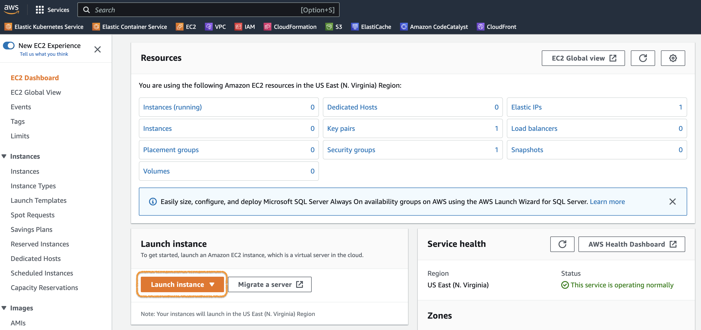
**EC2 dashboard** 화면에서 `Launch instance`버튼을 클릭합니다.

---

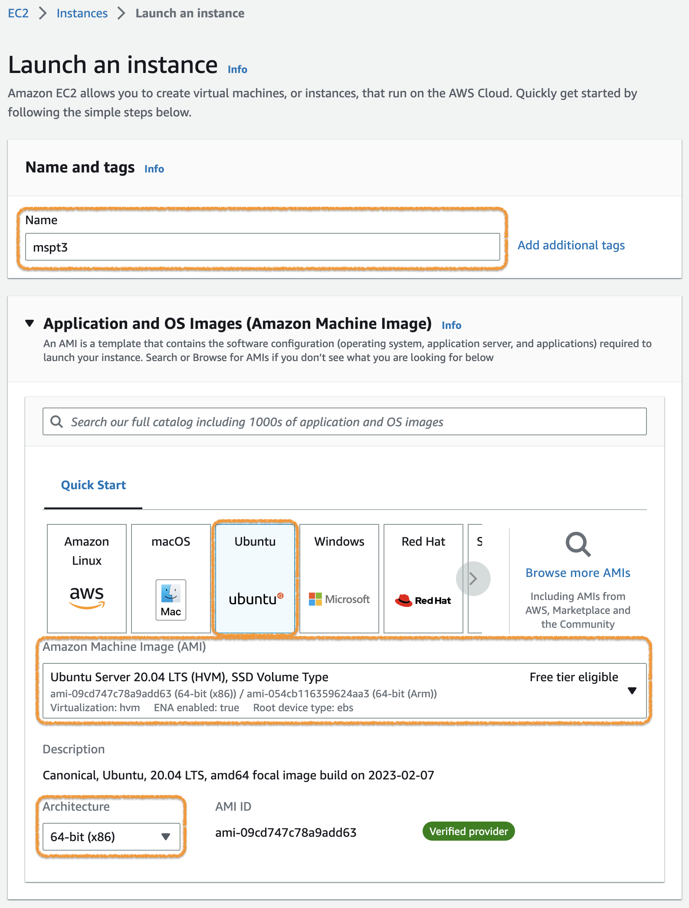
Instance 이름을 **mspt3**로 하고, **AMI(Amazon Machine Image)** 중에서 **Ubuntu**를 선택합니다.


그 다음 Instance type은 `t3.medium`을 선택합니다.

---

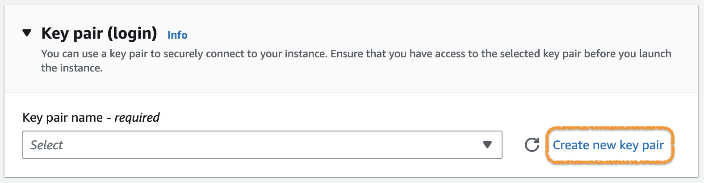
**Key pair**는 기존의 것을 사용하거나, 없는 경우에는 `Create new key pair`를 눌러 **Key pair** 생성 화면으로 이동합니다.

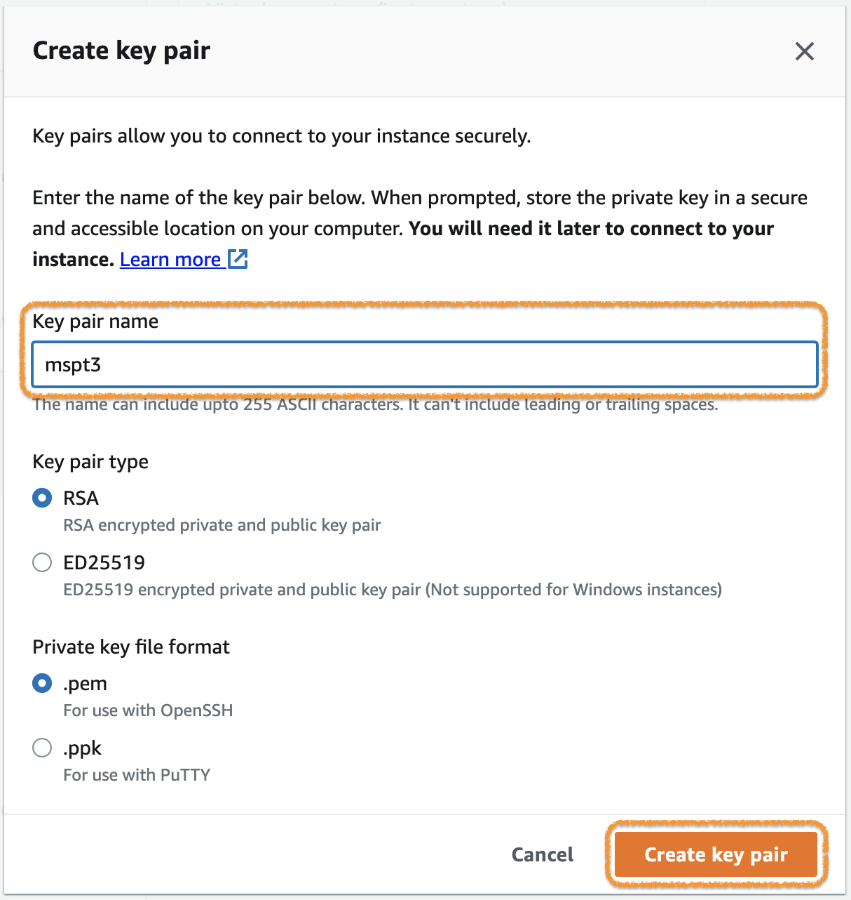
신규 생성이 필요한 경우 Key pair name에 **mspt3**를 입력하고,  **RSA** type과 **.pem** format 선택 후 `Create key pair`버튼을 클릭합니다.

> 생성되면 브라우저를 통해서 **mspt3.pem** 파일이 다운로드 됩니다. 잘 보관해두세요.

---

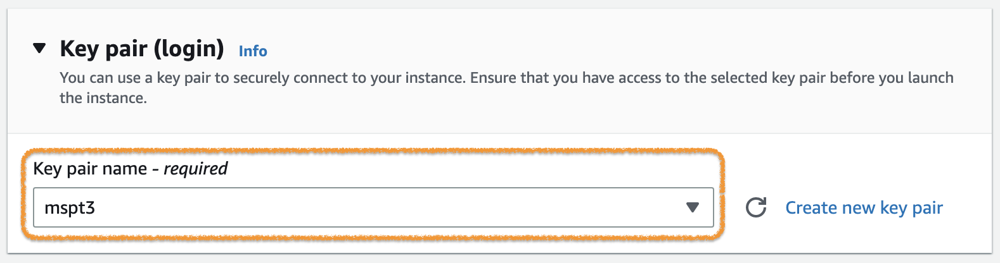
다시 Instance 생성 화면으로 돌아오면, 앞에서 생성한 **Key pair**를 선택할 수 있습니다.

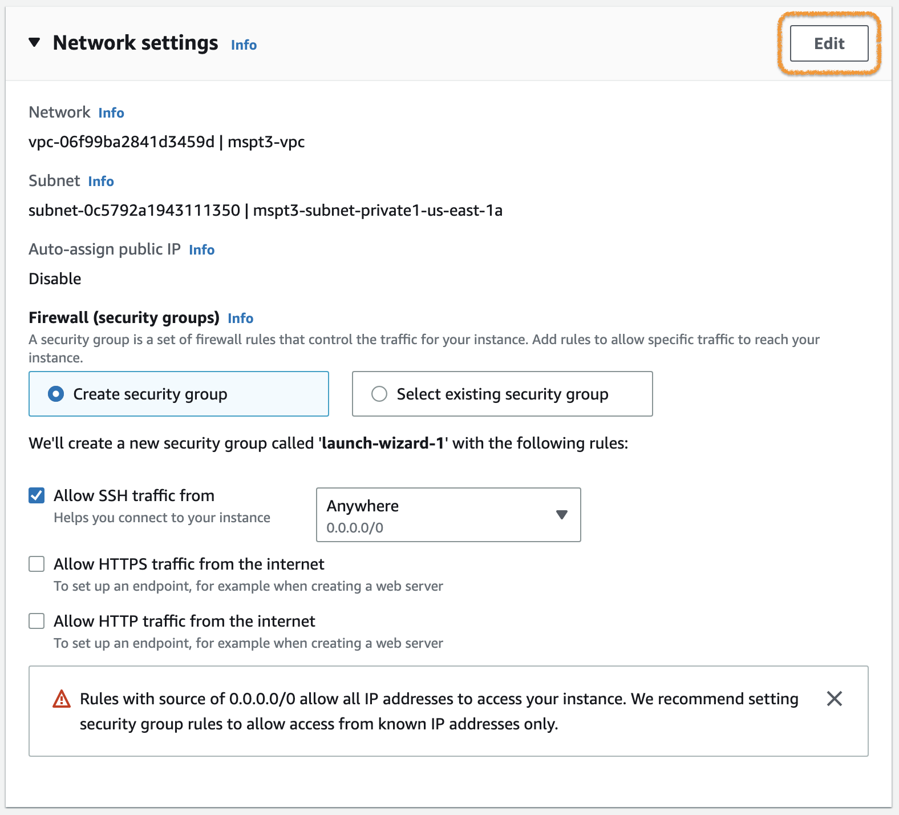
그 다음 Network settings에서 `Edit`버튼을 클릭하여 상세 설정을 진행합니다.

---

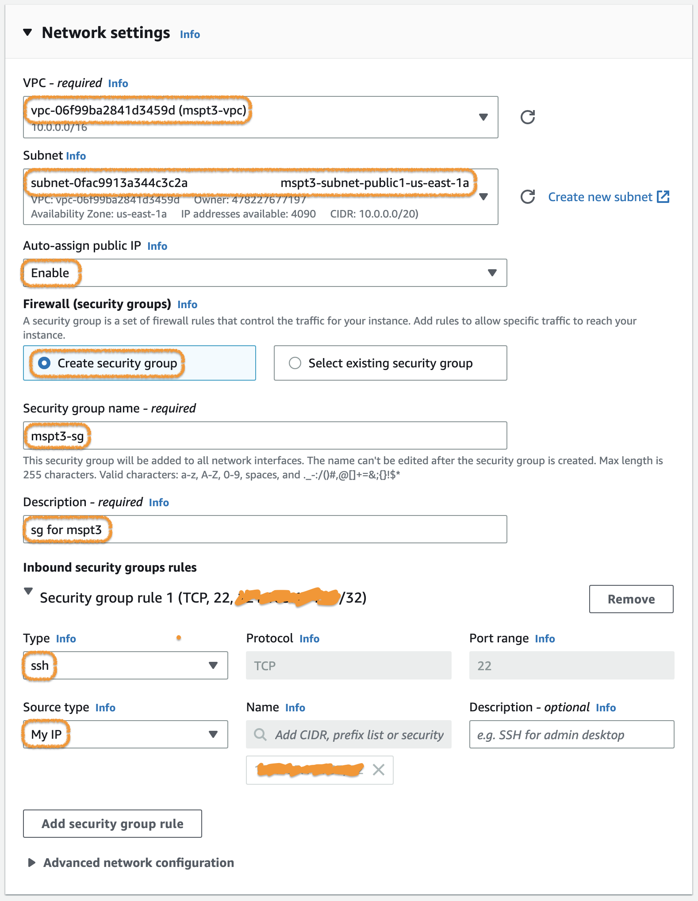
위 그림과 같이 입력합니다. (상세 내용은 다음페이지에 있습니다.)

---

### Network 구성 (Network Settings)

| **구분**                            | **설정**                          |
| --------------------------------- | --------------------------------- |
| **VPC**                           | default VPC를 선택                  |
| **Subnet**                        | subnet 중 하나를 선택 (public subnet) |
| **Auto-assign public IP**         | Enable                            |
| **Firewall (security groups)**    | Create security group             |
| **Security group name**           | mspt3-sg                          |
| **Description**                   | sg for mspt3                      |
| **Inbound security groups rules** | ssh (TCP,22) , My IP              |

> Security group은 우선 꼭 필요한 ssh (TCP,22) 만 My IP로 설정합니다. (이후에 추가로 설정합니다.)

---

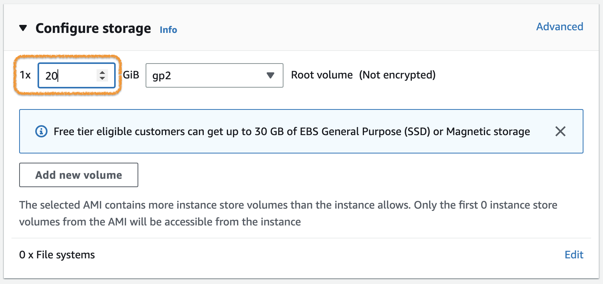
Storage를 20GiB로 설정합니다.

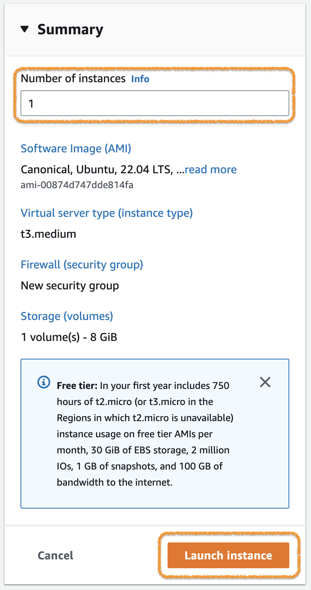
Number of instances를 1로 하고 `Launch instance`버튼을 클릭합니다.

---

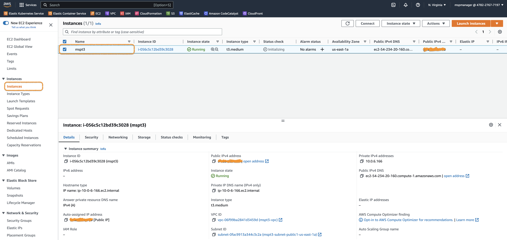
정상적으로 EC2 Instance가 생성되면 화면과 같이 표시됩니다.

> SSH 접속을 위해 필요한 **Public IPv4 address** 또는 **Public IPv4 DNS** 정보를 기록해둡니다.

---

과정중에는 SSH를 이용한 Instance 접속 외에도, 실행되는 애플리케이션 접속도 필요합니다.
애플리케이션 접속을 위해서 추가적인 Security group 설정을 진행합니다.


위와같이 EC2 Instance의 **Security** 탭에서 해당 **Security group**으로 이동합니다. (Security group명 옆의 아이콘 클릭)

---


Serurity group화면의 Inbound rules 탭에서 `Edit inbound rules` 버튼을 클릭합니다.

---

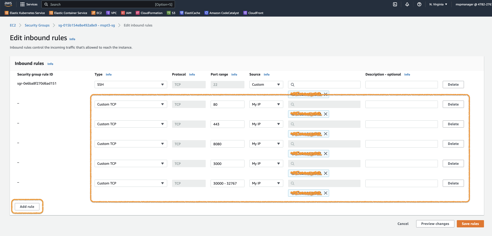
`Add rule` 버튼을 누르면 규칙을 추가할 수 있습니다. 아래 규칙을 추가해주세요.

| **Type**   | **Port range** | Source |
| ---------- | -------------- | ------ |
| Custom TCP | 80             | My IP  |
| Custom TCP | 443            | My IP  |
| Custom TCP | 8080           | My IP  |
| Custom TCP | 3000           | My IP  |
| Custom TCP | 30000-32767    | My IP  |

---

## VM Instance 접속하기

생성된 VM Instance의 접속(SSH)은 다음의 방법 중 하나를 사용하면 됩니다.

- **[접속방법1]** Terminal 프로그램 (e.g. PowerShell, cmder, iTerm, etc.)
- **[접속방법2]** MobaXterm

SSH 접속을 위해서는 다음을 먼저 확인해야 합니다.

- VM Instance의 **Public IPv4 address** 또는 **Public IPv4 DNS**
- Key pair (**mspt3.pem** 파일)
- SSH 접속을 위한 Inbound traffic (Port:22) 이 허용되어 있는지 확인 (앞에서 이미 진행함.)

준비가 됐으면 **[접속방법1]** 또는 **[접속방법2]** 중 하나를 선택하고 해당부분으로 이동하세요.

<br><br><br><br><br><br><br>

> 다양한 접속방법에 대한 자세한 설명은 AWS 문서인 [Linux 인스턴스에 연결합니다](https://docs.aws.amazon.com/ko_kr/AWSEC2/latest/UserGuide/AccessingInstances.html)를 참고하세요.

---

**[접속방법1]** Terminal 프로그램
기본적인 터미널 프로그램을 사용한 접속방법 입니다.

OS마다 제공되는 기본 툴을 사용해도 되고, 별도로 설치해서 사용해도 됩니다.
윈도우즈인 경우 [Windows Terminal](https://apps.microsoft.com/store/detail/windows-terminal/9N0DX20HK701?hl=ko-kr&gl=kr&rtc=1)를 사용하면 여러가지 기능을 사용할 수 있어 편리합니다. (선택사항)

AWS Console에서 EC2 > Instances 화면으로 이동합니다.

접속하려는 EC2 Instance를 선택하고, `Connect`버튼을 클릭합니다.

---

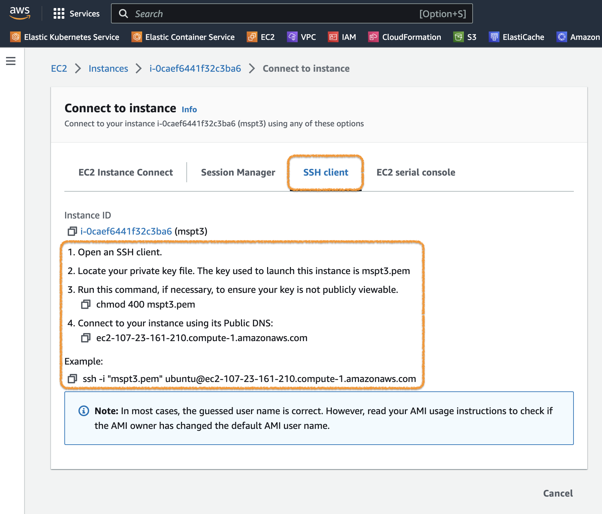
위 그림과 같이 **Connect to instance** 화면에서 **SSH client** 탭을 클릭하고, 아래 표시되는 절차에 따라 접속을 진행합니다.

> 윈도우즈 환경에서는 3번 절차 (chomod 400 mspt3.pem)를 진행할 수 없습니다. 다음장의 내용을 참고하세요.

---

(윈도우즈 환경인 경우 3번 절차 처리방법)
터미널 프로그램(e.g. PowerShell)에서 다음과 같이 실행합니다.

```shell
> icacls.exe mspt3.pem /reset
처리된 파일: mspt3.pem
1 파일을 처리했으며 0 파일은 처리하지 못했습니다.
> icacls.exe mspt3.pem /GRANT:R "$($env:USERNAME):(R)"
처리된 파일: mspt3.pem
1 파일을 처리했으며 0 파일은 처리하지 못했습니다.
> icacls.exe mspt3.pem /inheritance:r
처리된 파일: mspt3.pem
1 파일을 처리했으며 0 파일은 처리하지 못했습니다.
```

> **명령어** : `icacls.exe mspt3.pem /reset`
> **명령어** : `icacls.exe mspt3.pem /GRANT:R "$($env:USERNAME):(R)"`
> **명령어** : `icacls.exe mspt3.pem /inheritance:r`

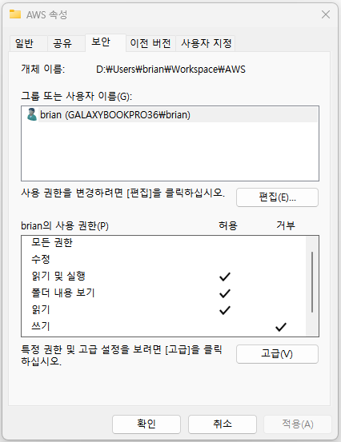 그림과 같이 mspt3.pem 파일의 권한을 변경하는 것입니다.

> 자세한 내용은은 [오류: 보호되지 않는 프라이빗 키 파일](https://docs.aws.amazon.com/ko_kr/AWSEC2/latest/UserGuide/TroubleshootingInstancesConnecting.html#troubleshoot-unprotected-key)의 내용을 참고하세요.

---

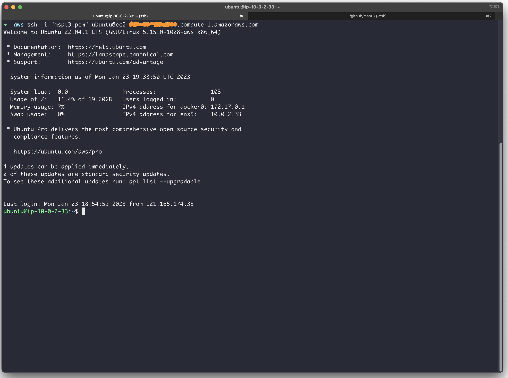
필요한 모든 절차를 거치고 정상적으로 접속되면 위와같은 화면이 표시됩니다.

---

**[접속방법2]**  MobaXterm
MobaXterm을 이용하여 VM Instance에 접속하는 방법입니다.


MobaXterm을 실행하고 `Session` 버튼을 클릭합니다.

---


접속방식은 `SSH`를 선택하고 다음 정보를 입력한 다음 `OK`버튼을 클릭하여 접속합니다.

- **Remote host** : EC2 Instance의 **Public IPv4 address** 또는 **Public IPv4 DNS**
- **Specify username** : ubuntu
- **Use private key** : mspt3.pem

---


접속되면 위와같은 화면이 표시됩니다.
다음 번 접속부터는 **Quick connect**의 **User session**을 이용할 수 있습니다.

---

## Docker 설치하기

실습을 위해서 Docker 설치를 진행합니다.
설치하는 방법은 아래 두 가지 방법이 있습니다.

- [Docker Desktop](https://docs.docker.com/desktop/) : One-click-install application for your Mac, Linux, or Windows
- [Docker Engine](https://docs.docker.com/engine/) : Open source containerization platform

우리 실습에는 앞에서 만든 **Ubuntu linux**에 **Docker Engine**을 설치해서 진행하도록 하겠습니다.

> 설치를 위해서는 [OS requirements](https://docs.docker.com/engine/install/ubuntu/#os-requirements)를 만족하는 조건이어야 합니다.
> 우리가 만든 환경은 이 조건에 맞는 **Ubuntu 22.04(LTS)** 64bit 버젼 입니다.

### [Uninstall old versions](https://docs.docker.com/engine/install/ubuntu/#uninstall-old-versions)

기존에 설치된 버젼이 있거나 다시 설치를 진행하려고 하는 경우 먼저 기존버젼 삭제를 진행합니다.
처음 설치를 하는 경우라면, 생략하고 다음 단계를 진행합니다.

```bash
ubuntu@ip-10-0-2-33:~$ sudo apt-get remove docker docker-engine docker.io containerd runc
Reading package lists... Done
Building dependency tree... Done
Reading state information... Done
E: Unable to locate package docker-engine
```

> **명령어** : `sudo apt-get remove docker docker-engine docker.io containerd runc`

---

### [Install using the repository](https://docs.docker.com/engine/install/ubuntu/#install-using-the-repository)

Ubuntu의 [Advanced Packaging Tool (APT)](https://ubuntu.com/server/docs/package-management)를 이용해서 설치를 진행합니다.

먼저 package index를 업데이트 합니다.

```bash
ubuntu@ip-10-0-2-33:~$ sudo apt-get update
Hit:1 http://us-east-1.ec2.archive.ubuntu.com/ubuntu jammy InRelease
Get:2 http://us-east-1.ec2.archive.ubuntu.com/ubuntu jammy-updates InRelease [114 kB]
Get:3 http://us-east-1.ec2.archive.ubuntu.com/ubuntu jammy-backports InRelease [99.8 kB]
Get:4 http://security.ubuntu.com/ubuntu jammy-security InRelease [110 kB]
Get:5 http://us-east-1.ec2.archive.ubuntu.com/ubuntu jammy-updates/main amd64 Packages [831 kB]
Get:6 http://us-east-1.ec2.archive.ubuntu.com/ubuntu jammy-updates/restricted amd64 Packages [566 kB]
Get:7 http://us-east-1.ec2.archive.ubuntu.com/ubuntu jammy-updates/universe amd64 Packages [785 kB]
Fetched 2507 kB in 1s (3302 kB/s)
Reading package lists... Done
```

> **명령어** : `sudo apt-get update`

---

다음은, HTTPS를 이용하기 위해서 몇 가지 패키지를 설치합니다.

```bash
ubuntu@ip-10-0-2-33:~$ sudo apt-get install -y ca-certificates curl gnupg lsb-release
Reading package lists... Done
Building dependency tree... Done
Reading state information... Done
lsb-release is already the newest version (11.1.0ubuntu4).
lsb-release set to manually installed.
ca-certificates is already the newest version (20211016ubuntu0.22.04.1).
ca-certificates set to manually installed.
curl is already the newest version (7.81.0-1ubuntu1.7).
curl set to manually installed.
gnupg is already the newest version (2.2.27-3ubuntu2.1).
gnupg set to manually installed.
0 upgraded, 0 newly installed, 0 to remove and 3 not upgraded.
```

> **명령어** : `sudo apt-get install -y ca-certificates curl gnupg lsb-release`

Docker GPG key를 추가합니다.

```bash
ubuntu@ip-10-0-2-33:~$ sudo mkdir -p /etc/apt/keyrings
ubuntu@ip-10-0-2-33:~$ curl -fsSL https://download.docker.com/linux/ubuntu/gpg | sudo gpg --dearmor -o /etc/apt/keyrings/docker.gpg
```

> **명령어** : `sudo mkdir -p /etc/apt/keyrings`
> **명령어** : `curl -fsSL https://download.docker.com/linux/ubuntu/gpg | sudo gpg --dearmor -o /etc/apt/keyrings/docker.gpg`

---

Docker 설치를 위서 APT Repository를 설정합니다.

```bash
ubuntu@ip-10-0-2-33:~$ echo \
  "deb [arch=$(dpkg --print-architecture) signed-by=/etc/apt/keyrings/docker.gpg] https://download.docker.com/linux/ubuntu \
  $(lsb_release -cs) stable" | sudo tee /etc/apt/sources.list.d/docker.list > /dev/null
```

> **명령어** : `echo "deb [arch=$(dpkg --print-architecture) signed-by=/etc/apt/keyrings/docker.gpg] https://download.docker.com/linux/ubuntu $(lsb_release -cs) stable" | sudo tee /etc/apt/sources.list.d/docker.list > /dev/null`

다시 Package index를 업데이트 합니다.

```bash
ubuntu@ip-10-0-2-33:~$ sudo apt-get update
Hit:1 http://us-east-1.ec2.archive.ubuntu.com/ubuntu jammy InRelease
Get:2 http://us-east-1.ec2.archive.ubuntu.com/ubuntu jammy-updates InRelease [114 kB]
Get:3 http://us-east-1.ec2.archive.ubuntu.com/ubuntu jammy-backports InRelease [99.8 kB]
Get:4 https://download.docker.com/linux/ubuntu jammy InRelease [48.9 kB]
Get:5 http://security.ubuntu.com/ubuntu jammy-security InRelease [110 kB]
Get:6 https://download.docker.com/linux/ubuntu jammy/stable amd64 Packages [11.9 kB]
Fetched 385 kB in 1s (652 kB/s)
Reading package lists... Done
```

> **명령어** : `sudo apt-get update`

---

그리고, 마지막으로 Docker를 설치합니다.

```bash
ubuntu@ip-10-0-2-33:~$ sudo apt-get install -y docker-ce docker-ce-cli containerd.io docker-compose-plugin
Reading package lists... Done
Building dependency tree... Done
Reading state information... Done
The following additional packages will be installed:
  docker-ce-rootless-extras docker-scan-plugin libltdl7 libslirp0 pigz slirp4netns
Suggested packages:
  aufs-tools cgroupfs-mount | cgroup-lite
The following NEW packages will be installed:
  containerd.io docker-ce docker-ce-cli docker-ce-rootless-extras docker-compose-plugin docker-scan-plugin libltdl7 libslirp0 pigz slirp4netns
0 upgraded, 10 newly installed, 0 to remove and 3 not upgraded.
Need to get 113 MB of archives.
After this operation, 431 MB of additional disk space will be used.
Get:1 http://us-east-1.ec2.archive.ubuntu.com/ubuntu jammy/universe amd64 pigz amd64 2.6-1 [63.6 kB]
Get:2 http://us-east-1.ec2.archive.ubuntu.com/ubuntu jammy/main amd64 libltdl7 amd64 2.4.6-15build2 [39.6 kB]
Get:3 http://us-east-1.ec2.archive.ubuntu.com/ubuntu jammy/main amd64 libslirp0 amd64 4.6.1-1build1 [61.5 kB]
Get:4 http://us-east-1.ec2.archive.ubuntu.com/ubuntu jammy/universe amd64 slirp4netns amd64 1.0.1-2 [28.2 kB]
Get:5 https://download.docker.com/linux/ubuntu jammy/stable amd64 containerd.io amd64 1.6.15-1 [27.7 MB]
Get:6 https://download.docker.com/linux/ubuntu jammy/stable amd64 docker-ce-cli amd64 5:20.10.23~3-0~ubuntu-jammy [42.6 MB]
Get:7 https://download.docker.com/linux/ubuntu jammy/stable amd64 docker-ce amd64 5:20.10.23~3-0~ubuntu-jammy [20.5 MB]
Get:8 https://download.docker.com/linux/ubuntu jammy/stable amd64 docker-ce-rootless-extras amd64 5:20.10.23~3-0~ubuntu-jammy [8390 kB]
Get:9 https://download.docker.com/linux/ubuntu jammy/stable amd64 docker-compose-plugin amd64 2.15.1-1~ubuntu.22.04~jammy [9570 kB]
Get:10 https://download.docker.com/linux/ubuntu jammy/stable amd64 docker-scan-plugin amd64 0.23.0~ubuntu-jammy [3623 kB]
Fetched 113 MB in 1s (81.5 MB/s)

... 생략 ...
```

> **명령어** : `sudo apt-get install -y docker-ce docker-ce-cli containerd.io docker-compose-plugin`

---

설치 후 다음 설정을 진행합니다. ([Docker Engine post-installation steps](https://docs.docker.com/engine/install/linux-postinstall/))

Docker daemon은 root 유저로 동작하고, Docker CLI(/usr/bin/docker)는 root 그룹/계정 권한을 가지고 있습니다.

```bash
ubuntu@ip-10-0-2-33:~$ ps -ef | grep -i dockerd
root        9282       1  0 07:09 ?        00:00:00 /usr/bin/dockerd -H fd:// --containerd=/run/containerd/containerd.sock
ubuntu      9514    8611  0 07:18 pts/1    00:00:00 grep --color=auto -i dockerd
ubuntu@ip-10-0-2-33:~$ ls -al /usr/bin/docker
-rwxr-xr-x 1 root root 50717552 Jan 19 17:42 /usr/bin/docker
```

root가 아닌 계정(우리 실습환경의 user는 `ubuntu` 입니다.)을 이용하여 Docker CLI를 사용하기 위해서 다음과 같이 진행합니다.

먼저 `docker`그룹을 추가합니다.

```bash
ubuntu@ip-10-0-2-33:~$ sudo groupadd docker
```

> **명령어** : `sudo groupadd docker`
> 이미 docker 그룹이 있을수도 있습니다. (groupadd: group 'docker' already exists)

다음은 사용 중인 User(`ubuntu`)를 docker 그룹에 추가하고, 적용(docker 그룹으로 로그인)합니다.

```bash
ubuntu@ip-10-0-2-33:~$ sudo usermod -aG docker $USER
ubuntu@ip-10-0-2-33:~$ newgrp docker
```

> **명령어** : `sudo usermod -aG docker $USER`
> **명령어** : `newgrp docker`

---

모두 정상적으로 설치되고 설정된 경우 다음과 같이 동작해야 합니다.
한 번 테스트 해보세요.

```bash
ubuntu@ip-10-0-2-33:~$ docker run --rm hello-world
Unable to find image 'hello-world:latest' locally
latest: Pulling from library/hello-world
2db29710123e: Pull complete
Digest: sha256:aa0cc8055b82dc2509bed2e19b275c8f463506616377219d9642221ab53cf9fe
Status: Downloaded newer image for hello-world:latest

Hello from Docker!
This message shows that your installation appears to be working correctly.

To generate this message, Docker took the following steps:
 1. The Docker client contacted the Docker daemon.
 2. The Docker daemon pulled the "hello-world" image from the Docker Hub.
    (amd64)
 3. The Docker daemon created a new container from that image which runs the
    executable that produces the output you are currently reading.
 4. The Docker daemon streamed that output to the Docker client, which sent it
    to your terminal.

To try something more ambitious, you can run an Ubuntu container with:
 $ docker run -it ubuntu bash

Share images, automate workflows, and more with a free Docker ID:
 https://hub.docker.com/

For more examples and ideas, visit:
 https://docs.docker.com/get-started/
```

> **명령어** : `docker run --rm hello-world`

---

## Git clone하기 (실습파일 다운로드)
이후 진행되는 실습과정들에 사용되는 파일들을 다운로드 하겠습니다.

```bash
ubuntu@ip-10-0-2-33:~$ git clone https://github.com/JungSangup/mspt3.git
Cloning into 'mspt3'...
remote: Enumerating objects: 2715, done.
remote: Counting objects: 100% (362/362), done.
remote: Compressing objects: 100% (212/212), done.
remote: Total 2715 (delta 150), reused 360 (delta 148), pack-reused 2353
Receiving objects: 100% (2715/2715), 285.64 MiB | 40.88 MiB/s, done.
Resolving deltas: 100% (1530/1530), done.
```
> **명령어** : `git clone https://github.com/JungSangup/mspt3.git`

**hands_on_files** 디렉토리 아래에 실습에 필요한 파일들이 있습니다.
