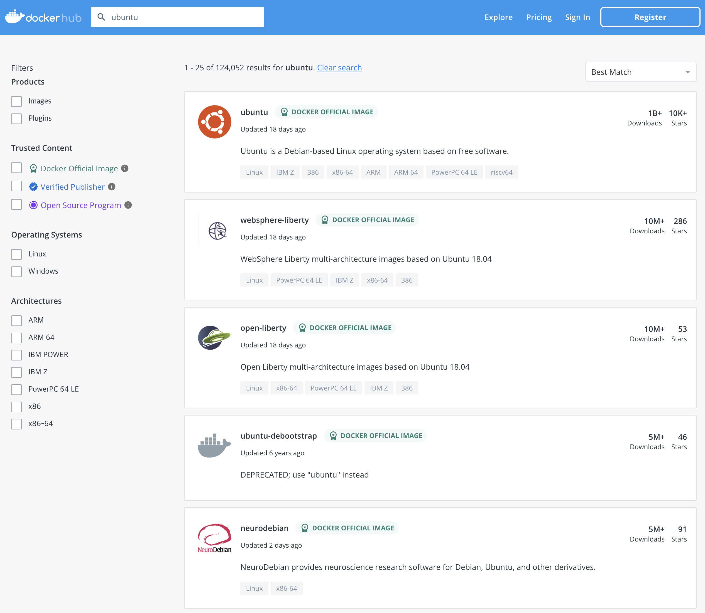
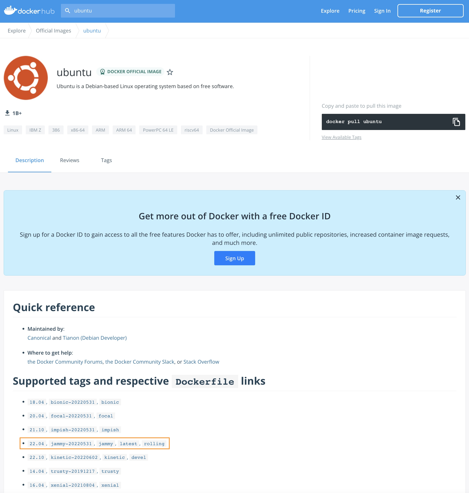
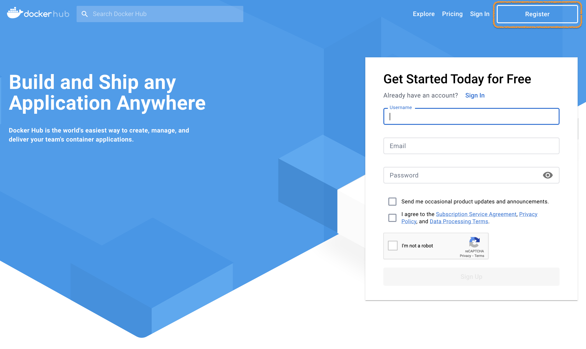
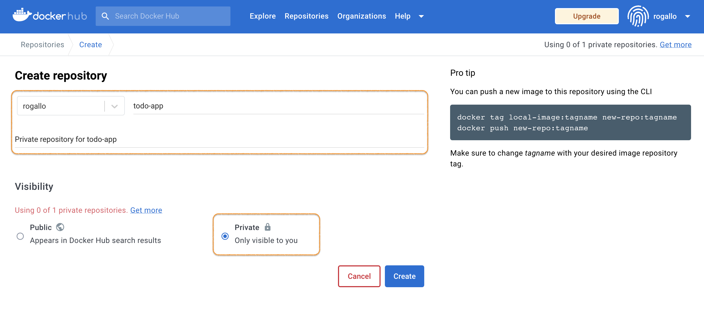
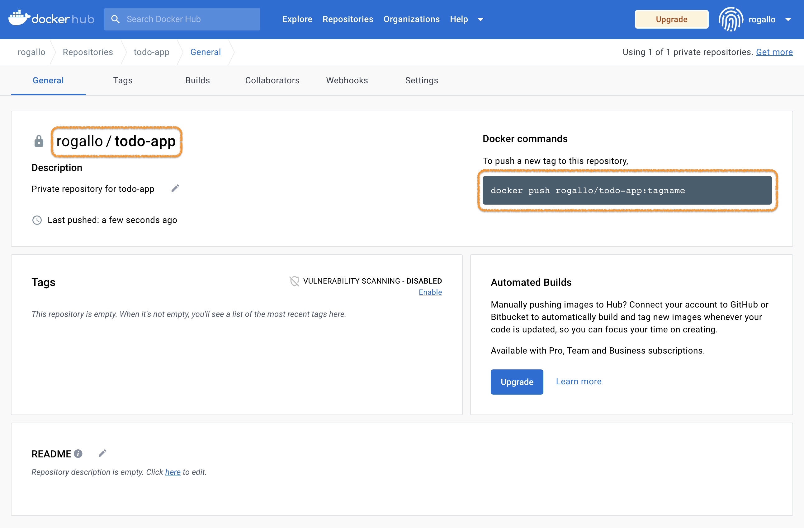
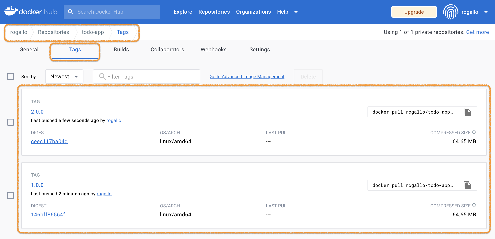

# [Hands-on] 02. Docker commands


<br>

# Contents

**[1. 이미지 검색하기](#1-이미지-검색하기)**  
**[2. 이미지 다운로드(Pull)하기](#2-이미지-다운로드pull하기)**  
**[3. 컨테이너 실행하기](#3-컨테이너-실행하기)**  
**[4. 이미지 업로드(Push)하기](#4-이미지-업로드push-하기)**  

---

<br>

## 1. 이미지 검색하기

자주 사용되는 도커 명령어를 알아보겠습니다.

도커 이미지를 검색하는 명령어는 `docker search`입니다.
도커허브에서 Ubuntu 이미지를 찾아볼까요?  
```bash
ubuntu@ip-172-31-23-60:~$ docker search ubuntu
NAME                             DESCRIPTION                                     STARS     OFFICIAL   AUTOMATED
ubuntu                           Ubuntu is a Debian-based Linux operating sys…   15577     [OK]
websphere-liberty                WebSphere Liberty multi-architecture images …   291       [OK]
ubuntu-upstart                   DEPRECATED, as is Upstart (find other proces…   112       [OK]
neurodebian                      NeuroDebian provides neuroscience research s…   98        [OK]
ubuntu/nginx                     Nginx, a high-performance reverse proxy & we…   75
open-liberty                     Open Liberty multi-architecture images based…   56        [OK]
ubuntu/apache2                   Apache, a secure & extensible open-source HT…   53
ubuntu-debootstrap               DEPRECATED; use "ubuntu" instead                50        [OK]
ubuntu/squid                     Squid is a caching proxy for the Web. Long-t…   50
ubuntu/bind9                     BIND 9 is a very flexible, full-featured DNS…   45
ubuntu/mysql                     MySQL open source fast, stable, multi-thread…   41
ubuntu/prometheus                Prometheus is a systems and service monitori…   35
ubuntu/postgres                  PostgreSQL is an open source object-relation…   23
ubuntu/kafka                     Apache Kafka, a distributed event streaming …   22
ubuntu/redis                     Redis, an open source key-value store. Long-…   16
ubuntu/prometheus-alertmanager   Alertmanager handles client alerts from Prom…   8
ubuntu/dotnet-deps               Chiselled Ubuntu for self-contained .NET & A…   6
ubuntu/grafana                   Grafana, a feature rich metrics dashboard & …   6
ubuntu/memcached                 Memcached, in-memory keyvalue store for smal…   5
ubuntu/zookeeper                 ZooKeeper maintains configuration informatio…   5
ubuntu/dotnet-runtime            Chiselled Ubuntu runtime image for .NET apps…   5
ubuntu/telegraf                  Telegraf collects, processes, aggregates & w…   4
ubuntu/cortex                    Cortex provides storage for Prometheus. Long…   3
ubuntu/dotnet-aspnet             Chiselled Ubuntu runtime image for ASP.NET a…   3
ubuntu/cassandra                 Cassandra, an open source NoSQL distributed …   2
```

> 💻 명령어
>```bash
>docker search ubuntu
>```

<br><br><br>

[https://hub.docker.com/](https://hub.docker.com/) 에서도 한번 검색을 해보세요.  
두 가지 결과가 어떤지 비교도 해보시구요.


<br><br><br><br><br>

## 2. 이미지 다운로드(Pull)하기

이제 **ubuntu** 이미지를 다운로드(**pull**) 해 보겠습니다.
```bash
ubuntu@ip-172-31-23-60:~$ docker pull ubuntu
Using default tag: latest
latest: Pulling from library/ubuntu
677076032cca: Pull complete
Digest: sha256:9a0bdde4188b896a372804be2384015e90e3f84906b750c1a53539b585fbbe7f
Status: Downloaded newer image for ubuntu:latest
docker.io/library/ubuntu:latest
```

> 💻 명령어
>```bash
>docker pull ubuntu
>```

<br><br><br>

**tag**를 특정해서(**18.04**) 다운로드도 해보구요.
```bash
ubuntu@ip-172-31-23-60:~$ docker pull ubuntu:18.04
18.04: Pulling from library/ubuntu
72d9f18d70f3: Pull complete
Digest: sha256:a3765b4d74747b5e9bdd03205b3fbc4fa19a02781c185f97f24c8f4f84ed7bbf
Status: Downloaded newer image for ubuntu:18.04
docker.io/library/ubuntu:18.04
```

> 💻 명령어
>```bash
>docker pull ubuntu:18.04
>```

<br><br><br>

받아온 이미지를 확인해볼까요?
```bash
ubuntu@ip-172-31-23-60:~$ docker images ubuntu
REPOSITORY   TAG       IMAGE ID       CREATED       SIZE
ubuntu       18.04     5d2df19066ac   2 weeks ago   63.1MB
ubuntu       latest    58db3edaf2be   2 weeks ago   77.8MB
```

> 💻 명령어
>```bash
>docker images ubuntu
>```

**tag**를 명시하지 않은 경우는 default tag인 `latest`를 받아오네요.  

<br><br><br><br><br>

## 3. 컨테이너 실행하기

이제 실행(**run**)을 해보겠습니다.
```bash
ubuntu@ip-172-31-23-60:~/app$ docker run --interactive --tty --name my-ubuntu1 ubuntu /bin/bash
root@d68fe3ec9f65:/#
```

> 💻 명령어
>```bash
>docker run --interactive --tty --name my-ubuntu1 ubuntu /bin/bash
>```

`--interactive --tty` 는 `-it`로 줄여서 쓸 수도 있습니다.  
`--interactive --tty (-it)`  로 실행했기 때문에 ubuntu의 bash shell에 콘솔로 연결되었습니다. (프롬프트 확인!)

<br><br><br>

실행된 ubuntu의 OS 정보를 확인 해볼까요?
```bash
root@5229efb2bd11:/# cat /etc/os-release
PRETTY_NAME="Ubuntu 22.04.1 LTS"
NAME="Ubuntu"
VERSION_ID="22.04"
VERSION="22.04.1 LTS (Jammy Jellyfish)"
VERSION_CODENAME=jammy
ID=ubuntu
ID_LIKE=debian
HOME_URL="https://www.ubuntu.com/"
SUPPORT_URL="https://help.ubuntu.com/"
BUG_REPORT_URL="https://bugs.launchpad.net/ubuntu/"
PRIVACY_POLICY_URL="https://www.ubuntu.com/legal/terms-and-policies/privacy-policy"
UBUNTU_CODENAME=jammy
```

> 💻 명령어
>```bash
>cat /etc/os-release
>```

<br><br><br>

**Ubuntu 22.04 LTS**로 실행된 것을 확인할 수 있습니다. (실행한 시기에 따라 달라질 수 있습니다.)

이제 `exit` 명령어로 컨테이너를 빠져나오겠습니다.
```bash
root@5229efb2bd11:/# exit
exit
ubuntu@ip-172-31-23-60:~$
```

> 💻 명령어
>```bash
>exit
>```

* 참고 : `exit`는 컨테이너를 **stop**합니다. **stop**하지 않고 detach만 하기 위해서는 `ctrl-p` + `ctrl-q` 를 이용하면 됩니다.
* detach한 경우는 [docker attach](https://docs.docker.com/engine/reference/commandline/attach/) 명령어를 이용하여 다시 접속할 수 있습니다.

<br><br><br>

이번에는 `ubuntu:18.04`를 실행해봅시다.
```bash
ubuntu@ip-172-31-23-60:~/app$ docker run --interactive --tty --name my-ubuntu2 ubuntu:18.04 /bin/bash
root@cac6c7cab1f9:/#
```

> 💻 명령어
>```bash
>docker run --interactive --tty --name my-ubuntu2 ubuntu:18.04 /bin/bash
>```

<br><br><br>

좀전과는 다르게 `tag(18.04)`를 명시해서 실행했습니다.

`cat /etc/os-release`의 결과는 어떻게 나올까요?
```bash
root@69a29fac3bd8:/# cat /etc/os-release
NAME="Ubuntu"
VERSION="18.04.6 LTS (Bionic Beaver)"
ID=ubuntu
ID_LIKE=debian
PRETTY_NAME="Ubuntu 18.04.6 LTS"
VERSION_ID="18.04"
HOME_URL="https://www.ubuntu.com/"
SUPPORT_URL="https://help.ubuntu.com/"
BUG_REPORT_URL="https://bugs.launchpad.net/ubuntu/"
PRIVACY_POLICY_URL="https://www.ubuntu.com/legal/terms-and-policies/privacy-policy"
VERSION_CODENAME=bionic
UBUNTU_CODENAME=bionic
```

> 💻 명령어
>```bash
>cat /etc/os-release
>```

둘의 차이를 찾으셨나요?   ಠ_ಠ   (힌트 : VERSION)

<br><br><br>

[https://hub.docker.com/_/ubuntu](https://hub.docker.com/_/ubuntu) 를 보시면, 어떤 tag가 latest인지 알 수 있습니다.



<br>

이제 `exit` 명령어로 컨테이너에서 나와주세요.
```bash
root@69a29fac3bd8:/# exit
exit
ubuntu@ip-172-31-23-60:~$
```

> 💻 명령어
>```bash
>exit
>```

<br><br><br>

이번엔 다른 방법(`--detach`)으로 실행해 보겠습니다. (다른 이미지를 사용합니다.)
```bash
ubuntu@ip-172-31-23-60:~/app$ docker run --detach --name my-nginx --publish 8080:80 nginx
Unable to find image 'nginx:latest' locally
latest: Pulling from library/nginx
bb263680fed1: Pull complete
258f176fd226: Pull complete
a0bc35e70773: Pull complete
077b9569ff86: Pull complete
3082a16f3b61: Pull complete
7e9b29976cce: Pull complete
Digest: sha256:6650513efd1d27c1f8a5351cbd33edf85cc7e0d9d0fcb4ffb23d8fa89b601ba8
Status: Downloaded newer image for nginx:latest
2fc9e3a49e91f4d8ba07ea2dc80a9ee79260354d97b44486333f6661867f8c26
ubuntu@ip-172-31-23-60:~/app$
```

> 💻 명령어
>```bash
>docker run --detach --name my-nginx --publish 8080:80 nginx
>```

이전에 `--interactive` 옵션을 적용했을때와는 달리, 프롬프트가 그대로 있네요.

<br><br><br>

이제 `docker ps --all` 명령어로 컨테이너 목록을 조회해보세요.
```bash
ubuntu@ip-172-31-23-60:~/app$ docker ps --all
CONTAINER ID   IMAGE          COMMAND                  CREATED              STATUS                          PORTS                                   NAMES
2fc9e3a49e91   nginx          "/docker-entrypoint.…"   45 seconds ago       Up 44 seconds                   0.0.0.0:8080->80/tcp, :::8080->80/tcp   my-nginx
cac6c7cab1f9   ubuntu:18.04   "/bin/bash"              About a minute ago   Exited (0) About a minute ago                                           my-ubuntu2
d68fe3ec9f65   ubuntu         "/bin/bash"              2 minutes ago        Exited (0) About a minute ago                                           my-ubuntu1
```

> 💻 명령어
>```bash
>docker ps --all
>```

이전에 실행했던 ubuntu와 nginx가 보일거예요.  
ubuntu는 **Exited** 상태이고, nginx는 **Running** 상태 입니다.

<br><br><br>

nginx가 정말 Running 상태인지 8080번 포트로 접속해서 확인도 해보세요.
- 실습환경이 AWS인 경우
  - EC2 인스턴스의 **Public IPv4 address**로 접속합니다. (e.g. http://[Public IPv4 address]:8080/)
  - Security group의 Inbound rule에 8080번 포트에 대한 규칙이 있어야 합니다.
- 실습환경이 SCP인 경우
  - Virtual Server의 **NAT IP**로 접속하면 됩니다. (e.g. http://[NAT IP]:8080/)
  - Firewall과 Security group의 Inbound rule에 8080번 포트에 대한 규칙이 있어야 합니다.


<br><br><br>

이번엔 `docker stop` 명령어로 nginx 컨테이너를 멈춰봅시다.
```bash
ubuntu@ip-172-31-23-60:~/app$ docker stop $(docker ps --filter "name=my-nginx" --quiet)
2fc9e3a49e91
```

> 💻 명령어
>```bash
>docker stop $(docker ps --filter "name=my-nginx" --quiet)
>```

<br>

`docker ps --all`로 상태도 확인해보시고, 8080번 포트로 접속이 되는지 확인도 해보세요.
```bash
ubuntu@ip-172-31-23-60:~/app$ docker ps --all
CONTAINER ID   IMAGE          COMMAND                  CREATED              STATUS                          PORTS     NAMES
2fc9e3a49e91   nginx          "/docker-entrypoint.…"   About a minute ago   Exited (0) 18 seconds ago                 my-nginx
cac6c7cab1f9   ubuntu:18.04   "/bin/bash"              2 minutes ago        Exited (0) About a minute ago             my-ubuntu2
d68fe3ec9f65   ubuntu         "/bin/bash"              3 minutes ago        Exited (0) 2 minutes ago                  my-ubuntu1
```

> 💻 명령어
>```bash
>docker ps --all
>```
- `Exited` 상태인 컨테이너는 `--all (-a)` 옵션을 적용해야 조회가 됩니다.

 `docker start` 와 `docker restart` 는 직접 명령어를 만들어서 한번 해보세요.

<br><br><br><br><br>

## 4. 이미지 업로드(Push) 하기

이제 **도커 레지스트리**에 대해 알아보고, 우리가 만든 애플리케이션을 등록해 보겠습니다.

먼저 [https://hub.docker.com/](https://hub.docker.com/) 에 가입(**Register**)을 합니다.

`Register`를 클릭하고, Docker account를 하나 만듭니다. (이미 있으면 있는 Account를 사용해도 됩니다.)

<br><br><br>

이제 실습을 위해서 **Repository**를 하나 생성합니다.  
로그인 후 `Create Repository` 버튼을 클릭해서 시작하면 됩니다.  
이름은 **todo-app** 으로 하고, Visibility는 **Private**으로 합니다.


> 무료 계정인 경우 Private repository는 하나만 만들 수 있습니다.
> 이미 사용중인 Private repository가 있으면, Public으로 만들어도 됩니다.

<br><br><br>

이제 여러분의 Docker repository가 하나 생겼습니다.
앞으로 이 곳에 여러분의 컨테이너 이미지를 저장하고 사용하면 됩니다.


> `[USER-NAME]/[REPOSITORY-NAME]` 이 여러분의 Repository 입니다. (e.g. `rogallo/todo-app`)

<br><br><br>

샘플 애플리케이션 이미지를 만들어 볼까요?  
먼저 소스코드를 Github에서 clone 합니다.
```bash
ubuntu@ip-172-31-23-60:~$ git clone https://github.com/JungSangup/todo_list_manager.git app
Cloning into 'app'...
remote: Enumerating objects: 131, done.
remote: Counting objects: 100% (131/131), done.
remote: Compressing objects: 100% (123/123), done.
remote: Total 131 (delta 51), reused 53 (delta 7), pack-reused 0
Receiving objects: 100% (131/131), 1.68 MiB | 24.63 MiB/s, done.
Resolving deltas: 100% (51/51), done.
```

> 💻 명령어
>```bash
>git clone https://github.com/JungSangup/todo_list_manager.git app
>```

<br><br><br>

그리고, 소스코드가 있는 경로로 이동합니다.
```bash
ubuntu@ip-172-31-23-60:~$ cd app
ubuntu@ip-172-31-23-60:~/app$
```

> 💻 명령어
>```bash
>cd app
>```

<br><br><br>

샘플 소스코드에는 두 개의 Tag가 있습니다.
```bash
ubuntu@ip-172-31-23-60:~/app$ git tag
v1.0.0
v2.0.0
```

> 💻 명령어
>```bash
>git tag
>```

<br><br><br>

먼저 v1.0.0 이미지를 만듭니다. (`docker build` 명령어을 이용합니다.)  
v1.0.0 tag로 checkout을 하구요,
```bash
ubuntu@ip-172-31-23-60:~/app$ git checkout v1.0.0
Note: switching to 'v1.0.0'.

You are in 'detached HEAD' state. You can look around, make experimental
changes and commit them, and you can discard any commits you make in this
state without impacting any branches by switching back to a branch.

If you want to create a new branch to retain commits you create, you may
do so (now or later) by using -c with the switch command. Example:

  git switch -c <new-branch-name>

Or undo this operation with:

  git switch -

Turn off this advice by setting config variable advice.detachedHead to false

HEAD is now at c7a54f7 .
```

> 💻 명령어
>```bash
>git checkout v1.0.0
>```

<br><br><br>

이제 Dockerfile을 이용해서 빌드를 합니다.
```bash
ubuntu@ip-172-31-23-60:~/app$ docker build -t rogallo/todo-app:1.0.0 .
Sending build context to Docker daemon  6.483MB
Step 1/5 : FROM node:10-alpine
10-alpine: Pulling from library/node
ddad3d7c1e96: Pull complete
de915e575d22: Pull complete
7150aa69525b: Pull complete
d7aa47be044e: Pull complete
Digest: sha256:dc98dac24efd4254f75976c40bce46944697a110d06ce7fa47e7268470cf2e28
Status: Downloaded newer image for node:10-alpine
 ---> aa67ba258e18
Step 2/5 : WORKDIR /app
 ---> Running in 8acf6accd870
Removing intermediate container 8acf6accd870
 ---> d63db0834be0
Step 3/5 : COPY . .
 ---> 58c34aafdf8f
Step 4/5 : RUN yarn install --production
 ---> Running in 86d59beb231e
yarn install v1.22.5
[1/4] Resolving packages...
[2/4] Fetching packages...
info fsevents@1.2.9: The platform "linux" is incompatible with this module.
info "fsevents@1.2.9" is an optional dependency and failed compatibility check. Excluding it from installation.
[3/4] Linking dependencies...
[4/4] Building fresh packages...
Done in 7.37s.
Removing intermediate container 86d59beb231e
 ---> f83bb9189656
Step 5/5 : CMD ["node", "/app/src/index.js"]
 ---> Running in 7e4c6cce23f8
Removing intermediate container 7e4c6cce23f8
 ---> df16f7f47728
Successfully built df16f7f47728
Successfully tagged rogallo/todo-app:1.0.0
```

> 💻 명령어
>```bash
>docker build -t [USER-NAME]/todo-app:1.0.0 .
>```
> [USER-NAME] 에는 여러분의 정보로 채워넣어 주세요.

<br><br><br>

이제 v2.0.0 이미지를 만듭니다.  
v2.0.0 tag로 checkout을 하구요,
```bash
ubuntu@ip-172-31-23-60:~/app$ git checkout v2.0.0
Previous HEAD position was c7a54f7 .
HEAD is now at d1c1aaf Update index.html
```

> 💻 명령어
>```bash
>git checkout v2.0.0
>```

<br><br><br>

Dockerfile을 이용해서 빌드를 합니다.
```bash
ubuntu@ip-172-31-23-60:~/app$ docker build -t rogallo/todo-app:2.0.0 .
Sending build context to Docker daemon  6.483MB
Step 1/5 : FROM node:10-alpine
 ---> aa67ba258e18
Step 2/5 : WORKDIR /app
 ---> Using cache
 ---> d63db0834be0
Step 3/5 : COPY . .
 ---> df9345ba8d5f
Step 4/5 : RUN yarn install --production
 ---> Running in 039e7f732624
yarn install v1.22.5
[1/4] Resolving packages...
[2/4] Fetching packages...
info fsevents@1.2.9: The platform "linux" is incompatible with this module.
info "fsevents@1.2.9" is an optional dependency and failed compatibility check. Excluding it from installation.
[3/4] Linking dependencies...
[4/4] Building fresh packages...
Done in 7.40s.
Removing intermediate container 039e7f732624
 ---> 69b3437c84a4
Step 5/5 : CMD ["node", "/app/src/index.js"]
 ---> Running in a3fa94d42b81
Removing intermediate container a3fa94d42b81
 ---> 7a79571ef432
Successfully built 7a79571ef432
Successfully tagged rogallo/todo-app:2.0.0
```

> 💻 명령어
>```bash
>docker build -t [USER-NAME]/todo-app:2.0.0 .
>```
> [USER-NAME] 에는 여러분의 정보로 채워넣어 주세요.

<br><br><br>

그리고, 만들어진 이미지를 확인합니다.
```bash
ubuntu@ip-172-31-23-60:~/app$ docker images rogallo/todo-app
REPOSITORY         TAG       IMAGE ID       CREATED          SIZE
rogallo/todo-app   2.0.0     7a79571ef432   56 seconds ago   172MB
rogallo/todo-app   1.0.0     df16f7f47728   2 minutes ago    172MB
```

> 💻 명령어
>```bash
>docker images [USER-NAME]/todo-app
>```
> [USER-NAME] 에는 여러분의 정보로 채워넣어 주세요.

<br><br><br>

이제 우리가 만든 이미지를 우리의 Docker hub repository에 업로드(push)해 보겠습니다.
먼저 로그인을 하구요,
```bash
ubuntu@ip-172-31-23-60:~/app$ docker login -u rogallo
Password:
WARNING! Your password will be stored unencrypted in /home/ubuntu/.docker/config.json.
Configure a credential helper to remove this warning. See
https://docs.docker.com/engine/reference/commandline/login/#credentials-store

Login Succeeded
```

> 💻 명령어
>```bash
>docker login -u [USER-NAME]
>```
> [USER-NAME] 에는 여러분의 정보로 채워넣어 주세요.  
> ❗ Password 입력 중에는 화면에 표시되지 않습니다. 정확히 타이핑 후 엔터키를 누르면 됩니다.

<br><br><br>

아래 명령어로 docker hub의 우리 repository에 업로드(push) 해볼까요?
```bash
ubuntu@ip-172-31-23-60:~/app$ docker push rogallo/todo-app:1.0.0
The push refers to repository [docker.io/rogallo/todo-app]
a07f0156c43d: Pushed
8c40db749504: Pushed
4efca0eb4778: Pushed
edff9ff691d5: Layer already exists
cbe4b9146f86: Layer already exists
a6524c5b12a6: Layer already exists
9a5d14f9f550: Layer already exists
1.0.0: digest: sha256:5cee6f196aa06a6ba00a1b7c40a0b674510cf9f931785d9491daaa31af0d9de1 size: 1787
```

> 💻 명령어
>```bash
>docker push [USER-NAME]/todo-app:1.0.0
>```
> [USER-NAME] 에는 여러분의 정보로 채워넣어 주세요.

<br><br><br>

똑 같은 방법으로 두 번재 이미지도 push합니다.
```bash
ubuntu@ip-172-31-23-60:~/app$ docker push rogallo/todo-app:2.0.0
The push refers to repository [docker.io/rogallo/todo-app]
ca2b6e73233e: Pushed
96fd2c585529: Pushed
4efca0eb4778: Layer already exists
edff9ff691d5: Layer already exists
cbe4b9146f86: Layer already exists
a6524c5b12a6: Layer already exists
9a5d14f9f550: Layer already exists
2.0.0: digest: sha256:13ba0a28f43b581d260611cd0ecb446eb5b1105334fb5bf9c86e08bbd66bfadb size: 1787
```

> 💻 명령어
>```bash
>docker push [USER-NAME]/todo-app:2.0.0
>```
> [USER-NAME] 에는 여러분의 정보로 채워넣어 주세요.

<br><br><br>

[https://hub.docker.com/](https://hub.docker.com/) 에 방금 push한 이미지가 잘 올라가 있나요?


> 위의 두 개 이미지는 뒤의 과정에서 계속 필요하니, 잘 준비해두세요.

<br><br><br>

축하합니다.  (๑˃̵ᴗ˂̵)و

이제 여러분들의 저장공간도 생겼고, 언제 어디서든 방금 올려둔 이미지를 이용해서 여러분의 샘플 애플리케이션을 실행할 수 있게 됐습니다.  

<br>

이번 실습은 여기까지 입니다.  
마지막으로 정리하고 마칠게요.
```bash
ubuntu@ip-172-31-23-60:~/app$ docker rm -f $(docker ps -a -f "name=my-nginx" -f "name=my-ubuntu1" -f "name=my-ubuntu2" -q)
2fc9e3a49e91
cac6c7cab1f9
d68fe3ec9f65
ubuntu@ip-172-31-23-60:~/app$ cd
ubuntu@ip-172-31-23-60:~$
```

> 💻 명령어
>```bash
>docker rm -f $(docker ps -a -f "name=my-nginx" -f "name=my-ubuntu1" -f "name=my-ubuntu2" -q)
>```
>```bash
>cd
>```

<br>

정리 후 상태는 아래와 같습니다.
```bash
ubuntu@ip-172-31-23-60:~$ docker ps --all
CONTAINER ID   IMAGE     COMMAND   CREATED   STATUS    PORTS     NAMES
ubuntu@ip-172-31-23-60:~$
```

> 💻 명령어
>```bash
>docker ps --all
>```

<br><br><br>

---

<br><br><br>

## 💿 Self Study

<br>

도커는 [Storage driver](https://docs.docker.com/storage/storagedriver/)를 이용해서 레이어로 이루어진 파일시스템을 관리합니다.  
우리가 설치한 도커환경의 **Storage driver**는 이렇게 알아볼 수 있습니다.

```bash
ubuntu@ip-172-31-23-60:~$ docker info | grep -i "storage driver"
 Storage Driver: overlay2
```

> 💻 명령어
>```bash
>docker info | grep -i "storage driver"
>```

**overlay2**라는 storage driver를 사용하고 있네요.  
더 자세한 건 [Docker storage drivers](https://docs.docker.com/storage/storagedriver/select-storage-driver/)를 참고하시구요.

<br><br><br>

우리가 관심을 가지고 볼 곳은 아래 디렉토리들 입니다.  
- /var/lib/docker/image/overlay2/layerdb/sha256
- /var/lib/docker/overlay2

> 위의 디렉토리들은 root권한이 있어야 접근/조회가 가능합니다. ([sudo](https://namu.wiki/w/sudo) 명령어 사용)

```bash
ubuntu@ip-172-31-23-60:~$ sudo tree -L 3 /var/lib/docker/image
/var/lib/docker/image
└── overlay2
    ├── distribution
    │   ├── diffid-by-digest
    │   └── v2metadata-by-diffid
    ├── imagedb
    │   ├── content
    │   └── metadata
    ├── layerdb
    │   ├── mounts
    │   ├── sha256
    │   └── tmp
    └── repositories.json

11 directories, 1 file

ubuntu@ip-172-31-23-60:~$ sudo tree -L 1 /var/lib/docker/overlay2
/var/lib/docker/overlay2
├── 06b8c67bb3e41e4a4c8f0bb4229dadf360cb689321c321e116b2c29ed1eb3999
├── 0730612fbb3bdad1e5adec146b404b3c943f2dd5c2005490777951b9d4a1aa15
... 생략 ...
├── f8a74a06069179b4c4388d7eb65ca8e1b213418c4bb1332fdbe9561b97743071
├── f90ae589f017fa9fbb25bd224019e494eee1e11ee779feac5eead5448e6ff769
├── fc2d48992ee0b4607df96c4b44f2f257148f9179dcc3c85ce3f94c61e25c0799
└── l

98 directories, 0 files
```

> 💻 명령어
>```bash
>sudo tree -L 3 /var/lib/docker/image
>```
>```bash
>sudo tree -L 1 /var/lib/docker/overlay2
>```

이제 아래 실습에서 위의 디렉토리에 있는 파일들이 무엇인지 좀 더 자세히 알아볼게요.

<br><br><br>

앞의 실습에서 내려받은 **Ubuntu:18.04** 이미지를 조금 더 자세히 볼까요?

```bash
ubuntu@ip-172-31-23-60:~$ docker image inspect ubuntu:18.04 --format "{{json .RootFS.Layers}}"
["sha256:b7e0fa7bfe7f9796f1268cca2e65a8bfb1e010277652cee9a9c9d077a83db3c4"]
```

> 💻 명령어
>```bash
>docker image inspect ubuntu:18.04 --format "{{json .RootFS.Layers}}"
>```
> `--format` 옵션은 [Format command and log output](https://docs.docker.com/config/formatting/)를 참고하세요.

<br>

**sha256:b7e0fa7bfe7f9796f1268cca2e65a8bfb1e010277652cee9a9c9d077a83db3c4**는 ubuntu:18.04 이미지의 **레이어 정보** 입니다.  
여러개의 레이어를 가진 이미지는 이 정보도 여러 개 표시됩니다.  
실습 결과는 교재와 다를 수도 있습니다.  

<br><br><br>

이제 레이어 데이터의 정보를 이용해서, 실제로 레이어의 파일들이 위치한 곳(디렉토리)을 알아보겠습니다.

레이어 정보 중 **cache-id**에는 레이어의 파일들이 저장된 위치정보(디렉토리명)를 가지고 있습니다.  
다음과 같이 조회하면 디렉토리명을 하나 확인할 수 있습니다.

```bash
ubuntu@ip-172-31-23-60:~$ sudo cat /var/lib/docker/image/overlay2/layerdb/sha256/b7e0fa7bfe7f9796f1268cca2e65a8bfb1e010277652cee9a9c9d077a83db3c4/cache-id
71fd236df50fd04938097606fb40b63897c7a591240de32dceede7b50b539474
```

> 💻 명령어
>```bash
>sudo cat /var/lib/docker/image/overlay2/layerdb/sha256/b7e0fa7bfe7f9796f1268cca2e65a8bfb1e010277652cee9a9c9d077a83db3c4/cache-id
>```
> 앞의 실행결과가 교재와 다르다면, 본인 실행결과의 SHA256 값을 사용하세요. ( b7... 대신 다른 값을 사용 )


**71fd236df50fd04938097606fb40b63897c7a591240de32dceede7b50b539474** 가 파일들이 저장되어 있는 위치(디렉토리) 입니다.  
이 결과는 실습환경에 따라 달라질 수 있습니다.

<br><br><br>

실제로 파일들이 위치하는 곳은 **/var/lib/docker/overlay2**아래에 있는 디렉토리들 입니다.  
앞에서 확인한 ubuntu:18.04 이미지는 아래와 같이 확인하면 됩니다.

```bash
ubuntu@ip-172-31-23-60:~$ sudo ls -al /var/lib/docker/overlay2/71fd236df50fd04938097606fb40b63897c7a591240de32dceede7b50b539474/diff
total 84
drwxr-xr-x 21 root root 4096 Apr 13 13:13 .
drwx--x---  3 root root 4096 Apr 13 13:13 ..
drwxr-xr-x  2 root root 4096 Mar  8 02:06 bin
drwxr-xr-x  2 root root 4096 Apr 24  2018 boot
drwxr-xr-x  2 root root 4096 Mar  8 02:06 dev
drwxr-xr-x 30 root root 4096 Mar  8 02:06 etc
drwxr-xr-x  2 root root 4096 Apr 24  2018 home
drwxr-xr-x  8 root root 4096 May 23  2017 lib
drwxr-xr-x  2 root root 4096 Mar  8 02:06 lib64
drwxr-xr-x  2 root root 4096 Mar  8 02:05 media
drwxr-xr-x  2 root root 4096 Mar  8 02:05 mnt
drwxr-xr-x  2 root root 4096 Mar  8 02:05 opt
drwxr-xr-x  2 root root 4096 Apr 24  2018 proc
drwx------  2 root root 4096 Mar  8 02:06 root
drwxr-xr-x  5 root root 4096 Mar  8 02:06 run
drwxr-xr-x  2 root root 4096 Mar  8 02:06 sbin
drwxr-xr-x  2 root root 4096 Mar  8 02:05 srv
drwxr-xr-x  2 root root 4096 Apr 24  2018 sys
drwxrwxrwt  2 root root 4096 Mar  8 02:06 tmp
drwxr-xr-x 10 root root 4096 Mar  8 02:05 usr
drwxr-xr-x 11 root root 4096 Mar  8 02:06 var
```

> 💻 명령어
>```bash
>sudo ls -al /var/lib/docker/overlay2/[DIR]/diff
>```
> [DIR]에는 앞의 명령어 실행결과를 넣어주세요. ( e.g. 71fd236df50fd04938097606fb40b63897c7a591240de32dceede7b50b539474 )

ubuntu:18.04는 하나의 레이어로 이루어져 있고, 그 안에는 위와같은 디렉토리와 파일들이 있습니다.

<br><br><br>

이제 저 ubuntu 이미지를 실행해서 컨테이너를 생성하고, 레이어들의 정보를 볼게요.  
같은 이미지를 사용해서 두 개의 컨테이너를 실행합니다. (my-ubuntu1, my-ubuntu2)

```bash
ubuntu@ip-172-31-23-60:~$ docker run -itd --name my-ubuntu1 ubuntu:18.04 /bin/bash
245613566caacef33fc7dc9f8bc54a04d266668f8fb496517eeeb966f67aa22b
ubuntu@ip-172-31-23-60:~$ docker run -itd --name my-ubuntu2 ubuntu:18.04 /bin/bash
8d5d524ddb0fffc14f9377001973b44536009ae0f62ec62c56fc8d2c6e51c9a7
```

> 💻 명령어
>```bash
>docker run -itd --name my-ubuntu1 ubuntu:18.04 /bin/bash
>```
>```bash
>docker run -itd --name my-ubuntu2 ubuntu:18.04 /bin/bash
>```

ubuntu:18.04 이미지를 이용해서 ubuntu1과 ubuntu2 두 개의 컨테이너를 실행했습니다.

<br><br><br>

그리고 목록을 조회해 보면

```bash
ubuntu@ip-172-31-23-60:~$ docker ps --size --filter "name=my-ubuntu1" --filter "name=my-ubuntu2"
CONTAINER ID   IMAGE          COMMAND       CREATED       STATUS       PORTS     NAMES        SIZE
8d5d524ddb0f   ubuntu:18.04   "/bin/bash"   9 hours ago   Up 9 hours             my-ubuntu2   0B (virtual 63.1MB)
245613566caa   ubuntu:18.04   "/bin/bash"   9 hours ago   Up 9 hours             my-ubuntu1   0B (virtual 63.1MB)
```

> 💻 명령어
>```bash
>docker ps --size --filter "name=my-ubuntu1" --filter "name=my-ubuntu2"
>```
> --size(-s) : 사이즈 표시, --filter(-f) : 특정 조건으로 필터링

<br>

SIZE 컬럼을 잘 봐주세요.  
- 0B : R/W Layer(Container layer)의 사이즈
- virtual 63.1MB : R/O Layer(Image layer) + R/W Layer(Container layer) 의 사이즈

똑 같은 R/O Layer(Image layer)를 공유하고 있고, 각 컨테이너는 0B의 R/W Layer(Conatiner layer)를 가지고 있습니다.  
아직 아무것도 하지 않았기 때문에 R/W Layer의 사이즈는 0B 입니다.

<br>

이제 이 중 하나의 컨테이너에 파일을 추가해 볼게요.  

```bash
ubuntu@ip-172-31-23-60:~$ docker exec -it my-ubuntu1 bash -c "echo 'Hello docker' > /hello.txt"
ubuntu@ip-172-31-23-60:~$ docker exec -it my-ubuntu1 cat /hello.txt
Hello docker
```

> 💻 명령어
>```bash
>docker exec -it my-ubuntu1 bash -c "echo 'Hello docker' > /hello.txt"
>```
>```bash
>docker exec -it my-ubuntu1 cat /hello.txt
>```
> [docker exec](https://docs.docker.com/engine/reference/commandline/exec/) 명령어를 사용해서, 컨테이너에 명령어를 전달함.

<br><br><br>

이제 다시 사이즈를 볼까요?

```bash
ubuntu@ip-172-31-23-60:~$ docker ps --size --filter "name=my-ubuntu1" --filter "name=my-ubuntu2"
CONTAINER ID   IMAGE          COMMAND       CREATED       STATUS       PORTS     NAMES        SIZE
8d5d524ddb0f   ubuntu:18.04   "/bin/bash"   9 hours ago   Up 9 hours             my-ubuntu2   0B (virtual 63.1MB)
245613566caa   ubuntu:18.04   "/bin/bash"   9 hours ago   Up 9 hours             my-ubuntu1   13B (virtual 63.1MB)
```

> 💻 명령어
>```bash
>docker ps --size --filter "name=my-ubuntu1" --filter "name=my-ubuntu2"
>```

**my-ubuntu1** 은 SIZE가 **13B**로 변경됐네요.  
R/W Layer(Container layer)에 'Hello docker'라는 문자열이 저장된 hello.txt 파일이 추가됐기 때문입니다.

<br><br><br>

그럼, 저 파일은 Host머신의 저장공간 중 어디에 있는걸까요?  
한 번 찾아가 볼까요?

<br>

```bash
ubuntu@ip-172-31-23-60:~$ docker inspect my-ubuntu1 --format "{{json .GraphDriver.Data.UpperDir}}"
"/var/lib/docker/overlay2/ecaff97441ba63d91ea354752f557ceab0fc5f555933f9371018109776bf04fb/diff"
```

> 💻 명령어
>```bash
>docker inspect my-ubuntu1 --format "{{json .GraphDriver.Data.UpperDir}}"
>```
> --format(-f) : 명령어 출력형태를 설정 - [Format command and log output](https://docs.docker.com/config/formatting/) 참조.

docker inspect명령으로 컨테이너의 상세정보를 확인했습니다.  
그 중에서 **.GraphDriver.Data.UpperDir**가 바로 R/W Layer(Container layer)가 실제 위치하는 곳 입니다.

<br>

이제 이렇게 해보세요.

```bash
ubuntu@ip-172-31-23-60:~$ sudo ls -al /var/lib/docker/overlay2/ecaff97441ba63d91ea354752f557ceab0fc5f555933f9371018109776bf04fb/diff
total 12
drwxr-xr-x 2 root root 4096 Apr 14 12:53 .
drwx--x--- 5 root root 4096 Apr 14 03:37 ..
-rw-r--r-- 1 root root   13 Apr 14 12:53 hello.txt
```

> 💻 명령어
>```bash
>sudo ls -al [DIR]
>```
> [DIR] 에는 앞의 명령어(docker ispect) 실행결과의 디렉토리 경로를 적어주세요.  
> /var/lib/docker 는 root 권한이 있어야 조회 가능합니다. (sudo 명령어 사용)

<br>

찾았다! hello.txt   🫵🏻

<br><br><br>

**.GraphDriver.Data.UpperDir** 말고도 아래와 같은 레이어 정보도 확인해보세요.
- **.GraphDriver.Data.LowerDir**
- **.GraphDriver.Data.MergedDir**

힌트만 드릴게요.  
Lower + Upper = Merged

<br><br><br>

마지막으로 정리하고 마칠게요.
```bash
ubuntu@ip-172-31-23-60:~$ docker rm -f $(docker ps -a -f "name=my-ubuntu1" -f "name=my-ubuntu2" -q)
8d5d524ddb0f
245613566caa
```

> 💻 명령어
>```bash
>docker rm -f $(docker ps -a -f "name=my-ubuntu1" -f "name=my-ubuntu2" -q)
>```

<br>

정리 후 상태는 아래와 같습니다.
```bash
ubuntu@ip-172-31-23-60:~$ docker ps --all
CONTAINER ID   IMAGE     COMMAND   CREATED   STATUS    PORTS     NAMES
ubuntu@ip-172-31-23-60:~$
```

> 💻 명령어
>```bash
>docker ps --all
>```
