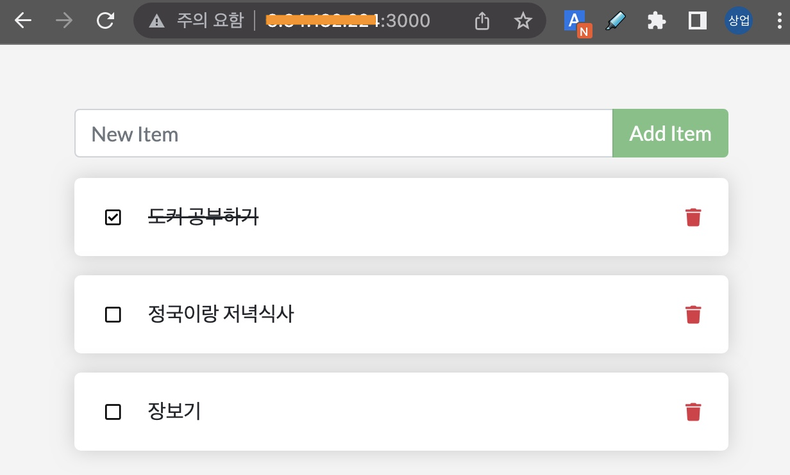

# [Hands-on] 04. Docker network


<br>

# Contents

**[1. Bridge network을 이용하여 Todo app. 실행하기](#1-bridge-network을-이용하여-todo-app-실행하기)**

---

## 1. Bridge network을 이용하여 Todo app. 실행하기

도커 네트워크를 이용해서 아래 그림과 같이 멀티 컨테이너 애플리케이션을 구성해 보겠습니다.
우리 애플리케이션에 Database(MySQL)를 연결해서 서비스하도록 합니다.


먼저 docker network create명령으로 bridge network을 하나 생성하겠습니다.
```bash
ubuntu@ip-172-31-23-60:~$ docker network create todo-app
b9040c02cb3e54eb51b4fa76dfc1031a7b3f02f0cd194de0a2097509e10e498a
```

> 💻 명령어
>```bash
>docker network create todo-app
>```

<br><br><br>

생성된 Network는 아래와 같이 상세내용을 확인할 수 있습니다.
```bash
ubuntu@ip-172-31-23-60:~$ docker network inspect todo-app
[
    {
        "Name": "todo-app",
        "Id": "b9040c02cb3e54eb51b4fa76dfc1031a7b3f02f0cd194de0a2097509e10e498a",
        "Created": "2023-02-13T06:11:05.735784274Z",
        "Scope": "local",
        "Driver": "bridge",
        "EnableIPv6": false,
        "IPAM": {
            "Driver": "default",
            "Options": {},
            "Config": [
                {
                    "Subnet": "172.18.0.0/16",
                    "Gateway": "172.18.0.1"
                }
            ]
        },
        "Internal": false,
        "Attachable": false,
        "Ingress": false,
        "ConfigFrom": {
            "Network": ""
        },
        "ConfigOnly": false,
        "Containers": {},
        "Options": {},
        "Labels": {}
    }
]
```

> 💻 명령어
>```bash
>docker network inspect todo-app
>```

<br><br><br>

그리고, 생성한 네트워크를 이용해서 mysql을 실행합니다.
```bash
ubuntu@ip-172-31-23-60:~$ docker run -d \
>     --network todo-app --network-alias mysql \
>     --volume todo-mysql-data:/var/lib/mysql \
>     --env MYSQL_ROOT_PASSWORD=secret \
>     --env MYSQL_DATABASE=todos \
>     --env LANG=C.UTF-8 \
>     --name my-mysql \
>     mysql:5.7 \
>     --character-set-server=utf8mb4 \
>     --collation-server=utf8mb4_unicode_ci
Unable to find image 'mysql:5.7' locally
5.7: Pulling from library/mysql
e048d0a38742: Pull complete
c7847c8a41cb: Pull complete
351a550f260d: Pull complete
8ce196d9d34f: Pull complete
17febb6f2030: Pull complete
d4e426841fb4: Pull complete
fda41038b9f8: Pull complete
f47aac56b41b: Pull complete
a4a90c369737: Pull complete
97091252395b: Pull complete
84fac29d61e9: Pull complete
Digest: sha256:8cf035b14977b26f4a47d98e85949a7dd35e641f88fc24aa4b466b36beecf9d6
Status: Downloaded newer image for mysql:5.7
b0cd02ef4766a2107e2404bc2c637c4a8b3088e4c1608151d6810122c287659c
```

> 💻 명령어
>```bash
>docker run -d \
>    --network todo-app --network-alias mysql \
>    --volume todo-mysql-data:/var/lib/mysql \
>    --env MYSQL_ROOT_PASSWORD=secret \
>    --env MYSQL_DATABASE=todos \
>    --env LANG=C.UTF-8 \
>    --name my-mysql \
>    mysql:5.7 \
>    --character-set-server=utf8mb4 \
>    --collation-server=utf8mb4_unicode_ci
>```

이전에 배운 **volume**도 사용하네요.  
데이터의 영속성을 위해서 데이터는 **volume(todo-mysql-data)**에 저장하도록 구성했습니다.  
`docker volume create`명령으로 생성하지 않아도, 없는 경우엔 도커가 알아서 생성해줍니다. ◟(ˊᗨˋ)◞ 

<br><br><br>

이제 mysql에 로그인해서 데이터베이스가 잘 생성됐나 봅시다.  
```bash
ubuntu@ip-172-31-23-60:~$ docker exec -it my-mysql mysql -p
Enter password:
Welcome to the MySQL monitor.  Commands end with ; or \g.
Your MySQL connection id is 2
Server version: 5.7.41 MySQL Community Server (GPL)

Copyright (c) 2000, 2023, Oracle and/or its affiliates.

Oracle is a registered trademark of Oracle Corporation and/or its
affiliates. Other names may be trademarks of their respective
owners.

Type 'help;' or '\h' for help. Type '\c' to clear the current input statement.

mysql>
```

> 💻 명령어
>```bash
>docker exec -it my-mysql mysql -p
>```
- Password는 **secret**입니다.  

**mysql>** 프롬프트가 표시되면, 정상적으로 로그인 된겁니다.

<br><br><br>

이제 mysql 명령어로 database를 조회해볼까요?
```bash
mysql> show databases;
+--------------------+
| Database           |
+--------------------+
| information_schema |
| mysql              |
| performance_schema |
| sys                |
| todos              |
+--------------------+
5 rows in set (0.00 sec)
```

> 💻 명령어
>```bash
>show databases;
>```

**todos**라는 database가 보이시나요?  


<br><br><br>

이제 mysql 에서 나갈게요.
```bash
mysql> exit
Bye
ubuntu@ip-172-31-23-60:~$
```

> 💻 명령어
>```bash
>exit
>```

<br><br><br>

이번에는 우리의 샘플 애플리케이션을 mysql과 연계해서 실행해 보겠습니다.
- Private repository의 이미지를 사용할 경우 로그인(`docker login -u [USER-NAME]`)이 필요합니다.
```bash
ubuntu@ip-172-31-23-60:~$ docker run -dp 3000:3000 \
> --network todo-app \
> --env MYSQL_HOST=mysql \
> --env MYSQL_USER=root \
> --env MYSQL_PASSWORD=secret \
> --env MYSQL_DB=todos \
> --name my-todo-manager \
> rogallo/todo-app:1.0.0
1dce849ca625a5c4b4925a90fe0a08dc272cf904682b3554210b94d183f5dfd2
```

> 💻 명령어
>```bash
>docker run -dp 3000:3000 \
> --network todo-app \
> --env MYSQL_HOST=mysql \
> --env MYSQL_USER=root \
> --env MYSQL_PASSWORD=secret \
> --env MYSQL_DB=todos \
> --name my-todo-manager \
>[USER-NAME]/todo-app:1.0.0
>```
> [USER-NAME] 에는 여러분의 정보로 채워넣어 주세요.
- **[USER-NAME]/todo-app:1.0.0** 이 준비가 안된 경우, **rogallo/101-todo-app:1.0.0**을 이용해주세요. login 없이 사용가능한 public repository의 이미지입니다.

`--network`옵션으로 mysql과 동일한 네트워크로 설정했고,  
`--env`를 이용해서 mysql 연계에 필요한 환경변수들을 설정해 주었습니다.

<br><br><br>

우리 애플리케이션의 로그를 한 번 볼까요?  
```bash
ubuntu@ip-172-31-23-60:~$ docker logs my-todo-manager
Waiting for mysql:3306.
Connected!
Connected to mysql db at host mysql
Listening on port 3000
```

> 💻 명령어
>```bash
>docker logs my-todo-manager
>```

**mysql**과 잘 연결됐다는 로그(Connected to mysql db at host mysql)가 보이네요.

이제 실행된 애플리케이션에 접속하고 오늘 할 일을 몇 개 적어볼까요?  
- 실습환경이 AWS인 경우
  - EC2 인스턴스의 **Public IPv4 address**로 접속합니다. (e.g. http://[Public IPv4 address]:3000/)
  - Security group의 Inbound rule에 3000번 포트에 대한 규칙이 있어야 합니다.
- 실습환경이 SCP인 경우
  - Virtual Server의 **NAT IP**로 접속하면 됩니다. (e.g. http://[NAT IP]:3000/)
  - Firewall과 Security group의 Inbound rule에 3000번 포트에 대한 규칙이 있어야 합니다.



<br><br><br>

자, 이제 다시 mysql로 로그인해서 table에 잘 저장되어 있나 확인해 보겠습니다.  
```bash
ubuntu@ip-172-31-23-60:~$ docker exec -it my-mysql mysql -p todos
Enter password:
Reading table information for completion of table and column names
You can turn off this feature to get a quicker startup with -A

Welcome to the MySQL monitor.  Commands end with ; or \g.
Your MySQL connection id is 6
Server version: 5.7.41 MySQL Community Server (GPL)

Copyright (c) 2000, 2023, Oracle and/or its affiliates.

Oracle is a registered trademark of Oracle Corporation and/or its
affiliates. Other names may be trademarks of their respective
owners.

Type 'help;' or '\h' for help. Type '\c' to clear the current input statement.

mysql>
```

> 💻 명령어
>```bash
>docker exec -it my-mysql mysql -p todos
>```
- Password는 **secret**입니다.  

<br><br><br>

`mysql>`프롬프트가 나오면 아래 쿼리문으로 조회해보세요.

```bash
mysql> select * from todo_items;
+--------------------------------------+---------------------------+-----------+
| id                                   | name                      | completed |
+--------------------------------------+---------------------------+-----------+
| 07289edd-df7e-4134-aaee-b8a67e0f6b37 | 도커 공부하기                 |         1 |
| 12a698f8-9604-4ef2-963e-e068f6a88c1e | 정국이랑 저녁식사              |         0 |
| 987e64e4-94ee-4fa6-83dc-42ce6a3729f2 | 장보기                      |         0 |
+--------------------------------------+---------------------------+-----------+
3 rows in set (0.00 sec)
```  

> 💻 명령어
>```bash
>select * from todo_items;
>```


화면에서 입력한 오늘의 할 일이 todo_items table에 잘 저장되어 있나요?

`exit` 명령으로 나와주시구요.
> 💻 명령어
>```bash
>exit
>```

사용된 컨테이너를 정리하겠습니다.
```bash
ubuntu@ip-172-31-23-60:~$ docker rm -f my-todo-manager my-mysql
my-todo-manager
my-mysql
ubuntu@ip-172-31-23-60:~$ docker network rm todo-app
todo-app
ubuntu@ip-172-31-23-60:~$ docker volume rm todo-mysql-data
todo-mysql-data
```

> 💻 명령어
>```bash
>docker rm -f my-todo-manager my-mysql
>```
>```bash
>docker network rm todo-app
>```
>```bash
>docker volume rm todo-mysql-data
>```

<br>

정리 후 상태는 아래와 같습니다.
```bash
ubuntu@ip-172-31-23-60:~/app$ docker ps --all
CONTAINER ID   IMAGE     COMMAND   CREATED   STATUS    PORTS     NAMES
ubuntu@ip-172-31-23-60:~/app$
```

> 💻 명령어
>```bash
>docker ps --all
>```

<br><br>

여기까지 실습을 마치겠습니다.  ˘◡˘
