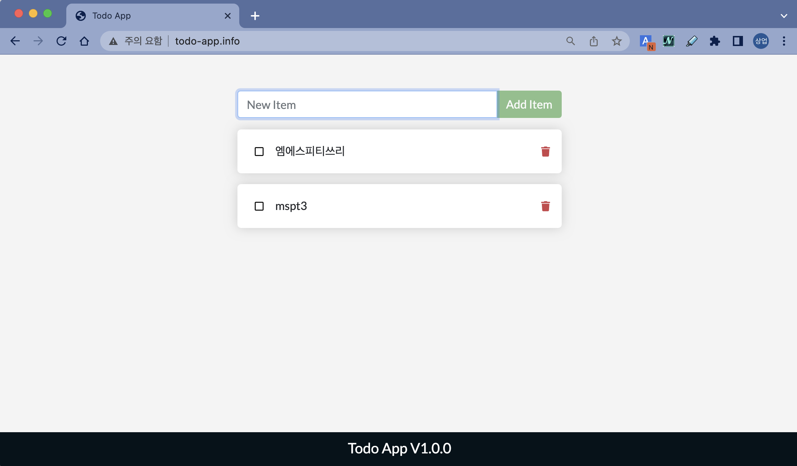

# [Hands-on] 11. Kubernetes Storage


<br>

# Contents

**[1. PersistentVolumeClaim(PVC), PersistentVolume(PV) 생성하기](#1-persistentvolumeclaimpvc-persistentvolumepv-생성하기)**  
**[2. Volume을 사용하여 Pod 생성하기](#2-volume을-사용하여-pod-생성하기)**

💾실습파일 위치 : [hands_on_files/ch11](../hands_on_files/ch11)

미리 준비된 실습용 파일을 사용하려는 경우 아래 디렉토리 이동 명령어를 실행해주세요.
```bash
ubuntu@ip-172-31-23-60:~$ cd ~/mspt3/hands_on_files/ch11
ubuntu@ip-172-31-23-60:~/mspt3/hands_on_files/ch11$
```

> 💻 명령어
>```bash
>cd ~/mspt3/hands_on_files/ch11
>```

---

## 1. PersistentVolumeClaim(PVC), PersistentVolume(PV) 생성하기

도커에서와 마찬가지로 컨테이너의 데이터 저장을 위해서 Volume을 생성해 보겠습니다.  
이번 실습은 다양한 방법 중에서

- Storage class를 이용한 [Dynamic Volume Provisioning](https://kubernetes.io/ko/docs/concepts/storage/dynamic-provisioning/) 을 적용하고,
- [hostPath](https://kubernetes.io/ko/docs/concepts/storage/volumes/#hostpath) 유형의 Volume을 사용  

해서 진행해 보겠습니다.

먼저 우리 환경이 준비가 되어있는지 확인해볼게요.  
우리 Cluster에서 사용가능한 Storageclass가 있는지 확인합니다.
```bash
ubuntu@ip-172-31-23-60:~$ kubectl get storageclasses
NAME                 PROVISIONER                RECLAIMPOLICY   VOLUMEBINDINGMODE   ALLOWVOLUMEEXPANSION   AGE
standard (default)   k8s.io/minikube-hostpath   Delete          Immediate           false                  4d12h
```

> 💻 명령어
>```bash
>kubectl get storageclasses
>```

<br>

Minikube는 기본적으로 위와같은 StorageClass가 있습니다.  
간단히 테스트해볼 수 있도록, hostPath 타입의 Volume을 만들 수 있습니다.

<br><br><br>

이제 **PersistentVolumeClaim**(**PVC**)를 만들어볼게요.  
아래와 같은 파일을 준비합니다.
```yaml
apiVersion: v1
kind: PersistentVolumeClaim
metadata:
  name: nginx-pvc
spec:
  storageClassName: standard
  accessModes:
    - ReadWriteOnce
  resources:
    requests:
      storage: 3Gi
```
> 파일명은 **nginx-pvc.yaml**로 합니다.

**standard** 라는 이름의 StorageClass를 이용해서, 3Gi 용량의 **PV**를 요청(Claim)하는 것입니다.

그리고, 아래와 같이 적용합니다.
```bash
ubuntu@ip-172-31-23-60:~$ kubectl apply -f nginx-pvc.yaml
persistentvolumeclaim/nginx-pvc created
```

> 💻 명령어
>```bash
>kubectl apply -f nginx-pvc.yaml
>```

<br><br><br>

만들어진 K8s 리소스들을 볼까요?  
먼저 PVC를 확인해볼게요.
```bash
ubuntu@ip-172-31-23-60:~$ kubectl get persistentvolumeclaims
NAME        STATUS   VOLUME                                     CAPACITY   ACCESS MODES   STORAGECLASS   AGE
nginx-pvc   Bound    pvc-07b9d09b-af9d-4828-b12b-e59960ec7ae9   3Gi        RWO            standard       38s
```
> 💻 명령어
>```bash
>kubectl get persistentvolumeclaims
>```
>또는
>```bash
>kubectl get pvc
>```

결과를 보니 **VOLUME(pvc-5347efb3-5aaf-437e-ad7d-9be120c190fa)** 도 보이고, STATUS는 **Bound**네요.

<br><br><br>

그럼, 이번에는 **PersistentVolume**(**PV**)을 볼까요?
```bash
ubuntu@ip-172-31-23-60:~$ kubectl get persistentvolume
NAME                                       CAPACITY   ACCESS MODES   RECLAIM POLICY   STATUS   CLAIM               STORAGECLASS   REASON   AGE
pvc-07b9d09b-af9d-4828-b12b-e59960ec7ae9   3Gi        RWO            Delete           Bound    default/nginx-pvc   standard                95s
```
> 💻 명령어
>```bash
>kubectl get persistentvolume
>```
>또는
>```bash
>kubectl get pv
>```

예상한대로 PVC를 생성했더니, PV가 동적으로 생성됐습니다.  

일반적인 사용 유형이니 잘 익혀두세요.

<br><br><br>

PV를 좀 더 자세히 볼까요?
```bash
ubuntu@ip-172-31-23-60:~$ kubectl describe persistentvolume pvc-07b9d09b-af9d-4828-b12b-e59960ec7ae9
Name:            pvc-07b9d09b-af9d-4828-b12b-e59960ec7ae9
Labels:          <none>
Annotations:     hostPathProvisionerIdentity: ee1f3efd-6ed4-4c8d-8fa2-9c85a7795642
                 pv.kubernetes.io/provisioned-by: k8s.io/minikube-hostpath
Finalizers:      [kubernetes.io/pv-protection]
StorageClass:    standard
Status:          Bound
Claim:           default/nginx-pvc
Reclaim Policy:  Delete
Access Modes:    RWO
VolumeMode:      Filesystem
Capacity:        3Gi
Node Affinity:   <none>
Message:
Source:
    Type:          HostPath (bare host directory volume)
    Path:          /tmp/hostpath-provisioner/default/nginx-pvc
    HostPathType:
Events:            <none>
```
> 💻 명령어
>```bash
>kubectl describe persistentvolume [PV-NAME]
>```
>또는
>```bash
>kubectl describe pv [PV-NAME]
>```
> [PV-NAME] 에는 앞에서 만들어진 PV의 Name을 넣어주세요.

**Source**아래 내용을 보시면 어디에 Volume영역이 할당되었는지 알 수 있습니다.  
위의 경우는 **HostPath**타입을 이용했고, **/tmp/hostpath-provisioner/default/nginx-pvc**를 Volume의 위치로 사용하고 있습니다.

<br><br><br><br><br>

## 2. Volume을 사용하여 Pod 생성하기

이제 만들어진 PVC, PV를 사용하는 Pod를 생성해 보겠습니다.  

다음과 같이 Deployment를 준비해주세요.
```yaml
apiVersion: apps/v1
kind: Deployment
metadata:
  name: my-nginx-deployment
  labels:
    app: my-nginx
    tier: frontend
spec:
  replicas: 3
  strategy:
    type: RollingUpdate
  selector:
    matchLabels:
      app: my-nginx
  template:
    metadata:
      labels:
        app: my-nginx
    spec:
      volumes:
      - name: nginx-storage
        persistentVolumeClaim:
          claimName: nginx-pvc
      containers:
      - image: nginx:1.19.3
        name: my-nginx
        ports:
        - containerPort: 80
        volumeMounts:
          - mountPath: "/usr/share/nginx/html"
            name: nginx-storage
```
> 파일명은 **nginx-deployment-volume.yaml**로 합니다.

앞에서 만든 **nginx-pvc**를 사용하고, 컨테이너의 **/usr/share/nginx/html**에 마운트합니다.

<br><br><br>

다음은 Deployment와 앞에서 실습한 Service, Ingress까지 리소스를 생성해주세요.
```bash
ubuntu@ip-172-31-23-60:~$ kubectl apply -f nginx-deployment-volume.yaml
deployment.apps/my-nginx-deployment created
ubuntu@ip-172-31-23-60:~$ kubectl apply -f nginx-clusterip-service.yaml
service/nginx-clusterip-service created
ubuntu@ip-172-31-23-60:~$ kubectl apply -f nginx-ingress.yaml
ingress.networking.k8s.io/my-nginx-ingress created
```

> 💻 명령어
>```bash
>kubectl apply -f nginx-deployment-volume.yaml
>kubectl apply -f nginx-clusterip-service.yaml
>kubectl apply -f nginx-ingress.yaml
>
>```

<br><br><br>

아직 한 가지 더 할 일이 남았습니다.
```bash
ubuntu@ip-172-31-23-60:~$ echo '<h1>Hello kubernetes</h1> <br> <iframe width="1400" height="788" src="https://www.youtube.com/embed/JbHI1yI1Ndk" allowfullscreen></iframe>' >> /tmp/hostpath-provisioner/default/nginx-pvc/index.html
```

> 💻 명령어
>```bash
>echo '<h1>Hello kubernetes</h1> <br> <iframe width="1400" height="788" src="https://www.youtube.com/embed/wDfqXR_5yyQ?si=v64pHyCqZ-4pW38f" allowfullscreen></iframe> <br> <iframe width="1400" height="788" src="https://www.youtube.com/embed/6RQ-bBdASvk?si=N7PPnNz_rrNwiZEo" allowfullscreen></iframe>' >> /tmp/hostpath-provisioner/default/nginx-pvc/index.html
>```

<br>

Nginx에서 보여줄 간단한 **index.html**파일을 하나 만들었습니다.  
혹시 PV의 경로가 다르다면 거기에 맞춰서 해주세요.

* 이 실습은 PVC, PV, Pod의 동작을 살펴보기 위한 것입니다. HostPath유형의 사용상 주의사항은 [hostPath](https://kubernetes.io/ko/docs/concepts/storage/volumes/#hostpath)를 참고하세요.

<br><br><br>

이제 브라우저에서 어떻게 나오나 볼까요?

http://my-nginx.io


Pod의 파일시스템에도 위의 내용이 반영되어 있는지도 확인해보세요.
```bash
ubuntu@ip-172-31-23-60:~$ kubectl get pods
NAME                                   READY   STATUS    RESTARTS   AGE
my-nginx-deployment-7cbbdb88f6-8n59s   1/1     Running   0          116s
my-nginx-deployment-7cbbdb88f6-jvvsm   1/1     Running   0          116s
my-nginx-deployment-7cbbdb88f6-w44q8   1/1     Running   0          116s
ubuntu@ip-172-31-23-60:~$ kubectl exec -it my-nginx-deployment-7cbbdb88f6-8n59s -- cat /usr/share/nginx/html/index.html
<h1>Hello kubernetes</h1> <br> <iframe width="1400" height="788" src="https://www.youtube.com/embed/JbHI1yI1Ndk" allowfullscreen></iframe>
```
> 💻 명령어
>```bash
>kubectl get pod
>```
>```bash
>kubectl exec -it [POD-NAME] -- cat /usr/share/nginx/html/index.html
>```
> [POD-NAME] 에는 앞에서 조회한 POD중 하나의 이름을 넣어주세요.

<br><br><br>

아래와 같이 사용한 리소스들을 정리해주세요.

```bash
ubuntu@ip-172-31-23-60:~$ kubectl delete -f nginx-ingress.yaml
ingress.networking.k8s.io "my-nginx-ingress" deleted
ubuntu@ip-172-31-23-60:~$ kubectl delete -f nginx-clusterip-service.yaml
service "nginx-clusterip-service" deleted
ubuntu@ip-172-31-23-60:~$ kubectl delete -f nginx-deployment-volume.yaml
deployment.apps "my-nginx-deployment" deleted
ubuntu@ip-172-31-23-60:~$ kubectl delete -f nginx-pvc.yaml
persistentvolumeclaim "nginx-pvc" deleted
```
> 💻 명령어
>```bash
>kubectl delete -f nginx-ingress.yaml
>kubectl delete -f nginx-clusterip-service.yaml
>kubectl delete -f nginx-deployment-volume.yaml
>kubectl delete -f nginx-pvc.yaml
>
>```

정리 후 상태는 아래와 같습니다. (service/kubernetes 는 시스템에서 사용하는 리소스입니다.)
```bash
ubuntu@ip-172-31-23-60:~$ kubectl get ingress
No resources found in default namespace.
ubuntu@ip-172-31-23-60:~$ kubectl get pvc
No resources found in default namespace.
ubuntu@ip-172-31-23-60:~$ kubectl get pv
No resources found
ubuntu@ip-172-31-23-60:~$ kubectl get all
NAME                 TYPE        CLUSTER-IP   EXTERNAL-IP   PORT(S)   AGE
service/kubernetes   ClusterIP   10.96.0.1    <none>        443/TCP   7m35s
```

> 💻 명령어
>```bash
>kubectl get ingress
>```
>```bash
>kubectl get pvc
>```
>```bash
>kubectl get pv
>```
>```bash
>kubectl get all
>```

이번 실습은 여기까지 입니다.  ˘◡˘  
끝~

<br><br><br>

---

<br><br><br>

### 💿 Self Study

앞의 실습까지 하고도 시간이 남으면 해보세요.

도커 실습에서 사용한 **ToDo App**을 PVC를 사용해서 데이터를 저장하는 방법입니다.  
Docker Volumes 실습의 Kubernetes 버젼이라고 보시면 될 것 같아요.

실습에 필요한 파일은 모두 **hands_on_files**아래에 있습니다.  
아래 참고해서 해보세요.
> PVC 생성 > Deployment 생성 > Service 생성 > Ingress 생성

```bash
ubuntu@ip-172-31-23-60:~$ kubectl apply -f todo-pvc.yaml
persistentvolumeclaim/todo-pvc created
ubuntu@ip-172-31-23-60:~$ kubectl apply -f todo-deployment-volume.yaml
deployment.apps/todo-app-deployment created
ubuntu@ip-172-31-23-60:~$ kubectl apply -f todo-clusterip-service.yaml
service/todo-clusterip-service created
ubuntu@ip-172-31-23-60:~$ kubectl apply -f todo-ingress.yaml
ingress.networking.k8s.io/todo-app-ingress created
```
> 💻 명령어
>```bash
>kubectl apply -f todo-pvc.yaml
>kubectl apply -f todo-deployment-volume.yaml
>kubectl apply -f todo-clusterip-service.yaml
>kubectl apply -f todo-ingress.yaml
>
>```

<br><br><br>

ToDo App 접속을 위해서 **hosts**파일에 다음과 같이 하나(***todo-app.info***)를 추가합니다.  
- Windows라면 **C:\Windows\System32\drivers\etc\hosts** 파일에,
- Linux계열은 **/etc/hosts** 파일에 추가하면 됩니다.
```bash
#mspt3
11.22.33.44  my-nginx.io todo-app.info
```
> 11.22.33.44 대신 여러분 AWS EC2 Instance의 **Public IPv4 address** 또는 SCP Virtual Server의 **NAT IP**를 써주세요.

이제 브라우저에서 http://todo-app.info/ 로 접속하면, 아래와 같이 접속 가능할거예요.



<br><br><br>

그리고, 아래처럼 Pod들이 삭제와 생성을 반복해도 데이터는 사라지지 않고 유지될거예요.
```bash
ubuntu@ip-172-31-23-60:~$ kubectl get pod
NAME                                   READY   STATUS    RESTARTS   AGE
todo-app-deployment-55464569cf-2stsv   1/1     Running   0          91s
todo-app-deployment-55464569cf-4jdq8   1/1     Running   0          91s
todo-app-deployment-55464569cf-zwh9z   1/1     Running   0          91s
ubuntu@ip-172-31-23-60:~$ kubectl delete pod --all
pod "todo-app-deployment-55464569cf-2stsv" deleted
pod "todo-app-deployment-55464569cf-4jdq8" deleted
pod "todo-app-deployment-55464569cf-zwh9z" deleted
ubuntu@ip-172-31-23-60:~$ kubectl get pod
NAME                                   READY   STATUS    RESTARTS   AGE
todo-app-deployment-55464569cf-7gn5v   1/1     Running   0          8s
todo-app-deployment-55464569cf-plnfd   1/1     Running   0          8s
todo-app-deployment-55464569cf-x8l6h   1/1     Running   0          8s
```
> 💻 명령어
>```bash
>kubectl get pod
>```
>```bash
>kubectl delete pod --all
>```
>```bash
>kubectl get pod
>```

위의 명령어들을 실행한 다음에도 데이터들이 유지되는지 확인해보세요.  
이유는... 여러분도 잘 아시다시피, 데이터는 Volume영역에 저장되기 때문입니다.

<br><br><br>

다 해보셨으면, 깨끗이 정리하고 마칠게요.

```bash
ubuntu@ip-172-31-23-60:~$ kubectl delete -f todo-ingress.yaml
ingress.networking.k8s.io "todo-app-ingress" deleted
ubuntu@ip-172-31-23-60:~$ kubectl delete -f todo-clusterip-service.yaml
service "todo-clusterip-service" deleted
ubuntu@ip-172-31-23-60:~$ kubectl delete -f todo-deployment-volume.yaml
deployment.apps "todo-app-deployment" deleted
ubuntu@ip-172-31-23-60:~$ kubectl delete -f todo-pvc.yaml
persistentvolumeclaim "todo-pvc" deleted
```
> 💻 명령어
>```bash
>kubectl delete -f todo-ingress.yaml
>kubectl delete -f todo-clusterip-service.yaml
>kubectl delete -f todo-deployment-volume.yaml
>kubectl delete -f todo-pvc.yaml
>
>```

<br>

정리 후 상태는 아래와 같습니다. (service/kubernetes 는 시스템에서 사용하는 리소스입니다.)
```bash
ubuntu@ip-172-31-23-60:~$ kubectl get ingress
No resources found in default namespace.
ubuntu@ip-172-31-23-60:~$ kubectl get pvc
No resources found in default namespace.
ubuntu@ip-172-31-23-60:~$ kubectl get pv
No resources found
ubuntu@ip-172-31-23-60:~$ kubectl get all
NAME                 TYPE        CLUSTER-IP   EXTERNAL-IP   PORT(S)   AGE
service/kubernetes   ClusterIP   10.96.0.1    <none>        443/TCP   7m35s
```

> 💻 명령어
>```bash
>kubectl get ingress
>```
>```bash
>kubectl get pvc
>```
>```bash
>kubectl get pv
>```
>```bash
>kubectl get all
>```

<br>

정말로 끝~   ˘◡˘
