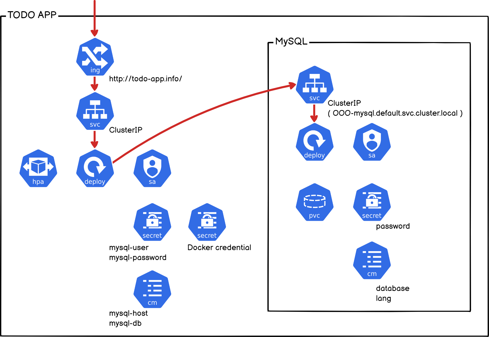
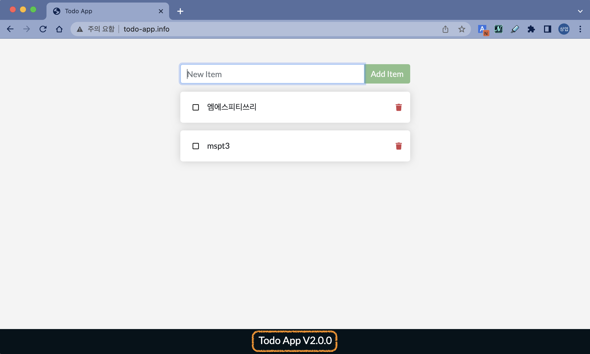
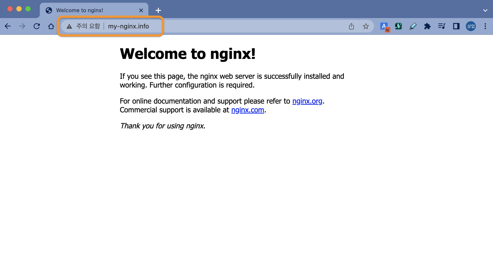

# [Hands-on] 15. Helm


<br>

# Contents

**[1. Helm 기본 사용법 알아보기](#1-helm-기본-사용법-알아보기)**  
**[2. ToDo App. 실행해보기](#2-todo-app-실행해보기)**  
**[3. 나의 차트 만들어보기](#3-나의-차트-만들어해보기)**

💾실습파일 위치 : [hands_on_files/ch15](../hands_on_files/ch15)

미리 준비된 실습용 파일을 사용하려는 경우 아래 디렉토리 이동 명령어를 실행해주세요.
```bash
ubuntu@ip-172-31-23-60:~$ cd ~/mspt3/hands_on_files/ch15
ubuntu@ip-172-31-23-60:~/mspt3/hands_on_files/ch15$
```

> 💻 명령어
>```bash
>cd ~/mspt3/hands_on_files/ch15
>```

---

## 1. Helm 기본 사용법 알아보기

자주 사용되는 Helm 명령어들을 실습해 보겠습니다.  
먼저 어떤 명령어들이 있는지 살펴볼까요?
```bash
ubuntu@ip-172-31-23-60:~$ helm --help
The Kubernetes package manager

Common actions for Helm:

- helm search:    search for charts
- helm pull:      download a chart to your local directory to view
- helm install:   upload the chart to Kubernetes
- helm list:      list releases of charts

Environment variables:

...생략...

Helm stores cache, configuration, and data based on the following configuration order:

- If a HELM_*_HOME environment variable is set, it will be used
- Otherwise, on systems supporting the XDG base directory specification, the XDG variables will be used
- When no other location is set a default location will be used based on the operating system

By default, the default directories depend on the Operating System. The defaults are listed below:

| Operating System | Cache Path                | Configuration Path             | Data Path               |
|------------------|---------------------------|--------------------------------|-------------------------|
| Linux            | $HOME/.cache/helm         | $HOME/.config/helm             | $HOME/.local/share/helm |
| macOS            | $HOME/Library/Caches/helm | $HOME/Library/Preferences/helm | $HOME/Library/helm      |
| Windows          | %TEMP%\helm               | %APPDATA%\helm                 | %APPDATA%\helm          |

Usage:
  helm [command]

Available Commands:
  completion  generate autocompletion scripts for the specified shell
  create      create a new chart with the given name
  dependency  manage a chart's dependencies

... 생략 ...

Use "helm [command] --help" for more information about a command.
```

> 💻 명령어
>```bash
>helm --help
>```

<br><br><br>

**Common actions for Helm** 의 명령어들을 하나씩 해볼까요?
```bash
Common actions for Helm:

- helm search:    search for charts
- helm pull:      download a chart to your local directory to view
- helm install:   upload the chart to Kubernetes
- helm list:      list releases of charts
```

첫 번째는 `helm search`인데, 그 전에 **helm repository**를 먼저 추가(**add**)해줘야 합니다.
```bash
ubuntu@ip-172-31-23-60:~$ helm repo add bitnami https://charts.bitnami.com/bitnami
"bitnami" has been added to your repositories
```

> 💻 명령어
>```bash
>helm repo add bitnami https://charts.bitnami.com/bitnami
>```

<br><br><br>

Repository 목록도 볼 수 있습니다.
```bash
ubuntu@ip-172-31-23-60:~$ helm repo list
NAME   	URL
bitnami	https://charts.bitnami.com/bitnami
```

> 💻 명령어
>```bash
>helm repo list
>```

<br><br><br>

이제 검색(`helm search`) 가능합니다.
```bash
ubuntu@ip-172-31-23-60:~$ helm search repo bitnami
NAME                                        	CHART VERSION	APP VERSION  	DESCRIPTION
bitnami/airflow                             	14.0.11      	2.5.1        	Apache Airflow is a tool to express and execute...
bitnami/apache                              	9.2.15       	2.4.55       	Apache HTTP Server is an open-source HTTP serve...
bitnami/appsmith                            	0.1.12       	1.9.7        	Appsmith is an open source platform for buildin...
bitnami/argo-cd                             	4.4.9        	2.6.1        	Argo CD is a continuous delivery tool for Kuber...
bitnami/argo-workflows                      	5.1.6        	3.4.5        	Argo Workflows is meant to orchestrate Kubernet...
bitnami/aspnet-core                         	4.0.5        	7.0.3        	ASP.NET Core is an open-source framework for we...
bitnami/cassandra                           	10.0.2       	4.1.0        	Apache Cassandra is an open source distributed ...
bitnami/cert-manager                        	0.9.0        	1.11.0       	cert-manager is a Kubernetes add-on to automate...
bitnami/clickhouse                          	3.0.1        	23.1.3       	ClickHouse is an open-source column-oriented OL...
bitnami/common                              	2.2.3        	2.2.3        	A Library Helm Chart for grouping common logic ...
bitnami/concourse                           	2.0.3        	7.9.0        	Concourse is an automation system written in Go...
bitnami/consul                              	10.9.11      	1.14.4       	HashiCorp Consul is a tool for discovering and ...
bitnami/contour                             	10.2.2       	1.23.3       	Contour is an open source Kubernetes ingress co...
bitnami/contour-operator                    	3.0.3        	1.23.0       	The Contour Operator extends the Kubernetes API...
...생략...
```

> 💻 명령어
>```bash
>helm search repo bitnami
>```

<br><br><br>

Wordpress를 한 번 찾아볼까요?
```bash
ubuntu@ip-172-31-23-60:~$ helm search repo wordpress
NAME                   	CHART VERSION	APP VERSION	DESCRIPTION
bitnami/wordpress      	15.2.42      	6.1.1      	WordPress is the world's most popular blogging ...
bitnami/wordpress-intel	2.1.31       	6.1.1      	DEPRECATED WordPress for Intel is the most popu...
```

> 💻 명령어
>```bash
>helm search repo wordpress
>```

<br><br><br>

다음은 `helm pull` 명령어 입니다.  
**Helm repository**에 등록되어 있는 Helm chart를 다운로드(pull)하는 명령어 입니다.
```bash
ubuntu@ip-172-31-23-60:~$ helm pull bitnami/wordpress
ubuntu@ip-172-31-23-60:~$ ls wordpress*
wordpress-15.2.48.tgz
```

> 💻 명령어
>```bash
>helm pull bitnami/wordpress
>```
>```bash
>ls wordpress*
>```

<br><br><br>

tar 파일로 받아지네요.  
압축도 풀어볼까요?
```bash
ubuntu@ip-172-31-23-60:~$ tar -xvf wordpress*
wordpress/Chart.yaml
wordpress/Chart.lock
wordpress/values.yaml
wordpress/values.schema.json
wordpress/templates/NOTES.txt
wordpress/templates/_helpers.tpl
wordpress/templates/config-secret.yaml
wordpress/templates/deployment.yaml
...생략...
```

> 💻 명령어
>```bash
>tar -xvf wordpress*
>```

<br><br><br>

어떤 파일들이 있는지 한 번 살펴보겠습니다.
```bash
ubuntu@ip-172-31-23-60:~$ tree ./wordpress
./wordpress
├── Chart.lock
├── Chart.yaml
├── README.md
├── charts
│   ├── common
│   │   ├── Chart.yaml
│   │   ├── README.md
│   │   ├── templates
│   │   │   ├── _affinities.tpl
│   │   │   ├── _capabilities.tpl
│   │   │   ├── _errors.tpl
│   │   │   ├── _images.tpl
│   │   │   ├── _ingress.tpl
│   │   │   ├── _labels.tpl
│   │   │   ├── _names.tpl
│   │   │   ├── _secrets.tpl
│   │   │   ├── _storage.tpl
│   │   │   ├── _tplvalues.tpl
│   │   │   ├── _utils.tpl
│   │   │   ├── _warnings.tpl
│   │   │   └── validations
│   │   │       ├── _cassandra.tpl
│   │   │       ├── _mariadb.tpl
│   │   │       ├── _mongodb.tpl
│   │   │       ├── _mysql.tpl
│   │   │       ├── _postgresql.tpl
│   │   │       ├── _redis.tpl
│   │   │       └── _validations.tpl
│   │   └── values.yaml
│   ├── mariadb
│   │   ├── Chart.lock
│   │   ├── Chart.yaml
│   │   ├── README.md
│   │   ├── charts
│   │   │   └── common
│   │   │       ├── Chart.yaml
│   │   │       ├── README.md
│   │   │       ├── templates
│   │   │       │   ├── _affinities.tpl
│   │   │       │   ├── _capabilities.tpl
│   │   │       │   ├── _errors.tpl
│   │   │       │   ├── _images.tpl
│   │   │       │   ├── _ingress.tpl
│   │   │       │   ├── _labels.tpl
│   │   │       │   ├── _names.tpl
│   │   │       │   ├── _secrets.tpl
│   │   │       │   ├── _storage.tpl
│   │   │       │   ├── _tplvalues.tpl
│   │   │       │   ├── _utils.tpl
│   │   │       │   ├── _warnings.tpl
│   │   │       │   └── validations
│   │   │       │       ├── _cassandra.tpl
│   │   │       │       ├── _mariadb.tpl
│   │   │       │       ├── _mongodb.tpl
│   │   │       │       ├── _mysql.tpl
│   │   │       │       ├── _postgresql.tpl
│   │   │       │       ├── _redis.tpl
│   │   │       │       └── _validations.tpl
│   │   │       └── values.yaml
│   │   ├── templates
│   │   │   ├── NOTES.txt
│   │   │   ├── _helpers.tpl
│   │   │   ├── extra-list.yaml
│   │   │   ├── networkpolicy-egress.yaml
│   │   │   ├── primary
│   │   │   │   ├── configmap.yaml
│   │   │   │   ├── initialization-configmap.yaml
│   │   │   │   ├── networkpolicy-ingress.yaml
│   │   │   │   ├── pdb.yaml
│   │   │   │   ├── statefulset.yaml
│   │   │   │   └── svc.yaml
│   │   │   ├── prometheusrules.yaml
│   │   │   ├── role.yaml
│   │   │   ├── rolebinding.yaml
│   │   │   ├── secondary
│   │   │   │   ├── configmap.yaml
│   │   │   │   ├── networkpolicy-ingress.yaml
│   │   │   │   ├── pdb.yaml
│   │   │   │   ├── statefulset.yaml
│   │   │   │   └── svc.yaml
│   │   │   ├── secrets.yaml
│   │   │   ├── serviceaccount.yaml
│   │   │   └── servicemonitor.yaml
│   │   ├── values.schema.json
│   │   └── values.yaml
│   └── memcached
│       ├── Chart.lock
│       ├── Chart.yaml
│       ├── README.md
│       ├── charts
│       │   └── common
│       │       ├── Chart.yaml
│       │       ├── README.md
│       │       ├── templates
│       │       │   ├── _affinities.tpl
│       │       │   ├── _capabilities.tpl
│       │       │   ├── _errors.tpl
│       │       │   ├── _images.tpl
│       │       │   ├── _ingress.tpl
│       │       │   ├── _labels.tpl
│       │       │   ├── _names.tpl
│       │       │   ├── _secrets.tpl
│       │       │   ├── _storage.tpl
│       │       │   ├── _tplvalues.tpl
│       │       │   ├── _utils.tpl
│       │       │   ├── _warnings.tpl
│       │       │   └── validations
│       │       │       ├── _cassandra.tpl
│       │       │       ├── _mariadb.tpl
│       │       │       ├── _mongodb.tpl
│       │       │       ├── _mysql.tpl
│       │       │       ├── _postgresql.tpl
│       │       │       ├── _redis.tpl
│       │       │       └── _validations.tpl
│       │       └── values.yaml
│       ├── templates
│       │   ├── NOTES.txt
│       │   ├── _helpers.tpl
│       │   ├── deployment.yaml
│       │   ├── extra-list.yaml
│       │   ├── hpa.yaml
│       │   ├── metrics-svc.yaml
│       │   ├── pdb.yaml
│       │   ├── secrets.yaml
│       │   ├── service.yaml
│       │   ├── serviceaccount.yaml
│       │   ├── servicemonitor.yaml
│       │   └── statefulset.yaml
│       └── values.yaml
├── templates
│   ├── NOTES.txt
│   ├── _helpers.tpl
│   ├── config-secret.yaml
│   ├── deployment.yaml
│   ├── externaldb-secrets.yaml
│   ├── extra-list.yaml
│   ├── hpa.yaml
│   ├── httpd-configmap.yaml
│   ├── ingress.yaml
│   ├── metrics-svc.yaml
│   ├── networkpolicy-backend-ingress.yaml
│   ├── networkpolicy-egress.yaml
│   ├── networkpolicy-ingress.yaml
│   ├── pdb.yaml
│   ├── postinit-configmap.yaml
│   ├── pvc.yaml
│   ├── secrets.yaml
│   ├── serviceaccount.yaml
│   ├── servicemonitor.yaml
│   ├── svc.yaml
│   └── tls-secrets.yaml
├── values.schema.json
└── values.yaml

19 directories, 134 files
```

> 💻 명령어
>```bash
>tree ./wordpress
>```

<br><br><br>

이제 설치(`helm install`)를 진행해 보겠습니다.
```bash
ubuntu@ip-172-31-23-60:~$ helm repo update
Hang tight while we grab the latest from your chart repositories...
...Successfully got an update from the "bitnami" chart repository
Update Complete. ⎈Happy Helming!⎈
```

> 💻 명령어
>```bash
>helm repo update
>```

<br><br><br>

```bash
ubuntu@ip-172-31-23-60:~$ helm install my-wordpress bitnami/wordpress
NAME: my-wordpress
LAST DEPLOYED: Thu Feb 16 08:08:04 2023
NAMESPACE: default
STATUS: deployed
REVISION: 1
TEST SUITE: None
NOTES:
CHART NAME: wordpress
CHART VERSION: 15.2.42
APP VERSION: 6.1.1

** Please be patient while the chart is being deployed **

Your WordPress site can be accessed through the following DNS name from within your cluster:

    my-wordpress.default.svc.cluster.local (port 80)

To access your WordPress site from outside the cluster follow the steps below:

1. Get the WordPress URL by running these commands:

  NOTE: It may take a few minutes for the LoadBalancer IP to be available.
        Watch the status with: 'kubectl get svc --namespace default -w my-wordpress'

   export SERVICE_IP=$(kubectl get svc --namespace default my-wordpress --template "{{ range (index .status.loadBalancer.ingress 0) }}{{ . }}{{ end }}")
   echo "WordPress URL: http://$SERVICE_IP/"
   echo "WordPress Admin URL: http://$SERVICE_IP/admin"

2. Open a browser and access WordPress using the obtained URL.

3. Login with the following credentials below to see your blog:

  echo Username: user
  echo Password: $(kubectl get secret --namespace default my-wordpress -o jsonpath="{.data.wordpress-password}" | base64 -d)
```

> 💻 명령어
>```bash
>helm install my-wordpress bitnami/wordpress
>```

<br><br><br>

설치된 Helm chart는 **[Release](https://helm.sh/ko/docs/glossary/#release)**라고 합니다.  
**Release**의 목록은 `helm list`명령으로 조회할 수 있구요.
```bash
ubuntu@ip-172-31-23-60:~$ helm list
NAME        	NAMESPACE	REVISION	UPDATED                                	STATUS  	CHART            	APP VERSION
my-wordpress	default  	1       	2023-02-16 08:08:04.880473857 +0000 UTC	deployed	wordpress-15.2.42	6.1.1
```

> 💻 명령어
>```bash
>helm list
>```

<br><br><br>

쿠버네티스 명령어로 어떤 리소스들이 생성됐나 볼까요?
```bash
ubuntu@ip-172-31-23-60:~$ kubectl get all
NAME                               READY   STATUS    RESTARTS   AGE
pod/my-wordpress-5786598c5-5fqln   1/1     Running   0          2m59s
pod/my-wordpress-mariadb-0         1/1     Running   0          2m59s

NAME                           TYPE           CLUSTER-IP       EXTERNAL-IP   PORT(S)                      AGE
service/kubernetes             ClusterIP      10.96.0.1        <none>        443/TCP                      4d17h
service/my-wordpress           LoadBalancer   10.109.136.241   <pending>     80:30606/TCP,443:32687/TCP   2m59s
service/my-wordpress-mariadb   ClusterIP      10.111.195.166   <none>        3306/TCP                     2m59s

NAME                           READY   UP-TO-DATE   AVAILABLE   AGE
deployment.apps/my-wordpress   1/1     1            1           2m59s

NAME                                     DESIRED   CURRENT   READY   AGE
replicaset.apps/my-wordpress-5786598c5   1         1         1       2m59s

NAME                                    READY   AGE
statefulset.apps/my-wordpress-mariadb   1/1     2m59s
```

> 💻 명령어
>```bash
>kubectl get all
>```

<br><br><br>

와우~ 뭔가 Wordpress 소프트웨어에 필요한 모든게 한 번에 설치가 된 것 같네요. 패키지로...

삭제도 한 번에 가능합니다.
```bash
ubuntu@ip-172-31-23-60:~$ helm uninstall my-wordpress
release "my-wordpress" uninstalled
```

> 💻 명령어
>```bash
>helm uninstall my-wordpress
>```

<br>

정리 후 상태는 아래와 같습니다.
```bash
ubuntu@ip-172-31-23-60:~$ helm list
NAME	NAMESPACE	REVISION	UPDATED	STATUS	CHART	APP VERSION
ubuntu@ip-172-31-28-216:~$
```

> 💻 명령어
>```bash
>helm list
>```

<br><br><br><br><br>

## 2. ToDo App. 실행해보기

우리가 익숙한 **ToDo App**을 이용해서 좀 더 자세히 볼게요.  
차트는 아래와 같은 구조를 가지고 있습니다. 우리가 배운 여러가지가 다 들어있네요.



<br><br><br>

설치는 간단합니다. 명령어 하나면 끝. （°o°；）
```bash
ubuntu@ip-172-31-23-60:~$ helm install my-todo-app https://github.com/JungSangup/mspt3/raw/main/hands_on_files/todo-app-1.0.0.tgz
NAME: my-todo-app
LAST DEPLOYED: Thu Feb 16 08:19:57 2023
NAMESPACE: default
STATUS: deployed
REVISION: 1
TEST SUITE: None
NOTES:
1. Get the application URL by running these commands:
  http://todo-app.info/
```

> 💻 명령어
>```bash
>helm install my-todo-app https://github.com/JungSangup/mspt3/raw/main/hands_on_files/todo-app-1.0.0.tgz
>```

<br>

위의 방법은 Helm chart 패키지 파일의 URL(깃헙에 올려놓은 파일)을 직접 지정해서 설치한 것입니다.  
위의 방법 외에도 아래와 같은 다양한 방법으로 설치 가능합니다. 
> - `helm install my-todo-app ./todo-app-1.0.0.tgz` -> 로컬 경로의 tgz파일(패키징 된 Helm chart)
> - `helm install my-todo-app ./todo-app` -> 로컬 경로의 차트 디렉토리  
- **hands_on_files** 아래에 위의 두 가지 방법을 위한 파일/디렉토리도 준비해 놓았습니다.

<br><br><br>

우선 이 Helm release는 Uninstall을 할게요. 뒤에 다른 방법으로 다시 설치하겠습니다.
```bash
ubuntu@ip-172-31-23-60:~$ helm uninstall my-todo-app
release "my-todo-app" uninstalled
```

> 💻 명령어
>```bash
>helm uninstall my-todo-app
>```

<br>

정리 후 상태는 아래와 같습니다.
```bash
ubuntu@ip-172-31-23-60:~$ helm list
NAME	NAMESPACE	REVISION	UPDATED	STATUS	CHART	APP VERSION
ubuntu@ip-172-31-28-216:~$
```

> 💻 명령어
>```bash
>helm list
>```

<br><br><br>

이번에는 구성을 조금 달리해서 설치하겠습니다.  
여러분의 **Docker private repository**에 올려놓은 이미지를 사용하도록 하고, 이미지 pull을 위해서 **자격증명**을 사용하도록 할게요.

역시 아래와 같이 간단하게 실행할 수 있습니다.
```bash
ubuntu@ip-172-31-23-60:~$ helm install my-todo-app \
>     --set image.repository=rogallo/todo-app \
>     --set imageCredentials.create=true \
>     --set imageCredentials.username=rogallo \
>     --set imageCredentials.password=XXXXXX \
>     https://github.com/JungSangup/mspt3/raw/main/hands_on_files/todo-app-1.0.0.tgz
NAME: my-todo-app
LAST DEPLOYED: Thu Feb 16 08:31:07 2023
NAMESPACE: default
STATUS: deployed
REVISION: 1
TEST SUITE: None
NOTES:
1. Get the application URL by running these commands:
  http://todo-app.info/
```

> 💻 명령어
>```bash
>helm install my-todo-app \
>     --set image.repository=[USER-NAME]/todo-app \
>     --set imageCredentials.create=true \
>     --set imageCredentials.username=[USER-NAME] \
>     --set imageCredentials.password=[PASSWORD] \
>     https://github.com/JungSangup/mspt3/raw/main/hands_on_files/todo-app-1.0.0.tgz
>```
> [USER-NAME]과 [PASSWORD]는 여러분의 정보로 채워넣어 주세요.

설치 시점에 아래 키-값 들을 변경해서 적용한 것입니다.  
image.repository는 여러분의 Private repository에서 pull해서 사용하도록 하고, imageCredentials 값들을 이용해서 도커허브 자격증명을 위햔 Secret을 생성합니다.
- image.repository=[USER-NAME]/todo-app
- imageCredentials.create=true
- imageCredentials.username=[USER-NAME]
- imageCredentials.password=[PASSWORD]

<br><br><br>

브라우저에서 http://todo-app.info/ 로 접속해서 테스트도 해보세요.


잘 되나요?

<br><br><br>

생성된 K8s 리소스들도 확인해보세요.
```bash
ubuntu@ip-172-31-23-60:~$ kubectl get all
NAME                                    READY   STATUS    RESTARTS   AGE
pod/my-todo-app-6b8b4887d5-l5kwf        1/1     Running   0          3m41s
pod/my-todo-app-mysql-7d8c985b5-5kwk2   1/1     Running   0          3m41s

NAME                        TYPE        CLUSTER-IP       EXTERNAL-IP   PORT(S)    AGE
service/kubernetes          ClusterIP   10.96.0.1        <none>        443/TCP    4d17h
service/my-todo-app         ClusterIP   10.99.25.35      <none>        3000/TCP   3m41s
service/my-todo-app-mysql   ClusterIP   10.101.118.220   <none>        3306/TCP   3m41s

NAME                                READY   UP-TO-DATE   AVAILABLE   AGE
deployment.apps/my-todo-app         1/1     1            1           3m41s
deployment.apps/my-todo-app-mysql   1/1     1            1           3m41s

NAME                                          DESIRED   CURRENT   READY   AGE
replicaset.apps/my-todo-app-6b8b4887d5        1         1         1       3m41s
replicaset.apps/my-todo-app-mysql-7d8c985b5   1         1         1       3m41s

NAME                                              REFERENCE                TARGETS         MINPODS   MAXPODS   REPLICAS   AGE
horizontalpodautoscaler.autoscaling/my-todo-app   Deployment/my-todo-app   <unknown>/80%   1         10        1          3m41s
```

> 💻 명령어
>```bash
>kubectl get all
>```

<br><br><br>

private repository의 이미지를 pull 하기 위해서 자격증명도 secret으로 생성했습니다.
```base
ubuntu@ip-172-31-23-60:~$ kubectl describe secrets regcred
Name:         regcred
Namespace:    default
Labels:       app.kubernetes.io/managed-by=Helm
Annotations:  meta.helm.sh/release-name: my-todo-app
              meta.helm.sh/release-namespace: default

Type:  kubernetes.io/dockerconfigjson

Data
====
.dockerconfigjson:  135 bytes
```

> 💻 명령어
>```bash
>kubectl describe secrets regcred
>```

<br><br><br>

다른 리소스들 (ConfitMap, Secret, PVC, PV, Ingress) 도 한 번 확인해보세요.
```base
ubuntu@ip-172-31-23-60:~$ kubectl get configmaps
NAME                 DATA   AGE
kube-root-ca.crt     1      4d18h
my-todo-app-config   2      5m5s
mysql-config         2      5m5s
ubuntu@ip-172-31-23-60:~$ kubectl get secrets
NAME                                TYPE                                  DATA   AGE
default-token-dskrr                 kubernetes.io/service-account-token   3      4d18h
my-todo-app-mysql-token-d25jp       kubernetes.io/service-account-token   3      5m10s
my-todo-app-secret                  Opaque                                2      5m10s
my-todo-app-token-5n24p             kubernetes.io/service-account-token   3      5m10s
mysql-secret                        Opaque                                1      5m10s
regcred                             kubernetes.io/dockerconfigjson        1      5m10s
sh.helm.release.v1.my-todo-app.v1   helm.sh/release.v1                    1      5m10s
ubuntu@ip-172-31-23-60:~$ kubectl get pvc
NAME                          STATUS   VOLUME                                     CAPACITY   ACCESS MODES   STORAGECLASS   AGE
data-my-wordpress-mariadb-0   Bound    pvc-94d614ca-8cb3-499c-a76f-35e73eca936e   8Gi        RWO            standard       28m
mysql-pvc                     Bound    pvc-775be31c-d9b9-4e21-b55c-8280af4e342f   3Gi        RWO            standard       5m14s
ubuntu@ip-172-31-23-60:~$ kubectl get pv
NAME                                       CAPACITY   ACCESS MODES   RECLAIM POLICY   STATUS   CLAIM                                 STORAGECLASS   REASON   AGE
pvc-775be31c-d9b9-4e21-b55c-8280af4e342f   3Gi        RWO            Delete           Bound    default/mysql-pvc                     standard                5m18s
pvc-94d614ca-8cb3-499c-a76f-35e73eca936e   8Gi        RWO            Delete           Bound    default/data-my-wordpress-mariadb-0   standard                28m
ubuntu@ip-172-31-23-60:~$ kubectl get ingress
NAME          CLASS   HOSTS           ADDRESS        PORTS   AGE
my-todo-app   nginx   todo-app.info   172.31.23.60   80      5m23s
```

> 💻 명령어
>```bash
>kubectl get configmaps
>```
>```bash
>kubectl get secrets
>```
>```bash
>kubectl get pvc
>```
>```bash
>kubectl get pv
>```
>```bash
>kubectl get ingress
>```

<br><br><br>

이제 Helm 에서 **업그레이드**를 해볼게요.  
여러가지 업그레이드가 있겠지만, 간단히 이미지의 Tag를 변경하는 경우만 해보겠습니다.
```bash
ubuntu@ip-172-31-23-60:~$ helm upgrade --set image.tag=2.0.0 my-todo-app https://github.com/JungSangup/mspt3/raw/main/hands_on_files/todo-app-1.0.0.tgz
Release "my-todo-app" has been upgraded. Happy Helming!
NAME: my-todo-app
LAST DEPLOYED: Thu Feb 16 10:41:50 2023
NAMESPACE: default
STATUS: deployed
REVISION: 2
TEST SUITE: None
NOTES:
1. Get the application URL by running these commands:
  http://todo-app.info/
```

> 💻 명령어
>```bash
>helm upgrade --set image.tag=2.0.0 my-todo-app https://github.com/JungSangup/mspt3/raw/main/hands_on_files/todo-app-1.0.0.tgz
>```
> **image.tag**만 변경해서 새로운 버젼으로 업그레이드 합니다.

<br><br><br>

바뀐 Deployment도 확인해 보시구요.
이렇게요.
```bash
ubuntu@ip-172-31-23-60:~$ kubectl describe deployments my-todo-app | grep Image
    Image:      rogallo/101-todo-app:2.0.0
```

> 💻 명령어
>```bash
>kubectl describe deployments my-todo-app | grep Image
>```

<br><br><br>

브라우저에서 http://todo-app.info/로 접속해서 업그레이드 결과도 보세요.



> 구분하기 위해서 하단에 버젼을 표시하도록 해 놓았습니다.

<br><br><br>

롤백도 해볼까요?  
간단히 History를 조회하고, 원하는 **Revision**으로 돌아가면 됩니다.
```bash
ubuntu@ip-172-31-23-60:~$ helm history my-todo-app
REVISION	UPDATED                 	STATUS    	CHART         	APP VERSION	DESCRIPTION
1       	Thu Feb 16 08:31:07 2023	superseded	todo-app-1.0.0	1.0.0      	Install complete
2       	Thu Feb 16 10:41:50 2023	deployed  	todo-app-1.0.0	1.0.0      	Upgrade complete
ubuntu@ip-172-31-23-60:~$ helm rollback my-todo-app 1
Rollback was a success! Happy Helming!
ubuntu@ip-172-31-23-60:~$ kubectl describe deployments my-todo-app | grep Image
    Image:      rogallo/todo-app:1.0.0
```

> 💻 명령어
>```bash
>helm history my-todo-app
>```
>```bash
>helm rollback my-todo-app 1
>```
>```bash
>kubectl describe deployments my-todo-app | grep Image
>```

http://todo-app.info/ 화면도 확인 해 보시구요.

<br><br><br>

역시 마지막은 정리.   
아래 명령어로 삭제(Uninstall) 해 주세요.

```bash
ubuntu@ip-172-31-23-60:~$ helm uninstall my-todo-app
release "my-todo-app" uninstalled
```

> 💻 명령어
>```bash
>helm uninstall my-todo-app
>```

<br>

정리 후 상태는 아래와 같습니다.
```bash
ubuntu@ip-172-31-23-60:~$ helm list
NAME	NAMESPACE	REVISION	UPDATED	STATUS	CHART	APP VERSION
ubuntu@ip-172-31-28-216:~$
```

> 💻 명령어
>```bash
>helm list
>```

한꺼번에 설치(install), 업데이트(update), 롤백(rollback), 삭제(uninstall)되니 편하네요.


<br><br><br><br><br>

## 3. 나의 차트 만들어보기

지금까지는 만들어진 차트를 사용하는 방법을 알아보았습니다.  
이제 내 차트를 직접 만들어보도록 해요. ( from scratch ＿〆(。╹‿ ╹ 。)  )

새로운 차트를 생성하는 명령어는 [helm create](https://helm.sh/ko/docs/helm/helm_create/)입니다.  
**my-chart**라는 차트를 하나 만들어볼까요?
```bash
ubuntu@ip-172-31-23-60:~$ helm create my-chart
Creating my-chart
ubuntu@ip-172-31-23-60:~$ tree my-chart
my-chart
├── Chart.yaml
├── charts
├── templates
│   ├── NOTES.txt
│   ├── _helpers.tpl
│   ├── deployment.yaml
│   ├── hpa.yaml
│   ├── ingress.yaml
│   ├── service.yaml
│   ├── serviceaccount.yaml
│   └── tests
│       └── test-connection.yaml
└── values.yaml

3 directories, 10 files
```

> 💻 명령어
>```bash
>helm create my-chart
>```
>```bash
>tree my-chart
>```

앞에서 배운것 처럼, chart.yaml파일과 templates디렉토리가 만들어져 있습니다.  
templates디렉토리에는 deployment, service, ingress등의 manifest 파일이 있구요.

이제 몇 가지만 수정해볼게요.  
values.yaml 파일에서 ingress 부분만 수정해줍니다.  
아래와 같이 수정해주세요.

```yaml
ingress:
  enabled: true
  className: ""
  annotations:
    kubernetes.io/ingress.class: nginx
    kubernetes.io/tls-acme: "true"
  hosts:
    - host: my-nginx.io
      paths:
        - path: /
          pathType: ImplementationSpecific
  tls: []
  #  - secretName: chart-example-tls
  #    hosts:
  #      - chart-example.local
```

> 💻 명령어
>```bash
>vi ./my-chart/values.yaml
>```
> vi 에디터나 익숙한 편집기를 사용해서 변경해주세요.


바뀐 부분은 다음과 같습니다.
- ingress.enabled : false -> true
- ingress.annotations : {} 삭제 후 주석부분 해제
- ingress.hosts[0].host : my-ninx.io 로 변경


이제 우리가 수정한 부분에 문제가 없는지 볼까요?

```bash
ubuntu@ip-172-31-23-60:~$ helm lint ./my-chart
==> Linting ./my-chart
[INFO] Chart.yaml: icon is recommended

1 chart(s) linted, 0 chart(s) failed
```

> 💻 명령어
>```bash
>helm lint ./my-chart
>```

만약 잘 못된 부분이 있으면 고쳐주세요.

자, 이제 문법적으로 문제는 없는 나만의 차트가 준비됐습니다.
내 차트로 어떤 K8s 리소스들이 만들어지는지 확인을 해보려면 [Helm Template](https://helm.sh/ko/docs/helm/helm_template/)명령어를 사용하면 됩니다.

```bash
ubuntu@ip-172-31-23-60:~$ helm template my-nginx ./my-chart
---
# Source: my-chart/templates/serviceaccount.yaml
apiVersion: v1
kind: ServiceAccount
metadata:
  name: my-nginx-my-chart
  labels:
    helm.sh/chart: my-chart-0.1.0
    app.kubernetes.io/name: my-chart
    app.kubernetes.io/instance: my-nginx
    app.kubernetes.io/version: "1.16.0"
    app.kubernetes.io/managed-by: Helm
---
# Source: my-chart/templates/service.yaml
apiVersion: v1
kind: Service
metadata:
  name: my-nginx-my-chart
  labels:
    helm.sh/chart: my-chart-0.1.0
    app.kubernetes.io/name: my-chart
    app.kubernetes.io/instance: my-nginx
    app.kubernetes.io/version: "1.16.0"
    app.kubernetes.io/managed-by: Helm
spec:
  type: ClusterIP
  ports:
    - port: 80
      targetPort: http
      protocol: TCP
      name: http
  selector:
    app.kubernetes.io/name: my-chart
    app.kubernetes.io/instance: my-nginx
---
# Source: my-chart/templates/deployment.yaml
apiVersion: apps/v1
kind: Deployment
metadata:
  name: my-nginx-my-chart
  labels:
    helm.sh/chart: my-chart-0.1.0
    app.kubernetes.io/name: my-chart
    app.kubernetes.io/instance: my-nginx
    app.kubernetes.io/version: "1.16.0"
    app.kubernetes.io/managed-by: Helm
spec:
  replicas: 1
  selector:
    matchLabels:
      app.kubernetes.io/name: my-chart
      app.kubernetes.io/instance: my-nginx
  template:
    metadata:
      labels:
        app.kubernetes.io/name: my-chart
        app.kubernetes.io/instance: my-nginx
    spec:
      serviceAccountName: my-nginx-my-chart
      securityContext:
        {}
      containers:
        - name: my-chart
          securityContext:
            {}
          image: "nginx:1.16.0"
          imagePullPolicy: IfNotPresent
          ports:
            - name: http
              containerPort: 80
              protocol: TCP
          livenessProbe:
            httpGet:
              path: /
              port: http
          readinessProbe:
            httpGet:
              path: /
              port: http
          resources:
            {}
---
# Source: my-chart/templates/ingress.yaml
apiVersion: networking.k8s.io/v1
kind: Ingress
metadata:
  name: my-nginx-my-chart
  labels:
    helm.sh/chart: my-chart-0.1.0
    app.kubernetes.io/name: my-chart
    app.kubernetes.io/instance: my-nginx
    app.kubernetes.io/version: "1.16.0"
    app.kubernetes.io/managed-by: Helm
  annotations:
    kubernetes.io/ingress.class: nginx
    kubernetes.io/tls-acme: "true"
spec:
  rules:
    - host: "my-nginx.io"
      http:
        paths:
          - path: /
            pathType: ImplementationSpecific
            backend:
              service:
                name: my-nginx-my-chart
                port:
                  number: 80
---
# Source: my-chart/templates/tests/test-connection.yaml
apiVersion: v1
kind: Pod
metadata:
  name: "my-nginx-my-chart-test-connection"
  labels:
    helm.sh/chart: my-chart-0.1.0
    app.kubernetes.io/name: my-chart
    app.kubernetes.io/instance: my-nginx
    app.kubernetes.io/version: "1.16.0"
    app.kubernetes.io/managed-by: Helm
  annotations:
    "helm.sh/hook": test
spec:
  containers:
    - name: wget
      image: busybox
      command: ['wget']
      args: ['my-nginx-my-chart:80']
  restartPolicy: Never
```

> 💻 명령어
>```bash
>helm template my-nginx ./my-chart
>```

템플릿 엔진에 의해서 생성될 K8s 리소스들을 미리 알아볼 수 있습니다.  

생각한 대로인가요?  
아니라면 다시 앞으로 돌아가서 chart를 수정하면 됩니다.

이런 과정이 차트를 개발하는 과정입니다. (수정하고 확인하고... 반복)

이제 마지막으로 나의 차트를 이용해서 설치([helm install](https://helm.sh/ko/docs/helm/helm_install/))를 해볼게요.

바로 설치를 할 수도 있지만, 이런것도 가능합니다.  
`--dry-run` 옵션을 사용해서, 실제 설치를 진행하기 전에 미리 확인을 해볼 수 있습니다.
```bash
ubuntu@ip-172-31-23-60:~$ helm install my-nginx --dry-run ./my-chart
NAME: my-nginx
LAST DEPLOYED: Tue Mar  7 08:58:58 2023
NAMESPACE: default
STATUS: pending-install
REVISION: 1
HOOKS:
---
# Source: my-chart/templates/tests/test-connection.yaml
apiVersion: v1
kind: Pod
metadata:
  name: "my-nginx-my-chart-test-connection"
  labels:
    helm.sh/chart: my-chart-0.1.0
    app.kubernetes.io/name: my-chart
    app.kubernetes.io/instance: my-nginx
    app.kubernetes.io/version: "1.16.0"
    app.kubernetes.io/managed-by: Helm
  annotations:
    "helm.sh/hook": test
spec:
  containers:
    - name: wget
      image: busybox
      command: ['wget']
      args: ['my-nginx-my-chart:80']
  restartPolicy: Never
MANIFEST:
---
# Source: my-chart/templates/serviceaccount.yaml
apiVersion: v1
kind: ServiceAccount
metadata:
  name: my-nginx-my-chart
  labels:
    helm.sh/chart: my-chart-0.1.0
    app.kubernetes.io/name: my-chart
    app.kubernetes.io/instance: my-nginx
    app.kubernetes.io/version: "1.16.0"
    app.kubernetes.io/managed-by: Helm
---
# Source: my-chart/templates/service.yaml
apiVersion: v1
kind: Service
metadata:
  name: my-nginx-my-chart
  labels:
    helm.sh/chart: my-chart-0.1.0
    app.kubernetes.io/name: my-chart
    app.kubernetes.io/instance: my-nginx
    app.kubernetes.io/version: "1.16.0"
    app.kubernetes.io/managed-by: Helm
spec:
  type: ClusterIP
  ports:
    - port: 80
      targetPort: http
      protocol: TCP
      name: http
  selector:
    app.kubernetes.io/name: my-chart
    app.kubernetes.io/instance: my-nginx
---
# Source: my-chart/templates/deployment.yaml
apiVersion: apps/v1
kind: Deployment
metadata:
  name: my-nginx-my-chart
  labels:
    helm.sh/chart: my-chart-0.1.0
    app.kubernetes.io/name: my-chart
    app.kubernetes.io/instance: my-nginx
    app.kubernetes.io/version: "1.16.0"
    app.kubernetes.io/managed-by: Helm
spec:
  replicas: 1
  selector:
    matchLabels:
      app.kubernetes.io/name: my-chart
      app.kubernetes.io/instance: my-nginx
  template:
    metadata:
      labels:
        app.kubernetes.io/name: my-chart
        app.kubernetes.io/instance: my-nginx
    spec:
      serviceAccountName: my-nginx-my-chart
      securityContext:
        {}
      containers:
        - name: my-chart
          securityContext:
            {}
          image: "nginx:1.16.0"
          imagePullPolicy: IfNotPresent
          ports:
            - name: http
              containerPort: 80
              protocol: TCP
          livenessProbe:
            httpGet:
              path: /
              port: http
          readinessProbe:
            httpGet:
              path: /
              port: http
          resources:
            {}
---
# Source: my-chart/templates/ingress.yaml
apiVersion: networking.k8s.io/v1
kind: Ingress
metadata:
  name: my-nginx-my-chart
  labels:
    helm.sh/chart: my-chart-0.1.0
    app.kubernetes.io/name: my-chart
    app.kubernetes.io/instance: my-nginx
    app.kubernetes.io/version: "1.16.0"
    app.kubernetes.io/managed-by: Helm
  annotations:
    kubernetes.io/ingress.class: nginx
    kubernetes.io/tls-acme: "true"
spec:
  rules:
    - host: "my-nginx.io"
      http:
        paths:
          - path: /
            pathType: ImplementationSpecific
            backend:
              service:
                name: my-nginx-my-chart
                port:
                  number: 80

NOTES:
1. Get the application URL by running these commands:
  http://my-nginx.io/
```

> 💻 명령어
>```bash
>helm install my-nginx --dry-run ./my-chart
>```

지금까지 문제가 없다면, 이제 설치를 진행하면 됩니다.  
```
ubuntu@ip-172-31-23-60:~$ helm install my-nginx ./my-chart
NAME: my-nginx
LAST DEPLOYED: Tue Mar  7 09:03:59 2023
NAMESPACE: default
STATUS: deployed
REVISION: 1
NOTES:
1. Get the application URL by running these commands:
  http://my-nginx.io/
```

> 💻 명령어
>```bash
>helm install my-nginx --dry-run ./my-chart
>```

웹브라우저에서 접속도 해보시구요. (앞에서 사용한 my-nginx.io를 그대로 사용했습니다. 혹시 hosts파일 처리가 필요하다면 추가해주세요.)  

http://my-nginx.io



여기까지 Helm 에 대해 알아보았습니다.

정리하고 마치겠습니다.
```bash
ubuntu@ip-172-31-23-60:~$ helm uninstall my-nginx
release "my-nginx" uninstalled
```

> 💻 명령어
>```bash
>helm uninstall my-nginx
>```

<br>

정리 후 상태는 아래와 같습니다.
```bash
ubuntu@ip-172-31-23-60:~$ helm list
NAME	NAMESPACE	REVISION	UPDATED	STATUS	CHART	APP VERSION
ubuntu@ip-172-31-28-216:~$
```

> 💻 명령어
>```bash
>helm list
>```

수고하셨습니다. (〃･ิ‿･ิ)ゞ
