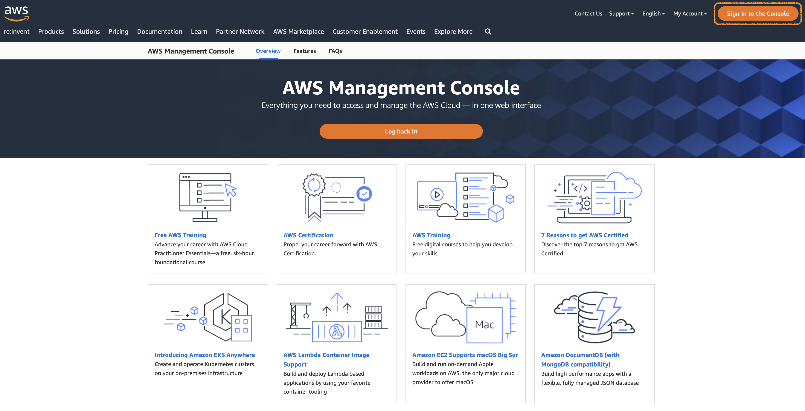
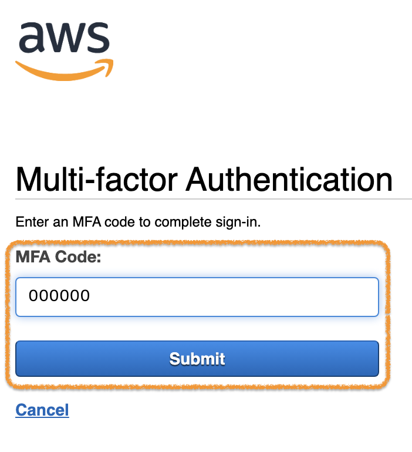
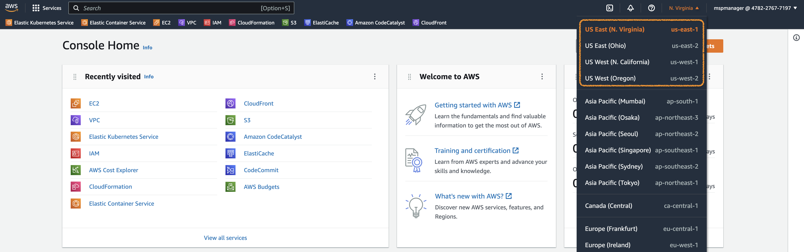
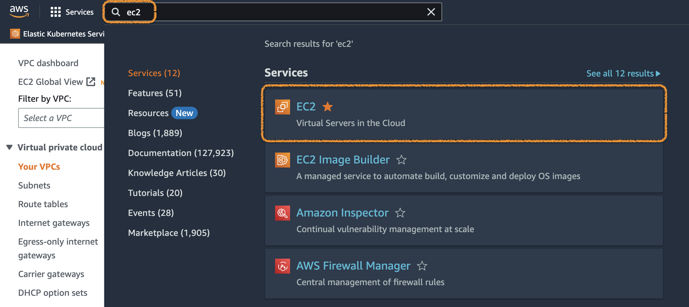
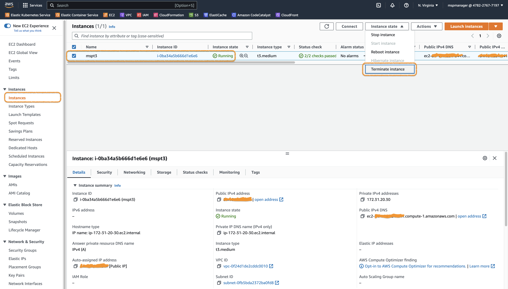
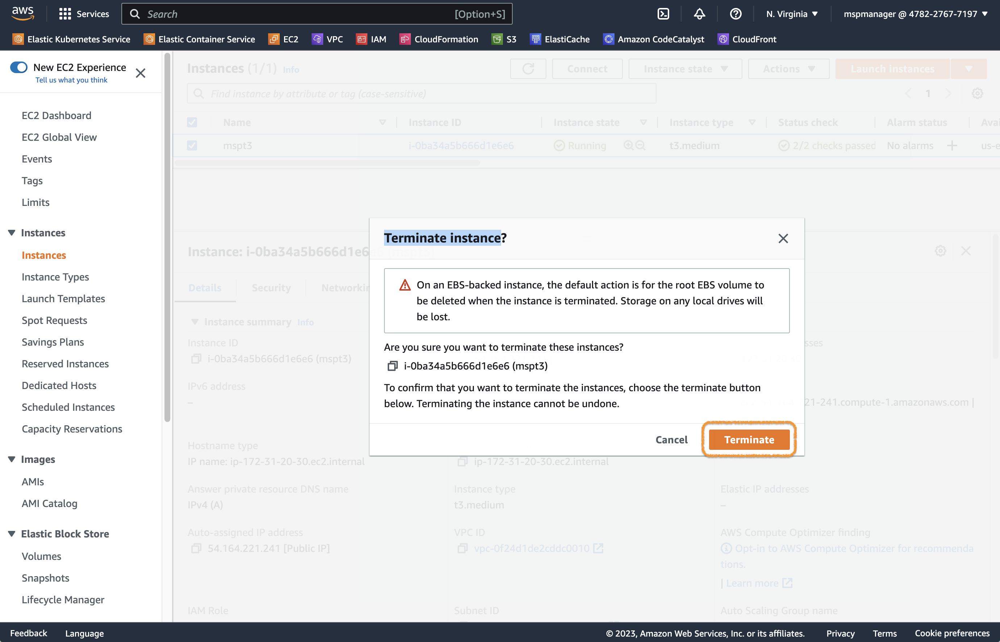
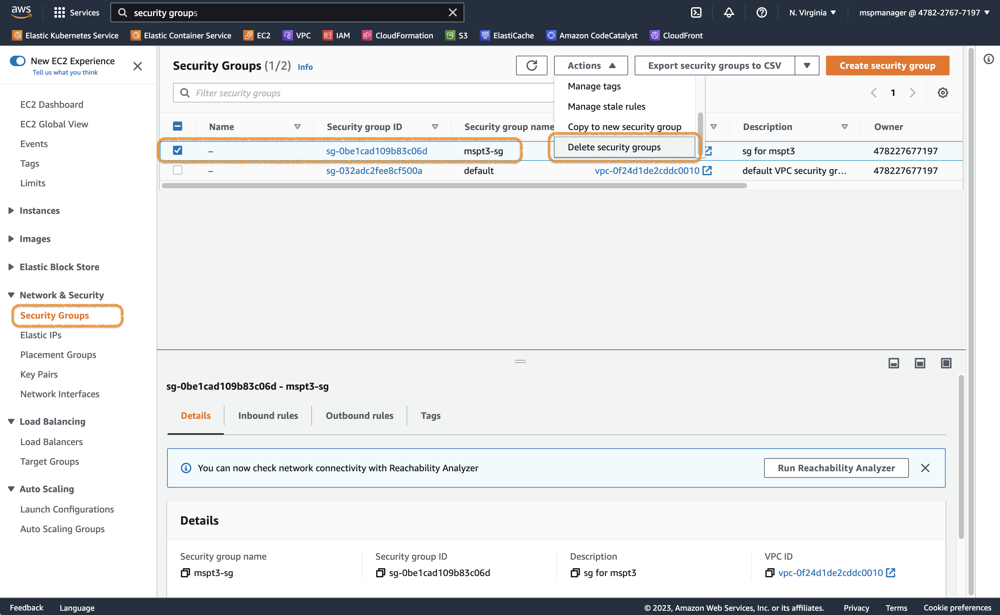
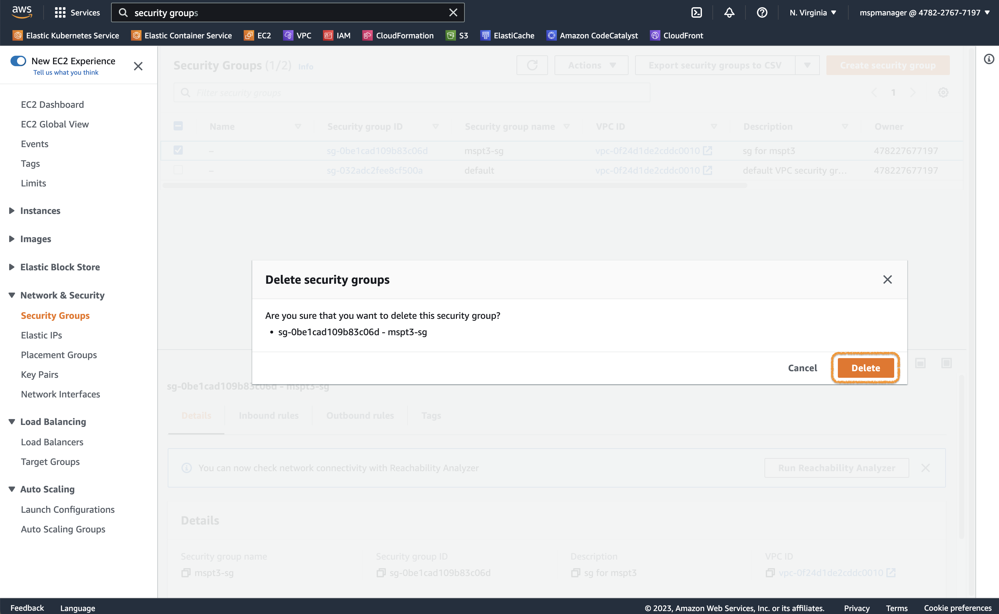

# [Hands-on] 16. Environment termination

 

# Contents

**[1. VM Instance 삭제하기](#1-vm-instance-삭제하기)**  
**[2. Security group 삭제하기](#2-security-group-삭제하기)**

---

## 1. VM Instance 삭제하기

실습에 사용한 환경을 정리하겠습니다.

먼저 AWS Console에 로그인합니다.
[https://aws.amazon.com/console/](https://aws.amazon.com/console/)

> 화면 우측 상단의 `Sign in to the Console`을 클릭합니다.

   

  
> **Account ID**와 **IAM user name**을 이용해서 `sign in` 합니다.

   

  
> [MFA](https://docs.aws.amazon.com/ko_kr/singlesignon/latest/userguide/enable-mfa.html) 구성을 한 경우, 위 그림과 같은 화면에서 MFA Code를 입력해야 합니다.

   

  
> 우측 상단 **Region** 선택 메뉴에서 **US East(N. Virginia) us-east-1**을 선택합니다.

   

먼저 EC2 Instance를 삭제할게요.

  
> **서비스** 중에서 **EC2**를 검색하고 이동합니다.

   

  
> Instances 메뉴에서 삭제할 EC2 Instance를 선택하고, 오른쪽 위의 메뉴에서 `Terminate instance`를 실행합니다.

   

정말로 삭제할거냐고 물어보네요.  
미련없이 보내주기로 해요.

어느정도 시간이 지나고 나면, EC2 Instance의 상태가 **Terminated**로 바뀌어 있을거예요.  
그리고, 시간이 더 지나면 목록에서도 사라집니다.

🤔 다음 단계로 넘어가기 전에 **Terminated** 상태로 바뀔 때까지 기다려주세요. 다음 단계(2. Security group 삭제하기)는 EC2 Instance가 완전히 삭제된 후 진행 가능합니다.

     

## 2. Security group 삭제하기

다음은 Security group도 삭제하겠습니다.

같은 화면에서 **Network & Security** 아래 **Security Groups** 메뉴를 선택합니다.

> 사용한 Security group (mspt3-sg)을 선택하고, `Delete security groups`를 실행합니다.

   

> 삭제 버튼을 눌러서 삭제해주세요.

우리 시간은 여기까지 입니다.   ( ᴗ_ᴗ̩̩ )  
그동안 수고하셨습니다. 

남은 과정도 모두 열공하셔요.  ＿〆(。╹‿ ╹ 。)