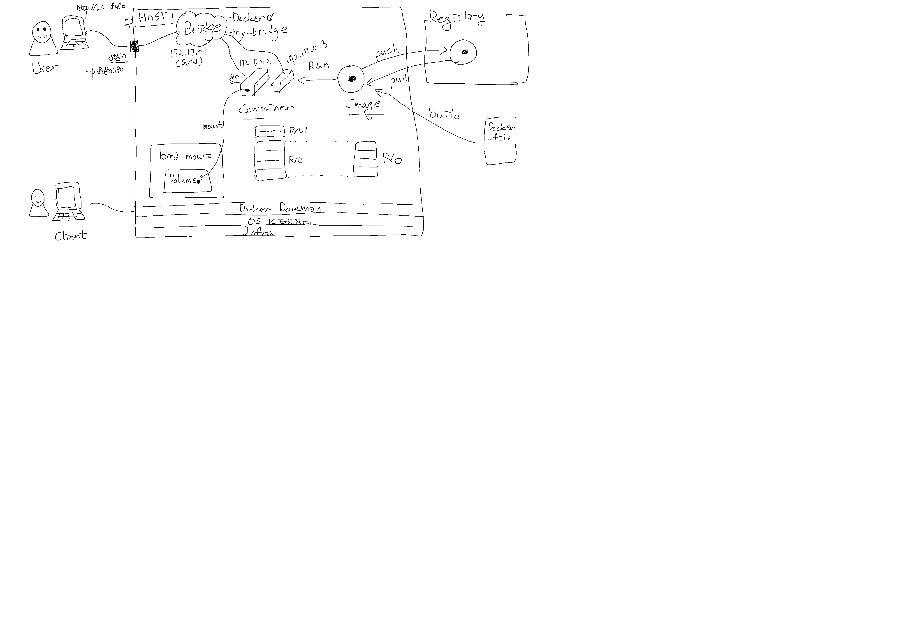

# Docker & Kubernetes 노트 (MSP T2 11차) ( ﾉ ﾟｰﾟ)ﾉ

## Q&A

### Docker

- docker는 기본적으로 host의 OS 기반으로 동작한다고 하셨는데요 그럼 windows 기반에서 docker image를 만들면 이 이미지를 linux 기반 환경에서 쓸 수 있는건가요?
  - Windows는 Windows container가 따로 있습니다. Windows OS를 사용하는 컨테이너이고, 이미지를 만드는 환경 보다는 거기 사용된 Base 이미지에 따라 나뉩니다.
  - [Windows and Containers](https://docs.microsoft.com/en-us/virtualization/windowscontainers/about/) 참고하세요.


- docker commit 명령어로 새롭게 생성된 이미지를 실행하면(컨테이너를 만들면), 그 때도 새로운 컨테이너 이미지가 만들어지는 건가요?
  - 네, 맞습니다.
  - 예를들어 최초 이미지가 5개의 레이어를 가지고 있고, 그 이미지를 실행한 뒤(이 때 하나의 R/W 레이어가 만들어짐.) `docker commit`명령어를 이용해 이미지를 만들면 6개의 R/O 레이어를 가진 이미지가 됩니다.
  - 그 다음 새롭게 만들어진 이미지를 실행하면, 이번에는 6개의 R/O 레이어에 1개의 새로운 R/W 레이어가 더 만들어지게 됩니다.

- volume에 저장되는 범위는 mount된 container전체가 저장되는건가요? 혹은 DB처럼 data의 일부역역이 mount되어 저장되는건가요?
  - 일부영역 입니다.
  - 얘를들어 우리 hands-on의 내용(`docker run --detach --publish 3000:3000 --volume todo-db:/etc/todos --name my-todo-manager rogallo/101-todo-app:1.0.0`)처럼 실행하면, my-todo-manager 컨테이너 전체가 아니라 `/etc/todos`라는 디렉토리만 `todo-db` 볼륨에 마운트 됩니다.

- 하나의 Bridge network안에 여러 subnet이 있을 수 있나요?
  - 그건 안되나봅니다. ㅠㅠ 아래처럼 에러(doesn't support multiple subnets)가 발생하네요.
```
$ docker network create --driver=bridge --subnet=172.19.0.0/16 --subnet=172.20.0.0/16 br0
Error response from daemon: bridge driver doesn't support multiple subnets
```

- `docker run -d --volume todo-my-sql-data:/var/lib/mysql` 실행 후에 `ls /var/lib/mysql`해보면 조회되지 않는데, 생성되는게 아닌가요?
  - 그 위치는 컨테이너의 파일시스템 위치입니다. 호스트머신이 아닌 컨테이너에서 명령어를 실행해보면 보입니다.
  - `docker exec -it OOOO sh -c "ls /var/lib/mysql"`

- docker:Error response from daemon:pull access denied for jj/101-todo-app... 에러가 발생합니다.
  - jj/101-todo-app을 pull해오는 권한이 없어서인 것 같습니다.
  - 위의 repository를 public으로 설정하거나, 아니면 jj에 권한이 있는 계정으로 먼저 `docker login`후에 실행하시면 됩니다.

- 동일한 호스트 내에 있는 컨테이너는 외부에서 모두 같은 host ip로만 접근 가능한가요? 다른 공인 ip를 할당할 수도 있나요?
  - 방법은 여러가지가 있을 수 있습니다.
  - host 머신이 여러 ip를 가지도록 어댑터를 구성하거나
  - host 머신 앞쪽에 다른 proxy를 구성하거나
  - 하는 방법들이 있을 수 있습니다.


- my_bridge와 같은 새로운 비리지 네트워크 생성 시 subnet 대역은 지정하지 않으면 자동으로 설정되나요?
  - 지정하지 않으면 자동으로 지정되고,
  - `--subnet` 옵션으로 지정해서 생성할 수도 있습니다.
  - `docker network create --driver=bridge --subnet=192.168.0.0/16 br0` 이런 식으로 가능합니다.

- 컨테이너가 중지되면 container layer가 컨테이너와 함께 제거되는데, 그 때 R/O 레이어와 R/W 레이어 둘 다 사라진다는 건가요?
  - 아니오, R/W 레이어(Container layer)만 사라집니다.
  - R/O 레이어 (Image layer)는 그대로 남아있습니다.
  - R/O 레이어는 Image를 삭제할 때 삭제됩니다.

- CI/CD  


- Docker summary  



---

### Kubernetes

- deployment 업데이트 시 `kubectl set image..`명령으로 하면, deployment yaml의 spec.은 변경이 안되고 현재 Deployment object정보만 변경되는건가요? 만약 나중에 다시 yaml파일로 적용하면, 구 버젼으로 돌아가게 되나요?
  - 네, 맞습니다. `kubectl set image...`나 `kubectl edit ...`같은 명령은 현재 Object를 직접 변경하는 것입니다. (yaml파일을 수정해서 적용하는 것이 아닌)
  - 그래서, 버젼관리/history관리 등을 위해서 yaml파일을 수정하고 반영하는 것이 실무에서는 더 많이 사용되는 방법입니다.
  - 명령형 커맨드는 간단히 테스트해보거나 할 때만 사용된다고 보시면 됩니다.

- spec. update해서 pod가 새로 생성되면 age가 새로 세팅되는건가요?
  - 네, 맞습니다.
  - deployment spec.이 변경되면(e.g. tag 변경) 새로운 replicaset이 만들어지고, 기존의 replicaset이 관리하던 pod는 삭제되면서 새로운 replicaset에 의해서 새로운 pod들이 생성됩니다. 새로 생성되었으니 그 생성시점으로 age가 표시됩니다.

- Max surge 는 의도한 pod수 (Desired)에 대한 건가요?
  - 그것과는 다릅니다. desired는 운영 시점에 필요한 pod의 개수이고, max surge는 업데이트 되는 동안에 최대한 추가로 생성될 수 있는 범위입니다.
  - rolling update 업데이트 되는 동안에는 Desired 숫자만큼의 pod를 유지하지는 않고, +/- 허용치를 Max surge와 Max unavailable로 정의하는 것입니다.

- Deployment에 여러개 replicaset을 정의할 수 있나요? 하나인 것 같은데...
  - 네, 맞습니다. 하나의 Deployment 에는 하나의 replicaset spec.이 정의된다고 보면 됩니다.
  - 실제로 만들어지는 replicaset은 여러개 이지만, 이건 업데이트 시 구 버젼은 desired숫자를 줄이고(그래서 실제로 pod는 삭제되고) 신 버젼은 desired숫자를 높여서(그래서 실제로 새로운 버젼의 pod가 생성되는) 관리하는 방식입니다.
  - Current state의 deployment와 replicaset은 1:1 이라고 보시면 됩니다.

- 같은 Node안에 있는 pod들 간에도 service를 통해야 되는건가요?
  - 그렇지는 않습니다. 클러스터 내부에서는 각 Pod의 Cluster ip로도 접근 가능합니다.
  - 하지만, 그 cluster ip는 유동적이기 때문에 테스트나 간단한 확인같은 경우만 cluster ip를 사용하면 되고, 그 외의 경우는 service를 구성해서 하는것이 좋습니다.

- service라는 오브젝트는 node단위나 cluster단위 어느정도에 위치하고 있는건가요?
  - 표현을 하자면 클러스터 단위로 관리되는 오브젝트 입니다. (특정 노드가 지정되지는 않는)
  - Pod도 편의상 Node에 생성되는 것처럼 표현하지만, 사실은 클러스터 단위에서 관리되는 오브젝트이고, 실제 실행되는 컨테이너는 Node에서 실행되는 것입니다.

- 서비스도 로드밸런서 기능이 있는데, 왜 별도의 로드밸런서를 구성하나요?
  - LB타입의 서비스를 구성하면, 외부 LB는 노드간 LB역할을 하게됩니다. (e.g. AWS에 LB를 구성하면 그 LB의 타겟 그룹은 클러스터의 노드들이 됩니다.)

- 클러스터 내/외부에서 사용하는 서비스가 여러개가 되면 그게 혼용되어 사용될 수 있는건가요?
  - 여러가지 중 한 가지를 선택해서 사용합니다.
  - 교재는 비교를 위해서 여러개를 그려놓은 것입니다.
  - 예를들어 NodePort타입의 서비스를 생성하면, ClusterIP타입의 서비스의 특징을 가지고 있으면서 NodePort의 특징을 추가로 더 가지는 형태입니다.

- 교재에서 Deployment와 template(Pod spec.)에 둘 다 label이 있는데, svc는 어떤걸 select하나요?
  - Pod의 Label을 선택합니다. 
  - Deployment의 label은 그냥 같이 설정되어있긴 하지만, svc는 그게 아닌 pod의 label을 보고 선택하게 됩니다.

- 만약 특정 pod에서 장시간 수행되는 job이 있는데 update/deploy를 하게되면, 기존 pod는 어떻게 종료되나요? (강제종료? 아니면, 끝날때를 기다리고 종료?)
  - 설정할 수 있습니다.
  - 기본적으로는 수행중이던 것을 마치고 종료하게 됩니다. ( Graceful shutdown : SIGTERM신호를 먼저 보내고, 이후에 SIGKILL )
  - [파드의 종료](https://kubernetes.io/ko/docs/concepts/workloads/pods/pod-lifecycle/#pod-termination) 부분도 참고하세요.
