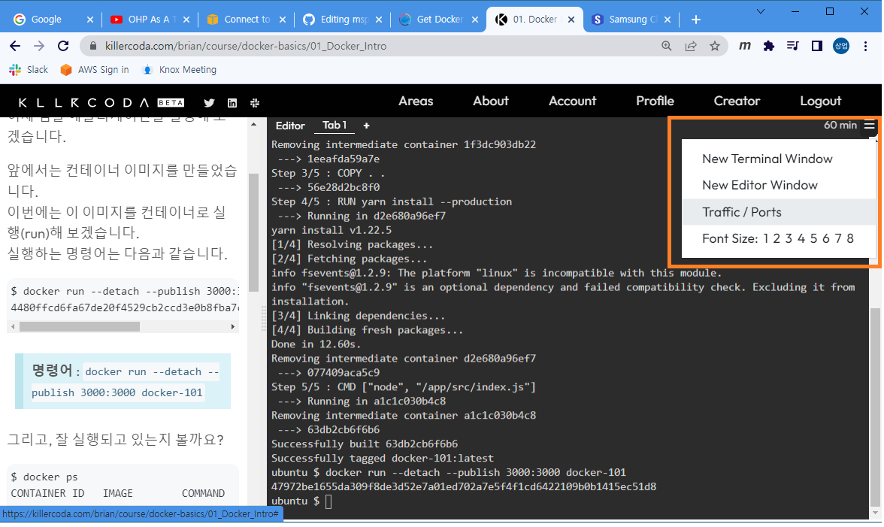
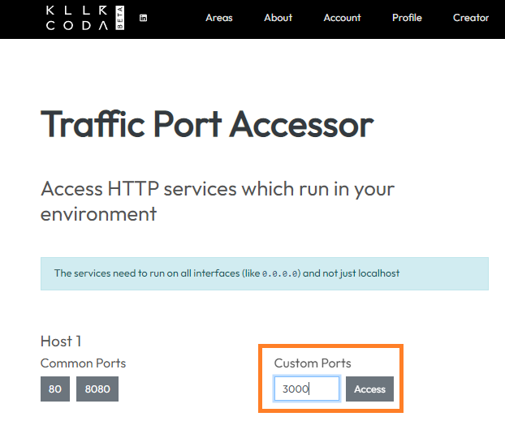

# Docker & Kubernetes 노트 (MSP T2 23-2차) (●'◡'●)
## Q&A

### Docker

- App별로 다른 OS를 사용한다면, OS를 공유하는 컨테이너는 사용 못하는건가요?
  - 아니오, 그렇지 않습니다.
  - OS Kernel 을 공유하고, 배포판별로 달라지는 건 컨테이너 이미지를 만들 때 다른 배포판을 사용해서 만들 수 있습니다.
  - 예를들어, 같은 Kernel위에서 Ubuntu와 CentOS 기반의 애플리케이션을 모두 실행할 수 있습니다.

- OS가 다양하고 이미지에 포함된 것 같은데, OS가 다양하면 그만큼 인프라 자원을 사용하게 되나요?
  - 인프라 자원은 한정적이기 때문에 Control group을 이용하여 자원을 적절히 나눠서 쓰게 됩니다.

- Hypervisor라는 레이어는 어떤 역할을 해주는건가요?
  - 가상머신(Virtual machine)을 제공해주기 위해서 사용되는 가상화솔루션 입니다.
  - Infrastructure(H/W)를 가상화 해서 자원(CPU, Memory, Network)을 공유해서 쓸 수 있도록 합니다.

- 코드와 종속성을 패키징 하는 소프트웨어의 표준 단위입니다. 에서 `종속성`은 무엇을 의미하나요?
  - App. 을 위한 코드도 필요하지만, 여러가지 종속된 라이브러리나 오픈소스 패키지들이 필요할 수 있습니다. 그 부분을 모두 컨테이너에 담는다는 의미입니다.
  - 예를들어 A 시스템이 Log4j를 이용한다면 그 부분도 패키징한다는 의미입니다.

- Container 와 VM 비교에서 VM이 격리/보안 측면에서 더 좋다고 했는데, 어떤 부분이 더 좋은건가요?
  - Volume파트를 보시면 좀 더 도움이 될 것 같습니다.
  - Container는 Host의 파일시스템이나 네트워크를 직접 사용하는 방법을 제공합니다. (잘 못 사용하면, 다른 컨테이너나 Host의 프로세스에 영향을 줄 수 있습니다.)
  - VM은 OS가 분리되어 있기 때문에, 위와같은 위험성은 상대적으로 적습니다.

- [Killercoda](https://killercoda.com/) 에서 포트접속 방법 다시 알려주세요.
  - 우측상단 메뉴 > Traffic/Ports > Custom Ports에 접속하려는 포트 설정 후 `Access`버튼 클릭




- Registry를 로컬 서버에 구축할 수 있는건가요?
  - 네, 가능합니다.
  - [Docker Registry - Basic commands](https://docs.docker.com/registry/#basic-commands) 의 **Start your registry** 부분 참고하세요.
  - 위 방법 말고도, Private registry를 구축하는 다양한 방법이 있습니다. (e.g. [Harbor](https://goharbor.io/) 와 같은 솔루션을 사용)

- 만약 서로다른 레이어인데 같은 경로의 같은 이름의 파일이 있다면 어떻게 되나요?
  - 위의 레이어가 우선합니다.

- Container는 Instance라고 했는데, 해당 레이어(Container layer)의 내용은 휘발성인가요?
  - 네, 맞습니다.
  - 그래서 뒤에 Volume이라는 걸 배울 예정입니다. (휘발성 레이어의 내용을 기록하는 방법)

- 해당 Layer가 이미 Image로 포함되었는데, 사라지지는 않겠죠?
  - 네, Image레이어는 Read only이고 사라지지 않습니다.
  - 단, 컨테이너가 실행되는 동안에 Container layer에서 Image layer의 내용을 삭제(실제로 삭제되지은 않고, 위의 레이어에서 삭제처리만 함)할 수는 있습니다.
  - 위의 경우에도 같은 Image layer를 사용하는 다른 컨테이너에서는 삭제되지 않은 상태로 사용 가능합니다.

- 이미지의 레이어들 중 가장 위의 0B 레이어는 어떤 의미인가요?
  - 교재 그림의 가장 위 레이어를 말씀하시는 것 같습니다.
  - 특별한 의미는 없고, 예시인 것 같습니다.
  - 보통은 각 레이어마다 파일들이 존재하기 때문에 어느정도의 사이즈를 가지고 있습니다.

- LB로 컨테이너를 여러개 실행하면 컨테이너 레벨에서 레이어를 쌓은건 복사 안되고, 이미지 단계에서 쌓은 레이어가 여러개가 되는건가요?
  - Image layer들의 내용은 공유를 하고(같은 파일시스템의 파일을 사용하고), 각 컨테이너의 레이어만 별도로 가지게 됩니다.

- 컨테이너가 여러개 있다면 정합성 문제는 없나요?
  - 그런 문제들은 애플리케이션에서 해결해야 합니다. (자동으로 동기화 되지는 않습니다.)
  - 예를들어 DB 라면 각 컨테이너별로 데이터를 replication해야 합니다.

- Base image는 누군가 만들어놓은 거라고 했는데, 공유된것만 쓰나요? 내가 만들어둔걸 쓸 수도 있나요?
  - 다 가능합니다.
  - [Docker Hub](https://hub.docker.com/)와 같은곳에 공개된 Image를 Base로 할 수도 있고, Private registry에 있는 우리 팀의 이미지를 Base로 할 수도 있습니다.
  - 나만의 이미지를 만들어서, 그걸 Base로 할 수도 있습니다. (Registry에 공유하지 않고)

- Run을 실행하는 시점에 Container layer가 daemon에 의해서 생성된다고 보며 될까요?
  - 네, 맞습니다.

- 동일한 실행 파일(이미지)을 detatched와 foreground모드로 다 실행 가능한가요?
  - 네, 대부분 가능합니다.
  - 보통 Web application같은 경우는 detached 형태로 실행하는 경우가 많습니다. 하지만, foreground모드로 실행하고 shell 명령어를 이용해서 개발단계나 디버깅 시 살펴볼 수 있습니다.
  
- docker stop이나 run명령어 실행 시 특정 컨테이너나 이미지를 지정하지 않으면 모든 이미지에 적용되나요?
  - 아니오, 그렇지 않습니다.
  - 컨테이너를 조작하는 명령어는 뒤에 컨테이너를, 이미지를 조작하는 명령어는 뒤에 이미지를 주도록 되어있습니다. 지정하지 않으면 에러가 발생합니다.

- Attach와 exec의 차이는 attach는 컨테이너 내부로 진입(attach)하는 것이고, exec는 바로 명령어를 실행시키는건가요?
  - 네, 맞습니다.
  - 예를들어 아래와 같은것이 가능합니다. (docker exec my-ubuntu bash -c "cat /etc/os-release")

```bash
ubuntu@ip-10-0-3-56:~$ docker ps
CONTAINER ID   IMAGE     COMMAND   CREATED         STATUS         PORTS     NAMES
e0d3f83c223b   ubuntu    "bash"    6 seconds ago   Up 6 seconds             my-ubuntu
ubuntu@ip-10-0-3-56:~$ docker exec my-ubuntu bash -c "cat /etc/os-release"
PRETTY_NAME="Ubuntu 22.04.1 LTS"
NAME="Ubuntu"
VERSION_ID="22.04"
VERSION="22.04.1 LTS (Jammy Jellyfish)"
VERSION_CODENAME=jammy
ID=ubuntu
ID_LIKE=debian
HOME_URL="https://www.ubuntu.com/"
SUPPORT_URL="https://help.ubuntu.com/"
BUG_REPORT_URL="https://bugs.launchpad.net/ubuntu/"
PRIVACY_POLICY_URL="https://www.ubuntu.com/legal/terms-and-policies/privacy-policy"
UBUNTU_CODENAME=jammy
```

- search할 때 레지스트리 위치는 선택할 수 있는건가요?
  - [docker search](https://docs.docker.com/engine/reference/commandline/search/) 는 [Docker hub](https://hub.docker.com/)에서만 검색하는 것 같습니다.
  - 다른 Registry에 로그인 후 search를 해도 동일하게 Docker hub의 검색 결과를 보여주네요.

- ReDii같은 또는 개인 Custom registry는 config로 어딘가에 등록해 놓고 pull, push할 수 있는건가요?
  - `docker login` 명령어를 실행하고 나면 그 다음부터는 로그인 한 registry에서 push, push를 합니다.
  - 일반적으로 사내에서 업무시스템을 운영한다고 하면, ReDii에 로그인 하고 ReDii에서 이미지를 pull하여 실행합니다.

- `Docker Commit`은 어떤경우에 사용하나요?
  - 컨테이너를 실행해서 발생한 파일시스템상의 변경사항 (파일의 생성/수정/삭제)을 포함해서 새로운 이미지를 만들 때 사용됩니다.

- Base image를 사용하지 않으면 그냥 커널OS를 사용하는 걸까요?
  - 애플리케이션을 실행하기 위해서 필요한 부분만 넣어서 이미지를 만들 수 있습니다.
  - Base image를 사용하지 않는 유형은 뒤에서 배울 FROM instruction에 scratch를 설정하는 방법입니다.
  - 이 상태에서 필요한 파일들만 추가해서 이미지를 만들 수 있습니다.

- Bind mounts는 같은 컨테이너가 바라볼 수 없거나 컨테이너간 공유가 안되는건가요?
  - 그렇지는 않습니다.
  - 기본적인 동작은 Volume과 같습니다.
  - 저장되는 위치가 달라지는 것입니다.
  - 아래는 bind mount유형으로 두 개의 컨테이너를 실행해서 같은 경로를 마운트한 경우입니다. (같은 파일이 보입니다.)

```bash
ubuntu $ ls -al /volume/bindmount/
total 8
drwxr-xr-x 2 root root 4096 Jan 17 05:55 .
drwxr-xr-x 3 root root 4096 Jan 17 05:55 ..
-rw-r--r-- 1 root root    0 Jan 17 05:55 mspt2
ubuntu $ docker run -it --name ubuntu1 -v /volume/bindmount:/tmp ubuntu
Unable to find image 'ubuntu:latest' locally
latest: Pulling from library/ubuntu
6e3729cf69e0: Pull complete 
Digest: sha256:27cb6e6ccef575a4698b66f5de06c7ecd61589132d5a91d098f7f3f9285415a9
Status: Downloaded newer image for ubuntu:latest
root@eeba64471e62:/# ls -al /tmp
total 8
drwxr-xr-x 2 root root 4096 Jan 17 05:55 .
drwxr-xr-x 1 root root 4096 Jan 17 05:57 ..
-rw-r--r-- 1 root root    0 Jan 17 05:55 mspt2
root@eeba64471e62:/# ubuntu $ 
ubuntu $ docker run -it --name ubuntu2 -v /volume/bindmount:/tmp ubuntu
root@4159e59a2ea8:/# ls -al /tmp
total 8
drwxr-xr-x 2 root root 4096 Jan 17 05:55 .
drwxr-xr-x 1 root root 4096 Jan 17 05:57 ..
-rw-r--r-- 1 root root    0 Jan 17 05:55 mspt2
root@4159e59a2ea8:/# ubuntu $
```

- 꼭 `docker volume create`로 만들고 사용해야 하나요?
  - 아니오, 뒤에 예제에서 그렇지 않은 경우도 다루고 있습니다. (없으면 알아서 자동으로 만들어줍니다.)
  
- 뒤의 목표(target) 이름은 임의로 입력할 수 있는건가요?
  - Container에서 사용할 파일시스템 경로를 입력하면 됩니다.
  - 없는 경우 디렉토리를 만들어줍니다.


- Volume 만들 때 용량은 지정할 수 있나요?
  - [Driver-specific options (-o, --opt)](https://docs.docker.com/engine/reference/commandline/volume_create/#-driver-specific-options--o---opt)을 이용하면 드라이버에 따라 용량을 지정할 수는 있는 것 같습니다.
  - Kubernetes에서는 PVC, PV를 이용하여 데이터를 저장하게 되는데, 이때는 명확하게 용량을 지정할 수 있습니다.(내일 배우게 됩니다.)
  
- Bind mount를 할 때 경로를 Volume의 경로로 지정할 수도 있는건가요? 그럼, 동일한 개념으로 사용되나요?
  - 지정은 할 수 있지만, 다른 개념입니다.
  - Volume은 도커의 Object로 관리가 되고, Bind mount 경로는 단지 Host 머신의 경로에 마운트되어 사용될 뿐입니다.
  
- 브릿지는 G/W IP랑 같을 수 있나요?
  - G/W IP와 Subnet 아이피 대역이 지정되어 있습니다.
  - 컨테이너는 subnet 대역 내에서 아이피를 할당받게 됩니다. (자동, 혹수 수동 지정도 가능합니다.)

- Bridge네트워크를 사용하면 Host를 사용하는 것에 대비해 장점이 있나요?
  - 같은 설정의 컨테이너라면, Host네트워크인 경우 여러개를 동시에 실행할 수 없습니다. (e.g. 80포트를 사용하는 웹서버)
  - 하지만, Bridge 네트워크는 같은 설정의 컨테이너를 실행하더라도 host에 노출되는 port를 달리해서 실행할 수 있습니다.
  
- ReDii는 SDS의 Private registry이름이라고 했는데, 상용이나 일반용어가 아닌 SDS에서 사용하는 용어인가요?
  - 네, 맞습니다. 그냥 Private registry에 이름을 ReDii라고 붙여놓은 것입니다. (뭔가의 약자일 것 같긴 한데, 저도 잘... ^^)

- `--network-alias mysql` 와 `--env MYSQL_HOST=mysql` 은 host file의 IP alias와 같은 기능이라고 보면 될까요?
  - 네, 같은 기능이라고 보시면 됩니다.
  - Container도 동적으로 IP를 할당받긴 하지만, IP를 가지고 네트워크를 구성하는것은 비효율적이어서 alias를 지정하고 사용합니다.

- Volume 사용 시 default경로로 외장 스토리지를 mount해야 하므로 Bind mount가 좀 더 유리할 것 같은데, OS상의 directory rwx mode를 조정해서 권한관련 취약점을 제거할 수 있는 방법은 없는가요?
  - 위치상의 자유도가 높기는 하지만, 그 외에 특별히 Bind mount가 더 유리한 것은 없습니다.
  - 말씀하신 mode 조정으로 어느정도 권한관리를 할 수 있겠지만 좀 번거로운 작업이 될 것 같습니다. 

- 현업에서는 Volume을 더 많이 사용하나요?
  - Kubernetes를 통해서 사용하는 경우가 많기 때문에, Kubernetes의 Volume을 사용합니다. (내일 배우게됩니다.)

- 이미지 빌드할 때 EXPOSE를 안해줬거나 다른 포트를 expose했는데, docker run할 때 다른 포트로 열면 통신이 안되나요?
  - 이미지 자체에 사용된 프로세스가 사용하는 포트가 있을텐데, 잘 못 EXPOSE하고 사용하면 통신이 안됩니다.
  - 예를들어 [Nginx Dockerfile](https://github.com/nginxinc/docker-nginx/blob/master/stable/alpine-slim/Dockerfile)에서 `EXPOSE 80` 부분을 `EXPOSE 90`으로 바꾸고 빌드해서 실행하면 아래와 같은 결과가 보입니다.
  - 하지만, EXPOSE에서 잘 못 설정했더라도 실행 시점에 정확히 80포트로 연결하면 동작은 합니다. (아래 참조)

```bash
ubuntu@ip-10-0-3-56:~/temp/docker-nginx/stable/alpine-slim$ cat Dockerfile
#
# NOTE: THIS DOCKERFILE IS GENERATED VIA "update.sh"
#
# PLEASE DO NOT EDIT IT DIRECTLY.
#
FROM alpine:3.17

LABEL maintainer="NGINX Docker Maintainers <docker-maint@nginx.com>"

ENV NGINX_VERSION 1.22.1
ENV PKG_RELEASE   1

............
... 생략 ...
............

EXPOSE 90

STOPSIGNAL SIGQUIT

CMD ["nginx", "-g", "daemon off;"]
ubuntu@ip-10-0-3-56:~/temp/docker-nginx/stable/alpine-slim$ docker build -t mynginx:v1 .
Sending build context to Docker daemon  20.48kB
Step 1/13 : FROM alpine:3.17
 ---> 042a816809aa
 
............
... 생략 ...
............

ubuntu@ip-10-0-3-56:~/temp/docker-nginx/stable/alpine-slim$ docker run -d --publish-all mynginx:v1
ab83634bbd5d2c097a1a0327a1ac39ddf717054a9c0170593cc22dc74871b239
ubuntu@ip-10-0-3-56:~/temp/docker-nginx/stable/alpine-slim$ docker ps
CONTAINER ID   IMAGE        COMMAND                  CREATED          STATUS          PORTS                                     NAMES
ab83634bbd5d   mynginx:v1   "/docker-entrypoint.…"   12 seconds ago   Up 11 seconds   0.0.0.0:32769->90/tcp, :::32769->90/tcp   silly_mendel
ubuntu@ip-10-0-3-56:~/temp/docker-nginx/stable/alpine-slim$ curl localhost:32769
curl: (52) Empty reply from server

ubuntu@ip-10-0-3-56:~/temp/docker-nginx/stable/alpine-slim$ docker run -d -p 8080:80 mynginx:v1
84934ace64675502dce5e2651c8adf2cdfd79f3af4e4da630bd4631b29a10607
ubuntu@ip-10-0-3-56:~/temp/docker-nginx/stable/alpine-slim$ docker ps
CONTAINER ID   IMAGE        COMMAND                  CREATED              STATUS              PORTS                                           NAMES
84934ace6467   mynginx:v1   "/docker-entrypoint.…"   7 seconds ago        Up 6 seconds        90/tcp, 0.0.0.0:8080->80/tcp, :::8080->80/tcp   funny_lehmann
ab83634bbd5d   mynginx:v1   "/docker-entrypoint.…"   About a minute ago   Up About a minute   0.0.0.0:32769->90/tcp, :::32769->90/tcp         silly_mendel
ubuntu@ip-10-0-3-56:~/temp/docker-nginx/stable/alpine-slim$ curl localhost:8080
<!DOCTYPE html>
<html>
<head>
<title>Welcome to nginx!</title>
<style>
html { color-scheme: light dark; }
body { width: 35em; margin: 0 auto;
font-family: Tahoma, Verdana, Arial, sans-serif; }
</style>
</head>
<body>
<h1>Welcome to nginx!</h1>
<p>If you see this page, the nginx web server is successfully installed and
working. Further configuration is required.</p>

<p>For online documentation and support please refer to
<a href="http://nginx.org/">nginx.org</a>.<br/>
Commercial support is available at
<a href="http://nginx.com/">nginx.com</a>.</p>

<p><em>Thank you for using nginx.</em></p>
</body>
</html>

```

- 도커빌드를 젠킨스에서 실행 시 빌드한 jar파일을 젠킨스 내부 저장소에 가지고 있나요? ... 생략 ...
  - 패키징된 artifact(e.g. jar/war)는 젠킨스에서 컨테이너 이미지로 copy됩니다. (이미지의 layer에 저장됩니다.)
  - 그리고, 컨테이너가 만들어질 시점에는 이미지가 가지고 있는 파일시스템의 artifact(앞에서 COPY된 것)을 사용합니다.

- 업무중에는 컨테이너를 먼저 할당받고 이 후 app 이미지를 할당받은 컨테이너에 배포하는 방식으로 진행했는데요, 컨테이너가 이미지를 실행한 인스턴스라고 해서 혼란스러워요. .... 생략 ...
  - 수업 중 설명드렸듯이 우리회사의 시스템은 WAS Base이미지를 가지고 먼저 컨테이너를 생성한 다음, Base + App.으로 새롭게 만들어진 이미지를 이용해서 업데이트를 하고 있습니다.

- Multistage-build 예제에서 COPY보다 CMD가 앞에 있는데 실행할 파일이 없어도 CMD명령어가 실행되나요?
  - COPY는 빌드 시점에 컨테이너 이미지로 파일이 복사되는 것이고, CMD는 실행 시점에(이미지를 실행해서 run하는 시점에) 실행되기 때문에 문제가 없습니다.
  - 명확하게 하려면 CMD를 뒤에 배치하는 것도 좋아보이네요.

- Multistage-build에서 연관된 binary들이 모두 hello에 포함되었을텐데, hello만 결과물에 포함시켜 최종 이미지의 크기가 크게 줄어든다는 부분이 이해가 잘 안됩니다.
  - 사용된 Base image에 의한 차이가 크다고 보시면 됩니다.
  - go build에 필요한 패키지가 포함된 Base image를 build stage에 이용하고, production stage에서는 아무것도 없는 scratch를 base로 해서 hello실행파일만 포함시켜서 이미지를 만든 것입니다.
  - hello자체의 크기보다는 base image를 최소화해서 쓸 수 있다는 측면으로 이해하시면 됩니다. (java라면 jdk보다는 jre를 사용해서 사이즈를 줄임.)


- Docker overview p7, p8 namespace에서 user, mnt 가 다르게 되어있는데, 어떤걸 기준으로 이해하면 될까요?
  - 둘 다 있는것입니다. 교재는 생략하고 표시되어서 그렇습니다.
  - 추가교재 [01_Containers.md](https://github.com/JungSangup/mspt2/blob/main/doc/%5BAppendix%5D%2001_Containers.md) 도 참고하세요.

- Docker_commmands P4 백그라운드에서 실행되는 모드 프로세스의 standard..... 는 Foreground 에 대한 설명인가요?
  - 자세히 보시면 표가 나뉘어 있습니다. (표의 세로줄이 잘 안보이네요.ㅠㅠ)
  - Detatched : 백그라운드에서 실행되는 모드
  - Foreground : 프로세스의 standard I/O, standard error에 console 로 연결
  - 입니다.

- Dockerfile p15 `COPY \$FOO /quux` 부분에서 \는 왜 들어간건가요?
  - escape 입니다.
  - COPY 부분은 $가 들어간 파일( 파일명이 $FOO 인 파일 )을 처리하기 위해서인 것 같습니다.
  - `$FOO`나 `${FOO}`는 환경변수인 FOO에 정의된 /bar를 사용하는 것이고, COPY 다음의 \$FOO는 파일명이 $FOO인 파일(환경변수와 무관한 파일)을 복사합니다.
  - [Environment replacement](https://docs.docker.com/engine/reference/builder/#environment-replacement)의 내용 참고하세요.

```bash
ubuntu $ cat Dockerfile 
FROM busybox
ENV FOO=/bar
WORKDIR ${FOO}
ADD . $FOO
COPY \$FOO /quux
ubuntu $ cat ./context/\$FOO
This is $Foo
ubuntu $ cat ./context/test_file 
This is test_file
ubuntu $ docker build -t env_test -f Dockerfile context
Sending build context to Docker daemon  3.631kB
Step 1/5 : FROM busybox
 ---> 66ba00ad3de8
Step 2/5 : ENV FOO=/bar
 ---> Running in 1ad544343df8
Removing intermediate container 1ad544343df8
 ---> db8f35ae0a3e
Step 3/5 : WORKDIR ${FOO}
 ---> Running in bd2fcfc76947
Removing intermediate container bd2fcfc76947
 ---> 00e7bcbd2be7
Step 4/5 : ADD . $FOO
 ---> fd5484b762e0
Step 5/5 : COPY \$FOO /quux
 ---> 87cd09952493
Successfully built 87cd09952493
Successfully tagged env_test:latest
ubuntu $ docker run -it env_test
/bar # 
/bar # ls -al /bar
total 16
-rw-r--r--    1 root     root            13 Jan 18 14:23 $FOO
drwxr-xr-x    1 root     root          4096 Jan 18 14:24 .
drwxr-xr-x    1 root     root          4096 Jan 18 14:25 ..
-rw-r--r--    1 root     root            18 Jan 18 14:23 test_file
/bar # cat /bar/\$FOO
This is $Foo
/bar # cat /bar/test_file
This is test_file
/bar # cat /quux
This is $Foo

```

- Dockerfile p16 ADD는 압축을 자동으로 풀어서 복사한다고 했는데, 다음줄에 RUN으로 다시 tar를 푸는 이유는 뭔가요?
  - 압축의 자동풀림은 `local`인 경우만 된다고 하네요. URL로 부터 받은 파일은 안된다고 합니다. (저도 이제 알았네요.. 감사합니다. 꾸벅~  교재도 업데이트 해서 올려놓았습니다.)
  - "If <src> is a local tar archive in a recognized compression format (identity, gzip, bzip2 or xz) then it is unpacked as a directory. Resources from remote URLs are not decompressed."
  - [ADD](https://docs.docker.com/engine/reference/builder/#add) 참고하세요. 스크롤을 좀 내리면 위의 문구가 있습니다.
  - 아래 예제에서 `big.tar.xz`파일은 URL을 통해 받은 파일이라 자동으로 압축이 풀리지 않은 경우입니다.

```bash
ADD http://example.com/big.tar.xz /usr/src/things/
RUN tar -xJf /usr/src/things/big.tar.xz -C /usr/src/things
RUN make -C /usr/src/things all  
```
  
- Dockerfile p20 세번째 줄 RUN과 네번째 줄 VOLUME이 바뀌어야 하는 것 아닌가요? Volume생성 후에 파일을 생성해야할 것 같은데요.
  - VOLUME 명령어는 run 시점에 마운트할 위치를 지정하는 것입니다.
  - 실제 사용되는 디렉토리는 `RUN mkdir /myvol` 에서 생성을 하고 그 다음 레이어에서 사용하고 있습니다.

```bash
FROM ubuntu
RUN mkdir /myvol
RUN echo "hello world" > /myvol/greeting
VOLUME /myvol
CMD ["/bin/bash"]
```
  
- Dockerfile BP p5에서 길이가 4가 아니라 5 아닌가요?
  - 맞네요. ㅠㅠ
  - 교재 수정하고, 예제 추가해서 업데이트 해 놓았습니다. (git pull 다시 하시거나, 다시 다운로드 받으시면 됩니다.)
  
- Dockerfile BP p14 Container를 실행하는 것이 아니라 USER지시자를 이용하여 Process를 실행하는 것 아닌가요?
  - 네, 그 표현이 더 정확합니다.
  - 이 부분도 교재 수정해서 반영했습니다. (꾸벅)

---

### Kubernetes

- 명령형 커맨드 방식은 yaml에 써주어야 하는 replica개수 등 이런 추가 내용들은 커맨드 argument들로 일일이 주어서 실행해야 하나요?
  - 네, 맞습니다. 그래서 간단한 생성/수정/삭제 정도만 명령형을 사용하고, 복잡한 구성이 필요한 것은 선언형을 많이 사용합니다.

- `Selector`에서 = 와 ==의 차이는 뭔가요?
  - 타입까지 비교?
  - 같은 의미로 사용되는 것 같습니다. (혹시 다르면 업데이트 하도록 하겠습니다.)
  - 비슷한 예로 [필드 셀렉터](https://kubernetes.io/ko/docs/concepts/overview/working-with-objects/field-selectors/)가 있는데, 이 문서에는 명확하게 = 는 ==과 같다고 하고 있습니다. ([사용 가능한 연산자](https://kubernetes.io/ko/docs/concepts/overview/working-with-objects/field-selectors/#%EC%82%AC%EC%9A%A9-%EA%B0%80%EB%8A%A5%ED%95%9C-%EC%97%B0%EC%82%B0%EC%9E%90) 참조)

- `kubectl logs ~`의 결과에서 맨 앞의 이니셜은 뭔가요? ( I0118 01:41:10.313042       1 serving.go:348] Generated self-signed cert in-memory )
  - 로그레벨?   -> 맞네요. 힌트 주신 프로님. 고맙습니다. (  ･･)ﾉ(._. )
  - Kubernetes 시스템 컴포넌트는 [klog](https://github.com/kubernetes/klog) 를 로깅에 사용하고 있습니다.
  - kube-scheduler의 로그는 klog의 로깅 기준에 따라 아래와 같이 표시됩니다. (맨 앞의 `I`는 `Info`)
  - [시스템 로그](https://kubernetes.io/ko/docs/concepts/cluster-administration/system-logs/) 와 [Text logging format](https://github.com/kubernetes/community/blob/master/contributors/devel/sig-instrumentation/logging.md#text-logging-format) 참고하세요.
  
```bash
Lmmdd hh:mm:ss.uuuuuu threadid file:line] msg...

where the fields are defined as follows:
	L                A single character, representing the log level (eg 'I' for INFO)
	mm               The month (zero padded; ie May is '05')
	dd               The day (zero padded)
	hh:mm:ss.uuuuuu  Time in hours, minutes and fractional seconds
	threadid         The space-padded thread ID as returned by GetTID()
	file             The file name
	line             The line number
	msg              The user-supplied message 
```
  
  - 참고로 아래 nginx의 로그는 다른 형식으로 표시되고 있습니다. (다른 로깅방식을 사용함.)

```bash
controlplane $ kubectl logs kube-scheduler-controlplane -n kube-system
I0119 02:23:24.817170       1 serving.go:348] Generated self-signed cert in-memory
W0119 02:23:26.743529       1 requestheader_controller.go:193] Unable to get configmap/extension-apiserver-authentication in kube-system.  Usually fixed by 'kubectl create rolebinding -n kube-system ROLEBINDING_NAME --role=extension-apiserver-authentication-reader --serviceaccount=YOUR_NS:YOUR_SA'
W0119 02:23:26.743740       1 authentication.go:349] Error looking up in-cluster authentication configuration: configmaps "extension-apiserver-authentication" is forbidden: User "system:kube-scheduler" cannot get resource "configmaps" in API group "" in the namespace "kube-system"
W0119 02:23:26.743898       1 authentication.go:350] Continuing without authentication configuration. This may treat all requests as anonymous.
W0119 02:23:26.744031       1 authentication.go:351] To require authentication configuration lookup to succeed, set --authentication-tolerate-lookup-failure=false
I0119 02:23:26.920865       1 server.go:152] "Starting Kubernetes Scheduler" version="v1.26.0"
I0119 02:23:26.922824       1 server.go:154] "Golang settings" GOGC="" GOMAXPROCS="" GOTRACEBACK=""
I0119 02:23:26.925454       1 secure_serving.go:210] Serving securely on 127.0.0.1:10259
I0119 02:23:26.930123       1 configmap_cafile_content.go:202] "Starting controller" name="client-ca::kube-system::extension-apiserver-authentication::client-ca-file"
I0119 02:23:26.930425       1 shared_informer.go:273] Waiting for caches to sync for client-ca::kube-system::extension-apiserver-authentication::client-ca-file
I0119 02:23:26.930641       1 tlsconfig.go:240] "Starting DynamicServingCertificateController"
I0119 02:23:27.030260       1 leaderelection.go:248] attempting to acquire leader lease kube-system/kube-scheduler...
I0119 02:23:27.035525       1 shared_informer.go:280] Caches are synced for client-ca::kube-system::extension-apiserver-authentication::client-ca-file
I0119 02:23:42.623974       1 leaderelection.go:258] successfully acquired lease kube-system/kube-scheduler
E0119 02:27:01.425085       1 leaderelection.go:367] Failed to update lock: Put "https://172.30.1.2:6443/apis/coordination.k8s.io/v1/namespaces/kube-system/leases/kube-scheduler?timeout=5s": net/http: request canceled (Client.Timeout exceeded while awaiting headers)
controlplane $ kubectl logs my-nginx
/docker-entrypoint.sh: /docker-entrypoint.d/ is not empty, will attempt to perform configuration
/docker-entrypoint.sh: Looking for shell scripts in /docker-entrypoint.d/
/docker-entrypoint.sh: Launching /docker-entrypoint.d/10-listen-on-ipv6-by-default.sh
10-listen-on-ipv6-by-default.sh: info: Getting the checksum of /etc/nginx/conf.d/default.conf
10-listen-on-ipv6-by-default.sh: info: Enabled listen on IPv6 in /etc/nginx/conf.d/default.conf
/docker-entrypoint.sh: Launching /docker-entrypoint.d/20-envsubst-on-templates.sh
/docker-entrypoint.sh: Launching /docker-entrypoint.d/30-tune-worker-processes.sh
/docker-entrypoint.sh: Configuration complete; ready for start up
2023/01/19 02:40:23 [notice] 1#1: using the "epoll" event method
2023/01/19 02:40:23 [notice] 1#1: nginx/1.23.3
2023/01/19 02:40:23 [notice] 1#1: built by gcc 10.2.1 20210110 (Debian 10.2.1-6) 
2023/01/19 02:40:23 [notice] 1#1: OS: Linux 5.4.0-131-generic
2023/01/19 02:40:23 [notice] 1#1: getrlimit(RLIMIT_NOFILE): 1048576:1048576
2023/01/19 02:40:23 [notice] 1#1: start worker processes
2023/01/19 02:40:23 [notice] 1#1: start worker process 28  
```
  
- B.M으로만 클러스터를 구성한다면, 컨트롤플레인 노드를 구동할 별도의 서버/노드가 필요한가요? 아니면 한 개의 노드에 같이 있을수도 있는건가요?
  - 다 가능합니다. (하나의 B.M을 컨트롤플레인과 노드로 사용할 수도 있고, 분리해서 구성할 수도 있습니다.)
  - 예를들면 [Minikube](https://minikube.sigs.k8s.io/) 같은것은 하나의 노드에 컨트롤플레인과 (워커)노드가 같이 있는 구조입니다.
  - BM VM 상관없이, 컨트롤플레인과 (워커)노드는 다양한 형태로 구성할 수 있습니다.
  - [프로덕션 환경](https://kubernetes.io/ko/docs/setup/production-environment/) 도 참고하세요.
  - [고가용성 토폴로지 선택](https://kubernetes.io/ko/docs/setup/production-environment/tools/kubeadm/ha-topology/) 도 참고하세요

- Init container라는건 예를들면 어떤 것들이 있나요?
  - 수업시간에 말씀드린 경우(젠킨스의 모니터링)나, 초기설정을 한다거나 등의 방법에 사용됩니다.
  - [초기화 컨테이너 예제](https://kubernetes.io/ko/docs/concepts/workloads/pods/init-containers/#%EC%98%88%EC%A0%9C) 부분 참고하세요.

- Pod Conditions에서 ContainersReady는 여러 컨테이너 중 하나라도 정상이 아니면 False로 표시되나요?
  - 네, 맞습니다. 모든 컨테이너가 다 준비되어야 True가 됩니다.

- Pod Conditions에서 ContainersReady는 모든 Pod가 준비가 된 것이라고 했는데, 준비는 뭘 의미하는건가요?
  - Kubernetes 문서에도 명확히 나와있지는 않지만, 이미지를 노드에 다운로드 해서 컨테이너가 정상적으로 run된 상태를 의미하는 것 같습니다. (프로세스가 정상적으로 만들어진 것)

- Pod Conditions에서 ContainersReady와 Ready의 차이는 뭔가요?
  - ContainersReady는 Pod의 모든(단수 혹은 복수) 컨테이너가 다 Ready라는 것이고,
  - Ready는 Pod가 Ready라는 표시입니다. (ContainerReady말고도 다른 condition들이 모두 true 되고 난 후 Ready=true가 됨.)

- Condition과 phase사이의 관계가 있나요? 예를들면 condition이 모두 true여야 running으로 넘어간다거나
  - 네, 맞습니다. Condition은 Running으로 가기위해 통과해야하는 것들을 T/F로 나타낸 것입니다.

- Unknown은 어차피 Pod로서 역할을 잘 못할 것 같은데, 단계로 정의되는 의미가 있을까요? Control plane에서 제어 시 재시작이나 강제 종료 등 처리에 대상여부를 판단하기 위한 기준으로 활용되는걸까요?
  - 노드와의 통신에 문제가 발생한 경우처럼, Pod object는 생성되었지만 자동으로 처리는 할 수 없는 경우라 unknown으로 분류하는 것 같습니다.
  - 대부분의 자동처리가 가능한 것들은 k8s가 자동으로 처리를 해줍니다. (재시작 같은 경우는)

- ReadinessProbe는 Pod 시작 시 한 번만 점검하는 건가요?
  - 엄밀하게는 한 번은 아니고, Pod가 시작될 때 까지의 기간동안만 여러 번(spec.에 정의된 대로 주기적으로) 점검하는 것입니다.
  - 예를들어 Tomcat이 시작되는데 10초가 걸리고, readiness probe의 spec.에 3초 후 부터 1초 간격으로 점검하라고 되어있으면 7 번 점검하게 됩니다.

- Http request유형의 Probe에서 Path는 어떻게 설치하나요? 만들어서 해야하나요?
  - 애플리케이션의 상태를 체크할 수 있는 것을 지정하면 되는데, 따로 만들 수도 있고 이미 있는 path를 사용할 수도 있습니다.
  - 예를들어 프로님의 시스템이 https://foo.mydomain.com 이고 https://foo.mydomain.com/bar 와 같은 경로가 있다면 path는 /를 할 수도 있고, /bar를 할 수도 있고, 또는 probe만을 위해서 별도의 path를 만들어서 할 수도 있습니다.

- Period second와 failure threshold * period seconds 중에 더 빨리 판단되는 걸로 실패 판단을 하는걸까요?
  - 제가 질문을 잘 못 정리한 것 같습니다. ㅠㅠ
  - 어쨌거나 정해진 timeoutSeconds안에 성공 response가 오지 않는 케이스가 failureThreshold만큼 연속 발생하면, 실패로 판단합니다.

- 0.5 core는 어떻게 될까요? CPU가 4GHz인 경우 2GHz만 사용할 수 있는건가요?
  - CPU는 할당되는 시간의 개념입니다.
  - 0.5core라는 것은 1core에 비해 절반의 시간만큼만 사용할 수 있는 시간을 준다는 것입니다.
  - [CPU 리소스 단위](https://kubernetes.io/ko/docs/concepts/configuration/manage-resources-containers/#meaning-of-cpu)도 참고하세요.

- 메모리 초과로 pod가 종료되면 자동 재시작 되는건가요?
  - `OOMKilled`처리되고 다시 시작할 수 있는 조건이라면 재시작 됩니다.
  - [컨테이너의 메모리 상한을 초과](https://kubernetes.io/ko/docs/tasks/configure-pod-container/assign-memory-resource/#%EC%BB%A8%ED%85%8C%EC%9D%B4%EB%84%88%EC%9D%98-%EB%A9%94%EB%AA%A8%EB%A6%AC-%EC%83%81%ED%95%9C%EC%9D%84-%EC%B4%88%EA%B3%BC) 부분도 참고하세요.
  
- Value에 어떤건 ""에 넣고, 어떤건 그냥 적는데 차이가 있나요?
  - String으로 처리해야할 부분은 ""로 감싸서 처리를 합니다.
  - 감싸지 않아도 명확히 구분이 되는경우는 사용하지 않아도 됩니다.
  
- Pod의 request/limit보다 LimitRange의 정책이 우선시 되는건가요?
  - 네, 맞습니다.
  - LimitRange에 정해진 범위 내에서, 각 pod들이 request/limit을 요청할 수 있습니다.
  
- 서비스에서 Pod를 구별하는 방법이 IP밖에 없나요? Alias나 Tag같은걸로 구별은 안되나요?
  - Label-Selector를 이용합니다. 특정 label이 있는 Pod를 Selector를 이용하여 찾아서 연결합니다.

- 수업 중 얘기하는 DNS는 (Service 챕터) 클러스터 내부 DNS인가요?
  - 네, 맞습니다. 내부에서만 사용됩니다.
  - 외부에서 접근하기 위해서는 다른 방법을 사용해야 합니다.

- ingress-controller와 ingress 리소스의 관계는 1:1 세트로 만들어져야 하나요?
  - 아니오, 그렇지 않습니다.
  - ingress-controller는 클러스터에 하나만 있어도 되고, ingress 리소스는 필요에 따라 필요한 만큼 만들어서 사용할 수 있습니다.
  - 예를들어 어떹 클러스터에서 http://a.mydomain.com http://b.mydomain.com  두 개를 하나의 ingress 리소스로 만들어서 사용하고, http://mydomain.com/foo http://mydomain.com/bar 를 또 다른 ingress 리소스로 만들어서 사용하는 형식입니다.  이 때 ingress-controller는 같은 걸 사용합니다.


- Recreate로 업데이트를 하면 신 버젼 생성 시 서비스 중단이 발생하나요?
  - 네, 중단이 발생하는 업데이트 방식입니다.

- replicas가 0으로 떨어진 구 replicaset이 계속 남아있는데, 언제 삭제되나요?
  - 제한된 개수만 유지되고 나머지는 삭제됩니다.
  - Deployment의 `.spec.revisionHistoryLimit` (default : 10) 에 설정된 개수만 유지되고, 오래된 replicaset들은 삭제됩니다.
  - [정책 초기화](https://kubernetes.io/ko/docs/concepts/workloads/controllers/deployment/#%EC%A0%95%EC%B1%85-%EC%B4%88%EA%B8%B0%ED%99%94) 부분을 참고하세요.

- max unavailable이 최대 사용불가 팟의 수 라고 하면 100개 기준으로 25인가요? 75인가요?
  - 25% 또는 75로 설정할 수 있습니다.
  - [디플로이먼트 롤링 업데이트](https://kubernetes.io/ko/docs/concepts/workloads/controllers/deployment/#%EB%94%94%ED%94%8C%EB%A1%9C%EC%9D%B4%EB%A8%BC%ED%8A%B8-%EB%A1%A4%EB%A7%81-%EC%97%85%EB%8D%B0%EC%9D%B4%ED%8A%B8) 참고하세요

- 업데이트 진행 중 신 버젼과 구 버젼이 혼용될 경우 서로 다른 버젼으로 서비스가 될텐데, 동기화에는 문제가 없을까요?
  - 그런 부분을 감안해서 애플리케이션이 설계되어야 합니다.
  - Kubernetes에서 자동으로 동기화를 해주거나 하지는 않습니다.

- Canary deployment도 Rolling update와 마찬가지로 무중단 전략이라고 보면 되나요?
  - 네, 맞습니다. Recreate만 중단이 발생하고 나머지는 무중단이라고 보시면 됩니다.

- Secret사용 시 envFrom과 valueFrom 차이가 뭔가요? (교재는 envFrom, todo는 valueFrom)
  - env는 환경변수를 하나씩 정의할 때 사용되고, envFrom은 configmap이나 secret에 정의된 key-value 모두를 환경변수로 정의할 때 사용됩니다.
  - [Hands-on] 12_Kubernetes_ConfigMaps & Secrets 을 보시면 예제가 있습니다.
  - 아래 그 예제가 있습니다. file-env-config라는 configmap에 정의된 모든 key-value 쌍이 pod의 환경변수로 등록되어 있습니다. (envFrom 사용 예시)

```bash
controlplane $ k describe configmap file-env-config 
Name:         file-env-config
Namespace:    default
Labels:       <none>
Annotations:  <none>

Data
====
database.url:
----
192.168.0.88
database.user:
----
hojoon
database.db:
----
employee
database.password:
----
elqlvotmdnjem
database.port:
----
5432

BinaryData
====

Events:  <none>
controlplane $ kubectl exec -it configmap-pod -- env
PATH=/usr/local/sbin:/usr/local/bin:/usr/sbin:/usr/bin:/sbin:/bin
HOSTNAME=configmap-pod
database.port=5432
database.url=192.168.0.88
database.user=hojoon
COMPANY=Samsung
LOCATION=Jamsil
BUSINESS=ITService
database.db=employee
database.password=elqlvotmdnjem
KUBERNETES_SERVICE_PORT=443
KUBERNETES_SERVICE_PORT_HTTPS=443
KUBERNETES_PORT=tcp://10.96.0.1:443
KUBERNETES_PORT_443_TCP=tcp://10.96.0.1:443
KUBERNETES_PORT_443_TCP_PROTO=tcp
KUBERNETES_PORT_443_TCP_PORT=443
KUBERNETES_PORT_443_TCP_ADDR=10.96.0.1
KUBERNETES_SERVICE_HOST=10.96.0.1
TERM=xterm
HOME=/root
```

- canary deployment에서 old/new 비율을 조절해갈 때 그 시점마다 deployment의 replica수를 변경해서 다시 apply해야하나요?
  - 네, 맞습니다. 교재에 나와있는 방법으로 하려면 그렇게 해야합니다.
  - Service가 backend의 pod로 분배를 할 때 pod수 비율로 분배되기 때문입니다.


