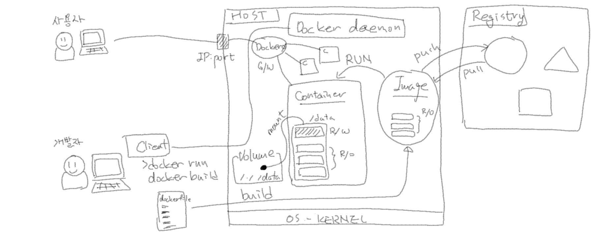

# MSP T3 - 23-4차


## Docker

- VM의 경우는 각 OS별로 스토리지를 할당받아서 용량이 넘지않게 사용할 수 있도록 관리가 가능한데, 컨테이너도 동일한가요?
  - 네, 가능합니다.
  - Storage 옵션은 [docker run](https://docs.docker.com/engine/reference/commandline/run/) 명령어의 `--storage-opt`옵션을 사용하면 되고, 자세한 내용은 [Set storage driver options per container (--storage-opt)](https://docs.docker.com/engine/reference/commandline/run/#storage-opt)를 참고하시면 됩니다.
  - Storage 외에도 CPU나 Memory에 대한 옵션도 있으니 참고하세요.

- os kernel이 다르면 동일한 이미지를 사용할 수 없나요? (linux, bsd, ...)
  - 네, 맞습니다. 컨테이너는 결국 os kernel의 시스템명령어들을 사용해야 하기 때문에, 커널에 맞는 이미지가 만들어지고 사용되게 됩니다. 

### Docker Summary


---

## Kubernetes

- Pod lifecycle에서 Unknown은 비정상 상태일텐데, success로 끝날수도 있나요?
  - ...

- minikube 실습환경에서 pod로 생성된 컨테이너를 docker 명령어로 삭제(rm)하면 어떻게 되나요?
  - 수업시간에 같이 확인해 봤습니다.
  - k8s object인 pod에 의해서 생성된 컨테이너를 rm 한 것이기 때문에, pod object는 그대로 있고 container만 재시작 된 걸로 확인됩니다. (아래 예시 참고하세요)
```bash
ubuntu@ip-172-31-27-225:~$ kubectl get pods my-nginx1
NAME        READY   STATUS    RESTARTS   AGE
my-nginx1   1/1     Running   2          38m
ubuntu@ip-172-31-27-225:~$ docker ps | grep my-nginx1
3b1c19cd926f   f35646e83998                               "/docker-entrypoint.…"   7 minutes ago    Up 7 minutes                                                                               k8s_my-nginx1_my-nginx1_default_3e203f9d-2716-4e70-b1d8-c0a68668d038_2
c2241247ae26   k8s.gcr.io/pause:3.6                       "/pause"                 38 minutes ago   Up 38 minutes                                                                              k8s_POD_my-nginx1_default_3e203f9d-2716-4e70-b1d8-c0a68668d038_0
ubuntu@ip-172-31-27-225:~$ docker rm -f 3b1c19cd926f
3b1c19cd926f
ubuntu@ip-172-31-27-225:~$ kubectl get pods my-nginx1
NAME        READY   STATUS    RESTARTS   AGE
my-nginx1   1/1     Running   3          38m
```


- 실행된 pod의 ip가 172.17.0.0/16를 갖는 것 같은데, 이것도 런타임이 docker여서 그런건가요?
  - 아래 그림과 같이 정해진 PodCIDR 범위 내에서 Pod ip가 주어집니다. (아래는 192.168.1.0/24 에서 192.168.1.3 로 주어진 예시)
  - 우리 실습환경인 minikube는 위와 다른 상태입니다. 정해진 PodCIDR이 아닌, Docker bridge의 subnet인 172.17.0.0/16 에서 ip가 주어진 것으로 보이며, 이 부분은 더 확인하고 아래에 내용을 업데이트 해 놓겠습니다.

```bash
controlplane $ kubectl get nodes          
NAME           STATUS   ROLES           AGE   VERSION
controlplane   Ready    control-plane   14d   v1.26.1
node01         Ready    <none>          14d   v1.26.1
controlplane $ kubectl describe nodes node01 | grep -i podcidr
PodCIDR:                      192.168.1.0/24
PodCIDRs:                     192.168.1.0/24
controlplane $ kubectl get pods -o wide
NAME       READY   STATUS    RESTARTS   AGE     IP            NODE     NOMINATED NODE   READINESS GATES
my-nginx   1/1     Running   0          6m16s   192.168.1.3   node01   <none>           <none>
```
> 일반적인 경우 위와같이 PodCIDR 범위(192.168.1.0/24)내의 IP가 주어집니다. (killercoda에서 확인해보세요)

```
ubuntu@ip-172-31-27-225:~$ kubectl describe node ip-172-31-27-225 | grep -i podcidr
PodCIDR:                      10.244.0.0/24
PodCIDRs:                     10.244.0.0/24
ubuntu@ip-172-31-27-225:~$ kubectl get pod -o wide
NAME       READY   STATUS    RESTARTS   AGE   IP           NODE               NOMINATED NODE   READINESS GATES
my-nginx   1/1     Running   0          12m   172.17.0.2   ip-172-31-27-225   <none>           <none>
ubuntu@ip-172-31-27-225:~$ docker network inspect bridge | grep -i subnet
                    "Subnet": "172.17.0.0/16",
```
> 이건 minikube 실습환경에서 확인한 결과입니다. PodCIDR (10.244.0.0/24)과 다른 IP가 Pod에 주어져 있습니다.

- K8s 1.20 이후에 Docker가 container runtime에서 deprecated되어서 사용 안하게 되면 docker 설치가 필요없다는 의미인 것 같은데, docker build와 같은 image build는 다른 tool을 이용하게 되는건가요?
  - Image를 만드는(개발하는)환경과 Container가 실행되는 환경을 분리해서 생각해야할 것 같습니다.
  - 실행환경인 K8s에서는 다른 Container runtime을 사용하더라고, 개발환경에서는 Docker를 여전히 사용할 수 있습니다.
  - 그리고, Docker가 아니어도 다른 방법으로도 Image를 만들 수도 있습니다. (e.g. [Kaniko](https://github.com/GoogleContainerTools/kaniko) )

- Ingress를 통해서 cluster ip로 통신할 때, 동일하게 cluster ip기반 서비스로 만들어서 사용하나요?
  - 네, 맞습니다. ingress와 cluster ip타입 서비스 두 오브젝트를 다 만들어서 사용합니다.

- ingress에서 tls처리도 가능하면, 인증서도 ingress에 등록하나요?
  - 네, 맞습니다.
  - Secret으로 인증서를 등록하고, ingress에서 secret을 적용해서 사용합니다.
  - 아래 예시와 [TLS](https://kubernetes.io/ko/docs/concepts/services-networking/ingress/#tls)부분 참고하세요.

```yaml
apiVersion: v1
kind: Secret
metadata:
  name: testsecret-tls
  namespace: default
data:
  tls.crt: base64 encoded cert
  tls.key: base64 encoded key
type: kubernetes.io/tls
---
apiVersion: networking.k8s.io/v1
kind: Ingress
metadata:
  name: tls-example-ingress
spec:
  tls:
  - hosts:
      - https-example.foo.com
    secretName: testsecret-tls
  rules:
  - host: https-example.foo.com
    http:
      paths:
      - path: /
        pathType: Prefix
        backend:
          service:
            name: service1
            port:
              number: 80
```

- ingress와 nodeport, loadbalancer 서비스의 차이점이 뭔가요?
  - 서비스는 하나의 애플리케이션에 대한 네트워크 오브젝트라고 하면, ingress는 그 앞에서 다수의 서비스/애플리케이션에 대한 처리가 가능한 오브젝트 입니다.
  - 그리고, 서비스는 L4영역을 담당하고 ingress는 L7영역을 담당합니다.

- 사용자에게 서비스 순단은 전혀 발생하지 않나요? (Deployment 무중단 배포 방식에서)
  - 네, 기존에 pod로 연결된 사용자는 서비스 종료까지 연결을 유지하고, 새로운 서비스 요청만 신 버젼으로 처리되게 됩니다.
  - 기존의 Transaction처리를 보장하기 위해서 Graceful shutdown을 하게됩니다. (SIGTERM신호를 먼저 보내고, 이후에 SIGKILL)
  - [파드의 종료](https://kubernetes.io/ko/docs/concepts/workloads/pods/pod-lifecycle/#pod-termination) 부분도 참고하세요.

- App(프로그램)내 세션을 이용했다면 새 버젼에서 오류가 날 수 있는건 Blue/Green 배포인가요?
  - 앞의 질문과 마찬가지로, 새로운 요청(세션)이 신버젼으로 무중단 서비스 된다는 것이고 기존 세션은 구 버젼에서 서비스를 마칠 때 까지 유지됩니다.

- 실제 서비스 운영 때 가장 일반적으로 많이 사용하는 배포 전략은 무엇인가요?
  - 시스템의 중요도나 고객사의 요건에 따라 다르겠지만, RollingUpdate가 Kubernetes의 기본 옵션이고 가장 일반적인 배포 방법입니다.
  - 하지만, 최근의 대고객 서비스같은 경우 Canary update가 널리 사용되고 있습니다. (실제 사용자의 f/b을 확인 가능하고, 롤백이나 여러 측면에서 장점이 많기 때문에)

- 교재 어떤곳은 Service를 Deployment보다 먼저 생성하고, 어떤곳은 나중에 생성하는데 어떤 차이인가요?
  - 교재에 있는건 사실 어떻게 해도 문제가 없습니다.
  - 하지만, Kubernetes에서 이야기 하는 모범사례는 Service를 먼저 생성하는 것입니다.
  - [구성 모범 사례-서비스](https://kubernetes.io/ko/docs/concepts/configuration/overview/#%EC%84%9C%EB%B9%84%EC%8A%A4) 내용 참고하세요.
