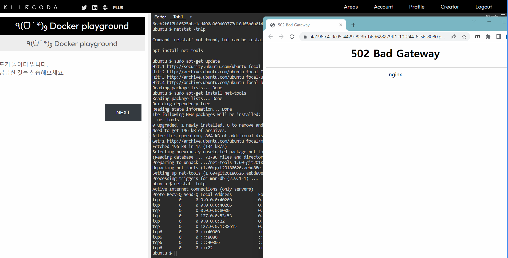
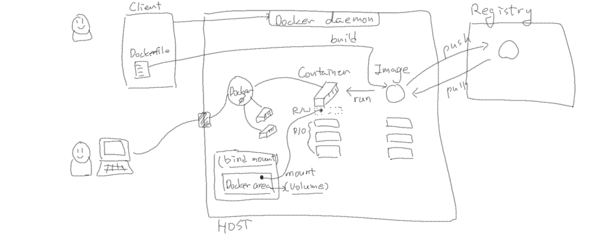

# MSP T3 - 23-5차


## Docker

- 컨테이너 환경은 OS가 24시간 동작한다고 생각하면 되겠네요.
  - 네, 맞습니다. provisioning 측면에서 보자면 VM은 OS를 부팅하는 것 부터 시작하고, 컨테이너는 OS가 실행되어 있는 상태에서 컨테이너(프로세스)가 실행된다고 보시면 됩니다.

- 컨테이너 레이어에서 어떤 파일을 사용할지 결정할 때 상위에 있는 Image layer 순서는 어떻게 정해지나요?
  - 뒤에서 배우겠지만, 이미지를 만들 때 쓰이는 Dockerfile의 명령어 순서에 따라서 레이어가 생성됩니다.
  - 먼저 실행된 명령어(Instruction)가 하위 레이어가 되고, 나중에 실행된 명령어가 상위 레이어가 됩니다.
  - 동일한 파일이 여러 레이어에 있다면, 최종 파일시스템은 상위 레이어의 것이 우선 사용됩니다.

- 이미지와 컨테이너는 상호 종속관계가 아니고 독립적인 관계인가요?
  - 이미지는 컨테이너를 생성하기 위한 패키징된 파일시스템이라고 보시면 됩니다.
  - 컨테이너가 생성되면 이미지의 파일시스템 레이어들과, 컨테이너의 레이어가 합쳐져서 하나의 파일시스템이 되기 때문에 완전히 독립적이라고 보기는 어렵습니다.
  - 하지만, 결국에는 각각의 컨테이너는 격리된 자신만의 공간(namespace)을 가지기 때문에 독립적인 것 처럼 동작합니다. (PID, Network, MNT등이 모두 자신만의 공간을 가진 것 처럼 동작합니다.)

- 다른 사람이 만든 이미지에 push를 통해서 덮어 씌울 수 있나요?
  - 네, Docker hub에서 테스트해보니 되네요.
  - 동일한 name:tag로 된 이미지를 push할 경우 기존의 이미지가 있어도 덮어쓰기가 됩니다.
  - 이미지의 name:tag는 유일한 정보가 아니기 때문에 그것만으로 고유한 이미지를 나타내지는 않습니다. (같은 name:tag를 이용하더라도 다른 이미지를 강제로 push할 수 있습니다.)

- 이미지로부터 컨테이너를 run하여 생성한 후, 그 이미지를 삭제(?)하면 run하던 컨테이너는 어떻게 되나요?
  - 먼저 docker 명령어를 이용한 이미지 삭제(`docker rmi`)는 안됩니다. (아래 참조. -> 에러가 발생함.)
  - 강제로 이미지 레이어의 파일(/var/lib/docker/overlay2/.... 에 있는)을 root권한으로 삭제할 수는 있지만, 문제가 될 수 있습니다.

```bash
ubuntu $ docker run -d nginx
Unable to find image 'nginx:latest' locally
latest: Pulling from library/nginx
f03b40093957: Pull complete 
eed12bbd6494: Pull complete 
fa7eb8c8eee8: Pull complete 
7ff3b2b12318: Pull complete 
0f67c7de5f2c: Pull complete 
831f51541d38: Pull complete 
Digest: sha256:af296b188c7b7df99ba960ca614439c99cb7cf252ed7bbc23e90cfda59092305
Status: Downloaded newer image for nginx:latest
54767f04cfab7b1d557fffb565a43802e96d9c9c11acd5d63dc4f8e1353ba49b
ubuntu $ docker ps
CONTAINER ID   IMAGE     COMMAND                  CREATED         STATUS         PORTS     NAMES
54767f04cfab   nginx     "/docker-entrypoint.…"   5 seconds ago   Up 4 seconds   80/tcp    compassionate_mcnulty
ubuntu $ docker images
REPOSITORY   TAG       IMAGE ID       CREATED       SIZE
nginx        latest    f9c14fe76d50   2 weeks ago   143MB
busybox      latest    8135583d97fe   2 weeks ago   4.86MB
ubuntu $ docker rmi nginx
Error response from daemon: conflict: unable to remove repository reference "nginx" (must force) - container 54767f04cfab is using its referenced image f9c14fe76d50
```

- `docker commit`을 하게되면 image에 변경되어 저장되나요?
  - 맞습니다. container layer에 기록된 내용이 새로운 layer가 되어 (레이어가 하나 더 더해져서), 새로운 이미지가 만들어집니다.
  - 예를들어 Image layer가 5개인 경우, Container가 실행되는 동안 하나의 Container layer가 더해져서 사용되는데, `docker commit'명령어를 사용하면 이 마지막 Container layer가 더해진 6개 레이어로 이루어진 새로운 이미지가 만들어집니다.
  - 보통, 기존의 이미지에 어떤 작업을 한 다음 그 내용을 포함한 새로운 이미지를 만들 때 사용됩니다.

- run하는 동안에는 images와 컨테이너는 연결되어 있는건가요?
  - 네, 맞습니다.
  - 이미지 레이어(R/O layer)들과 컨테이너 레이너(R/W layer)가 합쳐진(Union) 파일시스템이 그 컨테이너(run된 컨테이너)의 파일시스템이 됩니다. ( -> Union의 의미를 잘 떠올려보세요. )

- test 라는 파일은 R/W 레이어에 있는건가요? (* test파일은 컨테이너 실행 후 생성된 파일)
  - 네, 맞습니다.
  - 실행된 컨테이너에서 생성/수정/삭제되는 모든것은 R/W레이어(Container layer)에 기록됩니다.

- digest는 뭔가요?
  - 이미지에 주어지는 고유한 값입니다. (name:tag가 달라도 고유한 digest를 가진 동일한 이미지가 있을 수 있습니다.)
  - [Digests](https://github.com/opencontainers/image-spec/blob/main/descriptor.md#digests) 와 [컨테이너 이미지 다이제스트 사용](https://cloud.google.com/architecture/using-container-images?hl=ko)의 내용도 참고하세요.

- pull때 기본 디렉토리는 library/ 이고, push때 기본 디렉토리는 docker.io/ 인가요?
  - 아니오. 교재는 그냥 예시를 보여주기 위해서 몇 가지 샘플을 표시한 것입니다.
  - 고유한 repository를 앞에 표시하는데, 뒤에 더 자세히 다룰 예정입니다.

- `docker run`을 실행하면 `docker pull`은 같이 수행되나요?
  - 네, 맞습니다.
  - 고맙게도, 현재 host machine에 run하기 위해 필요한 이미지가 없으면 알아서 pull까지 해줍니다.
  - 명시적으로 `docker pull`하고 난  `docker run`해도 됩니다.

- 이미지는 push시에 다른 버젼으로 자동으로 생성해 주는 건가요?
  - 아니오, 그렇지는 않습니다.
  - 이미지를 push하기 전에, host machine에서 tag(버젼)까지 붙여서 만들어 줘야합니다. 그리고, 나서 그 이미지:태그 를 push 합니다.

- Chapter2 교재 4페이지에서 `docker push` 시에 3개는 push, 4내는 이미 존재하는 레이어라고 나오는데요, r/w레이어는 하나인데 왜 3개가 push되나요?
  - `docker push`명령어는 host머신에 있는 이미지를 registry로 업로드(push)하는 것입니다.
  - 교재의 경우 7개의 레이어로 이루어진 todo-app:1.0.0이라는 이미지를 push 하는 것이며, 이 때는 컨테이너 레이어(R/W layer)는 포함되어 있지 않습니다.
  - push되는 3개와, 이미있는 4개의 차이는 registry에 이미 있는 레이어라면 push 하지 않아도 되기때문에 생략되는 것입니다. (새롭게 만들어진 레이어만 push됩니다.)

- R/W 레이어를 마운트하지 않고 커밋으로 이미지화 하면 동일하게 삭제되지 않고 사용할 수 있지 않나요?
  - 네, 파일을 저장하는 용도로만 접근한다면 그런 방법도 가능은 합니다.
  - 하지만, 커밋하는 것은 새로운 이미지를 만든다는 것입니다.
  - 동일한 이미지를 이용해서 여러개의 컨테이너를 실행하는 것이 기본적인 사용 유형인데, 이때 데이터를 처리하는 방법이 마운트(볼룸)를 하는 것입니다.

- Docker network의 bridge유형이 L4랑 비슷한 개념일까요?
  - L2 통신을 지원합니다.
  - [4. Docker 네트워크 (리눅스 용)](https://doitnow-man.tistory.com/m/183) 의 내용도 참고하세요.

- host유형으로 쿠버네티스에서 사용하나요?
  - 쿠버네티스도 기본은 bridge 네트워크를 사용합니다.

- Host 유형은 잘 사용하지 않나요? 어떨 때 사용하나요?
  - host머신의 네트워크를 직접 사용해야 할 때 사용됩니다. (e.g. 더 빠른 네트워크 접속이 필요한 경우)
  - [Host network driver](https://docs.docker.com/network/drivers/host/) 의 내용 참조하시면 좋을 것 같습니다. (아래 내용)
  - "Host mode networking can be useful to optimize performance, and in situations where a container needs to handle a large range of ports, as it does not require network address translation (NAT), and no “userland-proxy” is created for each port."

- 볼륨을 사용하지 않으면 mysql 에 저장된 데이터도 삭제되나요?
  - 네, 맞습니다.
  - 모든 컨테이너는 컨테이너레이어(R/W 레이어)에 저장하는 내용은 컨테이너가 삭제되면 함께 삭제됩니다.
  - mysql도 volume을 사용해서 데이터 디렉토리를 외부로 마운트해야 데이터를 유지할 수 있습니다.

- EXPOSE는 80으로 설정하고 docker run -p 8080:8080 로 하면 어떻게 되나요?
  - 이렇게 되네요. 502 Bad gateway ( EXPOSE 80으로 만들어진 nginx를 8080으로 실행 )

```
ubuntu $ docker run -dp 8080:8080 nginx
Unable to find image 'nginx:latest' locally
latest: Pulling from library/nginx
f03b40093957: Pull complete 
eed12bbd6494: Pull complete 
fa7eb8c8eee8: Pull complete 
7ff3b2b12318: Pull complete 
0f67c7de5f2c: Pull complete 
831f51541d38: Pull complete 
Digest: sha256:af296b188c7b7df99ba960ca614439c99cb7cf252ed7bbc23e90cfda59092305
Status: Downloaded newer image for nginx:latest
6ecb2f817b10525bbc1cd490a069d09777d18d65b0a01438955f912719ec6258
ubuntu $ netstat -tnlp
Active Internet connections (only servers)
Proto Recv-Q Send-Q Local Address           Foreign Address         State       PID/Program name    
tcp        0      0 0.0.0.0:40200           0.0.0.0:*               LISTEN      21950/kc-terminal   
tcp        0      0 0.0.0.0:40205           0.0.0.0:*               LISTEN      21937/node          
tcp        0      0 0.0.0.0:8080            0.0.0.0:*               LISTEN      22870/docker-proxy  
tcp        0      0 127.0.0.53:53           0.0.0.0:*               LISTEN      22163/systemd-resol 
tcp        0      0 0.0.0.0:22              0.0.0.0:*               LISTEN      604/sshd: /usr/sbin 
tcp        0      0 127.0.0.1:38615         0.0.0.0:*               LISTEN      13907/containerd    
tcp6       0      0 :::40300                :::*                    LISTEN      22135/runtime-scena 
tcp6       0      0 :::8080                 :::*                    LISTEN      22875/docker-proxy  
tcp6       0      0 :::40305                :::*                    LISTEN      22307/runtime-info- 
tcp6       0      0 :::22                   :::*                    LISTEN      604/sshd: /usr/sbin 
```



- COPY는 storage(volume, bind mount 등)와는 어떤 관련이 있나요?
  - Dockerfile에서 COPY 명령어는 빌드가 실행되는 머신과 컨테이너이미지 사이에 파일을 복사하는 개념이고. (이미지를 만드는 시점에)
  - Storage(volume, bind mount 등)는 컨테이너가 실행되는 시점에 컨테이너의 파일시스템(디렉토리들) 중 일부 필요한 부분을 호스트 머신에 마운트해서 사용하는 것입니다.

- tag와 label의 차이는 뭔가요?
  - tag는 이미지의 버젼과 같은 것이고, label은 메타 데이터성격의 참조정보 입니다.
  - 특징들을 label로 지정해 놓고, 이후에 filtering해서 찾기위한 용도로 사용됩니다.

### Docker Summary


---

## Kubernetes

- Node - Pod - Container - application의 관계가 어떻게 되나요? (여러가지 질문을 하나로 정리했습니다.)
  - Node : Pod = 1 : N 입니다. Node에는 다수의 Pod가(구체적으로는 Pod가 관리하는 컨테이너들이) 동작합니다.
  - Pod : Container = 1 : N 이지만, 1 : 1 이 대부분이고 권장되는 유형입니다. ( One-container-per-pod 모델 )
  - Container : Application = 1 : N 이지만, 1 : 1 이 권장사항 입니다. (Decouple containers 참조)

- 컨테이너 포트를 여러개 지정할 때 "-"를 추가해서 정의하나요?
  - 네, 맞습니다. 
  - yaml 파일에서 복수개의 하위정보를 정의할 때 그 시작을 "-"로 합니다.

- Pod에 사용하는 이미지는 도커로 만드는건가요? 그럼, 결국 도커는 이미지 생성도구로만 사용하는건가요?
  - 도커로 생성한 이미지도 가능하고, 다른 도구를 이용한 이미지도 가능합니다.
  - [OCI](https://opencontainers.org/) spec.을 따르는 도구로 생성된 이미지는 모두 동일합니다.
  - 도커는 이미지의 개발이나 단일 컨테이너 실행환경(간단한 테스트환경)같은곳에 사용할 수 있습니다. ( 운영환경은 Kubernetes와 같은 container orchestration을 이용하는 것이 좋습니다.)

- Pod는 Node상에 구동되는데, Pod가 생성되는 시점에는 무조건 PodScheduled가 True아닌가요?
  - Pod를 Node에 표기하기는 하지만 실제로는 쿠버네티스상에서 관리되는 추상화된 개념(오브젝트)으로 보시는게 맞습니다.
  - 그래서, 최초에는 노드가 정해져있지 않다가 scheduler에 의해 Node가 결정되면 Pod의 정보에 Node의 정보가 추가됩니다. (이 때는 Node안에 Pod를 그릴 수 있는데, 이것도 개념적인 것으로 보는게 맞습니다.)

- (Pod conditions에서 )Initialized 는 Pod 스케쥴링이 되기 전부터 True일 수 있는건가요? 초기화 컨테이너여서 상관없는건가요?
  - 초기화 컨테이너가 없는 경우는 처음부터 True로 되어있습니다.
  - 초기화 컨테이너가 있는 경우는 처음에 False였다가, 초기화 컨테이너가 성공적으로 임무를 수행하고 나면 True로 바뀝니다.

- Probe의 정의를 해야 컨테이너 Fail 시 restart를 하나요? (미 정의 시 컨테이너가 죽어도 아무 작업이 안일어나나요?)
  - Probe를 정의하지 않아도 문제가 발생한 경우(error case) 재시작을 해줍니다.
  - 그리고, Pod가 삭제된 경우도 ReplicaSet에 의해서 항상 정의한 개수(replicas)의 Pod가 유지됩니다.

- Probe는 Pod의 상태를 진단하는데 왜 Container Probe라고 하나요?
  - Pod 내부의 Containers 하위에 여러개 Container마다 Probe를 설정할 수 있습니다.
  - 정확하게는 Container에 Probe가 설정되는 것이기 때문에 Container probe라는 표현이 맞는 것 같습니다.

- Raplica status를 체크할 때 동일 Node내에서 체크되는건가요? 아니면 Cluster내에서 체크되는 건가요?
  - ReplicaSet에 의해 관리되는 Pod들은 스케쥴러에 의해 다수의 노드에 배치되게 됩니다.
  - ReplicaSet은 클러스터 레벨에서 관리되는 Object라고 보는게 맞고, Pod는 Node가 할당되기 때문에 Node 단위로 관리되는 Object라고 보면 됩니다.
  - 하지만, 수업시간에도 말씀드렸듯이 K8s object들은 그 자체로 실체가 있는것은 아니어서 엄밀히 말하자면 Pod도 Node내에 있다고 할 수는 없고, Pod에 의해서 생성되는 Container들이 Node에 있다고 하는것이 정확한 표현입니다.

- Deployment에서 Label은 Pod의 Label인가요? 아니면 ReplicaSet의 Label인가요?
  - Deployment의 metadata에 정의된 Label은 Deployment의 Label입니다.
  - 그 하위 Pod는 별도의 Label을 가지고 있습니다. (template: 하위의 metadata부분에 있습니다.)

- Deployment는 한 개의 ReplicaSet만 가지나요?
  - 그렇지 않습니다.
  - 변경이 발생할 때, 기존의 ReplicaSet을 그대로 두면서 Replicas 숫자만 0으로 내리고 새로운 ReplicaSet을 생성합니다.
  - 교재의 그림처럼, 업데이트가 일어날 때 마다 새로운 ReplicaSet을 만들어서 관리하고, 기존의 ReplicaSet은 숫자(Replicas)만 0으로 내려놓습니다.
  - Rollback이 필요한 경우에는 남겨놓은 구 버젼의 ReplicaSet의 숫자(Replicas)만 조절해서 쉽게 할 수도 있습니다. ([Recreate 방법으로 롤백 해보기](https://github.com/JungSangup/mspt3/blob/main/doc/%5BHands-on%5D%2013_Kubernetes_Deployment_strategies.md#2-recreate-%EB%B0%A9%EB%B2%95%EC%9C%BC%EB%A1%9C-%EB%A1%A4%EB%B0%B1-%ED%95%B4%EB%B3%B4%EA%B8%B0)를 보면, 이렇게 ReplicaSet을 이용해서 롤백하는 것을 확인할 수 있습니다.)

- ReplicaSet의 Alive상태는 한개인가요?
  - 네, Deployment의 정보를 보면 현재 사용되는 ReplicaSet은 하나로 표시되어 있습니다.

- Deployment에서 select할 label을 ReplicaSet의 Label로 해도 되나요? (Deployment-ReplicaSet의 관계는 어떻게 정의되나요?)
  - Deployment의 `.spec.selector`는 `.spec.template`에서 정의하는 Pod에 대한 선택조건을 정의하는 것입니다. (ReplicaSet을 Select하지는 않음.)
  - 우리 교재 실습부분의 실행결과(아래 예시)와 [디플로이먼트 생성](https://kubernetes.io/ko/docs/concepts/workloads/controllers/deployment/#%EB%94%94%ED%94%8C%EB%A1%9C%EC%9D%B4%EB%A8%BC%ED%8A%B8-%EC%83%9D%EC%84%B1) 아래 설명부분도 참고하세요.

```bash
controlplane $ cat nginx-deployment.yaml 
apiVersion: apps/v1
kind: Deployment
metadata:
  name: my-nginx-deployment
  labels:
    app: my-nginx
    tier: frontend
spec:
  replicas: 3
  strategy:
    type: RollingUpdate
  selector:
    matchLabels:
      app: my-nginx
  template:
    metadata:
      labels:
        app: my-nginx
    spec:
      containers:
      - image: nginx:1.19.3
        name: my-nginx
        ports:
        - containerPort: 80
controlplane $ kubectl describe deployments my-nginx-deployment 
Name:                   my-nginx-deployment
Namespace:              default
CreationTimestamp:      Sat, 10 Jun 2023 05:27:05 +0000
Labels:                 app=my-nginx
                        tier=frontend
Annotations:            deployment.kubernetes.io/revision: 1
Selector:               app=my-nginx
Replicas:               3 desired | 3 updated | 3 total | 3 available | 0 unavailable
StrategyType:           RollingUpdate
MinReadySeconds:        0
RollingUpdateStrategy:  25% max unavailable, 25% max surge
Pod Template:
  Labels:  app=my-nginx
  Containers:
   my-nginx:
    Image:        nginx:1.19.3
    Port:         80/TCP
    Host Port:    0/TCP
    Environment:  <none>
    Mounts:       <none>
  Volumes:        <none>
Conditions:
  Type           Status  Reason
  ----           ------  ------
  Available      True    MinimumReplicasAvailable
  Progressing    True    NewReplicaSetAvailable
OldReplicaSets:  <none>
NewReplicaSet:   my-nginx-deployment-7d985f5478 (3/3 replicas created)
Events:
  Type    Reason             Age   From                   Message
  ----    ------             ----  ----                   -------
  Normal  ScalingReplicaSet  83s   deployment-controller  Scaled up replica set my-nginx-deployment-7d985f5478 to 3
controlplane $ kubectl describe replicasets my-nginx-deployment-7d985f5478 
Name:           my-nginx-deployment-7d985f5478
Namespace:      default
Selector:       app=my-nginx,pod-template-hash=7d985f5478
Labels:         app=my-nginx
                pod-template-hash=7d985f5478
Annotations:    deployment.kubernetes.io/desired-replicas: 3
                deployment.kubernetes.io/max-replicas: 4
                deployment.kubernetes.io/revision: 1
Controlled By:  Deployment/my-nginx-deployment
Replicas:       3 current / 3 desired
Pods Status:    3 Running / 0 Waiting / 0 Succeeded / 0 Failed
Pod Template:
  Labels:  app=my-nginx
           pod-template-hash=7d985f5478
  Containers:
   my-nginx:
    Image:        nginx:1.19.3
    Port:         80/TCP
    Host Port:    0/TCP
    Environment:  <none>
    Mounts:       <none>
  Volumes:        <none>
Events:
  Type    Reason            Age   From                   Message
  ----    ------            ----  ----                   -------
  Normal  SuccessfulCreate  94s   replicaset-controller  Created pod: my-nginx-deployment-7d985f5478-mpwgw
  Normal  SuccessfulCreate  94s   replicaset-controller  Created pod: my-nginx-deployment-7d985f5478-qwh87
  Normal  SuccessfulCreate  94s   replicaset-controller  Created pod: my-nginx-deployment-7d985f5478-8wfgp
```

- 서비스의 L4 역할은 Pod에 대한 분배인가요?
  - 네, 맞습니다.
  - Lebel - Selector로 연결된 pod들에 대한 분배를 합니다.

- 타겟포트가 멀티지정 가능한가요?
  - port/targetport 쌍으로 멀티 지정 가능합니다.

- LB는 별도 포트 지정이 되지 않는다면, 관리적 측면에서 LB 접속할 때 사용되는 포트도 존재하지 않는건가요?
  - CSP에서 LB가 만들어질 때 IP와 Port를 지정할 수 있습니다.
  - K8s의 LoadBalancer타입 서비스에서는 LB의 포트를 지정하지는 않지만, 실제로는 LB의 포트를 이용합니다.

- 원하는 Pod에 직접 접속하기 위해서는 ip를 직접 입력해서 접근하는 방법밖에는 없나요?
  - POD도 DNS에 등록이 되기는 합니다. ( e.g. 172-17-0-3.default.pod.cluster.local )
  - 위의 예제처럼 아이피를 이용해서 DNS에 등록이 되는거라, 결국에는 IP를 이용하는 거라고 보시면 됩니다.
  - [파드](https://kubernetes.io/ko/docs/concepts/services-networking/dns-pod-service/#%ED%8C%8C%EB%93%9C) 의 내용도 참고하세요.

- 외부포트 30007 -> 서비스포트 80 -> Pod포트 80 이후의 결과반환 순서?
  - 하부 구조를 보면 NAT변환을 거쳐 패킷이 전달되는데, 너무 복잡한 내용이라 우리 교재에서는 다루지 않고 있습니다.
  - [소스 IP 주소 이용하기](https://kubernetes.io/ko/docs/tutorials/services/source-ip/) 의 내용을 참고하시면 좋을 것 같습니다.
  - [Kubernetes Services networking](https://youtu.be/NFApeJRXos4)도 도움이 될 것 같구요.

- Ingress 를 사용하려면 ClusterIP타입의 서비스를 먼저 만들어야 하는건가요?
  - 네, 맞습니다. Ingress에서 규칙을 정할 때 어떤 도메인명/path로 오면 어떤 서비스로 routing한다고 지정을 하도록 되어있습니다.
  - Backend 서비스의 지정이 필요하기 때문에 먼저 서비스를 만들어야 합니다.
  - 꼭 ClusterIP타입은 아니어도 상관없습니다.

- LoadBalancer와 Ingress의 차이는 뭔가요?
  - 일단 LoadBalancer타입의 서비스가 담당하는 레이어(L4)와 Ingress가 담당하는 레이어(L7)가 다릅니다. (Service와 Ingress의 차이)
  - 그리고 LB타입 서비스를 만들면 생성되는 CSP의 LB는 여러 종류가 있고( [Product comparisons](https://aws.amazon.com/elasticloadbalancing/features/#Product_comparisons) ), K8s에서 생성 시 L7 라우팅이 가능한 LB가 생성됩니다.
  - 예를들어 AWS EKS에서 LB타입 서비스를 만드는 경우에는 Classic LB가 생성되고, TCP/HTTP/HTTPS등을 사용할 수 있습니다. ( [Amazon EKS의 네트워크 로드 밸런싱](https://docs.aws.amazon.com/ko_kr/eks/latest/userguide/network-load-balancing.html) 참조 )
  - 그리고, 중요한 한 가지는 Service마다 LB를 구성하는 것 보다는(LB마다 비용을 지불해야함.), Ingress를 사용하여 Virtual hosting을 하는 것이 비용측면에서 더 장점이 있습니다.

- PVC에 키값을 storageClassName대신 Selector로 쓰면?
  - PVC-PV Binding에 [셀렉터](https://kubernetes.io/ko/docs/concepts/storage/persistent-volumes/#%EC%85%80%EB%A0%89%ED%84%B0)를 사용할 수는 있습니다.
  - StorageClass를 쓰는 경우(Dynamic Volume Provisioning)는 PV가 동적으로 생성되기 때문에 궂이 Label-Selector로 매칭을 할 필요는 없어보입니다.

- local과 hostpath의 차이는 뭔가요?
  - 둘 다 Node의 스토리지를 사용한다는 점에서는 동일합니다.
  - [hostPath](https://kubernetes.io/ko/docs/concepts/storage/volumes/#hostpath)는 Pod가 실행되는 노드의 스토리지를 직접 마운트해서 사용합니다. (단일노드인 경우 적합함.)
  - [local](https://kubernetes.io/ko/docs/concepts/storage/volumes/#local)은 hostPath와 마찬가지로 노드의 스토리지를 사용하는 것은 같지만, 사용될 노드를 [노드 어피니티(affinity)](https://kubernetes.io/ko/docs/concepts/storage/persistent-volumes/#%EB%85%B8%EB%93%9C-%EC%96%B4%ED%94%BC%EB%8B%88%ED%8B%B0-affinity)를 이용하여 지정할 수 있습니다. (다중노드인 경우 적합함.)

- PVC에서 RWO로 만들었는데 지금은 노드가 하나이니까 가능한거죠?
  - 네, 맞습니다.
  - 여러개의 노드에서 같이 사용해야 하는 경우에는 RWX로 생성하면 됩니다.

- ResourceQuota의 네임스페이스 지정은 어떻게 하나요?
  - ResourceQuota 오브젝트는 네임스페이스를 지정해서 생성할 수 있습니다.
  - 교재 샘플을 이용하여 MSPT3라는 네임스페이스에 ResourceQuota를 지정한다면, 아래와 같은 방식으로 ResourceQuota 오브젝트를 생성하면 됩니다. (별도의 Binding과 같은 과정은 필요없네요.)
  - `kubectl apply -f resourcequota.yaml --namespace=MSPT3`
  - 참고로, 다른 오브젝트도 마찬가지 입니다. 네임스페이스를 구분하여 생성되는 오브젝트인 경우 `--namespace=OOO`과 같이 옵션을 지정하여 생성하면 됩니다.

- Resource 제한 시 가변용량으로도 설정 가능한가요? (%이용)
  - %로 설정하지는 않는 것 같습니다. ( 혹시라도 찾게되면 업데이트 해 놓겠습니다. )
  - [쿠버네티스의 리소스 단위](https://kubernetes.io/ko/docs/concepts/configuration/manage-resources-containers/#%EC%BF%A0%EB%B2%84%EB%84%A4%ED%8B%B0%EC%8A%A4%EC%9D%98-%EB%A6%AC%EC%86%8C%EC%8A%A4-%EB%8B%A8%EC%9C%84) 참고하세요.

- ReplicaSet을 사용할 경우, ReplicaSet은 롤백이 안되나요?
  - [kubectl rollout](https://kubernetes.io/docs/reference/generated/kubectl/kubectl-commands#rollout) 명령어를 이용하여 롤백을 하는데, 이 때 대상으로 삼을 수 있는 오브젝트는
    - deployments
    - daemonsets
    - statefulsets
  - 가 있습니다.
  - ReplicaSet은 history관리가 되지 않기 때문에, Deployment를 이용한 방법이 올바른 방법입니다.    

- HPA에서 하나씩 증가하지 않고, 증분 수량을 지정할 수 있나요?
  - 하나씩 처리된다기 보다는 [알고리즘 세부 정보](https://kubernetes.io/ko/docs/tasks/run-application/horizontal-pod-autoscale/#%EC%95%8C%EA%B3%A0%EB%A6%AC%EC%A6%98-%EC%84%B8%EB%B6%80-%EC%A0%95%EB%B3%B4)에 따라서 목표수량이 정해지고 동작한다고 보는게 맞을 것 같습니다.
  - 참고로, ScaleUp/ScaleDown시 [스케일링 정책](https://kubernetes.io/ko/docs/tasks/run-application/horizontal-pod-autoscale/#%EC%8A%A4%EC%BC%80%EC%9D%BC%EB%A7%81-%EC%A0%95%EC%B1%85)을 적용할 수도 있습니다.

- Helm은 K8s에서 자동으로 제공해주는 기능이 아닌가요?
  - 네, 맞습니다.
  - [CNCF Projects](https://www.cncf.io/projects/) 중 하나이고, K8s의 기본 구성요소는 아닙니다.
  - v2 까지는 Tiller라는 서버를 가진 Client/Server 구조여서 조금 복잡했지만, v3부터는 Tiller가 사라진 Client/Library구져여서 설치도 한결 수월합니다. (참고 : [Overview of Helm 3 Changes](https://helm.sh/docs/topics/v2_v3_migration/#overview-of-helm-3-changes) )
  - Helm 설치 가이드는 [Installing Helm](https://helm.sh/docs/intro/install/)나 [Helm 설치하기](https://github.com/JungSangup/mspt3/blob/main/doc/%5BHands-on%5D%2006_Environment_Setup-Kubernetes.md#3-helm-%EC%84%A4%EC%B9%98%ED%95%98%EA%B8%B0--%ED%97%AC%EB%A6%84-%EC%84%A4%EC%B9%98%ED%95%98%EA%B8%B0-) 를 참고하시면 됩니다.

- Deployment를 장애대응용으로 설정해서 사용할 수 있을까요?
  - Deployment-ReplicaSet-Pod 구조가 기본적으로 영속성을 전제로 하고 있기 때문에 사용하지 않은 것 보다는 장애에 더욱 더 적극적으로 대응한 것으로 볼 수도 있을 것 같습니다. (Pod만 단독으로 생성하여 사용하는 경우에는 문제가 발생하여도 자동으로 원복되지 않을 수 있습니다.)
  - 추가적으로 [파드 토폴로지 분배 제약 조건](https://kubernetes.io/ko/docs/concepts/scheduling-eviction/topology-spread-constraints/)을 통해서 고가용성(HA) 구성을 검토할 수도 있습니다.

- 보통 values.yaml파일은 template마다 만들지 않고 하나에 다 작성하나요?
  - 기본 [차트 파일 구조](https://helm.sh/ko/docs/topics/charts/#%EC%B0%A8%ED%8A%B8-%ED%8C%8C%EC%9D%BC-%EA%B5%AC%EC%A1%B0)는 하나의 values.yaml 파일로 구성되어 있습니다.
  - 만약 여러개의 values.yaml파일로 나누어 관리하려면 설치 시점에 여러개의 분할된 values 파일을 사용할 수도 있습니다. (수업 시간에는 하나만 사용한다고 했는데, 그건 일반적인 경우이고 여러개도 가능은 합니다.)
  - 예시 : `helm install -f myvalues.yaml -f override.yaml  myredis ./redis` ( -> `-f`옴션을 여러 번 사용함. 이 경우 중복된 키가 있다면 가장 오른쪽 파일에 우선순위가 있습니다. 앞의 예제는 override.yaml파일이 1순위 입니다.)
