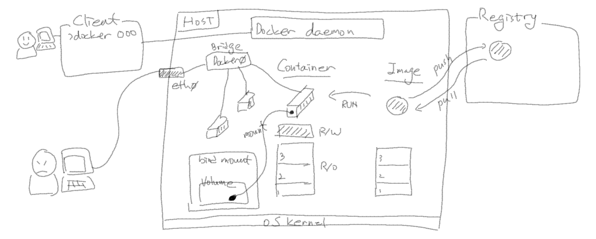

# MSP T3 - 23-6차


## Docker

- 'exit' 명령어를 실행하면 run 했던 container도 중지(stop) 되는 건가요?
  - 네, 맞습니다.
  - 중지하지 않고 exit하는 방법도 있습니다. ( ctrl + p, q )
  - [docker attach](https://docs.docker.com/engine/reference/commandline/attach/#description) 의 문서도 참고하세요.
 
- Volume을 구성하게 되면 Container layer (R/W layer)는 생성만 할 뿐인가요?
  - Volume을 구성할 때 컨테이너의 파일시스템 중 특정 디렉토리를 volume에 마운트하게 됩니다.
  - Container layer는 volume으로 마운트된 디렉토리 외에도 모든 파일시스템에 대한 File 처리가 되기 때문에 생성만 하고 사용되지 않는 건 아닙니다.
    
- RUN instruction의 내용은 image안에 들어가고, CMD instruction의 내용은 image안에 안들어가다 인거죠?
  - 네, 맞습니다.
  - RUN 에 의해 수행된 내용은 하나의 layer가 되어 image에 포함됩니다.
  - CMD 의 내용은 layer에는 포함되지 않고, 컨테이너가 생성되는 시점에 실행됩니다.

- RUN은 container를 실행시키는데 필요한 부분, CMD는 container의 app. 등의 실행에 필요한 부분이라고 이해하면 될까요?
  - 위 질문의 답변을 참고해주세요.

- `--publish-all`로 EXPOSE로 지정된 모든 포트를 오픈하는 경우 host의 포트와 expose에 등록된 포트는 어떻게 매핑되나요? (e.g. expose에 복수의 포트가 등록된 경우)
  - `publish-all`은 host의 포트에 랜덤하게 연결됩니다.
  - 복수개의 포트가 있어도 모두 랜덤하게 연결됩니다.
  - [docker run](https://docs.docker.com/engine/reference/commandline/run/) 문서의 `--publish-all` 부분 참고하세요.

- EXPOSE나 VOLUME이 dockerfile에 작성되지 않은 경우 포트오픈이나 볼륨 마운트는 불가능한가요?
  - 먼저 EXPOSE에 지정한 포트는 같은 네트워크 안에는 모두 노출됩니다. (같은 브릿지 아래있는 다른 컨테이너에서 EXPOSE로 지정한 포트로 접근 가능.)
  - 여기서 더 나가서 --publish 옵션을 이용하여 Host으 포트로 연결됩니다.
  - 만약, Dockerfile에서 EXPOSE 로 지정하지 않은 포트를 `docker run` 시점에 노출시키면 아래(첫 번째 예제)와 같이 연결됩니다. (하지만, 컨테이너 내부에서 그 포트에 대한 처리가 없다면 제대로 동작하지는 않을것입니다.)
  - VOLUME의 경우도 Dockerfile에서 지정하지 않은 경로도 마운트 가능합니다. (두 번째 예제)
```bash
ubuntu@ip-172-31-27-160:~$ docker run -d --name my-nginx -p 8080:80 -p 8081:81 nginx
172eb72f5cb5987ba7a6acf83abe4349fedbea8aa65c856d3b570b2a97ef0b24
ubuntu@ip-172-31-27-160:~$ docker inspect my-nginx
[

... 생략 ...

        "NetworkSettings": {
            "Bridge": "",
            "SandboxID": "060131501ffb9ddca11ea92882db9d74f44ea4e0beceb595397534219410b511",
            "HairpinMode": false,
            "LinkLocalIPv6Address": "",
            "LinkLocalIPv6PrefixLen": 0,
            "Ports": {
                "80/tcp": [
                    {
                        "HostIp": "0.0.0.0",
                        "HostPort": "8080"
                    },
                    {
                        "HostIp": "::",
                        "HostPort": "8080"
                    }
                ],
                "81/tcp": [
                    {
                        "HostIp": "0.0.0.0",
                        "HostPort": "8081"
                    },
                    {
                        "HostIp": "::",
                        "HostPort": "8081"
                    }
                ]
            },

... 생략 ...

ubuntu@ip-172-31-27-160:~$ netstat -tnlp | grep -i 808
(Not all processes could be identified, non-owned process info
 will not be shown, you would have to be root to see it all.)
tcp        0      0 0.0.0.0:8080            0.0.0.0:*               LISTEN      -
tcp        0      0 0.0.0.0:8081            0.0.0.0:*               LISTEN      -
tcp6       0      0 :::8080                 :::*                    LISTEN      -
tcp6       0      0 :::8081                 :::*                    LISTEN      -
```

```bash
ubuntu@ip-172-31-27-160:~$ docker run -it -v my-volume:/tmp/mspt3 ubuntu bash
root@43ac3c49de2e:/# ls -al /tmp
total 12
drwxrwxrwt 1 root root 4096 Jul 19 14:21 .
drwxr-xr-x 1 root root 4096 Jul 19 14:21 ..
drwxr-xr-x 2 root root 4096 Jul 19 14:21 mspt3
root@43ac3c49de2e:/# touch /tmp/mspt3/hi
...
ubuntu@ip-172-31-27-160:~$ sudo -i
root@ip-172-31-27-160:~# ls -al /var/lib/docker/volumes/my-volume/_data
total 8
drwxr-xr-x 2 root root 4096 Jul 19 14:21 .
drwx-----x 3 root root 4096 Jul 19 14:21 ..
-rw-r--r-- 1 root root    0 Jul 19 14:21 hi
```
> Dockerfile에서 VOLUME으로 지정하지 않은(심지어 없는) `/tmp/mspt3` 를 my-volume에 마운트하고, 테스트해보면 위와같이 정상적으로 마운트되고 파일이 생성됩니다.

- CMD같이 명령어가 여러개 있는 경우 layer는 어떻게 되나요?
  - CMD, ENTRYPOINT는 컨테이너 실행시점에 수행되는 명령어를 지정하는 Instruction이고 layer에 포함되지 않습니다.

    
- Multi-stage build에서 원하는 위치까지만 실행할 수도 있나요? (e.g. build 시점에 첫 번째 stage만 진행)
  - 네, 가능합니다. 특정 stage를 target으로 지정해서, 거기까지만 실행되도록 할 수 있습니다.
  - [Stop at a specific build stage](https://docs.docker.com/build/building/multi-stage/#stop-at-a-specific-build-stage) 의 내용 참고하세요.

- Hands-on 05. single과 multi 수행한 이후 각각의 image inpsect을 하면 layer구성의 차이가 있습니다. multi의 경우 layer 수가 single보다 작게 구성되어 있음을 확인할 수 있어요. 사이즈와 연관이 있다고 봐야하는 걸까요? layer 수가 작게 구성되는 이유가 궁금합니다.
  - 먼저 위 실습의 이미지 사이즈 차이는 사용된 Base image의 사이즈 차이가 첫 번째 원인입니다. (아래처럼 openjdk:8 과 openjdk:8-jre 가 벌써 차이가 크게 납니다.)
```bash
ubuntu $ docker images
REPOSITORY    TAG       IMAGE ID       CREATED              SIZE
hellodocker   v2        4ffe39dc6169   About a minute ago   274MB
hellodocker   v1        7717ca681c8e   About a minute ago   526MB
openjdk       8-jre     0c14a0e20aa3   11 months ago        274MB
openjdk       8         b273004037cc   11 months ago        526MB
```
  - 그리고, layer의 차이는 아래와 같습니다.
```bash
[ hellodocker:v1 의 Dockerfile ]
FROM openjdk:8
COPY HelloDocker.java /hello/
WORKDIR /hello
RUN javac HelloDocker.java
CMD ["java","HelloDocker"]

[ hellodocker:v1 의 레이어 정보 ]

        "RootFS": {
            "Type": "layers",
            "Layers": [
                "sha256:9c742cd6c7a5752ee36be8ecb14be45c0885e10e6dd34f26a9ae3eb096c5d492",
                "sha256:03127cdb479b0f1eb8a9b0df8e8d72ead24979728d3c84ff645611b9d8790f94",
                "sha256:293d5db30c9fcf33b65fa033e427fdd118464f9ea0c2a343a478a6e89c29140e",
                "sha256:9b55156abf262eac3e6bd3ae60e7277ab4f9c69543650d7ecefc8c26ee889873",
                "sha256:b626401ef603dd383fc3a43cf474186827db1875591bfc84b178177ca010015b",
                "sha256:53a0b163e9955ffb80569ef37e13fbf5d1074ddd67bc5ad09d7bd874b800396a",
                "sha256:6b5aaff4425423d122ebe4f1514a1994ae60954fc8a2299787df0ddb1a12f6b9",

                "sha256:43d2a7d31f6339767a0b4d11f364659924d770838d5894c97916ad14c461445a",
                "sha256:508a51d9cb2c2ec905130efc3f8f787589344b00e77d2b88ccf14ee059604931"
            ]
        },

===> 앞에서부터 일곱 개의 레이어는 Base image인 openjdk:8의 레이어이고, 마지막 두 개의 레이어가 COPY, RUN의 실행결과 생성된 레이어 입니다.

----------------------------------------------------------------------------------------------

[ hellodocker:v1 의 Dockerfile ]
# Build stage
FROM openjdk:8 as build-stage
COPY HelloDocker.java /hello/
WORKDIR /hello
RUN javac HelloDocker.java

# Production stage
FROM openjdk:8-jre as production-stage
COPY --from=build-stage /hello/HelloDocker.class /hello/HelloDocker.class
WORKDIR /hello
CMD ["java","HelloDocker"]

[ hellodocker:v2 의 레이어 정보 ]

        "RootFS": {
            "Type": "layers",
            "Layers": [
                "sha256:9c742cd6c7a5752ee36be8ecb14be45c0885e10e6dd34f26a9ae3eb096c5d492",
                "sha256:03127cdb479b0f1eb8a9b0df8e8d72ead24979728d3c84ff645611b9d8790f94",
                "sha256:293d5db30c9fcf33b65fa033e427fdd118464f9ea0c2a343a478a6e89c29140e",
                "sha256:5c384ea5f75201f4bd074559d2abedc93f5effbed2007ae4801a0366dd0313f6",
                "sha256:990c5138f5d1291dabfbd402fbf895ba0d56a99184c9b28a4747ba2a5ee7536d",
                "sha256:1aaddf64804fde60fed1bd58e35f7afb7d1a8cc43ef07f7ef590be0362a66c79",

                "sha256:19fdfbee25599bfba5663feeb27e2663ecaaf464355a53460eb81b4b9ed687d6"
            ]
        },

===> 앞에서부터 여섯 개의 레이어는 Base image인 openjdk:8의 레이어이고, 마지막 한 개의 레이어가 COPY 실행결과 생성된 레이어 입니다.

```

- Hands-on 05 의 실습에서 Dockerfile2는 Dockerfile1의 내용을 포함하고, 추가로 jre/app실행하는데 왜 파일사이즈가 더 작은지 설명해주세요.
  - Dockerfile2에서 이미지에 포함되는 내용은 아래 stage만 포함됩니다. (위의 stage는 빌드 시 사용되지만, 최종 이미지에는 포함되지 않습니다.)
  - 위의 질문/답변 내용도 참고하세요.

### Docker Summary
 

---

## Kubernetes

- YAML파일에서 `-`가 있는 경우와 없는 경우는 무슨 차이인가요?
  - Parent-Child 관계에서 Child가 복수인 경우 Child의 시작위치에 `-`를 붙여서 사용합니다.

- pod 가 노드에 스케줄되나요? container 가 스케줄되나요? pod 에 여러 개의 container 가 있으면, container 들이 서로다른 노드에 스케줄 될수도 있나요?
 - 엄밀히 말하자면 컨테이너가 스케쥴되는게 맞지만, pod는 컨테이너와 직접 연관이 있는 k8s 오브젝트이기 때문에 pod가 스케쥴된다고 해도 크게 틀린표현은 아닙니다.
 - 여러개 컨테이너가 있어도 같은 pod에 속하는 것이라면 같은 노드에 배치됩니다.

- Container probe의 설정 필드들의 단위는 초(seconds) 인가요?
  - 네, 맞습니다. 예를들어 `periodSeconds`는 probe를 실행하는 주기를 초단위로 설정한 것입니다.
 
- Replica를 5 -> 3으로 조정해서 줄이는 경우 조정대상에 대한 규칙이 있나요? 이에 대해서도 정할수가 있나요?
  - [파드 삭제 비용](https://kubernetes.io/ko/docs/concepts/workloads/controllers/replicaset/#%ED%8C%8C%EB%93%9C-%EC%82%AD%EC%A0%9C-%EB%B9%84%EC%9A%A9) 문서를 참조 바랍니다.
  - 비용을 기준으로 삭제 우선순위 지정 가능합니다.
  - 추가로 [Annotation](https://kubernetes.io/ko/docs/concepts/overview/working-with-objects/annotations/) 에 대해 아셔야 합니다. 
 
- [Hands-on] 09. Kubernetes Workload(2)  에서 replicaset 삭제하지 않고, deployment를 생성한 경우 처음 pod들은 삭제되고 새로운 pod들이 생성되는데 왜 그런건가요? (label-selector 관계 때문에???)
  - nginx-replicaset을 최초 생성하면, Replicaset-Pod 구조를 가집니다.
  - 앞의 Replicaset을 삭제하지 않고 동일한 spec (label, selector)을 가지는 nginx-deployment를 생성하면, 먼저 생성한 nginx-replicaset과 nginx-deployment에 의해 생성된 replicaset 둘 다 nginx-deployment의 관리대상이 됩니다. (아래 `Controlled By:` 부분 참조)
  - Deployment spec.은 replicas=3 이므로 먼저 생성된 Replicaset은 0으로 줄이고, 새롭게 생성된 Replicaset을 3으로 해서 관리됩니다.
 
```bash
ubuntu@ip-172-31-27-160:~/mspt3/hands_on_files/ch09$ kubectl apply -f nginx-replicaset.yaml
ubuntu@ip-172-31-27-160:~/mspt3/hands_on_files/ch09$ kubectl describe replicasets.apps nginx-replicaset
Name:         nginx-replicaset
Namespace:    default
Selector:     app=my-nginx
Labels:       app=my-nginx
              tier=frontend
Annotations:  <none>
Replicas:     3 current / 3 desired
Pods Status:  3 Running / 0 Waiting / 0 Succeeded / 0 Failed
Pod Template:
  Labels:  app=my-nginx
  Containers:
   my-nginx:
    Image:        nginx:1.19.3
    Port:         80/TCP
    Host Port:    0/TCP
    Environment:  <none>
    Mounts:       <none>
  Volumes:        <none>
Events:
  Type    Reason            Age   From                   Message
  ----    ------            ----  ----                   -------
  Normal  SuccessfulCreate  24s   replicaset-controller  Created pod: nginx-replicaset-2ftqt
  Normal  SuccessfulCreate  24s   replicaset-controller  Created pod: nginx-replicaset-v4x4z
  Normal  SuccessfulCreate  24s   replicaset-controller  Created pod: nginx-replicaset-6bqbj

ubuntu@ip-172-31-27-160:~/mspt3/hands_on_files/ch09$ kubectl apply -f nginx-deployment.yaml
deployment.apps/my-nginx-deployment created
ubuntu@ip-172-31-27-160:~/mspt3/hands_on_files/ch09$ kubectl describe replicasets.apps nginx-replicaset
Name:           nginx-replicaset
Namespace:      default
Selector:       app=my-nginx
Labels:         app=my-nginx
                tier=frontend
Annotations:    deployment.kubernetes.io/desired-replicas: 3
                deployment.kubernetes.io/max-replicas: 4
Controlled By:  Deployment/my-nginx-deployment
Replicas:       0 current / 0 desired
Pods Status:    0 Running / 0 Waiting / 0 Succeeded / 0 Failed
Pod Template:
  Labels:  app=my-nginx
  Containers:
   my-nginx:
    Image:        nginx:1.19.3
    Port:         80/TCP
    Host Port:    0/TCP
    Environment:  <none>
    Mounts:       <none>
  Volumes:        <none>
Events:
  Type    Reason            Age   From                   Message
  ----    ------            ----  ----                   -------
  Normal  SuccessfulCreate  77s   replicaset-controller  Created pod: nginx-replicaset-2ftqt
  Normal  SuccessfulCreate  77s   replicaset-controller  Created pod: nginx-replicaset-v4x4z
  Normal  SuccessfulCreate  77s   replicaset-controller  Created pod: nginx-replicaset-6bqbj
  Normal  SuccessfulDelete  36s   replicaset-controller  Deleted pod: nginx-replicaset-2ftqt
  Normal  SuccessfulDelete  34s   replicaset-controller  Deleted pod: nginx-replicaset-v4x4z
  Normal  SuccessfulDelete  32s   replicaset-controller  Deleted pod: nginx-replicaset-6bqbj
ubuntu@ip-172-31-27-160:~/mspt3/hands_on_files/ch09$ kubectl describe replicasets.apps my-nginx-deployment-55985c7fcf
Name:           my-nginx-deployment-55985c7fcf
Namespace:      default
Selector:       app=my-nginx,pod-template-hash=55985c7fcf
Labels:         app=my-nginx
                pod-template-hash=55985c7fcf
Annotations:    deployment.kubernetes.io/desired-replicas: 3
                deployment.kubernetes.io/max-replicas: 4
                deployment.kubernetes.io/revision: 1
Controlled By:  Deployment/my-nginx-deployment
Replicas:       3 current / 3 desired
Pods Status:    3 Running / 0 Waiting / 0 Succeeded / 0 Failed
Pod Template:
  Labels:  app=my-nginx
           pod-template-hash=55985c7fcf
  Containers:
   my-nginx:
    Image:        nginx:1.19.3
    Port:         80/TCP
    Host Port:    0/TCP
    Environment:  <none>
    Mounts:       <none>
  Volumes:        <none>
Events:
  Type    Reason            Age   From                   Message
  ----    ------            ----  ----                   -------
  Normal  SuccessfulCreate  46s   replicaset-controller  Created pod: my-nginx-deployment-55985c7fcf-lr9x8
  Normal  SuccessfulCreate  44s   replicaset-controller  Created pod: my-nginx-deployment-55985c7fcf-9j4tn
  Normal  SuccessfulCreate  42s   replicaset-controller  Created pod: my-nginx-deployment-55985c7fcf-r96bm
```
  - 추가로, nginx-replicaset의 spec.을 변경하여(laber/selector 를 app=my-nginx1으로 변경) 테스트를 하면 둘 다 replicas=3으로 남아있게 됩니다.
```bash
ubuntu@ip-172-31-27-160:~/mspt3/hands_on_files/ch09$ k get all
NAME                                       READY   STATUS    RESTARTS   AGE
pod/my-nginx-deployment-55985c7fcf-9bv7j   1/1     Running   0          5s
pod/my-nginx-deployment-55985c7fcf-hhvhx   1/1     Running   0          5s
pod/my-nginx-deployment-55985c7fcf-pqc87   1/1     Running   0          5s
pod/nginx-replicaset-4wbls                 1/1     Running   0          17s
pod/nginx-replicaset-krwst                 1/1     Running   0          17s
pod/nginx-replicaset-rv926                 1/1     Running   0          17s

NAME                 TYPE        CLUSTER-IP   EXTERNAL-IP   PORT(S)   AGE
service/kubernetes   ClusterIP   10.96.0.1    <none>        443/TCP   8h

NAME                                  READY   UP-TO-DATE   AVAILABLE   AGE
deployment.apps/my-nginx-deployment   3/3     3            3           5s

NAME                                             DESIRED   CURRENT   READY   AGE
replicaset.apps/my-nginx-deployment-55985c7fcf   3         3         3       5s
replicaset.apps/nginx-replicaset                 3         3         3       17s
ubuntu@ip-172-31-27-160:~/mspt3/hands_on_files/ch09$ k describe replicasets.apps nginx-replicaset
Name:         nginx-replicaset
Namespace:    default
Selector:     app=my-nginx1
Labels:       app=my-nginx1
              tier=frontend
Annotations:  <none>
Replicas:     3 current / 3 desired
Pods Status:  3 Running / 0 Waiting / 0 Succeeded / 0 Failed
Pod Template:
  Labels:  app=my-nginx1
  Containers:
   my-nginx:
    Image:        nginx:1.19.3
    Port:         80/TCP
    Host Port:    0/TCP
    Environment:  <none>
    Mounts:       <none>
  Volumes:        <none>
Events:
  Type    Reason            Age   From                   Message
  ----    ------            ----  ----                   -------
  Normal  SuccessfulCreate  28s   replicaset-controller  Created pod: nginx-replicaset-krwst
  Normal  SuccessfulCreate  28s   replicaset-controller  Created pod: nginx-replicaset-rv926
  Normal  SuccessfulCreate  28s   replicaset-controller  Created pod: nginx-replicaset-4wbls
ubuntu@ip-172-31-27-160:~/mspt3/hands_on_files/ch09$ k describe replicasets.apps my-nginx-deployment-55985c7fcf
Name:           my-nginx-deployment-55985c7fcf
Namespace:      default
Selector:       app=my-nginx,pod-template-hash=55985c7fcf
Labels:         app=my-nginx
                pod-template-hash=55985c7fcf
Annotations:    deployment.kubernetes.io/desired-replicas: 3
                deployment.kubernetes.io/max-replicas: 4
                deployment.kubernetes.io/revision: 1
Controlled By:  Deployment/my-nginx-deployment
Replicas:       3 current / 3 desired
Pods Status:    3 Running / 0 Waiting / 0 Succeeded / 0 Failed
Pod Template:
  Labels:  app=my-nginx
           pod-template-hash=55985c7fcf
  Containers:
   my-nginx:
    Image:        nginx:1.19.3
    Port:         80/TCP
    Host Port:    0/TCP
    Environment:  <none>
    Mounts:       <none>
  Volumes:        <none>
Events:
  Type    Reason            Age   From                   Message
  ----    ------            ----  ----                   -------
  Normal  SuccessfulCreate  27s   replicaset-controller  Created pod: my-nginx-deployment-55985c7fcf-hhvhx
  Normal  SuccessfulCreate  27s   replicaset-controller  Created pod: my-nginx-deployment-55985c7fcf-pqc87
  Normal  SuccessfulCreate  27s   replicaset-controller  Created pod: my-nginx-deployment-55985c7fcf-9bv7j
```

- Static volume provisioning 에서 PVC가 특정 PV를 지정해서 연결(바인딩)할 수도 있나요?
  - 아래와 같은 방법이 있습니다. (세 가지)

[ 방법 1 ] Label/Selector를 이용한 방법  
PV에 label을 설정하고, PVC에서 selector를 설정하면 아래와 같이 PV-PVC가 바인딩됩니다. 
```bash
ubuntu@ip-172-31-27-160:~/temp$ cat pv1.yaml
apiVersion: v1
kind: PersistentVolume
metadata:
  name: mspt3-pv1
  labels:
    foo: bar
spec:
  accessModes:
    - ReadWriteOnce
  capacity:
    storage: 5Gi
  hostPath:
    path: /data/mspt3-pv1/
ubuntu@ip-172-31-27-160:~/temp$ cat pv2.yaml
apiVersion: v1
kind: PersistentVolume
metadata:
  name: mspt3-pv2
  labels:
    foo: barrrr
spec:
  accessModes:
    - ReadWriteOnce
  capacity:
    storage: 5Gi
  hostPath:
    path: /data/mspt3-pv2/
ubuntu@ip-172-31-27-160:~/temp$ cat pvc.yaml
apiVersion: v1
kind: PersistentVolumeClaim
metadata:
  name: mspt3-pvc
spec:
  storageClassName: ""
  accessModes:
  - ReadWriteOnce
  resources:
     requests:
       storage: 5Gi
  selector: 
    matchLabels: 
      foo: bar
ubuntu@ip-172-31-27-160:~/temp$ kubectl apply -f ./
persistentvolume/mspt3-pv1 created
persistentvolume/mspt3-pv2 created
persistentvolumeclaim/mspt3-pvc created
ubuntu@ip-172-31-27-160:~/temp$ kubectl get pv --show-labels
NAME        CAPACITY   ACCESS MODES   RECLAIM POLICY   STATUS      CLAIM               STORAGECLASS   REASON   AGE   LABELS
mspt3-pv1   5Gi        RWO            Retain           Bound       default/mspt3-pvc                           8s    foo=bar
mspt3-pv2   5Gi        RWO            Retain           Available                                               8s    foo=barrrr
ubuntu@ip-172-31-27-160:~/temp$ kubectl get pvc
NAME        STATUS   VOLUME      CAPACITY   ACCESS MODES   STORAGECLASS   AGE
mspt3-pvc   Bound    mspt3-pv1   5Gi        RWO                           12s
```
> mspt2-pv1 에 foo=bar 레이블이 설정되어 있고, mspt3-pvc와 바인딩됨.  
> foo=barrrr 레이블이 있는 mspt3-pv2는 바인딩되지 않음.

```bash
# 방법 2

```
```bash
# 방법 3

```

- pod 설정에 있는 port나 command가 Dockerfile에 설정된 EXPOSE, CMD, ENTRYPOINT와 겹칠 것 같은데, pod 설정과 Dockerfile설정이 다를경우 어떻게 동작하나요?
  - 먼저 port정보는 EXPOSE와 달라도 연결은 됩니다. 하지만 그 포트로 컨테이너가 서비스하도록 되어있지 않다면 아마도 동작은 제대로 하지 않을 것 같습니다. (앞의 Dockerfile에서 EXPOSE 질문과 동일한 개념이라고 보면 될 것 같습니다.)
  - Pod의 command는 CMD를 대체하는 것이라고 보면 됩니다. (ENTRYPOINT는 POD에서 설정한 command와 상관없이 항상 실행됨.)

- replicas=3으로 설정해서 시작하고, HPA는 1~10으로 replicas를 설정한다면 어떻게 동작하나요?
  - ...

- 롤링 혹은 블루그린 디플로이 중에 트래픽이 몰리거나 자원 조건이 걸려서 스케일 아웃하게 되면 어떻게 동작하는지 궁금합니다. 또 자원 할당이 한정적으로 된 경우엔 무엇이 우선순위로 동작하는지 궁금합니다.
  - HPA는 Deployment의 replicas값을 변경합니다. Rolling update가 진행 중이더라도 값이 변경되면 변경된 값으로 pod가 만들어지게 됩니다. (당연히 업데이트가 끝나고 나서도 HPA의 조건에 따라 scaling이 됩니다.)
  - [롤링 업데이트 중 오토스케일링](https://kubernetes.io/ko/docs/tasks/run-application/horizontal-pod-autoscale/#%EB%A1%A4%EB%A7%81-%EC%97%85%EB%8D%B0%EC%9D%B4%ED%8A%B8-%EC%A4%91-%EC%98%A4%ED%86%A0%EC%8A%A4%EC%BC%80%EC%9D%BC%EB%A7%81) 참고하세요.
  - 그리고, HPA의 설정이 있다고 하더라도(e.g. `.sepc.maxReplicas = 10`), 리스소가 부족하면 scale-out 되지 않습니다. (계속 시도는 하고, 자원이 다시 확보되면 계속해서 scale-out 됩니다.)
 
- Helm 의 values.yaml 에서 값을 참조할 때, child가 여러개인 경우 `.Values.x[0].xx`의 형태로 참조하나요?
  - ...

- change cause는 어떻게 입력하는걸까요? sed로 버전바꾼뒤에 apply한거라서; 이부분은 어떻게 입력하는지 궁금합니다.
  - ...
  
