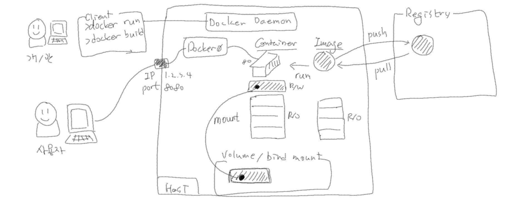

# MSP T3 - mspt3_24-2차 (SCP Track)

## Docker

- multistage build에서 2-stage만 반영했을 때와 차이는 무엇인가요?
  - 1-stage의 과정을 dockerbuild시점 전에 별도로 처리한다면(e.g. jenkins에서 빌드), 2-stage만 가지고 docker build를 할 수 있습니다.
  - 두 가지 유형 중 필요한 형태를 사용하면 됩니다.

- multistage build에서 builder때문에 1-stage를 해야하는 건가요?
  - 네, 맞습니다. 빌드 패키지등 실행시점에 필요없는 것들을 1-stage에서 처리하고, 2-stage는 1-stage의 결과물(실행 시점에 필요한 것)만 이용하는 것입니다.
 
- hands-on 05 실습에서 Baseimage (FROM openjdk:8)는 어디서 어디로 다운로드(pull) 하나요?
  - Docker build가 실행되는 곳 (Docker daemon이 있는 곳)으로 다운로드(pull) 됩니다.
  - Dockerfile과 build context가 위치한 곳이 아닌, docker build가 진행되는 곳 입니다.
  - 빌드되는 순서로 보자면 다음과 같습니다.
    - build context를 docker daemon으로 전달
    - dockerfile의 명령어를 순서대로 진행
      - FROM에 정의된 Baseimage를 Container registry에서 host 머신으로 pull
      - HelloDocker.java파일 복사 (COPY)
      - 디렉토리 이동(WORKDIR)
      - 빌드 (RUN javac ...)

### Docker Summary


---

## Kubernetes

- [Hands-on] 08. Kubernetes Workload(1)  실습에서 **registry.k8s.io/liveness** 이미지는 hub.docker.com 에서 검색이 안되는데 왜 그런건가요?
  - 앞의 실습에서 표시한 **nginx:1.18** 과 같은 경우는 앞에 docker hub 의 url이 생략된 것입니다.
  - **registry.k8s.io/liveness** 는 **registry.k8s.io** 컨테이너 레지스트리에 있는 **liveness** 이미지를 사용한다는 의미 입니다.
 
- Deployment나 ReplicaSet에 의해서 Pod들이 만들어져 있는 상태에서 강제로 동일한 spec.의 pod를 하나 더 만들면 어떻게 되나요?
  - 기존 Deployment-ReplicaSet에 의해 관리되는 Pod들은 그대로 있고, 새로운 Pod가 하나 만들어집니다.
  - Pod와 ReplicaSet은 Label과 Selector로도 연결관계를 알 수 있지만, OwnerReference 정보로도 확인이 가능합니다.
  - 아래 두 가지 Pod의 내용을 보면
    - 첫 번째 Pod는 ReplicaSet에 의해 관리되는 Pod이기 때문에 ownerReferences 정보가 있고,
    - 두 번째 Pod는 단독으로 생성했기 때문에 ownerReferences 정보가 없습니다.
    - 둘 다 Label은 동일합니다.
    - 또 다른 방법으로는, `kubectl describe`명령으로 조회했을 때 `Controlled By:` 에 ReplicaSet의 정보가 있는지 없는지를 확인해도 됩니다.
    - 자세한 정보는 [Owners and Dependents](https://kubernetes.io/docs/concepts/overview/working-with-objects/owners-dependents/)를 참고하세요.
```bash
$ k get po my-nginx-deployment-697d895648-62q6n -o yaml
apiVersion: v1
kind: Pod
metadata:
  annotations:
    cni.projectcalico.org/containerID: 66f3f05354300bc7f945640749263fd2d34782b785e7b668e39925a291bb1c3d
    cni.projectcalico.org/podIP: 192.168.1.4/32
    cni.projectcalico.org/podIPs: 192.168.1.4/32
  creationTimestamp: "2024-05-18T03:46:16Z"
  generateName: my-nginx-deployment-697d895648-
  labels:
    app: my-nginx
    pod-template-hash: 697d895648
  name: my-nginx-deployment-697d895648-62q6n
  namespace: default
  ownerReferences:
  - apiVersion: apps/v1
    blockOwnerDeletion: true
    controller: true
    kind: ReplicaSet
    name: my-nginx-deployment-697d895648
    uid: 7493b703-caa3-4188-9fd4-8a5d7a623c66
  resourceVersion: "2027"
  uid: 458f2fd7-643d-4167-8b83-08f287aa5b1a
```
```bash
$ kubectl get po my-nginx-4 -o yaml
apiVersion: v1
kind: Pod
metadata:
  annotations:
    cni.projectcalico.org/containerID: 9e8cf3087658b22eae6128d9846a8e3f7832009194cd25726817e76c6548f26d
    cni.projectcalico.org/podIP: 192.168.1.7/32
    cni.projectcalico.org/podIPs: 192.168.1.7/32
    kubectl.kubernetes.io/last-applied-configuration: |
      {"apiVersion":"v1","kind":"Pod","metadata":{"annotations":{},"labels":{"app":"my-nginx"},"name":"my-nginx-4","namespace":"default"},"spec":{"containers":[{"image":"nginx:1.19.3","name":"my-nginx","ports":[{"containerPort":80}]}]}}
  creationTimestamp: "2024-05-18T03:51:10Z"
  labels:
    app: my-nginx
  name: my-nginx-4
  namespace: default
  resourceVersion: "2396"
  uid: f1c19cd6-97cb-4510-8a62-f5776286cb80
```

- K8s 서비스 타입 중에 ExternalName이란 걸 들어본 것 같은데, 이건 서비스 종류에 포함되지 않는건가요?
  - 아닙니다. 우리 교재는 세 가지만 다루고 있지만 ExternalName타입도 있습니다.
  - 자세한 내용은 [ExternalName 유](https://kubernetes.io/ko/docs/concepts/services-networking/service/#externalname) 를 참조하세요.
 
- Docker에서는 Volume은 도커가 관리하는 스토리지 이고, Bind mount는 사용자가 지정한 경로를 사용할 수 있었는데, K8s Volume은 다른 의미로 쓰이는건가요?
  - 네, 맞습니다. 이름이 Volume이라 혼동될 수 있지만, K8s에서의 Volume은 오히려 Bind mount와 같은 형태로 쓰이는 것이라고 보시면 됩니다.
  - K8s Volume의 spec.을 보면 마운트 될 경로를 지정할 수 있습니다.
 
 - Pod에서 파일시스템 모드로 PVC를 요청하면 Node에서도 실제 파일시스템이 만들어지는 건가요?
   - 이 부분은 Volume 구성에 따라 다를 수 있을 것 같습니다.
   - PVC에 의해 별도의 파일시스템이 만들어진다기 보다는, 기 구성되어 있는 파일시스템에 디렉토리가 생성되고 마운트해서 사용하게 됩니다.
  
- (위 질문에 이어서) 그럼 서버(Volume이 만들어진 곳)에서 df -h 하면 pod에서 요청한 파일시스템이 보이는거죠?
  - 위의 질문/답변과 같이 df -h 했을 때, 기존에 Volume을 위해서 구성한 파일시스템이 보여지게 됩니다.
  - 해당 파일시스템 내에 Volume을 위한 디렉토리가 생성되고 사용됩니다.
 
- ConfigMap 교재에서 ConfigMap은 API Object라고 되어있는데, 무슨 뜻인가요?
  - K8s API 요청에 의해 관리되는 Object라는 뜻입니다. 그냥 Object라고 한 것과 동일한 의미입니다.
  - K8s에서 Object의 생성/수정/삭제는 Kube-apiserver로 전달되는 API요청에 의해서 처리됩니다.
